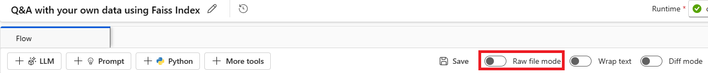
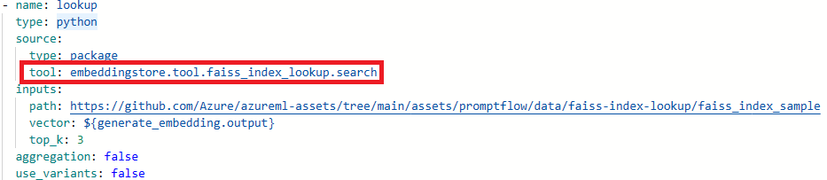
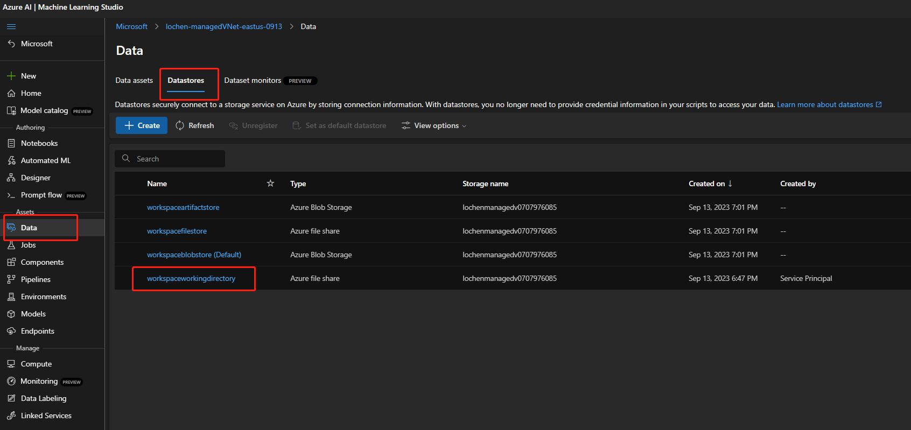

# Troubleshoot guidance

This article addresses frequent questions about prompt flow usage.

## "Package tool isn't found" error occurs when you update the flow for a code-first experience

When you update flows for a code-first experience, if the flow utilized the Faiss Index Lookup, Vector Index Lookup, Vector DB Lookup, or Content Safety (Text) tools, you might encounter the following error message:

<code><i>Package tool 'embeddingstore.tool.faiss_index_lookup.search' is not found in the current environment.</i></code>

To resolve the issue, you have two options:

- **Option 1**
  - Update your runtime to the latest version.
  - Select **Raw file mode** to switch to the raw code view. Then open the *flow.dag.yaml* file.
  
     
  - Update the tool names.
  
     
     
      | Tool | New tool name |
      | ---- | ---- |
      | Faiss Index Lookup | promptflow_vectordb.tool.faiss_index_lookup.FaissIndexLookup.search |
      | Vector Index Lookup | promptflow_vectordb.tool.vector_index_lookup.VectorIndexLookup.search |
      | Vector DB Lookup | promptflow_vectordb.tool.vector_db_lookup.VectorDBLookup.search |
      | Content Safety (Text) | content_safety_text.tools.content_safety_text_tool.analyze_text |
  - Save the *flow.dag.yaml* file.

- **Option 2**
  - Update your runtime to the latest version.
  - Remove the old tool and re-create a new tool.

## "No such file or directory" error

Prompt flow relies on a file share storage to store a snapshot of the flow. If the file share storage has an issue, you might encounter the following problem. Here are some workarounds you can try:

- If you're using a private storage account, see [Network isolation in prompt flow](../how-to-secure-prompt-flow.md) to make sure your workspace can access your storage account.
- If the storage account is enabled for public access, check whether there's a datastore named `workspaceworkingdirectory` in your workspace. It should be a file share type.

   
    - If you didn't get this datastore, you need to add it in your workspace.
        - Create a file share with the name `code-391ff5ac-6576-460f-ba4d-7e03433c68b6`.
        - Create a datastore with the name `workspaceworkingdirectory`. See [Create datastores](../../how-to-datastore.md).
    - If you have a `workspaceworkingdirectory` datastore but its type is `blob` instead of `fileshare`, create a new workspace. Use storage that doesn't enable hierarchical namespaces for Azure Data Lake Storage Gen2 as a workspace default storage account. For more information, see [Create workspace](../../how-to-manage-workspace.md#create-a-workspace).
     
## Flow is missing

:::image type="content" source="../media/faq/flow-missing.png" alt-text="Screenshot that shows a flow missing an authoring page." lightbox = "../media/faq/flow-missing.png":::

There are possible reasons for this issue:
- If you disabled public access to storage account, then you need have access to storage account either add you IP to the storage Firewall or add access studio through the virtual network which have private endpoint to the storage account.

    :::image type="content" source="../media/faq/storage-account-networking-firewall.png" alt-text="Screenshot that shows firewall setting on storage account." lightbox = "../media/faq/storage-account-networking-firewall.png":::

- There are some cases, the account key in data store is out of sync with the storage account, you can try to update the account key in data store detail page to fix this.

    :::image type="content" source="../media/faq/datastore-with-wrong-account-key.png" alt-text="Screenshot that shows datastore with wrong account key." lightbox = "../media/faq/datastore-with-wrong-account-key.png":::
 
- If you are using AI studio, the storage account need set CORS to allow AI studio access the storage account, otherwise, you will see the flow missing issue. You can add following CORS setting to the storage account to fix this issue.
    - Go to storage account page, select `Resource sharing (CORS)` under `settings`, and select to `File service` tab.
    - Allowed origins: `https://mlworkspace.azure.ai,https://ml.azure.com,https://*.ml.azure.com,https://ai.azure.com,https://*.ai.azure.com,https://mlworkspacecanary.azure.ai,https://mlworkspace.azureml-test.net`
    - Allowed methods: `DELETE, GET, HEAD, POST, OPTIONS, PUT`

    :::image type="content" source="../media/faq/resource-sharing-setting-storage-account.png" alt-text="Screenshot that shows data store with wrong account key." lightbox = "../media/faq/resource-sharing-setting-storage-account.png":::

## Runtime-related issues

You might experience runtime issues.

### Runtime failed with "system error runtime not ready" when you used a custom environment

:::image type="content" source="../media/how-to-create-manage-runtime/ci-failed-runtime-not-ready.png" alt-text="Screenshot that shows a failed run on the runtime detail page." lightbox = "../media/how-to-create-manage-runtime/ci-failed-runtime-not-ready.png":::

First, go to the compute instance terminal and run `docker ps` to find the root cause.

Use `docker images` to check if the image was pulled successfully. If your image was pulled successfully, check if the Docker container is running. If it's already running, locate this runtime. It attempts to restart the runtime and compute instance.

### Run failed because of "No module named XXX"

This type of error related to runtime lacks required packages. If you're using a default environment, make sure the image of your runtime is using the latest version. For more information, see [Runtime update](../how-to-create-manage-runtime.md#update-a-runtime-on-the-ui). If you're using a custom image and you're using a conda environment, make sure you installed all the required packages in your conda environment. For more information, see [Customize a prompt flow environment](../how-to-customize-environment-runtime.md#customize-environment-with-docker-context-for-runtime).

### Request timeout issue

You might experience timeout issues.

#### Request timeout error shown in the UI

**Compute instance runtime request timeout error:**

:::image type="content" source="../media/how-to-create-manage-runtime/ci-runtime-request-timeout.png" alt-text="Screenshot that shows a compute instance runtime timeout error in the studio UI." lightbox = "../media/how-to-create-manage-runtime/ci-runtime-request-timeout.png":::

The error in the example says "UserError: Invoking runtime gega-ci timeout, error message: The request was canceled due to the configured HttpClient.Timeout of 100 seconds elapsing."

### Identify which node consumes the most time

1. Check the runtime logs.

1. Try to find the following warning log format:

    {node_name} has been running for {duration} seconds.

    For example:

   - **Case 1:** Python script node runs for a long time.

        :::image type="content" source="../media/how-to-create-manage-runtime/runtime-timeout-running-for-long-time.png" alt-text="Screenshot that shows a timeout run log in the studio UI." lightbox = "../media/how-to-create-manage-runtime/runtime-timeout-running-for-long-time.png":::

        In this case, you can find that `PythonScriptNode` was running for a long time (almost 300 seconds). Then you can check the node details to see what's the problem.

   - **Case 2:** LLM node runs for a long time.

        :::image type="content" source="../media/how-to-create-manage-runtime/runtime-timeout-by-language-model-timeout.png" alt-text="Screenshot that shows timeout logs caused by an LLM timeout in the studio UI." lightbox = "../media/how-to-create-manage-runtime/runtime-timeout-by-language-model-timeout.png":::

        In this case, if you find the message `request canceled` in the logs, it might be because the OpenAI API call is taking too long and exceeding the runtime limit.

        An OpenAI API timeout could be caused by a network issue or a complex request that requires more processing time. For more information, see [OpenAI API timeout](https://help.openai.com/en/articles/6897186-timeout).

        Wait a few seconds and retry your request. This action usually resolves any network issues.

        If retrying doesn't work, check whether you're using a long context model, such as `gpt-4-32k`, and have set a large value for `max_tokens`. If so, the behavior is expected because your prompt might generate a long response that takes longer than the interactive mode's upper threshold. In this situation, we recommend trying `Bulk test` because this mode doesn't have a timeout setting.

1. If you can't find anything in runtime logs to indicate it's a specific node issue:

    - Contact the prompt flow team ([promptflow-eng](mailto:aml-pt-eng@microsoft.com)) with the runtime logs. We'll try to identify the root cause.

### Find the compute instance runtime log for further investigation

Go to the compute instance terminal and run `docker logs -<runtime_container_name>`.

### You don't have access to this compute instance

Check if this compute instance is assigned to you and you have access to the workspace. Also, verify that you're on the correct network to access this compute instance.

:::image type="content" source="../media/how-to-create-manage-runtime/ci-flow-clone-others.png" alt-text="Screenshot that shows you don't have an access error on the flow page." lightbox = "../media/how-to-create-manage-runtime/ci-flow-clone-others.png":::

This error occurs because you're cloning a flow from others that's using a compute instance as the runtime. Because the compute instance runtime is user isolated, you need to create your own compute instance runtime or select a managed online deployment/endpoint runtime, which can be shared with others.

### Find Python packages installed in runtime

Follow these steps to find Python packages installed in runtime:

- Add a Python node in your flow.
- Put the following code in the code section:

    ```python
    from promptflow import tool
    import subprocess
    
    @tool
    def list_packages(input: str) -> str: 
        # Run the pip list command and save the output to a file
        with open('packages.txt', 'w') as f:
            subprocess.run(['pip', 'list'], stdout=f)    
    
    ```
- Run the flow. Then you can find `packages.txt` in the flow folder.

  :::image type="content" source="../media/faq/list-packages.png" alt-text="Screenshot that shows finding Python packages installed in runtime." lightbox = "../media/faq/list-packages.png":::

## Flow run related issues

### How to find the raw inputs and outputs of in LLM tool for further investigation?

In prompt flow, on flow page with successful run and run detail page, you can find the raw inputs and outputs of LLM tool in the output section. Click the `view full output` button to view full output. 

:::image type="content" source="../media/faq/view-full-output.png" alt-text="Screenshot that shows view full output on LLM node." lightbox = "../media/faq/view-full-output.png":::

`Trace` section includes each request and response to the LLM tool. You can check the raw message sent to the LLM model and the raw response from the LLM model.

:::image type="content" source="../media/faq/trace-large-language-model-tool.png" alt-text="Screenshot that shows raw request send to LLM model and response from LLM model." lightbox = "../media/faq/trace-large-language-model-tool.png":::

## How to fix 409 error in from Azure OpenAI? 

You may encounter 409 error from Azure OpenAI, it means you have reached the rate limit of Azure OpenAI. You can check the error message in the output section of LLM node. Learn more about [Azure OpenAI rate limit](../../../ai-services/openai/quotas-limits.md).

:::image type="content" source="../media/faq/429-rate-limit.png" alt-text="Screenshot that shows 429 rate limit error from Azure OpenAI." lightbox = "../media/faq/429-rate-limit.png":::
