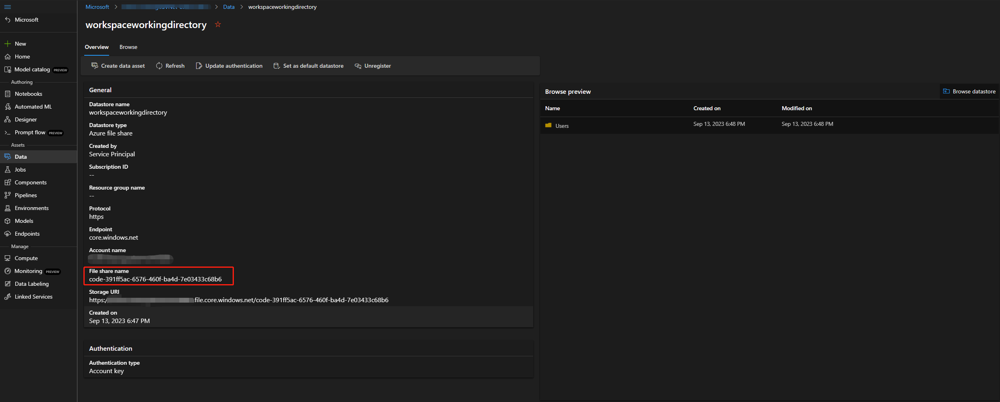

# Troubleshoot guidance

This article addresses frequent questions about tool usage.

## Error "package tool isn't found" occurs when updating the flow for code first experience.

When you update flows for code first experience, if the flow utilized these tools (Faiss Index Lookup, Vector Index Lookup, Vector DB Lookup, Content Safety (Text)), you may encounter the error message like below:

<code><i>Package tool 'embeddingstore.tool.faiss_index_lookup.search' is not found in the current environment.</i></code>

To resolve the issue, you have two options:

- **Option 1**
  - Update your runtime to latest version. 
  - Select on "Raw file mode" to switch to the raw code view, then open the "flow.dag.yaml" file.
     
  - Update the tool names.
     
     
      | Tool | New tool name |
      | ---- | ---- |
      | Faiss Index Lookup tool | promptflow_vectordb.tool.faiss_index_lookup.FaissIndexLookup.search |
      | Vector Index Lookup | promptflow_vectordb.tool.vector_index_lookup.VectorIndexLookup.search |
      | Vector DB Lookup | promptflow_vectordb.tool.vector_db_lookup.VectorDBLookup.search |
      | Content Safety (Text) | content_safety_text.tools.content_safety_text_tool.analyze_text |
  - Save the "flow.dag.yaml" file.

- **Option 2**
  - Update your runtime to latest version.
  - Remove the old tool and re-create a new tool.

## No such file or directory error
Prompt flow relies on fileshare to store snapshot of flow. If fileshare has some issue, you may encounter this issue. Here are some workarounds you can try:
- If you're using private storage account, see [Network isolation in prompt flow](../how-to-secure-prompt-flow.md) to make sure your storage account can be accessed by your workspace.
- If the storage account is enabled public access, please check whether there are datastore named `workspaceworkingdirectory` in your workspace, it should be fileshare type.
 
    - If you didn't get this datastore, you need add it in your workspace.
        - Create fileshare with name `code-391ff5ac-6576-460f-ba4d-7e03433c68b6`
        - Create data store with name `workspaceworkingdirectory` . See [Create datastores](../../how-to-datastore.md)
    - If you have `workspaceworkingdirectory` datastore but its type is `blob` instead of `fileshare`, please create new workspace and use storage didn't enable hierarchical namespaces ADLS Gen2 as workspace default storage account. See [Create workspace](../../how-to-manage-workspace.md#create-a-workspace)
     
## Flow is missing

:::image type="content" source="../media/faq/flow-missing.png" alt-text="Screenshot of a flow missing in authoring page. " lightbox = "../media/faq/flow-missing.png":::

Prompt flow relies on fileshare to store snapshot of flow. This error mean prompt flow service can operate prompt flow folder in fileshare, but the prompt flow UI can't find folder in fileshare. There are some potential reasons:
- Prompt flow relies datastore named `workspaceworkingdirectory` in your workspace, which using `code-391ff5ac-6576-460f-ba4d-7e03433c68b6`, please make sure your data store using the same container. If your data store is using different fileshare name, you need use new workspace.
 

- If your fileshare is correctly named, then please try in different network environment, such as home network, company network, etc. There is a rare case where a fileshare can't be accessed in some network environments even if it's public-access enabled.

## Runtime related issues

### My runtime is failed with a system error **runtime not ready** when using a custom environment

:::image type="content" source="../media/how-to-create-manage-runtime/ci-failed-runtime-not-ready.png" alt-text="Screenshot of a failed run on the runtime detail page. " lightbox = "../media/how-to-create-manage-runtime/ci-failed-runtime-not-ready.png":::

First, go to the Compute Instance terminal and run `docker ps` to find the root cause. 

Use  `docker images`  to check if the image was pulled successfully. If your image was pulled successfully, check if the Docker container is running. If it's already running, locate this runtime, which will attempt to restart the runtime and compute instance.

### Run failed due to "No module named XXX"

This type error related to runtime lack required packages. If you're using default environment, make sure image of your runtime is using the latest version, learn more: [runtime update](../how-to-create-manage-runtime.md#update-runtime-from-ui), if you're using custom image and you're using conda environment, make sure you have installed all required packages in your conda environment, learn more: [customize Prompt flow environment](../how-to-customize-environment-runtime.md#customize-environment-with-docker-context-for-runtime).

### Request timeout issue

#### Request timeout error shown in UI

**MIR runtime request timeout error in the UI:**

:::image type="content" source="../media/how-to-create-manage-runtime/mir-runtime-request-timeout.png" alt-text="Screenshot of a MIR runtime timeout error in the studio UI. " lightbox = "../media/how-to-create-manage-runtime/mir-runtime-request-timeout.png":::

Error in the example says "UserError: Upstream request timeout".

**Compute instance runtime request timeout error:**

:::image type="content" source="../media/how-to-create-manage-runtime/ci-runtime-request-timeout.png" alt-text="Screenshot of a compute instance runtime timeout error in the studio UI. " lightbox = "../media/how-to-create-manage-runtime/ci-runtime-request-timeout.png":::

Error in the example says "UserError: Invoking runtime gega-ci timeout, error message: The request was canceled due to the configured HttpClient.Timeout of 100 seconds elapsing".

### How to identify which node consume the most time

1. Check the runtime logs

2. Trying to find below warning log format

    {node_name} has been running for {duration} seconds.

    For example:

   - Case 1: Python script node running for long time.

        :::image type="content" source="../media/how-to-create-manage-runtime/runtime-timeout-running-for-long-time.png" alt-text="Screenshot of a timeout run logs in the studio UI. " lightbox = "../media/how-to-create-manage-runtime/runtime-timeout-running-for-long-time.png":::

        In this case, you can find that the `PythonScriptNode` was running for a long time (almost 300 s), then you can check the node details to see what's the problem.

   - Case 2: LLM node running for long time.

        :::image type="content" source="../media/how-to-create-manage-runtime/runtime-timeout-by-language-model-timeout.png" alt-text="Screenshot of a timeout logs caused by LLM timeout in the studio UI. " lightbox = "../media/how-to-create-manage-runtime/runtime-timeout-by-language-model-timeout.png":::

        In this case, if you find the message `request canceled` in the logs, it may be due to the OpenAI API call taking too long and exceeding the runtime limit.

        An OpenAI API Timeout could be caused by a network issue or a complex request that requires more processing time. For more information, see [OpenAI API Timeout](https://help.openai.com/en/articles/6897186-timeout).

        You can try waiting a few seconds and retrying your request. This usually resolves any network issues.

        If retrying doesn't work, check whether you're using a long context model, such as ‘gpt-4-32k’, and have set a large value for `max_tokens`. If so, it's expected behavior because your prompt may generate a long response that takes longer than the interactive mode upper threshold. In this situation, we recommend trying 'Bulk test', as this mode doesn't have a timeout setting.

3. If you can't find anything in runtime logs to indicate it's a specific node issue

    Contact the Prompt Flow team ([promptflow-eng](mailto:aml-pt-eng@microsoft.com)) with the runtime logs. We try to identify the root cause.

### How to find the compute instance runtime log for further investigation?

Go to the compute instance terminal and run  `docker logs -<runtime_container_name>`

### User doesn't have access to this compute instance. Check if this compute instance is assigned to you and you have access to the workspace. Additionally, verify that you are on the correct network to access this compute instance.

:::image type="content" source="../media/how-to-create-manage-runtime/ci-flow-clone-others.png" alt-text="Screenshot of don't have access error on the flow page. " lightbox = "../media/how-to-create-manage-runtime/ci-flow-clone-others.png":::

It's because you're cloning a flow from others that is using compute instance as runtime. As compute instance runtime is user isolated, you need to create your own compute instance runtime or select a managed online deployment/endpoint runtime, which can be shared with others. 

### How to find python packages installed in runtime?

Please follow below steps to find python packages installed in runtime:

- Add python node in your flow.
- Put following code to the code section.

    ```python
    from promptflow import tool
    import subprocess
    
    @tool
    def list_packages(input: str) -> str: 
        # Run the pip list command and save the output to a file
        with open('packages.txt', 'w') as f:
            subprocess.run(['pip', 'list'], stdout=f)    
    
    ```
- Run the flow, then you can find `packages.txt` in the flow folder.
  :::image type="content" source="../media/faq/list-packages.png" alt-text="Screenshot of finding python packages installed in runtime. " lightbox = "../media/faq/list-packages.png":::
