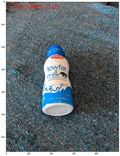
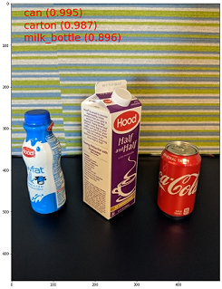
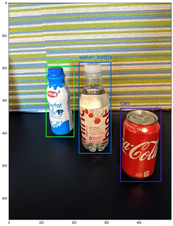
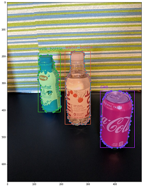

# Data schemas to train computer vision models with automated machine learning

[!INCLUDE [dev v2](includes/machine-learning-dev-v2.md)]


Learn how to format your JSONL files for data consumption in automated ML experiments for computer vision tasks during training and inference.


## Data schema for training 

Azure Machine Learning AutoML for Images requires input image data to be prepared in [JSONL](https://jsonlines.org/) (JSON Lines) format. This section describes input data formats or schema for image classification multi-class, image classification multi-label, object detection, and instance segmentation. We'll also provide a sample of final training or validation JSON Lines file.

### Image classification (binary/multi-class)

**Input data format/schema in each JSON Line:**
```json
{
   "image_url":"azureml://subscriptions/<my-subscription-id>/resourcegroups/<my-resource-group>/workspaces/<my-workspace>/datastores/<my-datastore>/paths/<path_to_image>",
   "image_details":{
      "format":"image_format",
      "width":"image_width",
      "height":"image_height"
   },
   "label":"class_name",
}
```

| Key       | Description  | Example |
| -------- |----------|-----|
| `image_url` | Image location in Azure Machine Learning datastore. <br>`my-subscription-id` needs to be replaced by the Azure subscription where images are located. More information about Azure subscriptions can be found [here](../azure-portal/get-subscription-tenant-id.md). Similarly `my-resource-group`, `my-workspace`, `my-datastore` should be replaced by [resource group name](../azure-resource-manager/management/manage-resource-groups-portal.md#what-is-a-resource-group), [workspace name]( ./concept-workspace.md) and [datastore name](./how-to-datastore.md) respectively. <br> `path_to_image` should be the full path to image on datastore.<br>`Required, String` | `"azureml://subscriptions/my-subscription-id/resourcegroups/my-resource-group/workspaces/my-workspace/datastores/my-datastore/paths/image_data/Image_01.jpg"` |
| `image_details` | Image details<br>`Optional, Dictionary` | `"image_details":{"format": "jpg", "width": "400px", "height": "258px"}` |
| `format`  | Image type (all the available Image formats in [Pillow](https://pillow.readthedocs.io/en/stable/releasenotes/8.0.1.html) library are supported)<br>`Optional, String from {"jpg", "jpeg", "png", "jpe", "jfif","bmp", "tif", "tiff"}`  |  `"jpg" or "jpeg" or "png" or "jpe" or "jfif" or "bmp" or "tif" or "tiff"` |
| `width` | Width of the image<br>`Optional, String or Positive Integer`  | `"400px" or 400`|
| `height` | Height of the image<br>`Optional, String or Positive Integer` | `"200px" or 200` |
| `label` | Class/label of the image<br>`Required, String` | `"cat"` |


Example of a JSONL file for multi-class image classification:
```json
{"image_url": "azureml://subscriptions/my-subscription-id/resourcegroups/my-resource-group/workspaces/my-workspace/datastores/my-datastore/paths/image_data/Image_01.jpg", "image_details":{"format": "jpg", "width": "400px", "height": "258px"}, "label": "can"}
{"image_url": "azureml://subscriptions/my-subscription-id/resourcegroups/my-resource-group/workspaces/my-workspace/datastores/my-datastore/paths/image_data/Image_02.jpg", "image_details": {"format": "jpg", "width": "397px", "height": "296px"}, "label": "milk_bottle"}
.
.
.
{"image_url": "azureml://subscriptions/my-subscription-id/resourcegroups/my-resource-group/workspaces/my-workspace/datastores/my-datastore/paths/image_data/Image_n.jpg", "image_details": {"format": "jpg", "width": "1024px", "height": "768px"}, "label": "water_bottle"}
  ```



### Image classification multi-label

The following is an example of input data format/schema in each JSON Line for image classification.


```json
{
   "image_url":"azureml://subscriptions/<my-subscription-id>/resourcegroups/<my-resource-group>/workspaces/<my-workspace>/datastores/<my-datastore>/paths/<path_to_image>",
   "image_details":{
      "format":"image_format",
      "width":"image_width",
      "height":"image_height"
   },
   "label":[
      "class_name_1",
      "class_name_2",
      "class_name_3",
      "...",
      "class_name_n"
        
   ]
}
```

| Key       | Description  | Example |
| -------- |----------|-----|
| `image_url` | Image location in Azure Machine Learning datastore. <br>`my-subscription-id` needs to be replaced by the Azure subscription where images are located. More information about Azure subscriptions can be found [here](../azure-portal/get-subscription-tenant-id.md). Similarly `my-resource-group`, `my-workspace`, `my-datastore` should be replaced by [resource group name](../azure-resource-manager/management/manage-resource-groups-portal.md#what-is-a-resource-group), [workspace name]( ./concept-workspace.md) and [datastore name](./how-to-datastore.md) respectively. <br> `path_to_image` should be the full path to image on datastore.<br>`Required, String` | `"azureml://subscriptions/my-subscription-id/resourcegroups/my-resource-group/workspaces/my-workspace/datastores/my-datastore/paths/image_data/Image_01.jpg"` |
| `image_details` | Image details<br>`Optional, Dictionary` | `"image_details":{"format": "jpg", "width": "400px", "height": "258px"}` |
| `format`  | Image type (all the Image formats available in [Pillow](https://pillow.readthedocs.io/en/stable/releasenotes/8.0.1.html) library are supported)<br>`Optional, String from {"jpg", "jpeg", "png", "jpe", "jfif", "bmp", "tif", "tiff"}`  |  `"jpg" or "jpeg" or "png" or "jpe" or "jfif" or "bmp" or "tif" or "tiff"` |
| `width` | Width of the image<br>`Optional, String or Positive Integer`  | `"400px" or 400`|
| `height` | Height of the image<br>`Optional, String or Positive Integer` | `"200px" or 200` |
| `label` | List of classes/labels in the image<br>`Required, List of Strings` | `["cat","dog"]` |


Example of a JSONL file for Image Classification Multi-label:

```json
{"image_url": "azureml://subscriptions/my-subscription-id/resourcegroups/my-resource-group/workspaces/my-workspace/datastores/my-datastore/paths/image_data/Image_01.jpg", "image_details":{"format": "jpg", "width": "400px", "height": "258px"}, "label": ["can"]}
{"image_url": "azureml://subscriptions/my-subscription-id/resourcegroups/my-resource-group/workspaces/my-workspace/datastores/my-datastore/paths/image_data/Image_02.jpg", "image_details": {"format": "jpg", "width": "397px", "height": "296px"}, "label": ["can","milk_bottle"]}
.
.
.
{"image_url": "azureml://subscriptions/my-subscription-id/resourcegroups/my-resource-group/workspaces/my-workspace/datastores/my-datastore/paths/image_data/Image_n.jpg", "image_details": {"format": "jpg", "width": "1024px", "height": "768px"}, "label": ["carton","milk_bottle","water_bottle"]}
  ```



### Object detection

The following is an example JSONL file for object detection.

```json
{
   "image_url":"azureml://subscriptions/<my-subscription-id>/resourcegroups/<my-resource-group>/workspaces/<my-workspace>/datastores/<my-datastore>/paths/<path_to_image>",
   "image_details":{
      "format":"image_format",
      "width":"image_width",
      "height":"image_height"
   },
   "label":[
      {
         "label":"class_name_1",
         "topX":"xmin/width",
         "topY":"ymin/height",
         "bottomX":"xmax/width",
         "bottomY":"ymax/height",
         "isCrowd":"isCrowd"
      },
      {
         "label":"class_name_2",
         "topX":"xmin/width",
         "topY":"ymin/height",
         "bottomX":"xmax/width",
         "bottomY":"ymax/height",
         "isCrowd":"isCrowd"
      },
      "..."
   ]
}
```

Here, 
- `xmin` = x coordinate of top-left corner of bounding box
- `ymin` = y coordinate of top-left corner of bounding box
- `xmax` = x coordinate of bottom-right corner of bounding box
- `ymax` = y coordinate of bottom-right corner of bounding box


| Key       | Description  | Example |
| -------- |----------|-----|
| `image_url` | Image location in Azure Machine Learning datastore. <br>`my-subscription-id` needs to be replaced by the Azure subscription where images are located. More information about Azure subscriptions can be found [here](../azure-portal/get-subscription-tenant-id.md). Similarly `my-resource-group`, `my-workspace`, `my-datastore` should be replaced by [resource group name](../azure-resource-manager/management/manage-resource-groups-portal.md#what-is-a-resource-group), [workspace name]( ./concept-workspace.md) and [datastore name](./how-to-datastore.md) respectively. <br> `path_to_image` should be the full path to image on datastore.<br>`Required, String` | `"azureml://subscriptions/my-subscription-id/resourcegroups/my-resource-group/workspaces/my-workspace/datastores/my-datastore/paths/image_data/Image_01.jpg"` |
| `image_details` | Image details<br>`Optional, Dictionary` | `"image_details":{"format": "jpg", "width": "400px", "height": "258px"}` |
| `format`  | Image type (all the Image formats available in [Pillow](https://pillow.readthedocs.io/en/stable/releasenotes/8.0.1.html) library are supported. But for YOLO only image formats allowed by [opencv](https://pypi.org/project/opencv-python/4.3.0.36/) are supported)<br>`Optional, String from {"jpg", "jpeg", "png", "jpe", "jfif", "bmp", "tif", "tiff"}`  |  `"jpg" or "jpeg" or "png" or "jpe" or "jfif" or "bmp" or "tif" or "tiff"` |
| `width` | Width of the image<br>`Optional, String or Positive Integer`  | `"499px" or 499`|
| `height` | Height of the image<br>`Optional, String or Positive Integer` | `"665px" or 665` |
| `label` (outer key) | List of bounding boxes, where each box is a dictionary of `label, topX, topY, bottomX, bottomY, isCrowd` their top-left and bottom-right coordinates<br>`Required, List of dictionaries` | `[{"label": "cat", "topX": 0.260, "topY": 0.406, "bottomX": 0.735, "bottomY": 0.701, "isCrowd": 0}]` |
| `label` (inner key)| Class/label of the object in the bounding box<br>`Required, String` | `"cat"` |
| `topX` | Ratio of x coordinate of top-left corner of the bounding box and width of the image<br>`Required, Float in the range [0,1]` | `0.260` |
| `topY` | Ratio of y coordinate of top-left corner of the bounding box and height of the image<br>`Required, Float in the range [0,1]` | `0.406` |
| `bottomX` | Ratio of x coordinate of bottom-right corner of the bounding box and width of the image<br>`Required, Float in the range [0,1]` | `0.735` |
| `bottomY` | Ratio of y coordinate of bottom-right corner of the bounding box and height of the image<br>`Required, Float in the range [0,1]` | `0.701` |
| `isCrowd` | Indicates whether the bounding box is around the crowd of objects. If this special flag is set, we skip this particular  bounding box when calculating the metric.<br>`Optional, Bool` | `0` |


Example of a JSONL file for object detection:

```json
{"image_url": "azureml://subscriptions/my-subscription-id/resourcegroups/my-resource-group/workspaces/my-workspace/datastores/my-datastore/paths/image_data/Image_01.jpg", "image_details": {"format": "jpg", "width": "499px", "height": "666px"}, "label": [{"label": "can", "topX": 0.260, "topY": 0.406, "bottomX": 0.735, "bottomY": 0.701, "isCrowd": 0}]}
{"image_url": "azureml://subscriptions/my-subscription-id/resourcegroups/my-resource-group/workspaces/my-workspace/datastores/my-datastore/paths/image_data/Image_02.jpg", "image_details": {"format": "jpg", "width": "499px", "height": "666px"}, "label": [{"label": "carton", "topX": 0.172, "topY": 0.153, "bottomX": 0.432, "bottomY": 0.659, "isCrowd": 0}, {"label": "milk_bottle", "topX": 0.300, "topY": 0.566, "bottomX": 0.891, "bottomY": 0.735, "isCrowd": 0}]}
.
.
.
{"image_url": "azureml://subscriptions/my-subscription-id/resourcegroups/my-resource-group/workspaces/my-workspace/datastores/my-datastore/paths/image_data/Image_n.jpg", "image_details": {"format": "jpg", "width": "499px", "height": "666px"}, "label": [{"label": "carton", "topX": 0.0180, "topY": 0.297, "bottomX": 0.380, "bottomY": 0.836, "isCrowd": 0}, {"label": "milk_bottle", "topX": 0.454, "topY": 0.348, "bottomX": 0.613, "bottomY": 0.683, "isCrowd": 0}, {"label": "water_bottle", "topX": 0.667, "topY": 0.279, "bottomX": 0.841, "bottomY": 0.615, "isCrowd": 0}]}
```



### Instance segmentation

For instance segmentation, automated ML only support polygon as input and output, no masks.

The following is an example JSONL file, for instance,  segmentation.

```json
{
   "image_url":"azureml://subscriptions/<my-subscription-id>/resourcegroups/<my-resource-group>/workspaces/<my-workspace>/datastores/<my-datastore>/paths/<path_to_image>",
   "image_details":{
      "format":"image_format",
      "width":"image_width",
      "height":"image_height"
   },
   "label":[
      {
         "label":"class_name",
         "isCrowd":"isCrowd",
         "polygon":[["x1", "y1", "x2", "y2", "x3", "y3", "...", "xn", "yn"]]
      }
   ]
}
```

| Key       | Description  | Example |
| -------- |----------|-----|
| `image_url` | Image location in Azure Machine Learning datastore. <br>`my-subscription-id` needs to be replaced by the Azure subscription where images are located. More information about Azure subscriptions can be found [here](../azure-portal/get-subscription-tenant-id.md). Similarly `my-resource-group`, `my-workspace`, `my-datastore` should be replaced by [resource group name](../azure-resource-manager/management/manage-resource-groups-portal.md#what-is-a-resource-group), [workspace name]( ./concept-workspace.md) and [datastore name](./how-to-datastore.md) respectively. <br> `path_to_image` should be the full path to image on datastore.<br>`Required, String` | `"azureml://subscriptions/my-subscription-id/resourcegroups/my-resource-group/workspaces/my-workspace/datastores/my-datastore/paths/image_data/Image_01.jpg"` |
| `image_details` | Image details<br>`Optional, Dictionary` | `"image_details":{"format": "jpg", "width": "400px", "height": "258px"}` |
| `format`  | Image type<br>`Optional, String from {"jpg", "jpeg", "png", "jpe", "jfif", "bmp", "tif", "tiff" }`  |  `"jpg" or "jpeg" or "png" or "jpe" or "jfif" or "bmp" or "tif" or "tiff"` |
| `width` | Width of the image<br>`Optional, String or Positive Integer`  | `"499px" or 499`|
| `height` | Height of the image<br>`Optional, String or Positive Integer` | `"665px" or 665` |
| `label` (outer key) | List of masks, where each mask is a dictionary of `label, isCrowd, polygon coordinates` <br>`Required, List of dictionaries` | ` [{"label": "can", "isCrowd": 0, "polygon": [[0.577, 0.689,`<br> ` 0.562, 0.681,`<br> `0.559, 0.686]]}]` |
| `label` (inner key)| Class/label of the object in the mask<br>`Required, String` | `"cat"` |
| `isCrowd` | Indicates whether the mask is around the crowd of objects<br>`Optional, Bool` | `0` |
| `polygon` | Polygon coordinates for the object<br>`Required,  List of list for multiple segments of the same instance. Float values in the range [0,1]` | ` [[0.577, 0.689, 0.567, 0.689, 0.559, 0.686]]` |


Example of a JSONL file for Instance Segmentation:

```python
{"image_url": "azureml://subscriptions/my-subscription-id/resourcegroups/my-resource-group/workspaces/my-workspace/datastores/my-datastore/paths/image_data/Image_01.jpg", "image_details": {"format": "jpg", "width": "499px", "height": "666px"}, "label": [{"label": "can", "isCrowd": 0, "polygon": [[0.577, 0.689, 0.567, 0.689, 0.559, 0.686, 0.380, 0.593, 0.304, 0.555, 0.294, 0.545, 0.290, 0.534, 0.274, 0.512, 0.2705, 0.496, 0.270, 0.478, 0.284, 0.453, 0.308, 0.432, 0.326, 0.423, 0.356, 0.415, 0.418, 0.417, 0.635, 0.493, 0.683, 0.507, 0.701, 0.518, 0.709, 0.528, 0.713, 0.545, 0.719, 0.554, 0.719, 0.579, 0.713, 0.597, 0.697, 0.621, 0.695, 0.629, 0.631, 0.678, 0.619, 0.683, 0.595, 0.683, 0.577, 0.689]]}]}
{"image_url": "azureml://subscriptions/my-subscription-id/resourcegroups/my-resource-group/workspaces/my-workspace/datastores/my-datastore/paths/image_data/Image_02.jpg", "image_details": {"format": "jpg", "width": "499px", "height": "666px"}, "label": [{"label": "carton", "isCrowd": 0, "polygon": [[0.240, 0.65, 0.234, 0.654, 0.230, 0.647, 0.210, 0.512, 0.202, 0.403, 0.182, 0.267, 0.184, 0.243, 0.180, 0.166, 0.186, 0.159, 0.198, 0.156, 0.396, 0.162, 0.408, 0.169, 0.406, 0.217, 0.414, 0.249, 0.422, 0.262, 0.422, 0.569, 0.342, 0.569, 0.334, 0.572, 0.320, 0.585, 0.308, 0.624, 0.306, 0.648, 0.240, 0.657]]}, {"label": "milk_bottle",  "isCrowd": 0, "polygon": [[0.675, 0.732, 0.635, 0.731, 0.621, 0.725, 0.573, 0.717, 0.516, 0.717, 0.505, 0.720, 0.462, 0.722, 0.438, 0.719, 0.396, 0.719, 0.358, 0.714, 0.334, 0.714, 0.322, 0.711, 0.312, 0.701, 0.306, 0.687, 0.304, 0.663, 0.308, 0.630, 0.320, 0.596, 0.32, 0.588, 0.326, 0.579]]}]}
.
.
.
{"image_url": "azureml://subscriptions/my-subscription-id/resourcegroups/my-resource-group/workspaces/my-workspace/datastores/my-datastore/paths/image_data/Image_n.jpg", "image_details": {"format": "jpg", "width": "499px", "height": "666px"}, "label": [{"label": "water_bottle", "isCrowd": 0, "polygon": [[0.334, 0.626, 0.304, 0.621, 0.254, 0.603, 0.164, 0.605, 0.158, 0.602, 0.146, 0.602, 0.142, 0.608, 0.094, 0.612, 0.084, 0.599, 0.080, 0.585, 0.080, 0.539, 0.082, 0.536, 0.092, 0.533, 0.126, 0.530, 0.132, 0.533, 0.144, 0.533, 0.162, 0.525, 0.172, 0.525, 0.186, 0.521, 0.196, 0.521 ]]}, {"label": "milk_bottle", "isCrowd": 0, "polygon": [[0.392, 0.773, 0.380, 0.732, 0.379, 0.767, 0.367, 0.755, 0.362, 0.735, 0.362, 0.714, 0.352, 0.644, 0.352, 0.611, 0.362, 0.597, 0.40, 0.593, 0.444,  0.494, 0.588, 0.515, 0.585, 0.621, 0.588, 0.671, 0.582, 0.713, 0.572, 0.753 ]]}]}
```



## Data schema for online scoring

In this section, we document the input data format required to make predictions using a deployed model.

### Input format

The following JSON is the input format needed to generate predictions on any task using task-specific model endpoint.

```json
{
   "input_data": {
      "columns": [
         "image"
      ],
      "data": [
         "image_in_base64_string_format"
      ]
   }
}
```

This json is a dictionary with outer key `input_data` and inner keys `columns`, `data` as described in the following table. The endpoint accepts a json string in the above format and converts it into a dataframe of samples required by the scoring script. Each input image in the `request_json["input_data"]["data"]` section of the json is a [base64 encoded string](https://docs.python.org/3/library/base64.html#base64.encodebytes).


| Key       | Description  |
| -------- |----------|
| `input_data`<br> (outer key) | It's an outer key in json request. `input_data` is a dictionary that accepts input image samples <br>`Required, Dictionary` |
| `columns`<br> (inner key) | Column names to use to create dataframe. It accepts only one column with `image` as column name.<br>`Required, List` |
| `data`<br> (inner key) | List of base64 encoded images <br>`Required, List`|


After we [deploy the mlflow model](how-to-auto-train-image-models.md#register-and-deploy-model), we can use the following code snippet to get predictions for all tasks.

[!Notebook-python[] (~/azureml-examples-main/sdk/python/jobs/automl-standalone-jobs/automl-image-object-detection-task-fridge-items/automl-image-object-detection-task-fridge-items.ipynb?name=create_inference_request)]

[!Notebook-python[] (~/azureml-examples-main/sdk/python/jobs/automl-standalone-jobs/automl-image-object-detection-task-fridge-items/automl-image-object-detection-task-fridge-items.ipynb?name=dump_inference_request)]

[!Notebook-python[] (~/azureml-examples-main/sdk/python/jobs/automl-standalone-jobs/automl-image-object-detection-task-fridge-items/automl-image-object-detection-task-fridge-items.ipynb?name=invoke_inference)]

### Output format

Predictions made on model endpoints follow different structure depending on the task type. This section explores the output data formats for multi-class, multi-label image classification, object detection, and instance segmentation tasks.

The following schemas are applicable when the input request contains one image.

#### Image classification (binary/multi-class)

Endpoint for image classification returns all the labels in the dataset and their probability scores for the input image in the following format.  `visualizations` and `attributions` are related to explainability and when the request is only for scoring, these keys will not be included in the output. For more information on explainability input and output schema for image classification, see the [explainability for image classification section](#image-classification-binarymulti-class-2).

```json
[
   {
      "probs": [
         2.098e-06,
         4.783e-08,
         0.999,
         8.637e-06
      ],
      "labels": [
         "can",
         "carton",
         "milk_bottle",
         "water_bottle"
      ]
   }
]
```

#### Image classification multi-label

For image classification multi-label, model endpoint returns labels and their probabilities. `visualizations` and `attributions` are related to explainability and when the request is only for scoring, these keys will not be included in the output. For more information on explainability input and output schema for multi-label classification, see the [explainability for image classification multi-label section](#image-classification-multi-label-2).

```json
[
   {
      "probs": [
         0.997,
         0.960,
         0.982,
         0.025
      ],
      "labels": [
         "can",
         "carton",
         "milk_bottle",
         "water_bottle"
      ]
   }
]
```

#### Object detection

Object detection model returns multiple boxes with their scaled top-left and bottom-right coordinates along with box label and confidence score.

```json
[
   {
      "boxes": [
         {
            "box": {
               "topX": 0.224,
               "topY": 0.285,
               "bottomX": 0.399,
               "bottomY": 0.620
            },
            "label": "milk_bottle",
            "score": 0.937
         },
         {
            "box": {
               "topX": 0.664,
               "topY": 0.484,
               "bottomX": 0.959,
               "bottomY": 0.812
            },
            "label": "can",
            "score": 0.891
         },
         {
            "box": {
               "topX": 0.423,
               "topY": 0.253,
               "bottomX": 0.632,
               "bottomY": 0.725
            },
            "label": "water_bottle",
            "score": 0.876
         }
      ]
   }
]
```
#### Instance segmentation

In instance segmentation, output consists of multiple boxes with their scaled top-left and bottom-right coordinates, labels, confidence scores, and polygons (not masks). Here, the polygon values are in the same format that we discussed in the [schema section](#instance-segmentation).

```json
[
    {
       "boxes": [
          {
             "box": {
                "topX": 0.679,
                "topY": 0.491,
                "bottomX": 0.926,
                "bottomY": 0.810
             },
             "label": "can",
             "score": 0.992,
             "polygon": [
                [
                   0.82, 0.811, 0.771, 0.810, 0.758, 0.805, 0.741, 0.797, 0.735, 0.791, 0.718, 0.785, 0.715, 0.778, 0.706, 0.775, 0.696, 0.758, 0.695, 0.717, 0.698, 0.567, 0.705, 0.552, 0.706, 0.540, 0.725, 0.520, 0.735, 0.505, 0.745, 0.502, 0.755, 0.493
                ]
             ]
          },
          {
             "box": {
                "topX": 0.220,
                "topY": 0.298,
                "bottomX": 0.397,
                "bottomY": 0.601
             },
             "label": "milk_bottle",
             "score": 0.989,
             "polygon": [
                [
                   0.365, 0.602, 0.273, 0.602, 0.26, 0.595, 0.263, 0.588, 0.251, 0.546, 0.248, 0.501, 0.25, 0.485, 0.246, 0.478, 0.245, 0.463, 0.233, 0.442, 0.231, 0.43, 0.226, 0.423, 0.226, 0.408, 0.234, 0.385, 0.241, 0.371, 0.238, 0.345, 0.234, 0.335, 0.233, 0.325, 0.24, 0.305, 0.586, 0.38, 0.592, 0.375, 0.598, 0.365
                ]
             ]
          },
          {
             "box": {
                "topX": 0.433,
                "topY": 0.280,
                "bottomX": 0.621,
                "bottomY": 0.679
             },
             "label": "water_bottle",
             "score": 0.988,
             "polygon": [
                [
                   0.576, 0.680, 0.501, 0.680, 0.475, 0.675, 0.460, 0.625, 0.445, 0.630, 0.443, 0.572, 0.440, 0.560, 0.435, 0.515, 0.431, 0.501, 0.431, 0.433, 0.433, 0.426, 0.445, 0.417, 0.456, 0.407, 0.465, 0.381, 0.468, 0.327, 0.471, 0.318
                ]
             ]
          }
       ]
    }
]
```


## Data format for Online Scoring and Explainability (XAI)

> [!IMPORTANT]
> These settings are currently in public preview. They are provided without a service-level agreement. Certain features might not be supported or might have constrained capabilities. For more information, see [Supplemental Terms of Use for Microsoft Azure Previews](https://azure.microsoft.com/support/legal/preview-supplemental-terms/).

> [!WARNING]
>  **Explainability** is supported only for **multi-class classification** and **multi-label classification**. While generating explanations on online endpoint, if you encounter timeout issues, use [batch scoring notebook (SDK v1)](https://github.com/Azure/azureml-examples/tree/v1-archive/v1/python-sdk/tutorials/automl-with-azureml/image-classification-multiclass-batch-scoring) to generate explanations.

In this section, we document the input data format required to make predictions and generate explanations for the predicted class/classes using a deployed model. There's no separate deployment needed for explainability. The same endpoint for online scoring can be utilized to generate explanations. We just need to pass some extra explainability related parameters in input schema and get either visualizations of explanations and/or attribution score matrices (pixel level explanations).

### Supported explainability methods:
   - [XRAI](https://arxiv.org/abs/1906.02825) (xrai)
   - [Integrated Gradients](https://arxiv.org/abs/1703.01365) (integrated_gradients)
   - [Guided GradCAM](https://arxiv.org/abs/1610.02391v4) (guided_gradcam)
   - [Guided BackPropagation](https://arxiv.org/abs/1412.6806) (guided_backprop)

### Input format (XAI)

The following input formats are supported to generate predictions and explanations on any classification task using task-specific model endpoint. After we [deploy the model](./how-to-auto-train-image-models.md#register-and-deploy-model), we can use the following schema to get predictions and explanations.

```json
{
   "input_data": {
      "columns": ["image"],
      "data": [json.dumps({"image_base64": "image_in_base64_string_format", 
                           "model_explainability": True,
                           "xai_parameters": {}
                         })
      ]
   }
}
```

Along with the image, there are two extra parameters (`model_explainability` and `xai_parameters`) required in the input schema to generate explanations.

| Key       | Description  | Default Value |
| -------- |----------|-----|
| `image_base64` | input image in base64 format<br>`Required, String` | - |
| `model_explainability` | Whether to generate explanations or just the scoring<br>`Optional, Bool` | `False` |
| `xai_parameters` | If `model_explainability` is True, then `xai_parameters` is a dictionary containing  explainability algorithm related parameters with `xai_algorithm`, `visualizations`, `attributions` ask keys. <br>`Optional, Dictionary` <br> If `xai_parameters` isn't passed, then the `xrai` explainability algorithm is used with its default value| `{"xai_algorithm": "xrai", "visualizations": True, "attributions": False}` |
| `xai_algorithm` | Name of the Explainability algorithm to be used. Supported XAI algorithms are {`xrai`, `integrated_gradients`, `guided_gradcam`, `guided_backprop`}<br>`Optional, String`| `xrai` |
| `visualizations` | Whether to return visualizations of explanations. <br>`Optional, Bool`| `True` |
| `attributions` | Whether to return feature attributions. <br>`Optional, Bool`| `False` |
| `confidence_score_threshold_multilabel` | Confidence score threshold to select top classes to generate explanations in **multi-label classification**. <br>`Optional, Float`| `0.5` |

Following table describes the supported schemas for explainability.

|Type | Schema |
|---|----|
|Inference on single image in base64 format | Dictionary with `image_base64` as key and value is base64 encoded image, <br> `model_explainability` key with True or False and `xai_parameters` dictionary with XAI algorithm specific parameters <br> `Required, Json String` <br> `Works for one or more images`  |

Each input image in the `request_json`, defined in the code below, is a base64 encoded string appended to the list `request_json["input_data"]["data"]`:

```python
import base64
import json
# Get the details for online endpoint
endpoint = ml_client.online_endpoints.get(name=online_endpoint_name)

sample_image = "./test_image.jpg"

# Define explainability (XAI) parameters
model_explainability = True
xai_parameters = {"xai_algorithm": "xrai",
                  "visualizations": True,
                  "attributions": False}

def read_image(image_path):
    with open(image_path, "rb") as f:
        return f.read()

# Create request json
request_json = {

    "input_data": {
        "columns": ["image"],
        "data": [json.dumps({"image_base64": base64.encodebytes(read_image(sample_image)).decode("utf-8"),
                             "model_explainability": model_explainability,
                             "xai_parameters": xai_parameters})],
    }
}

request_file_name = "sample_request_data.json"

with open(request_file_name, "w") as request_file:
    json.dump(request_json, request_file)

resp = ml_client.online_endpoints.invoke(
    endpoint_name=online_endpoint_name,
    deployment_name=deployment.name,
    request_file=request_file_name,
)
predictions = json.loads(resp)
```
### Output format (XAI)

Predictions made on model endpoints follow different schema depending on the task type. This section describes the output data formats for multi-class, multi-label image classification tasks.

The following schemas are defined for the case of two input images.

#### Image classification (binary/multi-class)
Output schema is [same as described above](#data-schema-for-online-scoring) except that `visualizations` and `attributions` key values are included, if these keys were set to `True` in the request.

If `model_explainability`, `visualizations`, `attributions` are set to `True` in the input request, then the output will have `visualizations` and `attributions`. More details on these parameters are explained in the following table. Visualizations and attributions are generated against a class that has the highest probability score.  

| Output key | Description  |
|--------- |------------- |
|`visualizations` |Single image in base64 string format with type <br> `Optional, String` |
|`attributions` | multi-dimensional array with pixel wise attribution scores of shape `[3, valid_crop_size, valid_crop_size]` <br> `Optional, List`|


```json
[
    {
       "probs": [
          0.006,
          9.345e-05,
          0.992,
          0.003
       ],
       "labels": [
          "can",
          "carton",
          "milk_bottle",
          "water_bottle"
       ],
       "visualizations": "iVBORw0KGgoAAAAN.....",
       "attributions": [[[-4.2969e-04, -1.3090e-03,  7.7791e-04,  ...,  2.6677e-04,
                          -5.5195e-03,  1.7989e-03],
                          .
                          .
                          .
                         [-5.8236e-03, -7.9108e-04, -2.6963e-03,  ...,  2.6517e-03,
                           1.2546e-03,  6.6507e-04]]]
    }
]
```

#### Image classification multi-label
The only difference in the output schema of **multi-label classification** compared to **multi-class classification** is that there can be multiple classes in each image for which explanations can be generated. So, `visualizations` is the list of base64 image strings and `attributions` is the list of attribution scores against each selected class based on the `confidence_score_threshold_multilabel` (default is 0.5).

If `model_explainability`, `visualizations`, `attributions` are set to `True` in the input request, then the output will have `visualizations` and `attributions`. More details on these parameters are explained in the following table. Visualizations and attributions are generated against all the classes that have the probability score greater than or equal to `confidence_score_threshold_multilabel`. 

| Output key | Description  |
|--------- |------------- |
|`visualizations` |List of images in base64 string format with type <br> `Optional, String` |
|`attributions` | List of multi-dimensional arrays with pixel wise attribution scores against each class, where each multi-dimensional array is of shape `[3, valid_crop_size, valid_crop_size]` <br> `Optional, List`|


> [!WARNING]
> While generating explanations on online endpoint, make sure to select only few classes based on confidence score in order to avoid timeout issues on the endpoint or use the endpoint with GPU instance type. To generate explanations for large number of classes in multi-label classification, refer to [batch scoring notebook (SDK v1)](https://github.com/Azure/azureml-examples/tree/v1-archive/v1/python-sdk/tutorials/automl-with-azureml/image-classification-multiclass-batch-scoring).

```json
[
    {
       "probs": [
          0.994,
          0.994,
          0.843,
          0.166
       ],
       "labels": [
          "can",
          "carton",
          "milk_bottle",
          "water_bottle"
       ],
       "visualizations": ["iVBORw0KGgoAAAAN.....", "iVBORw0KGgoAAAAN......", .....],
       "attributions": [
                        [[[-4.2969e-04, -1.3090e-03,  7.7791e-04,  ...,  2.6677e-04,
                           -5.5195e-03,  1.7989e-03],
                           .
                           .
                           .
                          [-5.8236e-03, -7.9108e-04, -2.6963e-03,  ...,  2.6517e-03,
                            1.2546e-03,  6.6507e-04]]],
                        .
                        .
                        .
                       ]
    }
]
```

#### Object detection
> [!WARNING]
>  XAI is not supported. So, only scores are returned. For scoring example, refer to [online scoring section](#object-detection-1).

#### Instance segmentation
> [!WARNING]
>  XAI is not supported. So, only scores are returned. For scoring example, refer to [online scoring section](#instance-segmentation-1).


> [!NOTE]
> The images used in this article are from the Fridge Objects dataset, copyright &copy; Microsoft Corporation and available at [computervision-recipes/01_training_introduction.ipynb](https://github.com/microsoft/computervision-recipes/blob/master/scenarios/detection/01_training_introduction.ipynb) under the [MIT License](https://github.com/microsoft/computervision-recipes/blob/master/LICENSE). 

## Next steps

* Learn how to [Prepare data for training computer vision models with automated ML](how-to-prepare-datasets-for-automl-images.md).
* [Set up computer vision tasks in AutoML](how-to-auto-train-image-models.md)
* [Tutorial: Train an object detection model with AutoML and Python](tutorial-auto-train-image-models.md).
