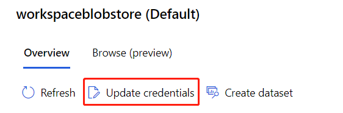
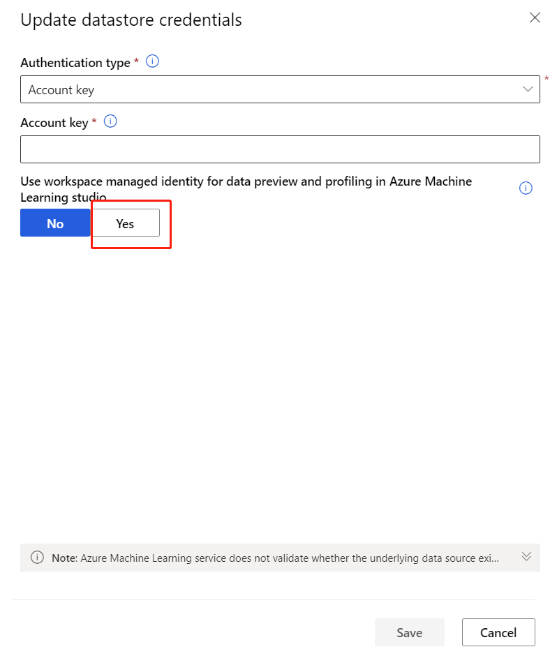

# Known issues and troubleshooting in Azure Machine Learning

This article helps you troubleshoot known issues you may encounter when using Azure Machine Learning. 

For more information on troubleshooting, see [Next steps](#next-steps) at the end of this article.

> [!TIP]
> Errors or other issues might be the result of [resource quotas](how-to-manage-quotas.md) you encounter when working with Azure Machine Learning. 

## Access diagnostic logs

Sometimes it can be helpful if you can provide diagnostic information when asking for help. To see some logs: 
1. Visit [Azure Machine Learning studio](https://ml.azure.com). 
1. On the left-hand side, select **Experiment** 
1. Select an experiment.
1. Select a run.
1. On the top, select **Outputs + logs**.

> [!NOTE]
> Azure Machine Learning logs information from a variety of sources during training, such as AutoML or the Docker container that runs the training job. Many of these logs are not documented. If you encounter problems and contact Microsoft support, they may be able to use these logs during troubleshooting.


## Installation and import
                           
* **Pip Installation: Dependencies are not guaranteed to be consistent with single-line installation:** 

   This is a known limitation of pip, as it does not have a functioning dependency resolver when you install as a single line. The first  unique dependency is the only one it looks at. 

   In the following code `azureml-datadrift` and `azureml-train-automl` are both installed using a single-line pip install. 
     ```
       pip install azureml-datadrift, azureml-train-automl
     ```
   For this example, let's say `azureml-datadrift` requires version > 1.0 and `azureml-train-automl` requires version < 1.2. If the latest version of `azureml-datadrift` is 1.3,  then both packages get upgraded to 1.3, regardless of the `azureml-train-automl` package requirement for an older version. 

   To ensure the appropriate versions are installed for your packages, install using multiple lines like in the following code. Order isn't an issue here, since pip explicitly downgrades as part of the next line call. And so, the appropriate version dependencies are applied.
    
     ```
        pip install azureml-datadrift
        pip install azureml-train-automl 
     ```
     
* **Explanation package not guaranteed to be installed when installing the azureml-train-automl-client:** 
   
   When running a remote AutoML run with model explanation enabled, you will see an error message "Please install azureml-explain-model package for model explanations." This is a known issue. As a workaround follow one of the steps below:
  
  1. Install azureml-explain-model locally.
   ```
      pip install azureml-explain-model
   ```
  2. Disable the explainability feature entirely by passing model_explainability=False in the AutoML configuration.
   ```
      automl_config = AutoMLConfig(task = 'classification',
                             path = '.',
                             debug_log = 'automated_ml_errors.log',
                             compute_target = compute_target,
                             run_configuration = aml_run_config,
                             featurization = 'auto',
                             model_explainability=False,
                             training_data = prepped_data,
                             label_column_name = 'Survived',
                             **automl_settings)
    ``` 
    
* **Panda errors: Typically seen during AutoML Experiment:**
   
   When manually setting up your environment using pip, you may notice attribute errors (especially from pandas) due to unsupported package versions being installed. In order to prevent such errors, [please install the AutoML SDK using the automl_setup.cmd](https://github.com/Azure/MachineLearningNotebooks/blob/master/how-to-use-azureml/automated-machine-learning/README.md):
   
    1. Open an Anaconda prompt and clone the GitHub repository for a set of sample notebooks.

    ```bash
    git clone https://github.com/Azure/MachineLearningNotebooks.git
    ```
    
    2. cd to the how-to-use-azureml/automated-machine-learning folder where the sample notebooks were extracted and then run:
    
    ```bash
    automl_setup
    ```
    
* **KeyError: 'brand' when running AutoML on local compute or Azure Databricks cluster**

    If a new environment was created after June 10, 2020, by using SDK 1.7.0 or earlier, training might fail with this error due to an update in the py-cpuinfo package. (Environments created on or before June 10, 2020, are unaffected, as are experiments run on remote compute because cached training images are used.) To work around this issue, take either of the following two steps:
    
    * Update the SDK version to 1.8.0 or later (this also downgrades py-cpuinfo to 5.0.0):
    
      ```bash
      pip install --upgrade azureml-sdk[automl]
      ```
    
    * Downgrade the installed version of py-cpuinfo to 5.0.0:
    
      ```bash
      pip install py-cpuinfo==5.0.0
      ```
  
* **Error message: Cannot uninstall 'PyYAML'**

    Azure Machine Learning SDK for Python: PyYAML is a `distutils` installed project. Therefore, we cannot accurately determine which files belong to it if there is a partial uninstall. To continue installing the SDK while ignoring this error, use:
    
    ```Python
    pip install --upgrade azureml-sdk[notebooks,automl] --ignore-installed PyYAML
    ```

* **Azure Machine Learning SDK installation failing with an exception: ModuleNotFoundError: No module named 'ruamel' or 'ImportError: No module named ruamel.yaml'**
   
   This issue is getting encountered with the installation of Azure Machine Learning SDK for Python on the latest pip (>20.1.1) in the conda base environment for all released versions of Azure Machine Learning SDK for Python. Refer to the following workarounds:

    * Avoid installing Python SDK on the conda base environment, rather create your conda environment and install SDK on that newly created user environment. The latest pip should work on that new conda environment.

    * For creating images in docker, where you cannot switch away from conda base environment, please pin pip<=20.1.1 in the docker file.

    ```Python
    conda install -c r -y conda python=3.6.2 pip=20.1.1
    ```
    
* **Databricks failure when installing packages**

    Azure Machine Learning SDK installation fails on Azure Databricks when more packages are installed. Some packages, such as `psutil`, can cause conflicts. To avoid installation errors, install packages by freezing the library version. This issue is related to Databricks and not to the Azure Machine Learning SDK. You might experience this issue with other libraries, too. Example:
    
    ```python
    psutil cryptography==1.5 pyopenssl==16.0.0 ipython==2.2.0
    ```

    Alternatively, you can use init scripts if you keep facing install issues with Python libraries. This approach isn't officially supported. For more information, see [Cluster-scoped init scripts](https://docs.azuredatabricks.net/user-guide/clusters/init-scripts.html#cluster-scoped-init-scripts).

* **Databricks import error: cannot import name `Timedelta` from `pandas._libs.tslibs`**: If you see this error when you use automated machine learning, run the two following lines in your notebook:
    ```
    %sh rm -rf /databricks/python/lib/python3.7/site-packages/pandas-0.23.4.dist-info /databricks/python/lib/python3.7/site-packages/pandas
    %sh /databricks/python/bin/pip install pandas==0.23.4
    ```

* **Databricks import error: No module named 'pandas.core.indexes'**: If you see this error when you use automated machine learning:

    1. Run this command to install two packages in your Azure Databricks cluster:
    
       ```bash
       scikit-learn==0.19.1
       pandas==0.22.0
       ```
    
    1. Detach and then reattach the cluster to your notebook.
    
    If these steps don't solve the issue, try restarting the cluster.

* **Databricks FailToSendFeather**: If you see a `FailToSendFeather` error when reading data on Azure Databricks cluster, refer to the following solutions:
    
    * Upgrade `azureml-sdk[automl]` package to the latest version.
    * Add `azureml-dataprep` version 1.1.8 or above.
    * Add `pyarrow` version 0.11 or above.
    
## Create and manage workspaces

> [!WARNING]
> Moving your Azure Machine Learning workspace to a different subscription, or moving the owning subscription to a new tenant, is not supported. Doing so may cause errors.

* **Azure portal**: 
  * If you go directly to your workspace from a share link from the SDK or the Azure portal, you can't view the standard **Overview** page that has subscription information in the extension. In this scenario, you also can't switch to another workspace. To view another workspace, go directly to [Azure Machine Learning studio](https://ml.azure.com) and search for the workspace name.
  * All assets (Datasets, Experiments, Computes, and so on) are available only in [Azure Machine Learning studio](https://ml.azure.com). They're *not* available from the Azure portal.

* **Supported browsers in Azure Machine Learning studio web portal**: We recommend that you use the most up-to-date browser that's compatible with your operating system. The following browsers are supported:
  * Microsoft Edge (The new Microsoft Edge, latest version. Not Microsoft Edge legacy)
  * Safari (latest version, Mac only)
  * Chrome (latest version)
  * Firefox (latest version)

## Set up your environment

* **Trouble creating AmlCompute**: There is a rare chance that some users who created their Azure Machine Learning workspace from the Azure portal before the GA release might not be able to create AmlCompute in that workspace. You can either raise a support request against the service or create a new workspace through the portal or the SDK to unblock yourself immediately.

* **Azure Container Registry doesn't currently support unicode characters in Resource Group names**: It is possible that ACR requests fail because its resource group name contains unicode characters. To mitigate this issue, we recommend creating an ACR in a differently-named resource group.

## Work with data

### Overloaded AzureFile storage

If you receive an error `Unable to upload project files to working directory in AzureFile because the storage is overloaded`, apply following workarounds.

If you are using file share for other workloads, such as data transfer, the recommendation is to use blobs so that file share is free to be used for submitting runs. You may also split the workload between two different workspaces.

### Passing data as input

*  **TypeError: FileNotFound: No such file or directory**: This error occurs if the file path you provide isn't where the file is located. You need to make sure the way you refer to the file is consistent with where you mounted your dataset on your compute target. To ensure a deterministic state, we recommend using the abstract path when mounting a dataset to a compute target. For example, in the following code we mount the dataset under the root of the filesystem of the compute target, `/tmp`. 
    
    ```python
    # Note the leading / in '/tmp/dataset'
    script_params = {
        '--data-folder': dset.as_named_input('dogscats_train').as_mount('/tmp/dataset'),
    } 
    ```

    If you don't include the leading forward slash, '/',  you'll need to prefix the working directory e.g. `/mnt/batch/.../tmp/dataset` on the compute target to indicate where you want the dataset to be mounted.

### Mount dataset
* **Dataset initialization failed:  Waiting for mount point to be ready has timed out**: Re-try logic has been added in `azureml-sdk >=1.12.0` to mitigate the issue. If you are on previous azureml-sdk versions, please upgrade to the latest version. If you are already on `azureml-sdk>=1.12.0`, please recreate your environment so that you have the latest patch with the fix.

### Data labeling projects

|Issue  |Resolution  |
|---------|---------|
|Only datasets created on blob datastores can be used.     |  This is a known limitation of the current release.       |
|After creation, the project shows "Initializing" for a long time.     | Manually refresh the page. Initialization should proceed at roughly 20 datapoints per second. The lack of autorefresh is a known issue.         |
|When reviewing images, newly labeled images are not shown.     |   To load all labeled images, choose the **First** button. The **First** button will take you back to the front of the list, but loads all labeled data.      |
|Pressing Esc key while labeling for object detection creates a zero size label on the top-left corner. Submitting labels in this state fails.     |   Delete the label by clicking on the cross mark next to it.  |

### Data drift monitors

Limitations and known issues for data drift monitors:

* The time range when analyzing historical data is limited to 31 intervals of the monitor's frequency setting. 
* Limitation of 200 features, unless a feature list is not specified (all features used).
* Compute size must be large enough to handle the data.
* Ensure your dataset has data within the start and end date for a given monitor run.
* Dataset monitors will only work on datasets that contain 50 rows or more.
* Columns, or features, in the dataset are classified as categorical or numeric based on the conditions in the following table. If the feature does not meet these conditions - for instance, a column of type string with >100 unique values - the feature is dropped from our data drift algorithm, but is still profiled. 

    | Feature type | Data type | Condition | Limitations | 
    | ------------ | --------- | --------- | ----------- |
    | Categorical | string, bool, int, float | The number of unique values in the feature is less than 100 and less than 5% of the number of rows. | Null is treated as its own category. | 
    | Numerical | int, float | The values in the feature are of a numerical data type and do not meet the condition for a categorical feature. | Feature dropped if >15% of values are null. | 

* When you have [created a data drift monitor](how-to-monitor-datasets.md) but cannot see data on the **Dataset monitors** page in Azure Machine Learning studio, try the following.

    1. Check if you have selected the right date range at the top of the page.  
    1. On the **Dataset Monitors** tab, select the experiment link to check run status.  This link is on the far right of the table.
    1. If run completed successfully, check driver logs to see how many metrics has been generated or if there's any warning messages.  Find driver logs in the **Output + logs** tab after you click on an experiment.

* If the SDK `backfill()` function does not generate the expected output, it may be due to an authentication issue.  When you create the compute to pass into this function, do not use `Run.get_context().experiment.workspace.compute_targets`.  Instead, use [ServicePrincipalAuthentication](/python/api/azureml-core/azureml.core.authentication.serviceprincipalauthentication?preserve-view=true&view=azure-ml-py) such as the following to create the compute that you pass into that `backfill()` function: 

  ```python
   auth = ServicePrincipalAuthentication(
          tenant_id=tenant_id,
          service_principal_id=app_id,
          service_principal_password=client_secret
          )
   ws = Workspace.get("xxx", auth=auth, subscription_id="xxx", resource_group"xxx")
   compute = ws.compute_targets.get("xxx")
   ```

## Azure Machine Learning designer

### Dataset visualization in the designer

After you register a dataset in **Datasets** asset page or using SDK, you can find it under **Datasets** category in the list left to the designer canvas.

However, when you drag the dataset to the canvas and visualize, it may be unable to visualize due to some of the following reasons:

- Currently you can only visualize tabular dataset in the designer. If you register a file dataset outside designer, you cannot visualize it in the designer canvas.
- Your dataset is stored in virtual network (VNet). If you want to visualize, you need to enable workspace managed identity of the datastore.
    1. Go the the related datastore and click **Update Credentials**
    > [!div class="mx-imgBorder"]
    >   
    1. Select **Yes** to enable workspace managed identity.
    > [!div class="mx-imgBorder"]
    >  

### Long compute preparation time

It may be a few minutes or even longer when you first connect to or create a compute target. 

From the Model Data Collector, it can take up to (but usually less than) 10 minutes for data to arrive in your blob storage account. Wait 10 minutes to ensure cells below will run.

```python
import time
time.sleep(600)
```

### Log for real-time endpoints

Logs of real-time endpoints are customer data. For real-time endpoint troubleshooting, you can use following code to enable logs. 

See more details about monitoring web service endpoints in [this article](./how-to-enable-app-insights.md#query-logs-for-deployed-models).

```python
from azureml.core import Workspace
from azureml.core.webservice import Webservice

ws = Workspace.from_config()
service = Webservice(name="service-name", workspace=ws)
logs = service.get_logs()
```
If you have multiple Tenant, you may need to add the following authenticate code before `ws = Workspace.from_config()`

```python
from azureml.core.authentication import InteractiveLoginAuthentication
interactive_auth = InteractiveLoginAuthentication(tenant_id="the tenant_id in which your workspace resides")
```

## Train models

* **ModuleErrors (No module named)**:  If you are running into ModuleErrors while submitting experiments in Azure ML, it means that the training script is expecting a package to be installed but it isn't added. Once you provide the package name, Azure ML installs the package in the environment used for your training run. 

    If you are using Estimators to submit experiments, you can specify a package name via `pip_packages` or `conda_packages` parameter in the estimator based on from which source you want to install the package. You can also specify a yml file with all your dependencies using `conda_dependencies_file`or list all your pip requirements in a txt file using `pip_requirements_file` parameter. If you have your own Azure ML Environment object that you want to override the default image used by the estimator, you can specify that environment via the `environment` parameter of the estimator constructor.

    Azure ML also provides framework-specific estimators for TensorFlow, PyTorch, Chainer and SKLearn. Using these estimators will make sure that the core framework dependencies are installed on your behalf in the environment used for training. You have the option to specify extra dependencies as described above. 
 
    Azure ML maintained docker images and their contents can be seen in [AzureML Containers](https://github.com/Azure/AzureML-Containers).
    Framework-specific dependencies  are listed in the respective framework documentation - [Chainer](/python/api/azureml-train-core/azureml.train.dnn.chainer?preserve-view=true&view=azure-ml-py#&preserve-view=trueremarks), [PyTorch](/python/api/azureml-train-core/azureml.train.dnn.pytorch?preserve-view=true&view=azure-ml-py#&preserve-view=trueremarks), [TensorFlow](/python/api/azureml-train-core/azureml.train.dnn.tensorflow?preserve-view=true&view=azure-ml-py#&preserve-view=trueremarks), [SKLearn](/python/api/azureml-train-core/azureml.train.sklearn.sklearn?preserve-view=true&view=azure-ml-py#&preserve-view=trueremarks).

    > [!Note]
    > If you think a particular package is common enough to be added in Azure ML maintained images and environments please raise a GitHub issue in [AzureML Containers](https://github.com/Azure/AzureML-Containers). 
 
* **NameError (Name not defined), AttributeError (Object has no attribute)**: This exception should come from your training scripts. You can look at the log files from Azure portal to get more information about the specific name not defined or attribute error. From the SDK, you can use `run.get_details()` to look at the error message. This will also list all the log files generated for your run. Please make sure to take a look at your training script and fix the error before resubmitting your run. 

* **Horovod has been shut down**: In most cases if you encounter "AbortedError: Horovod has been shut down" this exception means there was an underlying exception in one of the processes that caused Horovod to shut down. Each rank in the MPI job gets it own dedicated log file in Azure ML. These logs are named `70_driver_logs`. In case of distributed training, the log names are suffixed with `_rank` to make it easier to differentiate the logs. To find the exact error that caused Horovod to shut down, go through all the log files and look for `Traceback` at the end of the driver_log files. One of these files will give you the actual underlying exception. 

* **Run or experiment deletion**:  Experiments can be archived by using the [Experiment.archive](/python/api/azureml-core/azureml.core.experiment%28class%29?preserve-view=true&view=azure-ml-py#&preserve-view=truearchive--) 
method, or from the Experiment tab view in Azure Machine Learning studio client via the "Archive experiment" button. This action hides the experiment from list queries and views, but does not delete it.

    Permanent deletion of individual experiments or runs is not currently supported. For more information on deleting Workspace assets, see [Export or delete your Machine Learning service workspace data](how-to-export-delete-data.md).

* **Metric Document is too large**: Azure Machine Learning has internal limits on the size of metric objects that can be logged at once from a training run. If you encounter a "Metric Document is too large" error when logging a list-valued metric, try splitting the list into smaller chunks, for example:

    ```python
    run.log_list("my metric name", my_metric[:N])
    run.log_list("my metric name", my_metric[N:])
    ```

    Internally, Azure ML concatenates the blocks with the same metric name into a contiguous list.

## Automated machine learning

* **Recent upgrade of AutoML dependencies to newer versions will be breaking compatibility**:  As of version 1.13.0 of the SDK, models won't be loaded in older SDKs due to incompatibility between the older versions we pinned in our previous packages, and the newer versions we pin now. You will see error such as:
  * Module not found: Ex.`No module named 'sklearn.decomposition._truncated_svd`,
  * Import errors: Ex.`ImportError: cannot import name 'RollingOriginValidator'`,
  * Attribute errors: Ex. `AttributeError: 'SimpleImputer' object has no attribute 'add_indicator`
  
  To work around this issue, take either of the following two steps depending on your AutoML SDK training version:
  1. If your AutoML SDK training version is greater than 1.13.0, you need `pandas == 0.25.1` and `sckit-learn==0.22.1`. If there is a version mismatch, upgrade scikit-learn and/or pandas to correct version as shown below:
  
  ```bash
     pip install --upgrade pandas==0.25.1
     pip install --upgrade scikit-learn==0.22.1
  ```
  
  2. If your AutoML SDK training version is less than or equal to 1.12.0, you need `pandas == 0.23.4` and `sckit-learn==0.20.3`. If there is a version mismatch, downgrade scikit-learn and/or pandas to correct version as shown below:
  
  ```bash
    pip install --upgrade pandas==0.23.4
    pip install --upgrade scikit-learn==0.20.3
  ```
 
* **Forecasting R2 score is always zero**: This issue arises if the training data provided has time series that contains the same value for the last `n_cv_splits` + `forecasting_horizon` data points. If this pattern is expected in your time series, you can switch your primary metric to normalized root mean squared error.
 
* **TensorFlow**: As of version 1.5.0 of the SDK, automated machine learning does not install TensorFlow models by default. To install TensorFlow and use it with your automated ML experiments, install tensorflow==1.12.0 via CondaDependecies. 
 
   ```python
   from azureml.core.runconfig import RunConfiguration
   from azureml.core.conda_dependencies import CondaDependencies
   run_config = RunConfiguration()
   run_config.environment.python.conda_dependencies = CondaDependencies.create(conda_packages=['tensorflow==1.12.0'])
  ```
* **Experiment Charts**: Binary classification charts (precision-recall, ROC, gain curve etc.) shown in automated ML experiment iterations are not rendering correctly in user interface since 4/12. Chart plots are currently showing inverse results, where better performing models are shown with lower results. A resolution is under investigation.

* **Databricks cancel an automated machine learning run**: When you use automated machine learning capabilities on Azure Databricks, to cancel a run and start a new experiment run, restart your Azure Databricks cluster.

* **Databricks >10 iterations for automated machine learning**: In automated machine learning settings, if you have more than 10 iterations, set `show_output` to `False` when you submit the run.

* **Databricks widget for the Azure Machine Learning SDK and automated machine learning**: The Azure Machine Learning SDK widget isn't supported in a Databricks notebook because the notebooks can't parse HTML widgets. You can view the widget in the portal by using this Python code in your Azure Databricks notebook cell:

    ```
    displayHTML("<a href={} target='_blank'>Azure Portal: {}</a>".format(local_run.get_portal_url(), local_run.id))
    ```
* **automl_setup fails**: 
    * On Windows, run automl_setup from an Anaconda Prompt. Use this link to [install Miniconda](https://docs.conda.io/en/latest/miniconda.html).
    * Ensure that conda 64-bit is installed, rather than 32-bit by running the `conda info` command. The `platform` should be `win-64` for Windows or `osx-64` for Mac.
    * Ensure that conda 4.4.10 or later is installed. You can check the version with the command `conda -V`. If you have a previous version installed, you can update it by using the command: `conda update conda`.
    * Linux - `gcc: error trying to exec 'cc1plus'`
      *  If the `gcc: error trying to exec 'cc1plus': execvp: No such file or directory` error is encountered, install build essentials using the command `sudo apt-get install build-essential`.
      * Pass a new name as the first parameter to automl_setup to create a new conda environment. View existing conda environments using `conda env list` and remove them with `conda env remove -n <environmentname>`.
      
* **automl_setup_linux.sh fails**: If automl_setup_linus.sh fails on Ubuntu Linux with the error: `unable to execute 'gcc': No such file or directory`-
  1. Make sure that outbound ports 53 and 80 are enabled. On an Azure VM, you can do this from the Azure portal by selecting the VM and clicking on Networking.
  2. Run the command: `sudo apt-get update`
  3. Run the command: `sudo apt-get install build-essential --fix-missing`
  4. Run `automl_setup_linux.sh` again

* **configuration.ipynb fails**:
  * For local conda, first ensure that automl_setup has successfully run.
  * Ensure that the subscription_id is correct. Find the subscription_id in the Azure portal by selecting All Service and then Subscriptions. The characters "<" and ">" should not be included in the subscription_id value. For example, `subscription_id = "12345678-90ab-1234-5678-1234567890abcd"` has the valid format.
  * Ensure Contributor or Owner access to the Subscription.
  * Check that the region is one of the supported regions: `eastus2`, `eastus`, `westcentralus`, `southeastasia`, `westeurope`, `australiaeast`, `westus2`, `southcentralus`.
  * Ensure access to the region using the Azure portal.
  
* **import AutoMLConfig fails**: There were package changes in the automated machine learning version 1.0.76, which require the previous version to be uninstalled before updating to the new version. If the `ImportError: cannot import name AutoMLConfig` is encountered after upgrading from an SDK version before v1.0.76 to v1.0.76 or later, resolve the error by running: `pip uninstall azureml-train automl` and then `pip install azureml-train-auotml`. The automl_setup.cmd script does this automatically. 

* **workspace.from_config fails**: If the calls ws = Workspace.from_config()' fails -
  1. Ensure that the configuration.ipynb notebook has run successfully.
  2. If the notebook is being run from a folder that is not under the folder where the `configuration.ipynb` was run, copy the folder aml_config and the file config.json that it contains to the new folder. Workspace.from_config reads the config.json for the notebook folder or its parent folder.
  3. If a new subscription, resource group, workspace or region, is being used, make sure that you run the `configuration.ipynb` notebook again. Changing config.json directly will only work if the workspace already exists in the specified resource group under the specified subscription.
  4. If you want to change the region, please change the workspace, resource group or subscription. `Workspace.create` will not create or update a workspace if it already exists, even if the region specified is different.
  
* **Sample notebook fails**: If a sample notebook fails with an error that property, method, or library does not exist:
  * Ensure that the correct kernel has been selected in the jupyter notebook. The kernel is displayed in the top right of the notebook page. The default is azure_automl. Note that the kernel is saved as part of the notebook. So, if you switch to a new conda environment, you will have to select the new kernel in the notebook.
      * For Azure Notebooks, it should be Python 3.6. 
      * For local conda environments, it should be the conda environment name that you specified in automl_setup.
  * Ensure the notebook is for the SDK version that you are using. You can check the SDK version by executing `azureml.core.VERSION` in a jupyter notebook cell. You can download previous version of the sample notebooks from GitHub by clicking the `Branch` button, selecting the `Tags` tab and then selecting the version.

* **Numpy import fails in Windows**: Some Windows environments see an error loading numpy with the latest Python version 3.6.8. If you see this issue, try with Python version 3.6.7.

* **Numpy import fails**: Check the TensorFlow version in the automated ml conda environment. Supported versions are < 1.13. Uninstall TensorFlow from the environment if version is >= 1.13 You may check the version of TensorFlow and uninstall as follows -
  1. Start a command shell, activate conda environment where automated ml packages are installed.
  2. Enter `pip freeze` and look for `tensorflow`, if found, the version listed should be < 1.13
  3. If the listed version is a not a supported version, `pip uninstall tensorflow` in the command shell and enter y for confirmation.

## Deploy & serve models

Take these actions for the following errors:

|Error  | Resolution  |
|---------|---------|
|Image building failure when deploying web service     |  Add "pynacl==1.2.1" as a pip dependency to Conda file for image configuration       |
|`['DaskOnBatch:context_managers.DaskOnBatch', 'setup.py']' died with <Signals.SIGKILL: 9>`     |   Change the SKU for VMs used in your deployment to one that has more memory. |
|FPGA failure     |  You will not be able to deploy models on FPGAs until you have requested and been approved for FPGA quota. To request access, fill out the quota request form: https://aka.ms/aml-real-time-ai       |

### Updating Azure Machine Learning components in AKS cluster

Updates to Azure Machine Learning components installed in an Azure Kubernetes Service cluster must be manually applied. 

You can apply these updates by detaching the cluster from the Azure Machine Learning workspace, and then reattaching the cluster to the workspace. If TLS is enabled in the cluster, you will need to supply the TLS/SSL certificate and private key when reattaching the cluster. 

```python
compute_target = ComputeTarget(workspace=ws, name=clusterWorkspaceName)
compute_target.detach()
compute_target.wait_for_completion(show_output=True)

attach_config = AksCompute.attach_configuration(resource_group=resourceGroup, cluster_name=kubernetesClusterName)

## If SSL is enabled.
attach_config.enable_ssl(
    ssl_cert_pem_file="cert.pem",
    ssl_key_pem_file="key.pem",
    ssl_cname=sslCname)

attach_config.validate_configuration()

compute_target = ComputeTarget.attach(workspace=ws, name=args.clusterWorkspaceName, attach_configuration=attach_config)
compute_target.wait_for_completion(show_output=True)
```

If you no longer have the TLS/SSL certificate and private key, or you are using a certificate generated by Azure Machine Learning, you can retrieve the files prior to detaching the cluster by connecting to the cluster using `kubectl` and retrieving the secret `azuremlfessl`.

```bash
kubectl get secret/azuremlfessl -o yaml
```

>[!Note]
>Kubernetes stores the secrets in base-64 encoded format. You will need to base-64 decode the `cert.pem` and `key.pem` components of the secrets prior to providing them to `attach_config.enable_ssl`. 

### Detaching Azure Kubernetes Service

Using the Azure Machine Learning studio, SDK, or the Azure CLI extension for machine learning to detach an AKS cluster does not delete the AKS cluster. To delete the cluster, see [Use the Azure CLI with AKS](../aks/kubernetes-walkthrough.md#delete-the-cluster).

### Webservices in Azure Kubernetes Service failures

Many webservice failures in Azure Kubernetes Service can be debugged by connecting to the cluster using `kubectl`. You can get the `kubeconfig.json` for an Azure Kubernetes Service Cluster by running

```azurecli-interactive
az aks get-credentials -g <rg> -n <aks cluster name>
```

## Authentication errors

If you perform a management operation on a compute target from a remote job, you will receive one of the following errors: 

```json
{"code":"Unauthorized","statusCode":401,"message":"Unauthorized","details":[{"code":"InvalidOrExpiredToken","message":"The request token was either invalid or expired. Please try again with a valid token."}]}
```

```json
{"error":{"code":"AuthenticationFailed","message":"Authentication failed."}}
```

For example, you will receive an error if you try to create or attach a compute target from an ML Pipeline that is submitted for remote execution.

## Missing user interface items in studio

Azure role-based access control can be used to restrict actions that you can perform with Azure Machine Learning. These restrictions can prevent user interface items from showing in the Azure Machine Learning studio. For example, if you are assigned a role that cannot create a compute instance, the option to create a compute instance will not appear in the studio.

For more information, see [Manage users and roles](how-to-assign-roles.md).

## Compute cluster won't resize

If your Azure Machine Learning compute cluster appears stuck at resizing (0 -> 0) for the node state, this may be caused by Azure resource locks.

[!INCLUDE [resource locks](../../includes/machine-learning-resource-lock.md)]

## Next steps

See more troubleshooting articles for Azure Machine Learning:

* [Docker deployment troubleshooting with Azure Machine Learning](how-to-troubleshoot-deployment.md)
* [Debug machine learning pipelines](how-to-debug-pipelines.md)
* [Debug the ParallelRunStep class from the Azure Machine Learning SDK](how-to-debug-parallel-run-step.md)
* [Interactive debugging of a machine learning compute instance with VS Code](how-to-debug-visual-studio-code.md)
* [Use Application Insights to debug machine learning pipelines](./how-to-log-pipelines-application-insights.md)