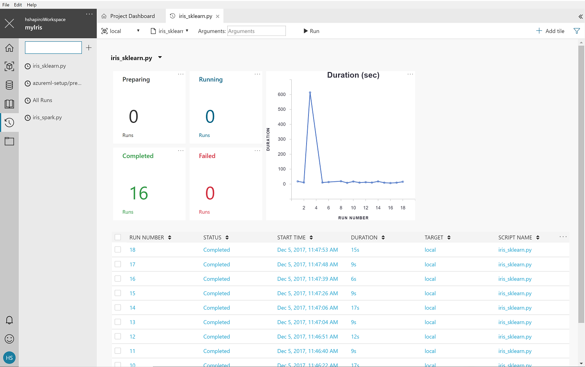
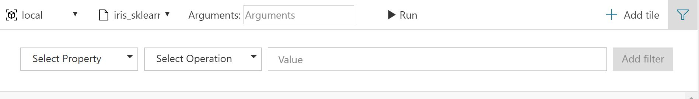
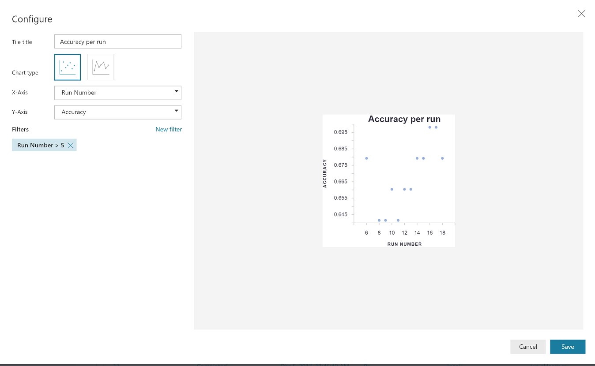
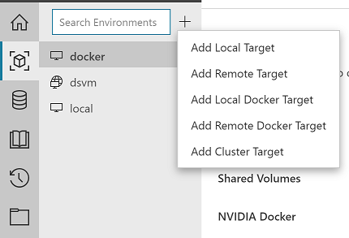
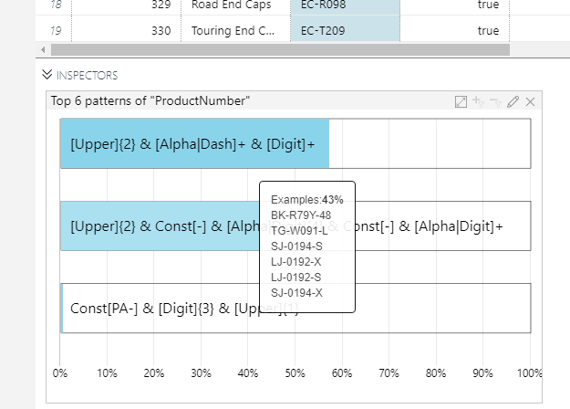
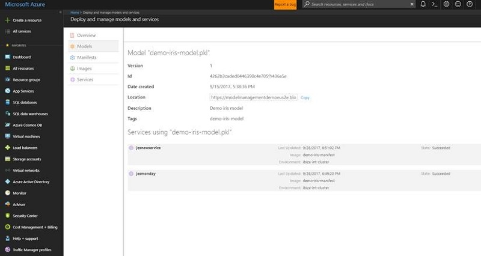

# Azure Machine Learning service release notes

In this article, learn about the Azure Machine Learning service releases. 

## 2018-10-12

### Azure Machine Learning SDK for Python v0.1.68

#### New features
 * Multiple tenant support when creating new workspace.

#### Breaking changes
 * **Upcoming in next release** *Workspace.compute_targets, datastores, experiments, images, models* and *webservices* will become properties instead of methods. For example, replace *Workspace.compute_targets()* with *Workspace.compute_targets*.

#### Bugs fixed
 * The pynacl library version no longer needs to be pinned when deploying web servcie.

### Azure Machine Learning Data Prep SDK v0.3.0

#### New features:
* Added method transform_partition_with_file(script_path), which allows users to pass in the path of a Python file to execute

## 2018-10-01

### Azure Machine Learning SDK for Python v0.1.65
[Version 0.1.65](https://pypi.org/project/azureml-sdk/0.1.65) includes new features, more documentation, bug fixes, and more [sample notebooks](https://aka.ms/aml-notebooks).

See [the list of known issues](resource-known-issues.md) to learn about known bugs and workarounds.

#### Breaking changes
 * Workspace.experiments, Workspace.models, Workspace.compute_targets, Workspace.images, Workspace.web_services return dictionary, previously returned list. See [azureml.core.Workspace](https://docs.microsoft.com/en-us/python/api/azureml-core/azureml.core.workspace(class)?view=azure-ml-py) API documentation.

 * Automated Machine Learning removed normalized mean square error from the primary metrics.


#### HyperDrive
 * Various HyperDrive bug fixes for Bayesian, Performance improvements for get Metrics calls. 
 * Tensorflow 1.10 upgrade from 1.9 
 * Docker image optimization for cold start. 
 * Job’s now report correct status even if they exit with error code other than 0. 
 * RunConfig attribute validation in SDK. 
 * HyperDrive run object supports cancel similar to a regular run: no need to pass any parameters. 
 * Widget improvements for maintaining state of drop-down values for distributed runs and HyperDrive runs. 
 * TensorBoard and other log files support fixed for Parameter server. 
 * Intel(R) MPI support on service side. 
 * Bugfix to parameter tuning for distributed run fix during validation in BatchAI. 
 * Context Manager now identifies the primary instance. 

#### Azure portal experience
 * log_table() and log_row() are supported in Run details. 
 * Automatically create graphs for tables and rows with 1,2 or 3 numerical columns and an optional categorical column.

#### Automated Machine Learning
 * Improved error handling and documentation 
 * Fixed run property retrieval performance issues. 
 * Fixed continue run issue. 
 * Fixed ensembling iteration issues.
 * Fixed training hanging bug on MAC OS.
 * Downsampling macro average PR/ROC curve in custom validation scenario.
 * Removed extra index logic.
 * Removed filter from get_output API.

#### Pipelines
 * Added a method Pipeline.publish() to publish a pipeline directly, without requiring an execution run first.   
 * Added a method PipelineRun.get_pipeline_runs() to fetch the pipeline runs which were generated from a published pipeline.

#### Project Brainwave
 * Updated support for new AI models available on FPGAs.

### Azure Machine Learning Data Prep SDK v0.2.0
[Version 0.2.0](https://pypi.org/project/azureml-dataprep/0.2.0/) includes following features and bugfixes:

**New features:** 
 * Support for one-hot encoding
 * Support for quantile transform
   
**Bug fixed:**
 * Works with any Tornado version, no need to downgrade your Tornado version
 * Value counts for all values, not just the top three

## 2018-09 (Public preview refresh)

A new, completely refreshed release of Azure Machine Learning: Read more about this release: https://azure.microsoft.com/blog/what-s-new-in-azure-machine-learning-service/

## Older notes: Sept 2017 - Jun 2018
### 2018-05 (Sprint 5)

With this release of Azure Machine Learning, you can:
+ Featurize images with a quantized version of ResNet 50, train a classifier based on those features, and [deploy that model to an FPGA on Azure](../service/how-to-deploy-fpga-web-service.md) for ultra-low latency inferencing.

+ Quickly build and deploy highly-accurate machine learning and deep learning models using [custom Azure Machine Learning Packages](../desktop-workbench/reference-python-package-overview.md) for the following domains:
  + [Computer vision](../desktop-workbench/how-to-build-deploy-image-classification-models.md)
  + [Text analytics](../desktop-workbench/how-to-build-deploy-text-classification-models.md)
  + [Forecasting](../desktop-workbench/how-to-build-deploy-forecast-models.md)

### 2018-03 (Sprint 4)
**Version number**: 0.1.1801.24353  &nbsp;&nbsp;&nbsp;&nbsp;&nbsp;([Find your version](../desktop-workbench/known-issues-and-troubleshooting-guide.md#find-the-workbench-build-number))


Many of the following updates are made as direct results of your feedback. Please keep them coming!

**Notable New Features and Changes**

- Support for running your scripts on remote Ubuntu VMs natively on your own environment in addition to remote-docker based execution.
- New environment experience in Workbench App allows you to create compute targets and run configurations in addition to our CLI-based experience.

- Customizable Run History reports


**Detailed Updates**

Following is a list of detailed updates in each component area of Azure Machine Learning in this sprint.

#### Workbench UI
- Customizable Run History reports
  - Improved chart configuration for Run History reports
    - The used entrypoints can be changed
    - Top-level filters can be added and modified
    
    - Charts and stats can be added or modified (and drag-and-drop rearranged).
    

  - CRUD for Run History reports
  - Moved all existing run history list view configs to server-side reports, which acts like pipelines on runs from the selected entry points.

- Environments Tab
  - Easily add new compute target and run configuration files to your project
  
  - Manage and update your configuration files using a simple, form-based UX
  - New button for preparing your environments for execution

- Performance improvements to the list of files in the sidebar

#### Data preparation 
- Azure Machine Learning Workbench now allows you to be able to search for a column by using a known column's name.


#### Experimentation
- Azure Machine Learning Workbench now supports running your scripts natively on your own python or pyspark environment. For this capability, user creates and manages their own environment on the remote VM and use Azure Machine Learning Workbench to run their scripts on that target. Please see [Configuring Azure Machine Learning Experimentation Service](../desktop-workbench/experimentation-service-configuration.md) 

#### Model Management
- Support for Customizing the Deployed Containers: enables customizing the container image by allowing installation of external libraries using apt-get, etc. It is no longer limited to pip-installable libraries. See the [documentation](../desktop-workbench/model-management-custom-container.md) for more info.
  - Use the `--docker-file myDockerStepsFilename` flag and file name with the manifest, image, or service creation commands.
  - Note that the base image is Ubuntu, and cannot be modified.
  - Example command: 
  
      ```shell
      $ az ml image create -n myimage -m mymodel.pkl -f score.py --docker-file mydockerstepsfile
      ```


### 2018-01 (Sprint 3) 
**Version number**: 0.1.1712.18263  &nbsp;&nbsp;&nbsp;&nbsp;&nbsp;([Find your version](../desktop-workbench/known-issues-and-troubleshooting-guide.md#find-the-workbench-build-number))

The following are the updates and improvements in this sprint. Many of these updates are made as direct result of user feedback. 


Following is a list of detailed updates in each component area of Azure Machine Learning in this sprint.

- Updates to the authentication stack forces login and account selection at startup

#### Workbench
- Ability to install/uninstall the app from Add/Remove Programs
- Updates to the authentication stack forces login and account selection at start-up
- Improved Single Sign On (SSO) experience on Windows
- Users that belong to multiple tenants with different credentials will now be able to sign into Workbench

#### UI
- General improvements and bug fixes

#### Notebooks
- General improvements and bug fixes

#### Data preparation 
- Improved auto-suggestions while performing By Example transformations
- Improved algorithm for Pattern Frequency inspector
- Ability to send sample data and feedback while performing By Example transformations 

- Spark Runtime Improvements
- Scala has replaced Pyspark
- Fixed inability to close Data Not Applicable for the Time Series Inspector 
- Fixed the hang time for Data Prep execution for HDI

#### Model Management CLI updates 
  - Ownership of the subscription is no longer required for provisioning resources. Contributor access to the resource group will be sufficient to set up the deployment environment.
  - Enabled local environment setup for free subscriptions 

### 2017-12 (Sprint 2 QFE) 
**Version number**: 0.1.1711.15323  &nbsp;&nbsp;&nbsp;&nbsp;&nbsp;([Find your version](../desktop-workbench/known-issues-and-troubleshooting-guide.md#find-the-workbench-build-number))

This is the QFE (Quick Fix Engineering) release, a minor release. It addresses several telemetry issues and helps the product team to better understand how the product is being used. The knowledge can go into future efforts for improving the product experience. 

In addition, there are two important updates:

- Fixed a bug in data prep that prevented the time series inspector from displaying in data preparation packages.
- In the command-line tool, you no longer need to be an Azure subscription owner to provision Machine Learning Compute ACS clusters. 

### 2017-12 (Sprint 2)
**Version number**: 0.1.1711.15263  &nbsp;&nbsp;&nbsp;&nbsp;&nbsp;([Find your version](../desktop-workbench/known-issues-and-troubleshooting-guide.md#find-the-workbench-build-number))

Welcome to the third update of Azure Machine Learning. This update includes improvements in the workbench app, the Command-line Interface (CLI), and the back-end services. Thank you very much for sending the smiles and frowns. Many of the following updates are made as direct results of your feedback. 

**Notable New Features**
- [Support for SQL Server and Azure SQL DB as a data source](../desktop-workbench/data-prep-appendix2-supported-data-sources.md#types) 
- [Deep Learning on Spark with GPU support using MMLSpark](https://github.com/Azure/mmlspark/blob/master/docs/gpu-setup.md)
- [All AML containers are compatible with Azure IoT Edge devices when deployed (no extra steps required)](http://aka.ms/aml-iot-edge-blog)
- Registered model list and detail views available Azure portal
- Accessing compute targets using SSH key-based authentication in addition to username/password-based access. 
- New Pattern Frequency Inspector in the data prep experience. 

**Detailed Updates**
Following is a list of detailed updates in each component area of Azure Machine Learning in this sprint.

#### Installer
- Installer can self update so that bugs fixes and new features can be supported without user having to reinstall it

#### Workbench Authentication
- Multiple fixes to authentication system. Please let us know if you are still experiencing login issues.
- UI changes that make it easier to find the Proxy Manager settings.

#### Workbench
- Read-only file view now has light blue background
- Moved Edit button to the right to make it more discoverable.
- "dsource", "dprep", and "ipynb" file formats can now be rendered in raw text format
- The workbench now has a new editing experience that guides users towards using external IDEs to edit scripts, and use Workbench only to edit file types that have a rich editing experience (such as Notebooks, Data sources, Data preparation packages)
- Loading the list of workspaces and projects that the user has access to is significantly faster now

#### Data preparation 
- A Pattern Frequency Inspector to view the string patterns in a column. You can also filter your data using these patterns. This shows you a view similar to the Value Counts inspector. The difference is that Pattern Frequency shows the counts of the unique patterns of the data, rather than the counts of unique data. You can also filter in or out all rows that fit a certain pattern.



- Performance improvements while recommending edge cases to review in the 'derive column by example' transformation

- [Support for SQL Server and Azure SQL DB as a data source](../desktop-workbench/data-prep-appendix2-supported-data-sources.md#types) 


- Enabled "At a glance" view of row and column counts


- Data prep is enabled in all compute contexts
- Data sources that use a SQL Server database are enabled in all compute contexts
- Data prep grid columns can be filtered by data type
- Fixed issue with converting multiple columns to date
- Fixed issue that user could select output column as a source in Derive Column By Example if user changed output column name in the advanced mode.

#### Job execution
You can now create and access a remotedocker or cluster type compute target using SSH key-based authentication following these steps:
- Attach a compute target using the following command in CLI

    ```azure-cli
    $ az ml computetarget attach remotedocker --name "remotevm" --address "remotevm_IP_address" --username "sshuser" --use-azureml-ssh-key
    ```
>[!NOTE]
>-k (or --use-azureml-ssh-key) option in the command specifies to generate and use SSH-key.

- Azure ML Workbench will generate a public key and output that in your console. Log into the compute target using the same username and append ~/.ssh/authorized_keys file with this public key.

- You can prepare this compute target and use it for execution and Azure ML Workbench will use this key for authentication.  

For more information on creating compute targets, see [Configuring Azure Machine Learning Experimentation Service](../desktop-workbench/experimentation-service-configuration.md)

#### Visual Studio Tools for AI
- Added support for [Visual Studio Tools for AI](https://marketplace.visualstudio.com/items?itemName=ms-toolsai.vstoolsai-vs2017). 

#### Command Line Interface (CLI)
- Added `az ml datasource create` command allows to creating a data source file from the command-line

#### Model Management and Operationalization
- [All AML containers are compatible with Azure IoT Edge devices when operationalized (no extra steps required)](http://aka.ms/aml-iot-edge-blog) 
- Improvements of error messages in the o16n CLI
- Bug fixes in model management portal UX  
- Consistent letter casing for model management attributes in the detail page
- Realtime scoring calls timeout set to 60 seconds
- Registered model list and detail views available in the Azure portal




#### MMLSpark
- Deep Learning on Spark with [GPU support](https://github.com/Azure/mmlspark/blob/master/docs/gpu-setup.md)
- Support for Resource Manager templates for easy resource deployment
- Support for the SparklyR ecosystem
- [AZTK integration](https://github.com/Azure/aztk/wiki/Spark-on-Azure-for-Python-Users#optional-set-up-mmlspark)

#### Sample projects
- [Iris](https://github.com/Azure/MachineLearningSamples-Iris) and [MMLSpark](https://github.com/Azure/mmlspark) samples updated with the new Azure ML SDK version

#### Breaking changes
- Promoted the `--type` switch in `az ml computetarget attach` to a subcommand. 

    - `az ml computetarget attach --type remotedocker` is now `az ml computetarget attach remotedocker`
    - `az ml computetarget attach --type cluster` is now `az ml computetarget attach cluster`

### 2017-11 (Sprint 1) 
**Version number**: 0.1.1710.31013  &nbsp;&nbsp;&nbsp;&nbsp;&nbsp;([Find your version](../desktop-workbench/known-issues-and-troubleshooting-guide.md#find-the-workbench-build-number))

In this release, we've made improvements around security, stability, and maintainability in the workbench app, the CLI, and the back-end services layer. Thanks very much for sending us smiles and frowns. Many of the below updates are made as direct results of your feedback. Keep them coming!

#### Notable New Features
- Azure ML is now available in two new Azure regions: **West Europe** and **Southeast Asia**. They join the previous regions of **East US 2**, **West Central US**, and **Australia East**, bringing the total number of deployed regions to five.
- We enabled Python code syntax highlighting in the Workbench app to make it easier to read and edit Python source code. 
- You can now launch your favorite IDE directly from a file, rather than from the whole project.  Opening a file in Workbench and then clicking "Edit" launches your IDE (currently VS Code and PyCharm are supported) to the current file and project.  You can also click the arrow next to the Edit button to edit the file in the Workbench text editor.  Files are read-only until you click Edit, preventing accidental changes.
- The popular plotting library `matplotlib` version 2.1.0 is now shipped with the Workbench app.
- We upgraded the .NET Core version to 2.0 for the data prep engine. This removed the requirement for brew-install openssl during app installation on macOS. It also paves the way for more exciting data prep features to come in the near future. 
- We have enabled a version-specific app homepage, so you get more relevant release notes and update prompts based on your current app version.
- If your local user name has a space in it, the application can now be successfully installed. 

#### Detailed Updates
Below is a list of detailed updates in each component area of Azure Machine Learning in this sprint.

##### Installer
- App installer now cleans up the install directory created by older version of the app.
- Fixed a bug that leads installer getting stuck at 100% on macOS High Sierra.
- There is now a direct link to the installer directory for user to review installer logs in case installation fails.
- Install now works for users that have space in their user name.

##### Workbench Authentication
- Support for authentication in Proxy Manager.
- Logging in now succeeds if user is behind a firewall. 
- If user has experimentation accounts in multiple Azure regions, and if one region happens to be unavailable, the app no longer hangs.
- When authentication is not completed and the authentication dialog box is still visible, app no longer tries to load workspace from local cache.

##### Workbench App
- Python code syntax highlighting is enabled in text editor.
- The Edit button in the text editor allows you to edit the file either in an IDE (VS Code and PyCharm are supported) or in the built-in text editor.
- Text editor is in read-only mode by default. 
- Save button visual state now changes to disabled after the current file is saved and hence no longer dirty.
- Workbench saves _all_ unsaved files when you initiate a run.
- Workbench remembers the last used Workspace on the local machine so it opens automatically.
- Only a single instance of Workbench is now permitted to run. Previously multiple instances could be launched which caused issues when operating on the same project.
- Renamed File menu "Open Project..." to "Add Existing Folder as Project..." 
- Tab switching is now a lot quicker.
- Help links are added to the Configuring IDE dialog box.
- The feedback form now remembers the email address you entered last time.
- Smiles and frowns form text area is now bigger, so you can send us more feedback! 
- The `--owner` switch help text in `az ml workspace create` is corrected.
- We added an "About" dialog box to help user easily view and copy version number of the app.
- A "Suggest a feature" menu item is added to the Help menu.
- Experimentation account name is now visible in the app title bar, preceding the app name "Azure Machine Learning Workbench".
- A version-specific app homepage is displayed now based on the version of the app detected.

##### Data preparation 
- External web site can no longer be loaded from Map Inspector to prevent potential security problems.
- Histogram and Value Count inspectors now has option to show graph in logarithmic scale.
- When a calculation is ongoing, data quality bar now shows a different color to signal the "calculating" state.
- Column metrics now show statistics for categorical value columns.
- The last character in the data source name is no longer truncated.
- Data prep package now remains open when switching tabs, resulting noticeable performance gains.
- In data source, when switching between data view and metric view, the order of columns now longer changes.
- Opening an invalid `.dprep` or `.dsource` file no longer causes Workbench to crash.
- Data prep package can now uses relative path for output in _Write to CSV_ transform.
- _Keep Column_ transform now allows user to add additional columns when edited.
- _Replace this_ menu now actually launches _Replace Value_ dialog box.
- _Replace Value_ transform now functions as expected instead of throwing error.
- Data prep package now uses absolute path when referencing data files outside of the project folder, making it possible to run the package in local context with absolute path to the data file.
- _Full file_ as a sampling strategy is now supported when using Azure blob as data source.
- Generated Python code (from data prep package) now carries both CR and LF, making it friendly in Windows.
- _Choose Metrics_ dropdown now hides property when switching to the Data view.
- Workbench can now process parquet files even when it is using Python runtime. Previously only Spark can be used when processing parquet files. 
- Filtering out values in a column with _date_ data type no longer causes data prep engine to crash.
- Metric view now respects sampling strategy updates.
- Remote sampling jobs now functions properly.

##### Job execution
- Argument is now included in run history record.
- Jobs kicked off in CLI now shows up in Run history Job panel automatically.
- Job panel now shows jobs created by guest users added to the Azure AD tenant.
- Job panel cancel and delete actions are more stable.
- When clicking on Run button, error message is triggered now if the configuration files are in bad format.
- Terminating app no longer interferes with jobs kicked off in CLI.
- Jobs kicked off in CLI now continues to spit out standard-out even after one hour of execution.
- Better error messages are shown when data prep package run fails in Python/PySpark.
- `az ml experiment clean` now cleans up Docker images in remote VM as well.
- `az ml experiment clean` now works properly for local target on macOS.
- Error messages when targeting local or remote Docker runs are cleaned up and easier to read.
- Better error message is displayed when HDInsight cluster head node name is not properly formatted when attached as an execution target.
- Better error message is shown when secret is not found in the credential service. 
- MMLSpark library is upgraded to support Apache Spark 2.2.
- MMLSpark now include subject encoding transform (Mesh encoding) for medical documents.
- `matplotlib` version 2.1.0 is now shipped out-of-the box with Workbench.

##### Jupyter Notebook
- Notebook name search now works properly in the Notebooks view.
- You can now delete a Notebook in the Notebooks view.
- New magic `%upload_artifact` is added for uploading files produced in the Notebook execution environment into run history data store.
- Kernel errors are now surfaced in Notebook job status for easier debugging.
- Jupyter server now properly shuts down when user logs out of the app.

##### Azure portal
- Experimentation account and Model Management account can now be created in two new Azure regions: West Europe and Southeast Asia.
- Model Management account DevTest plan now is only available when it is the first one to be created in the subscription. 
- Help link in the Azure portal is updated to point to the correct documentation page.
- Description field is removed from Docker image details page since it is not applicable.
- Details including AppInsights and auto-scale settings are added to the web service detail page.
- Model management page now renders even if third-party cookies are disabled in the browser. 

##### Operationalization
- Web service with "score" in its name no longer fails.
- User can now create a deployment environment with just Contributor access to an Azure resource group or the subscription. Owner access to the entire subscription is no longer needed.
- Operationalization CLI now enjoys tab auto-completion on Linux.
- Image construction service now supports building images for Azure IoT services/devices.

##### Sample projects
- [_Classifying Iris_](../desktop-workbench/tutorial-classifying-iris-part-1.md) sample project:
    - `iris_pyspark.py` is renamed to `iris_spark.py`.
    - `iris_score.py` is renamed to `score_iris.py`.
    - `iris.dprep` and `iris.dsource` are updated to reflect the latest data prep engine updates.
    - `iris.ipynb` Notebook is amended to work in HDInsight cluster.
    - Run history is turned on in `iris.ipynb` Notebook cell.
- [_Advanced Data Prep using Bike Share Data_](../desktop-workbench/tutorial-bikeshare-dataprep.md) sample project "Handle Error Value" step fixed.
- [_MMLSpark on Adult Census Data_](https://github.com/Azure/MachineLearningSamples-mmlspark) sample project `docker.runconfig` format updated from JSON to YAML.
- [_Distributed Hyperparameter Tuning_](../desktop-workbench/scenario-distributed-tuning-of-hyperparameters.md) sample project`docker.runconfig` format updated from JSON to YAML.
- New sample project [_Image Classification using CNTK_](../desktop-workbench/scenario-image-classification-using-cntk.md).


### 2017-10 (Sprint 0) 
**Version number**: 0.1.1710.31013  &nbsp;&nbsp;&nbsp;&nbsp;&nbsp;([Find your version](../desktop-workbench/known-issues-and-troubleshooting-guide.md#find-the-workbench-build-number))

Welcome to the first update of Azure Machine Learning Workbench following our initial public preview at the Microsoft Ignite 2017 conference. The main updates in this release are reliability and stabilization fixes.  Some of the critical issues we addressed include:

#### New features
- macOS High Sierra is now supported

#### Bug fixes
##### Workbench experience
- Drag and drop a file into Workbench causes the Workbench to crash.
- The terminal window in VS Code configured as an IDE for Workbench does not recognize _az ml_ commands.

##### Workbench authentication
We made a number of updates to improve various login and authentication issues reported.
- Authentication window keeps popping-up, particularly when Internet connection is not stable.
- Improved reliability issues around authentication token expiration.
- In some cases, authentication window appears twice.
- Workbench main window still displays "authenticating" message when the authentication process has finished and the pop-up dialog box already dismissed.
- If there is no Internet connection, the authentication dialog pops up with a blank screen.

##### Data preparation 
- When a specific value is filtered, errors and missing values are also filtered out.
- Changing a sampling strategy removes subsequent existing join operations.
- Replacing Missing Value transform does not take NaN into consideration.
- Date type inference throws exception when null value encountered.

##### Job execution
- There is no clear error message when job execution fails to upload project folder because it exceeded the size limit.
- If user's Python script changes the working directory, the files written to outputs folders are not tracked. 
- If the active Azure subscription is different than the one the current project belongs to, job submission results a 403 error.
- When Docker is not present, no clear error message is returned if user tries to use Docker as an execution target.
- .runconfig file is not saved automatically when user clicks on _Run_ button.

##### Jupyter Notebook
- Notebook server cannot start if user uses with certain login types.
- Notebook server error messages do not surface in logs visible to user.

##### Azure portal
- Selecting the dark theme of Azure portal causes Model Management blade to display as a black box.

##### Operationalization
- Reusing a manifest to update a web service causes a new Docker image built with a random name.
- Web service logs cannot be retrieved from Kubernetes cluster.
- Misleading error message is printed when user attempts to create a Model Management account or an ML Compute account and encounters permissions issues.

## Next steps

Read the overview for [Azure Machine Learning](../service/overview-what-is-azure-ml.md).
