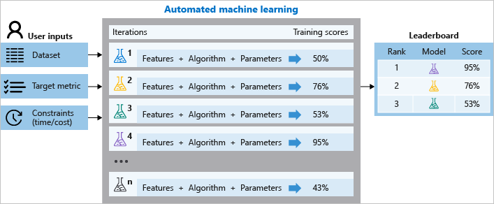

# What is automated machine learning?

Automated machine learning, also referred to as autoML, is the process of automating the time consuming, iterative tasks of machine learning model development. It allows data scientists, analysts, and developers to build ML models with high scale, efficiency, and productivity all while sustaining model quality.

Traditional machine learning model development is resource-intensive, requiring significant domain knowledge and time to produce and compare dozens of models. Apply automated ML when you want Azure Machine Learning to train and tune a model for you using the target metric you specify. The service then iterates through ML algorithms paired with feature selections, where each iteration produces a model with a training score. The higher the score, the better the model is considered to "fit" your data.

With automated machine learning, you'll accelerate the time it takes to get production-ready ML models with great ease and efficiency.

## When to use automated ML

Automated ML democratizes the machine learning model development process, and empowers its users, no matter their data science expertise, to identify an end-to-end machine learning pipeline for any problem.

Data scientists, analysts and developers across industries can use automated ML to:

+ Implement machine learning solutions without extensive programming knowledge
+ Save time and resources
+ Leverage data science best practices
+ Provide agile problem-solving

## How automated ML works

Using **Azure Machine Learning service**, you can design and run your automated ML training experiments with these steps:

1. **Identify the ML problem** to be solved: classification, forecasting, or regression

1. **Specify the source and format of the labeled training data**: Numpy arrays or Pandas dataframe

1. **Configure the compute target for model training**, such as your [local computer, Azure Machine Learning Computes, remote VMs, or Azure Databricks](how-to-set-up-training-targets.md).  Learn about automated training [on a remote resource](how-to-auto-train-remote.md).

1. **Configure the automated machine learning parameters** that determine how many iterations over different models, hyperparameter settings, advanced preprocessing/featurization, and what metrics to look at when determining the best model.  You can configure the settings for automatic training experiment [in Azure portal](how-to-create-portal-experiments.md) or [with the SDK](how-to-configure-auto-train.md).

1. **Submit the training run.**

  

During training, the Azure Machine Learning service creates a number of in parallel pipelines that try different algorithms and parameters. It will stop once it hits the exit criteria defined in the experiment.

You can also inspect the logged run information, which [contains metrics](how-to-understand-accuracy-metrics.md) gathered during the run. The training run produces a Python serialized object (`.pkl` file) that contains the model and data preprocessing.

While model building is automated, you can also [learn how important or relevant features are](how-to-configure-auto-train.md#explain) to the generated models.

> [!VIDEO https://www.microsoft.com/videoplayer/embed/RE2Xc9t]

## Preprocessing

In every automated machine learning experiment, your data is preprocessed using the default methods and optionally through advanced preprocessing.

### Automatic preprocessing (standard)

In every automated machine learning experiment, your data is automatically scaled or normalized to help algorithms perform well.  During model training, one of the following scaling or normalization techniques will be applied to each model.

|Scaling&nbsp;&&nbsp;normalization| Description |
| ------------- | ------------- |
| [StandardScaleWrapper](https://scikit-learn.org/stable/modules/generated/sklearn.preprocessing.StandardScaler.html)  | Standardize features by removing the mean and scaling to unit variance  |
| [MinMaxScalar](https://scikit-learn.org/stable/modules/generated/sklearn.preprocessing.MinMaxScaler.html)  | Transforms features by scaling each feature by that column’s minimum and maximum  |
| [MaxAbsScaler](https://scikit-learn.org/stable/modules/generated/sklearn.preprocessing.MaxAbsScaler.html#sklearn.preprocessing.MaxAbsScaler) |Scale each feature by its maximum absolute value |
| [RobustScalar](https://scikit-learn.org/stable/modules/generated/sklearn.preprocessing.RobustScaler.html) |This Scaler features by their quantile range |
| [PCA](https://scikit-learn.org/stable/modules/generated/sklearn.decomposition.PCA.html) |Linear dimensionality reduction using Singular Value Decomposition of the data to project it to a lower dimensional space |
| [TruncatedSVDWrapper](https://scikit-learn.org/stable/modules/generated/sklearn.decomposition.TruncatedSVD.html) |This transformer performs linear dimensionality reduction by means of truncated singular value decomposition (SVD). Contrary to PCA, this estimator does not center the data before computing the singular value decomposition. This means it can work with scipy.sparse matrices efficiently |
| [SparseNormalizer](https://scikit-learn.org/stable/modules/generated/sklearn.preprocessing.Normalizer.html) | Each sample (that is, each row of the data matrix) with at least one non-zero component is re-scaled independently of other samples so that its norm (l1 or l2) equals one |

### Advanced preprocessing: optional featurization

Additional advanced preprocessing and featurization are also available, such as missing values imputation, encoding, and transforms. [Learn more about what featurization is included](how-to-create-portal-experiments.md#preprocess). Enable this setting with:

+ Azure portal: Selecting the **Preprocess** checkbox in the **Advanced settings** [with these steps](how-to-create-portal-experiments.md).

+ Python SDK: Specifying `"preprocess": True` for the [`AutoMLConfig` class](https://docs.microsoft.com/python/api/azureml-train-automl/azureml.train.automl.automlconfig?view=azure-ml-py).

## Time-series forecasting
Building forecasts is an integral part of any business, whether it’s revenue, inventory, sales, or customer demand. You can use automated ML to combine techniques and approaches and get a recommended, high-quality time-series forecast. 

An automated time-series experiment is treated as a multivariate regression problem. Past time-series values are “pivoted” to become additional dimensions for the regressor together with other predictors. This approach, unlike classical time series methods, has an advantage of naturally incorporating multiple contextual variables and their relationship to one another during training. Automated ML learns a single, but often internally branched model for all items in the dataset and prediction horizons. More data is thus available to estimate model parameters and generalization to unseen series becomes possible. 

Learn more and see an example of [automated machine learning for time series forecasting](how-to-auto-train-forecast.md).

## Ensemble models

You can train ensemble models using automated machine learning with the [Caruana ensemble selection algorithm with sorted Ensemble initialization](http://www.niculescu-mizil.org/papers/shotgun.icml04.revised.rev2.pdf). Ensemble learning improves machine learning results and predictive performance by combing many models as opposed to using single models. The ensemble iteration appears as the last iteration of your run.

## Use with ONNX in C# apps

With Azure Machine Learning, you can use automated ML to build a Python model and have it converted to the ONNX format. The ONNX runtime supports  C#, so you can use the model built automatically in your C# apps without any need for recoding or any of the network latencies that REST endpoints introduce. Try an example of this flow [in this Jupyter notebook](https://github.com/Azure/MachineLearningNotebooks/blob/master/how-to-use-azureml/automated-machine-learning/classification-with-onnx/auto-ml-classification-with-onnx.ipynb).

## Automated ML across Microsoft

Automated ML is also available in other Microsoft solutions such as:

|Integrations|Description|
|------------|-----------|
|[ML.NET](https://docs.microsoft.com/dotnet/machine-learning/automl-overview)|Automatic model selection and training in .NET apps using Visual Studio and Visual Studio Code with ML.NET automated ML (Preview).|
|[HDInsight](../../hdinsight/spark/apache-spark-run-machine-learning-automl.md)|Scale out your automated ML training jobs on Spark in HDInsight clusters in parallel.|
|[PowerBI](https://docs.microsoft.com/power-bi/service-machine-learning-automated)|Invoke machine learning models directly in Power BI (Preview).|
|[SQL Server](https://cloudblogs.microsoft.com/sqlserver/2019/01/09/how-to-automate-machine-learning-on-sql-server-2019-big-data-clusters/)|Create new machine learning models over your data in SQL Server 2019 big data clusters.|

## Next steps

See examples and learn how to build models using automated machine learning:

+ Follow the [Tutorial: Automatically train a regression model with Azure Automated Machine Learning](tutorial-auto-train-models.md)

+ Configure the settings for automatic training experiment:
  + In Azure portal interface, [use these steps](how-to-create-portal-experiments.md).
  + With the Python SDK, [use these steps](how-to-configure-auto-train.md).

+ Learn how to auto train using time series data, [use these steps](how-to-auto-train-forecast.md).

+ Try out [Jupyter Notebook samples for automated machine learning](https://github.com/Azure/MachineLearningNotebooks/blob/master/how-to-use-azureml/automated-machine-learning/)
