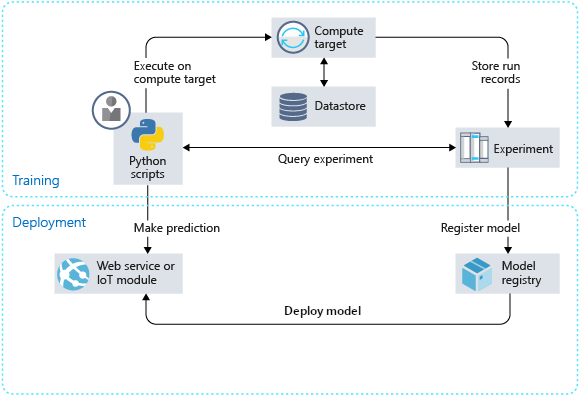
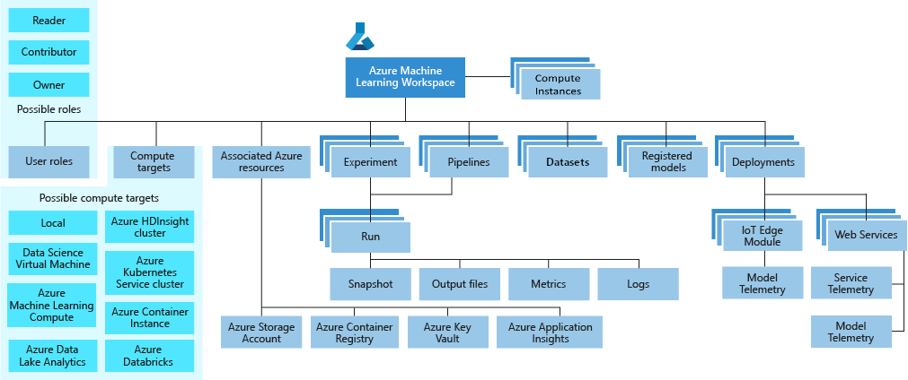

# How Azure Machine Learning service works: Architecture and concepts

Learn about the architecture, concepts, and workflow for Azure Machine Learning service. The major components of the service and the general workflow for using the service are shown in the following diagram:

## Workflow

The machine learning model workflow generally follows this sequence:

1. **Train**
    + Develop machine learning training scripts in **Python** or with the visual interface.
    + Create and configure a **compute target**.
    + **Submit the scripts** to the configured compute target to run in that environment. During training, the scripts can read from or write to **datastore**. And the records of execution are saved as **runs** in the **workspace** and grouped under **experiments**.

1. **Package** - After a satisfactory run is found, register the persisted model in the **model registry**.

1. **Validate** - **Query the experiment** for logged metrics from the current and past runs. If the metrics don't indicate a desired outcome, loop back to step 1 and iterate on your scripts.

1. **Deploy** - Develop a scoring script that uses the model and **Deploy the model** as a **web service** in Azure, or to an **IoT Edge device**.

1. **Monitor** - Monitor for **data drift** between the training dataset and inference data of a deployed model. When necessary, loop back to step 1 to retrain the model with new training data.

## Tools for Azure Machine Learning 

Use these tools for Azure Machine Learning:

+  Interact with the service in any Python environment with the [Azure Machine Learning SDK for Python](https://docs.microsoft.com/python/api/overview/azure/ml/intro?view=azure-ml-py).
+ Automate your machine learning activities with the [Azure Machine Learning CLI](https://docs.microsoft.com/azure/machine-learning/service/reference-azure-machine-learning-cli).
+ Write code in Visual Studio Code with [Azure Machine Learning VS Code extension](how-to-vscode-tools.md) 
+ Use the [visual interface (preview) for Azure Machine Learning service](ui-concept-visual-interface.md)  to perform the workflow steps without writing code.

## Glossary of concepts

+ <a href="#workspaces">Workspace</a>
+ <a href="#experiments">Experiments</a>
+ <a href="#models">Models</a>
+ <a href="#run-configurations">Run Configuration</a>
+ <a href="#datasets-and-datastores">Dataset & datastores</a>
+ <a href="#compute-targets">Compute targets</a>
+ <a href="#training-scripts">Training script</a>
+ <a href="#runs">Run</a>
+ <a href="#github-tracking-and-integration">Git tracking</a>
+ <a href="#snapshots">Snapshot</a>
+ <a href="#activities">Activity</a>
+ <a href="#images">Image</a>
+ <a href="#deployment">Deployment</a>
+ <a href="#web-service-deployments">Web services</a>
+ <a href="#iot-module-deployments">IoT modules</a>
+ <a href="#ml-pipelines">ML pipelines</a>
+ <a href="#logging">Logging</a>

> [!NOTE]
> Although this article defines terms and concepts used by Azure Machine Learning service, it does not define terms and concepts for the Azure platform. For more information about Azure platform terminology, see the [Microsoft Azure glossary](https://docs.microsoft.com/azure/azure-glossary-cloud-terminology).

### Workspaces

[The workspace](concept-workspace.md) is the top-level resource for Azure Machine Learning service. It provides a centralized place to work with all the artifacts you create when you use Azure Machine Learning service.

A taxonomy of the workspace is illustrated in the following diagram:

For more information about workspaces, see [What is an Azure Machine Learning workspace?](concept-workspace.md).

### Experiments

An experiment is a grouping of many runs from a specified script. It always belongs to a workspace. When you submit a run, you provide an experiment name. Information for the run is stored under that experiment. If you submit a run and specify an experiment name that doesn't exist, a new experiment with that newly specified name is automatically created.

For an example of using an experiment, see [Quickstart: Get started with Azure Machine Learning service](quickstart-run-cloud-notebook.md).

### Models

At its simplest, a model is a piece of code that takes an input and produces output. Creating a machine learning model involves selecting an algorithm, providing it with data, and tuning hyperparameters. Training is an iterative process that produces a trained model, which encapsulates what the model learned during the training process.

A model is produced by a run in Azure Machine Learning. You can also use a model that's trained outside of Azure Machine Learning. You can register a model in an Azure Machine Learning service workspace.

Azure Machine Learning service is framework agnostic. When you create a model, you can use any popular machine learning framework, such as Scikit-learn, XGBoost, PyTorch, TensorFlow, and Chainer.

For an example of training a model, see [Tutorial: Train an image classification model with Azure Machine Learning service](tutorial-train-models-with-aml.md).

The **model registry** keeps track of all the models in your Azure Machine Learning service workspace.

Models are identified by name and version. Each time you register a model with the same name as an existing one, the registry assumes that it's a new version. The version is incremented, and the new model is registered under the same name.

When you register the model, you can provide additional metadata tags and then use the tags when you search for models.

> [!TIP]
> A registered model is a logical container for one or more files that make up your model. For example, if you have a model that is stored in multiple files, you can register them as a single model in your Azure Machine Learning workspace. After registration, you can then download or deploy the registered model and receive all the files that were registered.

You can't delete a registered model that is being used by an active deployment.

For an example of registering a model, see [Train an image classification model with Azure Machine Learning](tutorial-train-models-with-aml.md).

### Run configurations

A run configuration is a set of instructions that defines how a script should be run in a specified compute target. The configuration includes a wide set of behavior definitions, such as whether to use an existing Python environment or to use a Conda environment that's built from a specification.

A run configuration can be persisted into a file inside the directory that contains your training script, or it can be constructed as an in-memory object and used to submit a run.

For example run configurations, see [Select and use a compute target to train your model](how-to-set-up-training-targets.md).

### Datasets and datastores

**Azure Machine Learning Datasets** (preview) make it easier to access and work with your data. Datasets manage data in various scenarios such as model training and pipeline creation. Using the Azure Machine Learning SDK, you can access underlying storage, explore and prepare data, manage the life cycle of different Dataset definitions, and compare between Datasets used in training and in production.

Datasets provides methods for working with data in popular formats, such as using `from_delimited_files()` or `to_pandas_dataframe()`.

For more information, see [Create and register Azure Machine Learning Datasets](how-to-create-register-datasets.md).  For more examples using Datasets, see the [sample notebooks](https://aka.ms/dataset-tutorial).

A **datastore** is a storage abstraction over an Azure storage account. The datastore can use either an Azure blob container or an Azure file share as the back-end storage. Each workspace has a default datastore, and you can register additional datastores. Use the Python SDK API or the Azure Machine Learning CLI to store and retrieve files from the datastore.

### Compute targets

A [compute target](concept-compute-target.md) lets you to specify the compute resource where you run your training script or host your service deployment. This location may be your local machine or a cloud-based compute resource. Compute targets make it easy to change your compute environment without changing your code. 

Learn more about the [available compute targets for training and deployment](concept-compute-target.md). 

### Training scripts

To train a model, you specify the directory that contains the training script and associated files. You also specify an experiment name, which is used to store information that's gathered during training. During training, the entire directory is copied to the training environment (compute target), and the script that's specified by the run configuration is started. A snapshot of the directory is also stored under the experiment in the workspace.

For an example, see [Tutorial: Train an image classification model with Azure Machine Learning service](tutorial-train-models-with-aml.md).

### Runs

A run is a record that contains the following information:

* Metadata about the run (timestamp, duration, and so on)
* Metrics that are logged by your script
* Output files that are autocollected by the experiment or explicitly uploaded by you
* A snapshot of the directory that contains your scripts, prior to the run

You produce a run when you submit a script to train a model. A run can have zero or more child runs. For example, the top-level run might have two child runs, each of which might have its own child run.

For an example of viewing runs that are produced by training a model, see [Quickstart: Get started with Azure Machine Learning service](quickstart-run-cloud-notebook.md).

### GitHub tracking and integration

When you start a training run where the source directory is a local Git repository, information about the repository is stored in the run history. For example, the current commit ID for the repository is logged as part of the history. This works with runs submitted using an estimator, ML pipeline, or script run. It also works for runs submitted from the SDK or Machine Learning CLI.

### Snapshots

When you submit a run, Azure Machine Learning compresses the directory that contains the script as a zip file and sends it to the compute target. The zip file is then extracted, and the script is run there. Azure Machine Learning also stores the zip file as a snapshot as part of the run record. Anyone with access to the workspace can browse a run record and download the snapshot.

> [!NOTE]
> To prevent unnecessary files from being included in the snapshot, make an ignore file (.gitignore or .amlignore). Place this file in the Snapshot directory and add the filenames to ignore in it. The .amlignore file uses the same [syntax and patterns as the .gitignore file](https://git-scm.com/docs/gitignore). If both files exist, the .amlignore file takes precedence.

### Activities

An activity represents a long running operation. The following operations are examples of activities:

* Creating or deleting a compute target
* Running a script on a compute target

Activities can provide notifications through the SDK or the web UI so that you can easily monitor the progress of these operations.

### Images

Images provide a way to reliably deploy a model, along with all components you need to use the model. An image contains the following items:

* A model.
* A scoring script or application. You use the script to pass input to the model and return the output of the model.
* The dependencies that are needed by the model or scoring script or application. For example, you might include a Conda environment file that lists Python package dependencies.

Azure Machine Learning can create two types of images:

* **FPGA image**: Used when you deploy to a field-programmable gate array in Azure.
* **Docker image**: Used when you deploy to compute targets other than FPGA. Examples are Azure Container Instances and Azure Kubernetes Service.

The Azure Machine Learning service provides a base image, which is used by default. You can also provide your own custom images.

### Image registry

Images are cataloged in the **image registry** in your workspace. You can provide additional metadata tags when you create the image, so that you can query them to find your image later.

For an example of creating an image, see [Deploy an image classification model in Azure Container Instances](tutorial-deploy-models-with-aml.md).

For an example of deploying a model using a custom image, see [How to deploy a model using a custom Docker image](how-to-deploy-custom-docker-image.md).

### Deployment

A deployment is an instantiation of your model into either a web service that can be hosted in the cloud or an IoT module for integrated device deployments.

#### Web service deployments

A deployed web service can use Azure Container Instances, Azure Kubernetes Service, or FPGAs. You create the service from your model, script, and associated files. These are encapsulated in an image, which provides the run time environment for the web service. The image has a load-balanced, HTTP endpoint that receives scoring requests that are sent to the web service.

Azure helps you monitor your web service deployment by collecting Application Insights telemetry or model telemetry, if you've chosen to enable this feature. The telemetry data is accessible only to you, and it's stored in your Application Insights and storage account instances.

If you've enabled automatic scaling, Azure automatically scales your deployment.

For an example of deploying a model as a web service, see [Deploy an image classification model in Azure Container Instances](tutorial-deploy-models-with-aml.md).

#### IoT module deployments

A deployed IoT module is a Docker container that includes your model and associated script or application and any additional dependencies. You deploy these modules by using Azure IoT Edge on edge devices.

If you've enabled monitoring, Azure collects telemetry data from the model inside the Azure IoT Edge module. The telemetry data is accessible only to you, and it's stored in your storage account instance.

Azure IoT Edge ensures that your module is running, and it monitors the device that's hosting it.

### ML Pipelines

You use machine learning pipelines to create and manage workflows that stitch together machine learning phases. For example, a pipeline might include data preparation, model training, model deployment, and inference/scoring phases. Each phase can encompass multiple steps, each of which can run unattended in various compute targets.

For more information about machine learning pipelines with this service, see [Pipelines and Azure Machine Learning](concept-ml-pipelines.md).

### Logging

When you develop your solution, use the Azure Machine Learning Python SDK in your Python script to log arbitrary metrics. After the run, query the metrics to determine whether the run has produced the model you want to deploy.

### Next steps

To get started with Azure Machine Learning service, see:

* [What is Azure Machine Learning service?](overview-what-is-azure-ml.md)
* [Create an Azure Machine Learning service workspace](setup-create-workspace.md)
* [Tutorial (part 1): Train a model](tutorial-train-models-with-aml.md)
