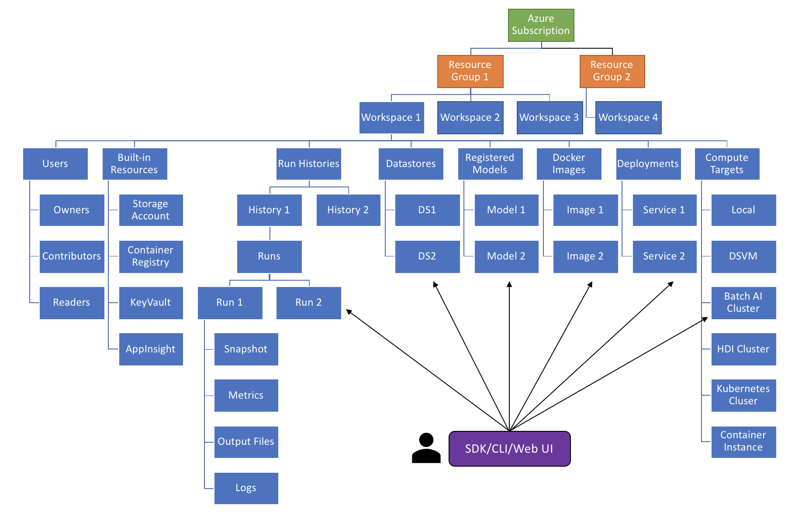
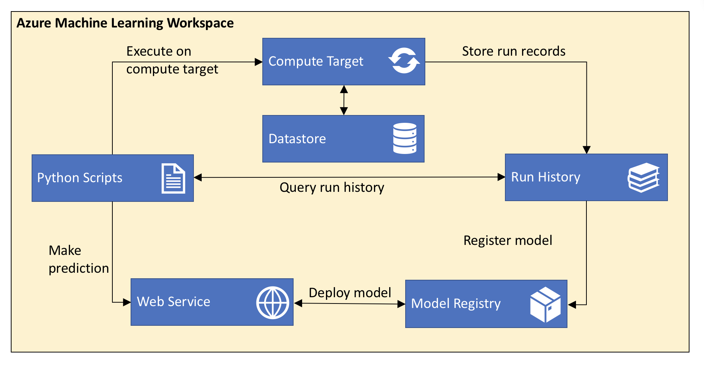

# Azure Machine Learning Services architecture and key terms 

The __Azure Machine Learning workspace__ is the top-level resource for Azure Machine learning. It provides the following resources:

* Run histories - Information about each run of your project.
* Models - Your models.
* Docker images - A Docker image created from your model.
* Deployments - One of your Docker images deployed as a service.
* Datastores

The workspace is also the security boundary of these artifacts. Users can have the following roles for a workspace:

* Owner
* Contributor
* Reader

For your convenience, the following Azure resources are added automatically to your workspace: 

* [Azure Container Registry](https://azure.microsoft.com/en-us/services/container-registry/)
* [Azure Storage](https://azure.microsoft.com/en-us/services/storage/)
* [Azure Application Insights](https://azure.microsoft.com/en-us/services/application-insights/)
* [Azure Key Vault](https://azure.microsoft.com/en-us/services/key-vault/).

You can create multiple workspaces, and each workspace can be shared by multiple people.

The following diagram is a taxonomy of the workspace:

## Architecture and workflow

The following diagram shows the major components of Azure Machine learning, and illustrates the general workflow from development to production: 

The workflow for developing and deploying a model with Azure Machine Learning follows these steps:

1. Create an Azure Machine Learning Workspace.
2. Develop machine learning training scripts in Python code or Jupyter notebooks.
3. Configure a local or cloud environment for execution.
4. Submit the scripts to execute in that environment.
5. Examine the run history and iterate.
6. Query the run history to find the best model.
6. Register the model under the model registry of the workspace.
7. Deploy the model and the scoring scripts as a web service in Azure.

## Project

A project is a local folder on your computer that contains the files for your machine learing solution. To use a local folder with Azure Machine Learning Services, you must attach it to a workspace. For an example of how to do attach a project to a workspace, see one of the following documents:

* [Create a workspace with Python]()
* [Create a workspace with Azure CLI]()

When you submit a project for execution, the folder is copied into the compute target. The entry script is executed in a Python environment configured through a __run configuration__.

## Model

A model is a scoring logic operation materialized in one or more files. A model can be produced by a run in Azure machine learning. You can also use a model trained outside of Azure Machine Learning. A model can be registered under a Workspace, and can be version-managed. It can also be used to create a Docker image and deployment.

## Docker image

A Docker image is created by the Azure Machine Learning Image Construction Engine, and registered with a workspace. It encapsulates:

* One or model files
* Your scoring script
* Library files
* Schema files
* Other dependency files

## Deployment

A deployment is a deployed web service in either Azure Container Instances or Azure Kubernetes Service. It is created from a Docker image that encapsulates your model, script, and associated files.

## Datastore

A datastore is a storage abstraction over an Azure Storage Account. The datastore can use an Azure blob container or Azure file share as the implementation. Each workspace has a default datastore, and may have additional datastores. For information on using additional datastores, see [TBD]().

You can use the Python SDK API to store and retrieve files from the datastore as part of your Python scripts. For more information, see [TBD]().

## Run

A __run__ is an execution record stored in the run history of a workgroup. It contains the following information:

* Metadata about the run (timestamp, duration etc.)
* Metrics logged by your script
* Output files collected by the run history service
* A snapshot of the project when the run is produced

A run can have zero or more child runs.

## Run history

A __run history__ is a logical grouping of many runs. It always belongs to a workspace. You can submit a run using an arbitrary run history name, and the submitted run is then listed under that run history.

## Run configuration

A run configuration is a set of instructions that defines how a script should be executed in a given compute target. It includes a wide set of behavior definitions, such as whether to use an existing Python environment or use a Conda environment built from specification.

A run configuration can be persisted into a file inside your project, or can be constructed as an in-memory object and used to submit a run.

## Compute target

A compute target is the service or environment used to execute your training script or host your web service deployment. The supported compute targets are:

* Your local computer
* A Linux VM in Azure (such as the Data Science Virtual Machine)
* Azure Batch AI
* Apache Spark for HDInsight
* Azure Container Instance
* Azure Kubernetes Service

Compute targets are attached to a workspace. Computer targets other than the local machine are shared by users of the workspace.

## Metrics

When developing your solution, you can use the Azure Machine Learning Python SDK in your Python script to log metrics information. You can provide name-value pairs, where the name is a string and the value is one of the following items:

* String
* Number
* Array of strings or numbers
* `matplotlib` figure object representing a plotted image.

## Snapshots

When submitting a project run, Azure Machine Learning compresses the project folder as a zip file and sends it to the compute target. The project is then expanded and executed there. Azure Machine Learning also stores the zip file as a snapshot as part of the run record. Anyone with access to the workspace can browse a run record and download the snapshot.

## Task

A task represents a long running operation. The following operations are examples of tasks:

* Creating or deleting a compute target
* Executing a script on a compute target

Tasks can provide notifications through the SDK or Web UI so you can easily monitor the progress of these operations. 
