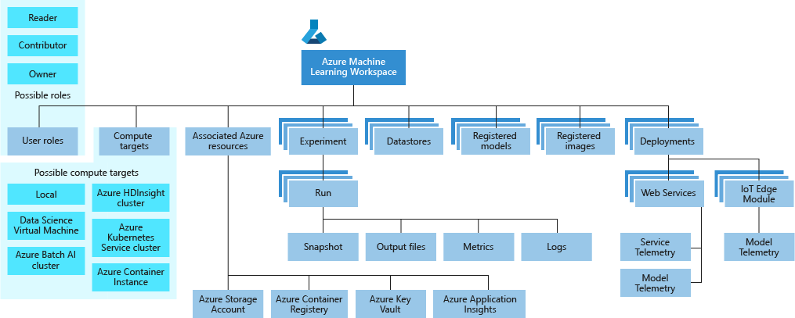

# Architecture and concepts: How does Azure Machine Learning service work? 

This document describes the architecture and concepts for the Azure Machine Learning service. The following diagram shows the major components of the service, and illustrates the general workflow when using the service: 

The workflow generally follows these steps:

1. Develop machine learning training scripts in __Python__.
1. Create and configure a __compute target__.
1. __Submit the scripts__ to the configured compute target to run in that environment. During training, the compute target stores run records to a __datastore__. There the records are saved to an __experiment__.
1. __Query the experiment__ for logged metrics from the current and past runs. If the metrics do not indicate a desired outcome, loop back to step 1 and iterate on your scripts.
1. Once a satisfactory run is found, register the persisted model in the __model registry__.
1. Develop a scoring script.
1. __Create an Image__ and register it in the __image registry__. 
1. __Deploy the image__ as a __web service__ in Azure.

[!INCLUDE [aml-preview-note](../../../includes/aml-preview-note.md)]

> [!NOTE]
> While this document defines terms and concepts used by Azure Machine Learning, it does not define terms and concepts for the Azure platform. For more information on Azure platform terminology, see the [Microsoft Azure glossary](https://docs.microsoft.com/azure/azure-glossary-cloud-terminology).

## Workspace

The workspace is the top-level resource for the Azure Machine Learning service. It provides a centralized place to work with all the artifacts you create when using Azure Machine Learning Service.

The workspace keeps a list of compute targets that can be used to train your model. It also keeps a history of the training runs, including logs, metrics, output, and a snapshot of your scripts. This information is used to determine which training run produces the best model.

Models are registered with the workspace. A registered model and scoring scripts are used to create an image. The image can then be deployed into Azure Container Instances, Azure Kubernetes Service, or to a field-programmable gate array (FPGA) as a REST-based HTTP endpoint. It can also be deployed to an Azure IoT Edge device as a module.

You can create multiple workspaces, and each workspace can be shared by multiple people. When sharing a workspace, control access to the workspace by assigning the following roles to users:

* Owner
* Contributor
* Reader

When you create a new workspace, it automatically creates several Azure resources that are used by the workspace:

* [Azure Container Registry](https://azure.microsoft.com/services/container-registry/) - Registers docker containers that are used during training and when deploying a model.
* [Azure Storage](https://azure.microsoft.com/services/storage/) - Used as the default datastore for the workspace.
* [Azure Application Insights](https://azure.microsoft.com/services/application-insights/) - Stores monitoring information about your models.
* [Azure Key Vault](https://azure.microsoft.com/services/key-vault/) - Stores secrets used by compute targets and other sensitive information needed by the workspace.

> [!NOTE]
> Instead of creating new versions, you can also use existing Azure services. 

The following diagram is a taxonomy of the workspace:

## Model

At its simplest, a model is a piece of code that takes an input and produces output. Creating a machine learning model involves selecting an algorithm, providing it with data, and tuning hyperparameters. Training is an iterative process that produces a trained model, which encapsulates what the model learned during the training process.

A model is produced by a run in Azure Machine Learning. You can also use a model trained outside of Azure Machine Learning. A model can be registered under an Azure Machine Learning service workspace.

Azure Machine Learning Service is framework agnostic. You can use any popular machine learning framework when creating a model, such as scikit-learn, xgboost, PyTorch, TensorFlow, Chainer, and CNTK.

For an example of training a model, see the [Quickstart: Create a machine learning Service workspace](quickstart-get-started.md) document.

### Model registry

The model registry keeps track of all the models in your Azure Machine Learning service workspace. 

Models are identified by name and version. Each time you register a model with the same name as an existing one, the registry assumes that it is a new version. The version is incremented and the new model is registered under the name.

You can provide additional metadata tags when you register the model, and then use these tags when searching for models.

You cannot delete models that are being used by an image.

For an example of registering a model, see the [Train an image classification model with Azure Machine Learning](tutorial-train-models-with-aml.md) document.

## Image

Images provide a way to reliably deploy a model, along with all components needed to use the model. An image contains the following items:

* A model.
* A scoring script or application. This script is used to pass input to the model and return the output of the model.
* Dependencies needed by the model or scoring script/application.  For example, you might include a Conda environment file that lists Python package dependencies.

There are two types of images that can be created by Azure Machine Learning:

* FPGA image: Used when deploying to a field-programmable gate array in the Azure cloud.
* Docker image: Used when deploying to compute targets other than FPGA. For example, Azure Container Instances and Azure Kubernetes Service.

For an example of creating an image, see the [Deploy an image classification model in Azure Container Instance](tutorial-deploy-models-with-aml.md) document.

### Image registry

The image registry keeps track of images created from your models. You can provide additional metadata tags when creating the image. Metadata tags are stored by the image registry and can be queried to find your image.

## Deployment

A deployment is an instantiation of your image into either a Web Service that may be hosted in the cloud or an IoT Module for integrated device deployments. 

### Web service

A deployed web service can use Azure Container Instances, Azure Kubernetes Service, or field-programmable gate arrays (FPGA).
The service is created from an image that encapsulates your model, script, and associated files. The image has a load-balanced, HTTP endpoint that receives scoring requests sent to the web service.

Azure helps you monitor your Web service deployment by collecting Application Insight telemetry and/or model telemetry if you have chosen to enable this feature. The telemetry data is only accessible to you, and stored in your Application Insights and storage account instances.

If you have enabled automatic scaling, Azure will automatically scale your deployment.

For an example of deploying a model as a web service, see the [Deploy an image classification model in Azure Container Instance](tutorial-deploy-models-with-aml.md) document.

### IoT Module

A deployed IoT Module is a Docker container that includes your model and associated script or application and any additional dependencies. These modules are deployed using Azure IoT Edge on edge devices. 

If you have enabled monitoring, Azure collects telemetry data from the model inside the Azure IoT Edge module. The telemetry data is only accessible to you, and stored in your storage account instance.

Azure IoT Edge will ensure that your module is running and monitor the device that is hosting it.

## Datastore

A datastore is a storage abstraction over an Azure Storage Account. The datastore can use either an Azure blob container or an Azure file share as the backend storage. Each workspace has a default datastore, and you may register additional datastores. 

Use the Python SDK API or Azure Machine Learning CLI to store and retrieve files from the datastore. 

## Run

A run is a record that contains the following information:

* Metadata about the run (timestamp, duration etc.)
* Metrics logged by your script
* Output files auto-collected by the experiment, or explicitly uploaded by you.
* A snapshot of the directory that contains your scripts, prior to the run

A run is produced when you submit a script to train a model. A run can have zero or more child runs. So the top-level run might have two child runs, each of which may have their own child runs.

For an example of viewing runs produced by training a model, see the [Quickstart: Get started with Azure Machine Learning service](quickstart-get-started.md) document.

## Experiment

An experiment is a grouping of many runs from a given script. It always belongs to a workspace. When you submit a run, you provide an experiment name. Information for the run is stored under that experiment. If you submit a run and specify an experiment name that doesn't exist, a new experiment with that name is automatically created.

For an example of using an experiment, see the [Quickstart: Get started with Azure Machine Learning service](quickstart-get-started.md) document.

## Compute target

A compute target is the compute resource used to run your training script or host your web service deployment. The supported compute targets are: 

* Your local computer
* A Linux VM in Azure (such as the Data Science Virtual Machine)
* Azure Batch AI Cluster
* Apache Spark for HDInsight
* Azure Container Instance
* Azure Kubernetes Service

Compute targets are attached to a workspace. Compute targets other than the local machine are shared by users of the workspace.

Most compute targets can be created directly through the workspace by using the Azure portal, Azure Machine Learning SDK, or Azure CLI. If you have compute targets that were created by another process (for example, the Azure portal or Azure CLI), you can add (attach) them to your workspace. Some compute targets must be created outside the workspace, and then attached.

For information on selecting a compute target for training, see the [Select and use a compute target to train your model](how-to-set-up-training-targets.md) document.

For information on selecting a compute target for deployment, see the [Deploy models with the Azure Machine Learning service](how-to-deploy-and-where.md) document.

## Run configuration

A run configuration is a set of instructions that defines how a script should be run in a given compute target. It includes a wide set of behavior definitions, such as whether to use an existing Python environment or use a Conda environment built from specification.

A run configuration can be persisted into a file inside the directory that contains your training script, or constructed as an in-memory object and used to submit a run.

For example run configurations, see the [Select and use a compute target to train your model](how-to-set-up-training-targets.md) document.

## Training script

To train a model, you specify the directory that contains the training script and associated files. You also specify an experiment name, which is used to store information gathered during training. During training, the entire directory is copied to the training environment (compute target), and the script specified by the run configuration is started. A snapshot of the directory is also stored under the experiment in the workspace.

For an example of using scripts to train a model, see [Create a workspace with Python](quickstart-get-started.md)

## Logging

When developing your solution, use the Azure Machine Learning Python SDK in your Python script to log arbitrary metrics. After the run, query the metrics to determine if the run produced the model you want to deploy. 

## Snapshot

When submitting a run, Azure Machine Learning compresses the directory that contains the script as a zip file and sends it to the compute target. The zip is then expanded and the script is run there. Azure Machine Learning also stores the zip file as a snapshot as part of the run record. Anyone with access to the workspace can browse a run record and download the snapshot.

## Activity

An activity represents a long running operation. The following operations are examples of activities:

* Creating or deleting a compute target
* Running a script on a compute target

Activities can provide notifications through the SDK or Web UI so you can easily monitor the progress of these operations.

## Next steps

Use the following links to get started using Azure Machine Learning:

* [What is Azure Machine Learning service](overview-what-is-azure-ml.md)
* [Quickstart: Create a workspace with Python](quickstart-get-started.md)
* [Tutorial: Train a model](tutorial-train-models-with-aml.md)
