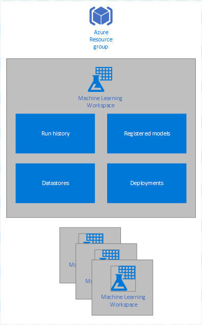
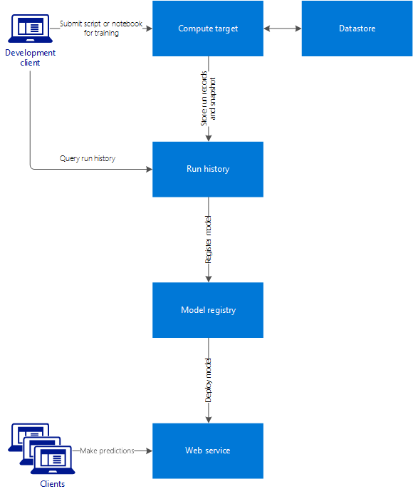

# Azure Machine Learning Services architecture and key concepts 

The base logical container for Azure Machine Learning Services is the __workspace__. The workspace contains artifacts created through Azure Machine learning. The workspace also contains information about Azure resources that are used by Azure Machine Learning.

The following are artifacts contained or defined in a workspace:

* Run history
* Models
* Docker images
* Deployments
* Datastore

You can create multiple workspaces, and each workspace can be shared by multiple people.

The workspace also stores information about associated resources, such as compute resources that are used to train models or host web services.

## Access control

You can control access to a workspace using the [role-based access control](https://docs.microsoft.com/azure/role-based-access-control/overview) provided by the Azure platform. 

## Run History

A __run__ is an execution record stored in Azure ML run history service. It contains the following information:

* Metadata about the run (timestamp, duration etc.)
* Metrics logged by your script
* Output files collected by the run history service
* A snapshot of the project when the run is produced

A run can have zero or more child runs.

A __run history__ is a logical grouping of many runs. It always belongs to a workspace. You can submit a run using an arbitrary run history name, and the submitted run is then listed under that run history.

## Model

A model is a scoring logic operation materialized in one or more files. It is usually produced by a run. A model can also existing files that were trained outside Azure Machine Learning. A model can be registered under a Workspace, and can be version-managed. It can also be used to create a Docker image and deployment.

## Docker image

A Docker image is created by the Azure ML Image Construction Engine, and registered with an Azure ML Workspace. It encapsulates:

* One or model files
* Your scoring script
* Library files
* Schema files
* Other dependency files

## Deployment

A deployment is a deployed web service in either Azure Container Instances or Azure Kubernetes Service. It is created from a Docker image that encapsulates your model, script, and associated files.

## Datastore

A datastore is a storage abstraction over an Azure Storage Account. The datastore can use an Azure blob container or Azure file share as the implementation. Each workspace has a default datastore, and may have additional datastores. For information on using additional datastores, see [TBD]().

You can use the Python SDK API to store and retrieve files from the datastore as part of your Python scripts. For more information, see [TBD]().

## Compute target

A compute target is the service or environment used to execute your training script or host your web service deployment. The supported compute targets are:

* Your local computer
* A Linux VM in Azure (such as the Data Science Virtual Machine)
* Azure Batch AI
* Apache Spark for HDInsight
* Azure Container Instance
* Azure Kubernetes Service

Compute targets are attached to a workspace. Computer targets other than the local machine are shared by users of the workspace.

## Development workflow

The main workflow of developing a solution with Azure Machine Learning service generally follows this pattern:

1. Create an Azure Machine Learning Workspace.
2. Create a project and develop your machine learning solution in Python scripts or Jupyter notebooks.
3. Configure a local or cloud environment for training.
4. Submit the scripts to the training environment.
5. Examine the run history and iterate.
6. Query the run history to find the best model.
7. Register the model under the model registry of the workspace.
8. Deploy the model and the scoring scripts as a web service in Azure.

The following diagram shows the steps in the workflow, along with associated artifacts in the workspace:

### Project

A project is a local folder on your computer that contains files related to your solution. It is attached to a run history under a Workspace through the `project.json` configuration file in the `aml_config` folder of the project. 

When you submit a project for execution, the folder is copied into the compute target. The entry script is executed in a Python environment configured through a __run configuration__.

### Run configuration

A run configuration is a set of instructions that defines how a script should be executed in a given compute target. It includes a wide set of behavior definitions, such as whether to use an existing Python environment or use a Conda environment built from specification.

A run configuration can be persisted into a file inside your project, or can be constructed as an in-memory object and used to submit a run.

### Metrics

When developing your solution, you can use the Azure ML Python SDK in your Python script to log metrics information. You can provide name-value pairs, where the name is a string and the value is one of the following items:

* String
* Number
* Array of strings or numbers
* `matplotlib` figure object representing a plotted image.

### Snapshots

When submitting a project run, Azure ML compresses the project folder as a zip file and sends it to the compute target. The project is then expanded and executed there. Azure ML also stores the zip file as a snapshot as part of the run record. Anyone with access to the workspace can browse a run record and download the snapshot.

## Tools and utilities

