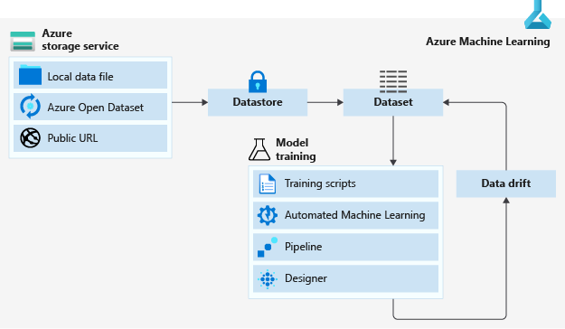

# Data access in Azure Machine Learning

In this article, learn about Azure Machine Learning's data management and integration solutions for your machine learning tasks. This article describes a data access workflow that assumes you've already created an [Azure storage account](https://docs.microsoft.comazure/storage/common/storage-quickstart-create-account?tabs=azure-portal) and [Azure storage service](https://docs.microsoft.com/azure/storage/common/storage-introduction).

When you're ready to use the data in your storage, we recommend you

1. Create an Azure Machine Learning datastore.
2. From that datastore, create an Azure Machine Learning dataset. 
3. Use that dataset in your machine learning (ML) experiment by either 
    1. Mounting it to your ML experiment's compute target for model training

        **OR** 

    1. Consuming it directly in Azure Machine Learning solutions like automated machine learning (automated ML) experiment runs, ML pipelines, and the designer.
4. Create dataset monitors for your model input and output datasets to detect for data drift. 
5. If data drift is detected, retrain your model accordingly.

The following diagram provides a visual demonstration of this recommended data access workflow.

## Access data in storage

To access your data in your storage account, Azure Machine Learning offers datastores and datasets. Datastores provide a layer of abstraction over your storage service, this aids in security and ease of access to your storage, since connection information is kept in the datastore and not exposed in scripts. Datasets point to the specific file or files in your underlying storage that you want to use for your machine learning experiment. Together these offer a secure, scalable and reproducible data delivery workflow for your machine learning tasks.

### Datastores

An Azure Machine Learning datastore is a storage abstraction over an Azure  storage services account. Datastores allow you to easily connect to your Azure storage account, and access the data in your underlying Azure storage services. This ease of connection is facilitated by storing security information, like your subscription ID and token authorization, as part of the datastore object so you aren't hard coding that information in your scripts.

+ [Register and create datastores](how-to-access-data.md)

### Datasets

Create an Azure Machine Learning dataset to interact with data in your datastores or to package your data into a consumable object for machine learning tasks. 

Datasets can be created from local files, public urls, [Azure Open Datasets](#open), or specific file(s) in your datastores. They aren't copies of your data, but are references that point to the data in your storage service, so no extra storage cost is incurred. 

The following articles demonstrate additional datasets capabilities.

+ [Create and register datasets](how-to-create-register-datasets.md) to your workspace to share and reuse it across different experiments without data ingestion complexities.
+ [Version and track](how-to-version-track-datasets.md) dataset lineage.
+ [Monitor your dataset](how-to-monitor-datasets.md) to help with data drift detection.

#### Types of datasets

There are two different types of datasets:

+ [TabularDataset](https://docs.microsoft.com/python/api/azureml-core/azureml.data.tabulardataset?view=azure-ml-py) represents data in a tabular format by parsing the provided file or list of files. This provides you with the ability to materialize the data into a Pandas or Spark DataFrame for further manipulation and cleansing. For a complete list of files you can create TabularDatasets from, see the [TabularDatasetFactory class](https://aka.ms/tabulardataset-api-reference).

+ [FileDataset](https://docs.microsoft.com/python/api/azureml-core/azureml.data.file_dataset.filedataset?view=azure-ml-py) references single or multiple files in your datastores or public URLs. By this method, you can download or mount files of your choosing to your compute target as a FileDataset object.

## Work with your data

With datasets, you can accomplish a number of machine learning tasks through seamless integration with Azure Machine Learning features. 

+ [Train machine learning models](how-to-train-with-datasets.md).
+ Consume datasets in 
     + [automated ML experiments](how-to-create-portal-experiments.md)
     + [ML pipelines](how-to-create-your-first-pipeline.md)
     + the [designer](tutorial-designer-automobile-price-train-score.md#import-data)
+ Create a [data labeling project](#label).
+ Set up a dataset monitor for [data drift](#drift) detection.

## Azure Open Datasets

[Azure Open Datasets](https://docs.microsoft.com/azure/open-datasets/overview-what-are-open-datasets) are curated public datasets that you can use to add scenario-specific features to machine learning solutions for more accurate models. Open Datasets are in the cloud on Microsoft Azure and are integrated into Azure Machine Learning. You can also access the datasets through APIs and use them in other products, such as Power BI and Azure Data Factory.

Azure Open Datasets include public-domain data for weather, census, holidays, public safety, and location that help you train machine learning models and enrich predictive solutions. You can also share your public datasets on Azure Open Datasets.

## Data labeling

Labeling large amounts of data has often been a headache in machine learning projects. ML projects with a computer vision component, such as image classification or object detection, generally require thousands of images and corresponding labels.

Azure Machine Learning gives you a central location to create, manage, and monitor labeling projects. Labeling projects help coordinate the data, labels, and team members, allowing you to more efficiently manage the labeling tasks. Currently supported tasks are image classification, either multi-label or multi-class, and object identification using bounded boxes.

+ Create a [data labeling project](how-to-create-labeling-projects.md), and output a dataset for use in machine learning experiments.

## Data drift

In the context of machine learning, data drift is the change in model input data that leads to model performance degradation. It is one of the top reasons model accuracy degrades over time, thus monitoring data drift helps detect model performance issues.
See the [Create a dataset monitor](how-to-monitor-datasets.md) article, to learn more about how to detect and alert to data drift on new data in a dataset.

## Next steps 

+ Create a dataset in Azure Machine Learning studio or with the Python SDK, [use these steps.](how-to-create-register-datasets.md)
+ Try out dataset training examples with our [sample notebooks](https://aka.ms/dataset-tutorial).
+ For data drift examples, see this [data drift tutorial](https://aka.ms/datadrift-notebook).