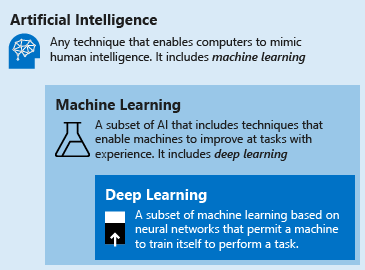

# Introduction to deep learning vs. machine learning

This article helps you understand the relationship between deep learning vs. machine learning. You'll learn how the two concepts compare and how they fit into the broader category of artificial intelligence. Finally, the article describes how deep learning can be applied to real-world scenarios, such as fraud detection, voice and facial recognition, sentiment analytics, and time series forecasting.

## How do deep learning, machine learning, and AI relate to one another?

In order to understand the difference between deep learning vs. machine learning vs. AI, learn about each of these fields of study:

- **Deep learning** is a subset of machine learning based on artificial neural networks that permit a machine to train itself. In this case, the _learning process_ is called _deep_, because the structure of artificial neural networks consists of multiple input, output, and hidden layers. Each layer contains units that transform the input data into information that the next layer can use to perform a certain predictive task. Thanks to this structure, a machine is able to learn through its own data processing.

- **Machine learning** is a subset of artificial intelligence that includes techniques (such as deep learning) that enable machines to improve at tasks with experience. In this case, the _learning process_ is based on the following steps:

    1. Feed an algorithm with data by providing it with more information (for example, by performing feature extraction).
    2. Use this data to train a model.
    3. Test and deploy the model.
    4. Consume the deployed model to perform a certain automated predictive task.

- **Artificial intelligence (AI)** is a technique that enables computers to mimic human intelligence. It includes machine learning. It is important to understand the relationship between _AI vs. machine learning vs. deep learning_: Machine learning is a way of achieving artificial intelligence, which means by the use of machine learning and deep learning techniques you can build computer systems and applications that can perform tasks commonly associated with human intelligence, such as visual perception, speech recognition, decision-making, and translation between languages.

## Comparison of deep learning vs. machine learning

Now that you have the overview of machine learning vs. deep learning, compare the two techniques. In the case of machine learning, the algorithm needs to be told how to make an accurate prediction by providing it with more information; whereas, in the case of deep learning, the algorithm is able to learn that through its own data processing thanks to the artificial neural network structure.

The table below compares the two techniques in more detail:

| |All machine learning |Only deep learning|
|---|---|---|
|  **Number of data points** | Can use small data amounts provided by users | Requires a large amount of training data to make concise conclusions |
|  **Hardware dependencies** | Can work on low-end machines. It doesn't need a large amount of computational power | Depends on high-end machines. It inherently does a large number of matrix multiplication operations. These operations can be efficiently optimized using a GPU |
|  **Featurization process** | Requires features to be accurately identified and created by users | It learns high-level features from data and creates new features by itself |
|  **Learning approach** | Divides tasks into small pieces, and then combine received results into one conclusion | Solves the problem on an end-to-end basis |
|  **Execution time** | Comparatively takes less time to train, ranging from a few seconds to a few hours | Takes an unusually long time to train, because there are many parameters in a deep learning algorithm |
|  **Output** | The output is usually a numerical value, like a score or a classification | The output can be anything from a score, a text, an element, or a sound |

## Deep learning use cases: What problems does it solve?

Because of the artificial neural network structure, deep learning excels at identifying patterns in unstructured data, such as images, sound, video, and text. For this reason, it's rapidly transforming many industries including healthcare, energy, fintech, transportation, and others, to rethink traditional business processes. Some of the most common applications for deep learning are described in the following paragraphs.

### Named-entity recognition

One use of deep-learning networks is named-entity recognition, which is a way to extract from unstructured, unlabeled data certain types of information like people, places, companies, or things. That information can then be stored in a structured schema to build a list of addresses or serve as a benchmark for an identity validation engine.

### Object detection

Deep learning has been applied in many object detection use cases. Object detection is actually a two-part process: image classification, and then image localization. Image classification determines what the objects in the image are, like a car or a person, while image localization provides the specific location of these objects. Object detection is already being used in gaming, retail, tourism, and self-driving cars industries.

### Image caption generation

Similar to the image recognition task, image captioning is the task where, for a given image, the system must generate a caption that describes the contents of the image. Once you can detect objects in photographs and generate labels for those objects, you can see that the next step is to turn those labels into a coherent sentence description. Generally, the systems involve the use of very large convolutional neural networks for the object detection in the photographs and then a recurrent neural network (RNN) to turn the labels into a coherent sentence.

### Machine translation

Machine translation takes words, phrases, or sentences from one language and automatically translates them into another language. Automatic machine translation has been around for a long time, but deep learning is achieving top results in two specific areas: automatic translation of text (and speech-to-text) and automatic translation of images. With the proper data transformation, a deep network is capable of understanding text, audio, and visual signals. Machine translation can be used to identify snippets of sound in larger audio files and transcribe the spoken word or image as text.

### Text analytics

One important task that deep learning can perform is e-discovery. Companies are using deep learning-based text analytics for insider trading detection and government regulatory compliance. Hedge funds use text analytics to drill down into massive document repositories for obtaining insights into future investment performance and market sentiment. The use case for deep learning-based text analytics revolves around its ability to parse massive amounts of text data to perform analytics or yield aggregations.

## What are artificial neural networks?

Artificial neural networks are formed by layers of connected nodes. Deep learning models use neural networks with a very large number of layers. The most popular artificial neural network typologies are discussed below.

### Feedforward neural network

The feedforward neural network is the most basic type of artificial neural network, in which the information travels in only one direction from input layer to output layer. Feedforward neural networks transform an input by putting it through a series of hidden layers. Every layer is made up of a set of neurons, where each layer is fully connected to all neurons in the layer before. Finally, there is a last fully connected layer — the output layer — that represents the predictions generated.

### Recurrent neural network

Recurrent neural networks are a more widely used type of artificial neural network, which works on the principle of saving the output of a layer and feeding it back to the input layer to help in predicting the outcome of the layer. These neural networks possess greater learning abilities and are widely employed for more complex tasks, such as learning handwriting or language recognition.

### Convolutional neural networks

A convolutional neural network is a particularly effective type of artificial neural network, which presents a unique architecture. First, the layers are organized in three dimensions: width, height, and depth. Further, the neurons in one layer don't connect to all the neurons in the next layer, but only to a small region of it. Lastly, the final output will be reduced to a single vector of probability scores, organized along the depth dimension. These neural networks have been used in areas such as image recognition and classification.

## Next steps

The following articles show you how to use deep learning technology on the [Azure Machine Learning service](/azure/machine-learning/service/):

- [Classify handwritten digits with a TensorFlow model](how-to-train-tensorflow.md)
- [Classify handwritten digits with a TensorFlow estimator and Keras](how-to-train-keras.md)
- [Classify images with a Pytorch model](how-to-train-pytorch.md)
- [Classify handwritten digits with a Chainer model](how-to-train-pytorch.md)
