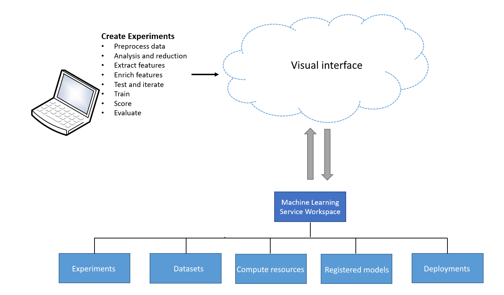
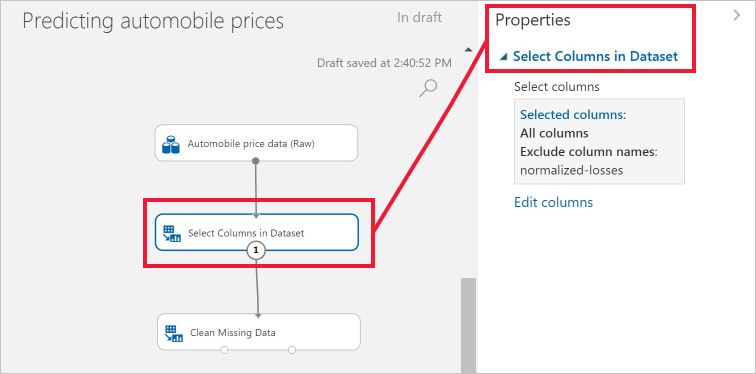

# What is Azure Machine Learning designer (preview)? 
[!INCLUDE [applies-to-skus](../../../includes/aml-applies-to-enterprise-sku.md)]

The designer for Azure Machine Learning enables you to prep data, train, test, deploy, manage, and track machine learning models without writing code.

There is no programming required, you visually connect [datasets](#datasets) and [modules](#module) to construct your model.

The designer uses your Azure Machine Learning [workspace](concept-workspace.md) to:

+ Create, edit, and run [pipelines](#pipeline) in the workspace.
+ Access [datasets](#datasets).
+ Use the [compute resources](#compute) in the workspace to run the pipeline. 
+ Register [models](concept-azure-machine-learning-architecture.md#models).
+ [Publish](#publish) pipelines as REST endpoints.
+ [Deploy](#deployment) models as pipeline endpoints (for batch inference) or real-time endpoints on compute resources in the workspace.

## Workflow

The designer gives you an interactive, visual canvas to quickly build, test, and iterate on a model. 

+ You drag-and-drop [datasets](#datasets) and [modules](#module) onto the canvas.
+ Connect the modules together to form an [pipeline](#pipeline).
+ Run the pipeline using the compute resource of the Machine Learning Service workspace.
+ Iterate on your model design by editing the pipeline and running it again.
+ When you're ready, convert your **training pipeline** to an **inference pipeline**.
+ [Publish](#publish) your pipeline as an REST endpoint if you want to resubmit it without the Python code constructed it.
+ [Deploy](#deployment) the inference pipeline as a pipeline endpoint or real-time endpoint so that your model can be accessed by others.

## Pipeline

Create an ML [pipeline](concept-azure-machine-learning-architecture.md#ml-pipelines) from scratch, or use an existing sample pipeline as a template. Each time you run a pipeline, artifacts are stored in your workspace. Pipeline runs are grouped into [experiments](concept-azure-machine-learning-architecture.md#experiments).

A pipeline consists of datasets and analytical modules, which you connect together to construct a model. Specifically, a valid pipeline has these characteristics:

* Datasets may be connected only to modules.
* Modules may be connected to either datasets or other modules.
* All input ports for modules must have some connection to the data flow.
* All required parameters for each module must be set.

To learn how to get started with the designer, see [Tutorial: Predict automobile price with the designer](tutorial-designer-automobile-price-train-score.md).

## Datasets

A machine learning dataset makes it easy to access and work with your data. A number of sample datasets are included in the designer for you to experiment with. You can [register](./how-to-create-register-datasets.md) more datasets as you need them.

## Module

A module is an algorithm that you can perform on your data. The designer has a number of modules ranging from data ingress functions to training, scoring, and validation processes.

A module may have a set of parameters that you can use to configure the module's internal algorithms. When you select a module on the canvas, the module's parameters are displayed in the Properties pane to the right of the canvas. You can modify the parameters in that pane to tune your model.

For some help navigating through the library of machine learning algorithms available, see [Algorithm & module reference overview](../algorithm-module-reference/module-reference.md)

##  Compute resources

Use compute resources from your workspace to run your pipeline and host your deployed models as real-time endpoints or pipeline endpoints (for batch inference). The supported compute targets are:

| Compute target | Training | Deployment |
| ---- |:----:|:----:|
| Azure Machine Learning compute | ✓ | |
| Azure Kubernetes Service | | ✓ |

Compute targets are attached to your Machine Learning [workspace](concept-workspace.md). You manage your compute targets in your workspace in [Azure Machine Learning studio](https://ml.azure.com).

## Publish

Once you have a pipeline ready, you can publish it as a REST endpoint. A [PublishedPipeline](https://docs.microsoft.com/python/api/azureml-pipeline-core/azureml.pipeline.core.graph.publishedpipeline?view=azure-ml-py) can be submitted without the Python code which constructed it.

In addition, a PublishedPipeline can be used to resubmit a Pipeline with different PipelineParameter values and inputs.

## Deployment

Once your predictive model is ready, deploy it as a pipeline endpoint or real-time endpoint right from the designer.

The pipeline endpoint is a PublishedPipeline, which you can submit a pipeline run with different PipelineParameter values and inputs for batch inference.

The real-time endpoint provides an interface between an application and your scoring model. An external application can communicate with the scoring model in real time. A call to a real-time endpoint returns prediction results to an external application. To make a call to a real-time endpoint, you pass an API key that was created when you deployed the endpoint. The endpoint is based on REST, a popular architecture choice for web programming projects.

To learn how to deploy your model, see [Tutorial: Deploy a machine learning model with the designer](tutorial-designer-automobile-price-deploy.md).

## Moving from the visual interface to the designer

The visual interface (preview) has been updated and is now Azure Machine Learning designer (preview). The designer has been rearchitected to use a pipeline-based backend that fully integrates with the other features of Azure Machine Learning. 

As a result of these updates, some concepts and terms for the visual interface have been changed or renamed. See the table below for the most important conceptual changes. 

| Concept in the designer | Previously in the visual interface |
| ---- |:----:|
| Pipeline draft | Experiment |
| Real-time endpoint | Web service |

### Migrating to the designer

You can convert existing visual interface experiments and web services to pipelines and real-time endpoints in the designer. Use the following steps to migrate your visual interface assets:

[!INCLUDE [migrate from the visual interface](../../../includes/aml-vi-designer-migration.md)]

## Next steps

* Learn the basics of predictive analytics and machine learning with [Tutorial: Predict automobile price with the designer](tutorial-designer-automobile-price-train-score.md)
* Use one of the samples and modify to suite your needs:

- [Sample 1 - Regression: Predict an automobile's price](how-to-designer-sample-regression-automobile-price-basic.md)
- [Sample 2 - Regression: Compare algorithms for automobile price prediction](how-to-designer-sample-regression-automobile-price-compare-algorithms.md)
- [Sample 3 - Classification with feature selection: Income Prediction](how-to-designer-sample-classification-predict-income.md)
- [Sample 4 - Classification: Predict credit risk (cost sensitive)](how-to-designer-sample-classification-credit-risk-cost-sensitive.md)
- [Sample 5 - Classification: Predict churn](how-to-designer-sample-classification-churn.md)
- [Sample 6 - Classification: Predict flight delays](how-to-designer-sample-classification-flight-delay.md)
- [Sample 7 - Text Classification: Wikipedia SP 500 Dataset](how-to-designer-sample-text-classification.md)

