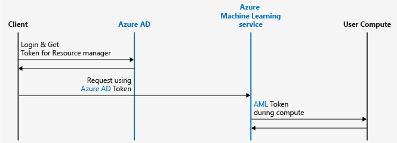
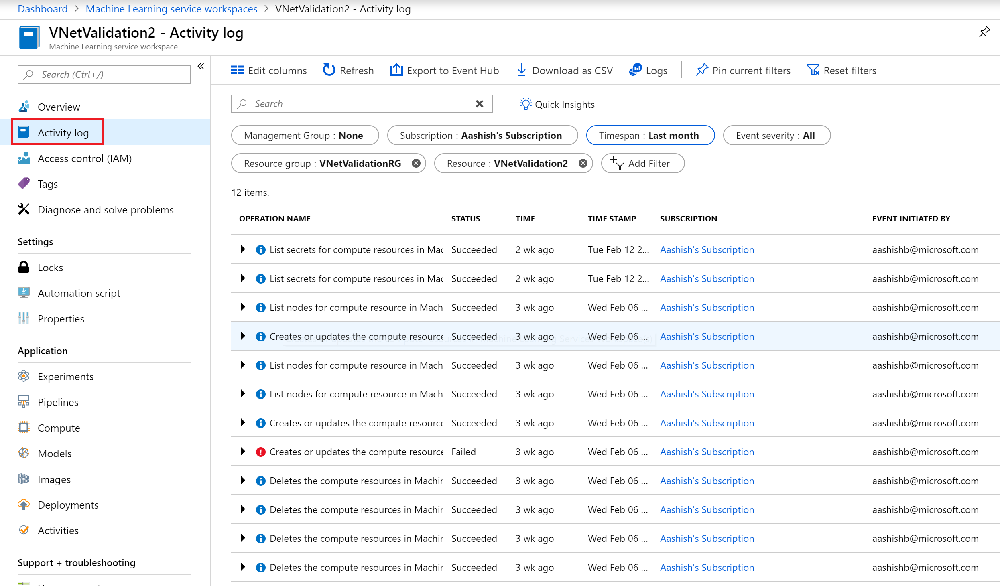
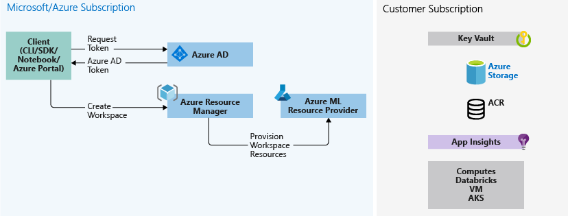

# Enterprise security for Azure Machine Learning service

In this article, you will learn about security features available with the Azure Machine learning service.

When using a cloud service, it is a best practice to restrict access only to the users who need it. This starts by understanding the authentication and authorization model used by the service. You may also want to restrict network access, or securely join resources in your on-premises network with those in the cloud. Data encryption is also vital, both at rest and while the data moves between services. Finally, you need to be able to monitor the service and produce an audit log of all activity.

## Authentication
Multi Factor authentication is supported if Azure Active Directory (Azure AD) is configured for the same.
* Client logs into Azure AD and gets Azure Resource Manager token.  Users and Service Principals are fully supported.
* Client presents token to Azure Resource Manager & all Azure Machine Learning services
* Azure Machine Learning service provides an Azure Machine Learning token to the user compute. For example, Machine Learning Compute. This Azure Machine Learning token is used by user compute to call back into Azure Machine Learning service (limits scope to workspace) after the run is complete.



### Authentication keys for Web service deployment

When you enable authentication for a deployment, you automatically create authentication keys.

* Authentication is enabled by default when you are deploying to Azure Kubernetes Service.
* Authentication is disabled by default when you are deploying to Azure Container Instances.

To control authentication, use the `auth_enabled` parameter when you are creating or updating a deployment.

If authentication is enabled, you can use the `get_keys` method to retrieve a primary and secondary authentication key:

```python
primary, secondary = service.get_keys()
print(primary)
```

> [!IMPORTANT]
> If you need to regenerate a key, use [`service.regen_key`](https://docs.microsoft.com/python/api/azureml-core/azureml.core.webservice(class)?view=azure-ml-py)


## Authorization

You can create multiple workspaces, and each workspace can be shared by multiple people. When you share a workspace, you can control access to it by assigning the following roles to users:
* Owner
* Contributor
* Reader
	
The following table lists some of the major Azure Machine Learning service operations and the roles that can perform them:

| Azure Machine Learning service Operation | Owner | Contributor | Reader |
| ---- |:----:|:----:|:----:|
| Create Workspace | ✓ | ✓ | |
| Share Workspace | ✓ | |  |
| Create Compute | ✓ | ✓ | |
| Attach Compute | ✓ | ✓ | |
| Attach Datastores | ✓ | ✓ | |
| Run an Experiment | ✓ | ✓ | |
| View runs/metrics | ✓ | ✓ | ✓ |
| Register model | ✓ | ✓ | |
| Create image | ✓ | ✓ | |
| Deploy web service | ✓ | ✓ | |
| View models/images | ✓ | ✓ | ✓ |
| Call web service | ✓ | ✓ | ✓ |

If the built-in roles are insufficient for your needs, you can also create custom roles. The only custom roles we support are for operations on the workspace and Machine Learning Compute. The custom roles may have read, write, or delete permissions on the workspace and the compute resource in that workspace. You can make the role available at a specific workspace level, a specific resource group level, or a specific subscription level. For more information, see [Manage users and roles in an Azure Machine Learning workspace](how-to-assign-roles.md)

### Securing compute and data
Owners and contributors can use all compute targets and data stores that are attached to the workspace.  
Each workspace also has an associated system-assigned Managed Identity (with the same name as the workspace) with the following permissions on attached resources used in the workspace:

For more information on managed identities, see [Managed identities for Azure resources](https://docs.microsoft.com/azure/active-directory/managed-identities-azure-resources/overview)

| Resource | Permissions |
| ----- | ----- |
| Workspace | Contributor | 
| Storage Account | Storage Blob Data Contributor | 
| Key Vault | Access to all Keys, Secrets, Certificates | 
| Azure Container Registry | Contributor | 
| Resource Group that contains the workspace | Contributor | 
| Resource Group that contains the Key Vault (if different than the one containing the workspace) | Contributor | 

It is recommended that administrators do not revoke the access of the managed identity to the resources mentioned above. Access can be restored with the Resync Keys operation.

Azure Machine Learning service creates an additional application (name starts with `aml-`) with the contributor level access in your subscription for every workspace region. For ex. if you have a workspace in East US and another workspace in North Europe in the same subscription you will see two such applications. This is needed so that Azure Machine Learning service can help manage compute resources.


## Network security

The Azure Machine Learning service relies on other Azure services for compute resources. Compute resources (compute targets) are used to train and deploy models. These compute targets can be created inside a virtual network. For example, you can use the Microsoft Data Science Virtual Machine to train a model and then deploy the model to Azure Kubernetes Service (AKS).  

For more information, see [How to run experiments and inference in a virtual network](how-to-enable-virtual-network.md).

## Data encryption

### Encryption at rest
#### Azure Blob Storage
Azure Machine Learning service stores snapshots, outputs, and logs in the Azure Blob Storage account that is tied to the Azure Machine Learning service workspace and lives in user’s subscription. All the data stored in Azure Blob Storage is encrypted at rest using Microsoft-Managed Keys.

For more information on how to bring your own keys for the data stored in Azure Blob Storage, see [Storage Service Encryption using customer-managed keys in Azure Key Vault](https://docs.microsoft.com/azure/storage/common/storage-service-encryption-customer-managed-keys).

Training data is typically also stored in Azure Blob storage so that it is accessible to training compute. This storage is not managed by Azure Machine Learning but mounted to compute as a remote file system.

For information on regenerating the access keys for the Azure storage accounts used with your workspace, see the [Regenerate storage access keys](how-to-change-storage-access-key.md) article.

#### Cosmos DB
Azure Machine Learning service stores metrics and metadata to the Cosmos DB that lives in a Microsoft subscription managed by Azure Machine Learning service. All the data stored in Cosmos DB is encrypted at rest using Microsoft Managed Keys.

#### Azure Container Registry (ACR)
All container images in your registry (ACR) are encrypted at rest. Azure automatically encrypts an image before storing it and decrypts it on-the-fly when Azure Machine Learning service pulls the image.

#### Machine Learning Compute
The OS disk for each compute node is stored in Azure Storage is encrypted using Microsoft Managed Keys in Azure Machine Learning service storage accounts. This compute is ephemeral, and clusters are typically scaled down when there are no runs queued. The underlying virtual machine is de-provisioned and OS disk deleted. Azure disk encryption is not supported for the OS disk.
Each virtual machine also has a local temporary disk for OS operations. This disk can also be optionally used to stage training data. This disk is not encrypted. 
For more information on how encryption at rest works in Azure, see [Azure Data Encryption-at-Rest](https://docs.microsoft.com/azure/security/azure-security-encryption-atrest). 

### Encryption in transit
Both internal communication between various Azure Machine Learning micro services and external communication of calling the scoring endpoint are supported using SSL. All Azure Storage access is also over a secure channel. 
For more information, see [Secure Azure Machine Learning web services using SSL](https://docs.microsoft.com/azure/machine-learning/service/how-to-secure-web-service).

### Using Azure Key Vault
Key Vault instance associated with the workspace is used by Azure Machine Learning service to store credentials of various kinds:
* The associated storage account connection string
* Passwords to Azure Container Repository instances
* Connection Strings to data stores. 

SSH passwords and keys to compute targets such as HDI HDInsight and VM are stored in a separate Key Vault that is associated with Microsoft subscription. Azure Machine Learning service does store any passwords or keys provided by the user instead it generates, authorizes, and stores its own SSH keys in order to connect to VM/HDInsight to run the experiments. 
Each workspace has an associated system-assigned Managed Identity (with the same name as the workspace) that has access to all keys, secrets, and certificates in the Key Vault.

 
## Monitoring

Users can see the activity log under the workspace to see various operations performed on the workspace and get the basic information like the operation name, event initiated by, timestamp etc.

The following screenshot shows the activity log for a workspace:




Scoring request details are stored in the AppInsights, which is created in user’s subscription while creating the workspace. This includes fields like HTTPMethod, UserAgent, ComputeType, RequestUrl, StatusCode, RequestId, Duration etc.


## Data Flow Diagram

### Create Workspace
The following diagram shows the create workspace workflow.
User logs into Azure AD from any of the supported Azure Machine Learning service clients (CLI, Python SDK, Azure portal) and requests the appropriate Azure Resource Manager token.  User then calls Azure Resource Manager to create the workspace.  Azure Resource Manager contacts the Azure Machine Learning service Resource Provider to provision the workspace.  Additional resources are created in the customer’s subscription during workspace creation:
* KeyVault (to store secrets)
* An Azure Storage account (including Blob & FileShare)
* Azure Container Registry (to store docker images for inference/scoring and experimentation)
* Application Insights (to store telemetry)

Other computes attached to a workspace (Azure Kubernetes Service, VM etc.) can also be provisioned by customers as needed. 



### Save source code (training scripts)
The following diagram shows the code snapshot workflow.
Associated with an Azure Machine Learning service workspace are directories (experiments), which contains the source code (training scripts).  These are stored on the customer’s local machine and in the cloud (in the Azure Blob Storage under customer’s subscription). These code snapshots are used for execution or inspection for historical auditing.


### Training
The following diagram shows the training workflow.
* Azure Machine Learning service is called with the snapshot ID for the code snapshot saved above
* Azure Machine Learning service creates run ID (optional) & Azure Machine Learning service token, which is later used by the compute targets like Machine Learning Compute/VM to talk back to Azure Machine Learning service
* You can choose either a managed compute (ex. Machine Learning Compute) or unmanaged compute (ex. VM) to run your training jobs. Data flow is explained for both the scenarios below:
* (VM/HDInsight – accessed using SSH creds in Key Vault in Microsoft subscription) Azure Machine Learning service runs management code on compute target that:
    1.	Prepares the environment (note: Docker is an option for VM/Local as well. See steps for Machine Learning Compute below to understand how running experiment on docker container works)
    2.	Downloads the code
    3.	Sets up environment variables/configs
    4.	Runs user script (code snapshot mentioned above)
* (Machine Learning Compute – accessed using workspace managed identity) 
Note that since Machine Learning Compute is a managed compute that is, it is managed by Microsoft, as a result it runs under the Microsoft subscription.
    1.	Remote Docker construction is kicked off if needed
    2.	Writes management code to user Azure FileShare
    3.	Starts container with initial command that is, management code in the above step


#### Querying runs & metrics
This step is shown in the flow where training compute writes the *Run Metrics* back to the Azure Machine Learning service from where it gets stored in the Cosmos DB. Clients can call Azure Machine Learning service that will in turn pull metrics from the Cosmos DB and return it back to the client.


### Creating web services
The following diagram shows the inference workflow. Inference, or model scoring, is the phase where the deployed model is used for prediction, most commonly on production data.
See details below:
* User registers a model using a client like Azure ML SDK
* User creates image using model, score file, and other model dependencies
* The Docker Image is created and stored in ACR
* Webservice is deployed to the compute target (ACI/AKS) using the image created above
* Scoring request details are stored in the AppInsights, which is in user’s subscription
* Telemetry is also pushed to Microsoft/Azure subscription


## Next steps

* [Secure Azure Machine Learning web services with SSL](how-to-secure-web-service.md)
* [Consume a ML Model deployed as a web service](how-to-consume-web-service.md)
* [How to run batch predictions](how-to-run-batch-predictions.md)
* [Monitor your Azure Machine Learning models with Application Insights](how-to-enable-app-insights.md)
* [Collect data for models in production](how-to-enable-data-collection.md)
* [Azure Machine Learning service SDK](https://docs.microsoft.com/python/api/overview/azure/ml/intro?view=azure-ml-py)
* [Use Azure Machine Learning service with Azure Virtual Networks](how-to-enable-virtual-network.md)
* [Best practices for building recommendation systems](https://github.com/Microsoft/Recommenders)
* [Build a real-time recommendation API on Azure](https://docs.microsoft.com/azure/architecture/reference-architectures/ai/real-time-recommendation)
