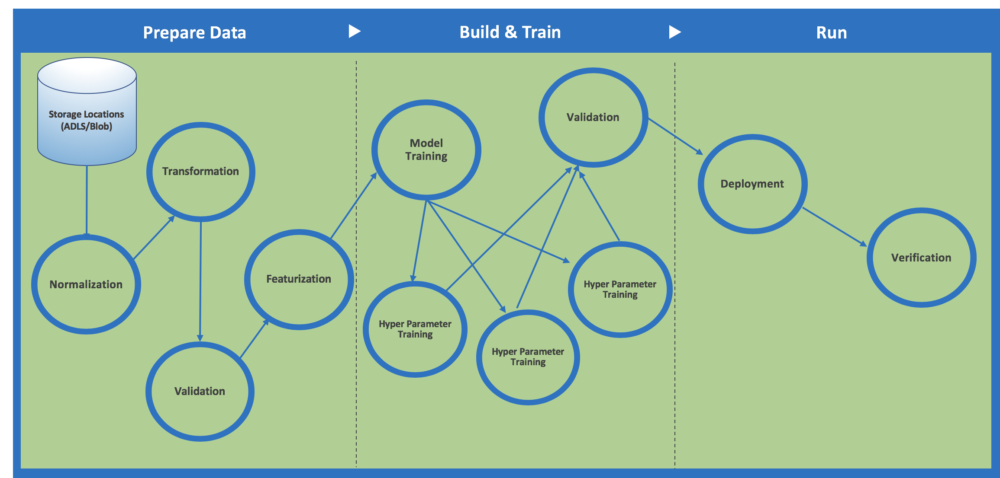

# Pipelines and Azure Machine Learning

In this article, learn about the machine learning pipelines you can build with the Azure Machine Learning SDK for Python and the advantages to using pipelines.

## What are machine learning pipelines?

Machine learning (ML) pipelines are used by data scientists to build, optimize, and manage their machine learning workflows. A typical pipeline involves a sequence of steps that cover the following areas:

+ Data preparation, such as normalizations and transformations
+ Model training, such as hyper parameter tuning and validation
+ Model deployment and evaluation  

The following diagram shows an example pipeline:

[  ]
(./media/concept-ml-pipelines/machine-learning-pipelines-big.png#lightbox)

## Why build pipelines with Azure Machine Learning?

The [Azure Machine Learning SDK for Python](#the-python-sdk-for-pipelines) can be used to create ML pipelines as well as to submit and track individual pipeline runs.

With pipelines, you can optimize your workflow with simplicity, speed, portability, and reuse. When building pipelines with Azure Machine Learning, you can focus on what you know best &mdash; machine learning &mdash; rather than infrastructure.

Using distinct steps makes it possible to rerun only the steps you need as you tweak and test your workflow. A step is a computational unit in the pipeline. As shown in the diagram above, the task of preparing data may involve many steps including, but not limited to, normalization, transformation, validation, and featurization.

Once the pipeline is designed, there is often more fine-tuning around the training loop of the pipeline. When you rerun a pipeline, the run jumps to the steps that need to be rerun, such as an updated training script, and skips what hasn't changed. The same paradigm applies to unchanged scripts used for the execution of the step. 

With Azure Machine Learning, you can use various toolkits and frameworks such as Microsoft Cognitive Toolkit or TensorFlow for each step in your pipeline. Azure coordinates between the various [compute targets](concept-azure-machine-learning-architecture.md) you use so that your intermediate data can be shared with the downstream compute targets easily. 

## Key advantages

The key advantages to building pipelines for your machine learning workflows is:

|Key advantage|Description|
|:-------:|-----------|
|**Unattended&nbsp;runs**|Schedule a few steps to run in parallel or in sequence in a reliable and unattended manner. Since data prep and modeling can last days or weeks, you can now focus on other tasks while your pipeline is running. |
|**Mixed and diverse compute**|Use multiple pipelines that are reliably coordinated across heterogeneous and scalable computes and storages. Individual pipeline steps can be run on different compute targets, such as HDInsight, GPU Data Science VMs, and Databricks, to make efficient use of available compute options.|
|**Reusability**|Pipelines can be templatized for specific scenarios such as retraining and batch scoring.  They can be triggered from external systems via simple REST calls.|
|**Tracking and versioning**|Instead of manually tracking data and result paths as you iterate, use the pipelines SDK to explicitly name and version your data sources, inputs, and outputs as well as manage scripts and data separately for increased productivity.|

## The Python SDK for pipelines

Use Python to create your ML pipelines. The Azure Machine Learning SDK offers imperative constructs for sequencing and parallelizing the steps in your pipelines when no data dependency is present. You can interact with it in Jupyter notebooks or in another preferred IDE. 

Using declarative data dependencies, you can optimize your tasks. The SDK includes a framework of pre-built modules for common tasks such as data transfer, compute target creation, and model publishing. The framework can be extended to model your own conventions by implementing custom steps that are reusable across pipelines.

Pipelines can be saved as templates and can be deployed to a REST endpoint so you can schedule batch-scoring or retraining jobs.

Check out the [Python SDK reference docs for pipelines](http://aka.ms/aml-sdk) and the notebook in the next section to see how to build your own.

## Example notebooks
 
The following notebook demonstrates pipelines with Azure Machine Learning:  [pipeline/pipeline-batch-scoring.ipynb](https://github.com/Azure/MachineLearningNotebooks/blob/master/pipeline/pipeline-batch-scoring.ipynb).
 
Get this notebook:
 
[!INCLUDE [aml-clone-in-azure-notebook](../../../includes/aml-clone-for-examples.md)]
