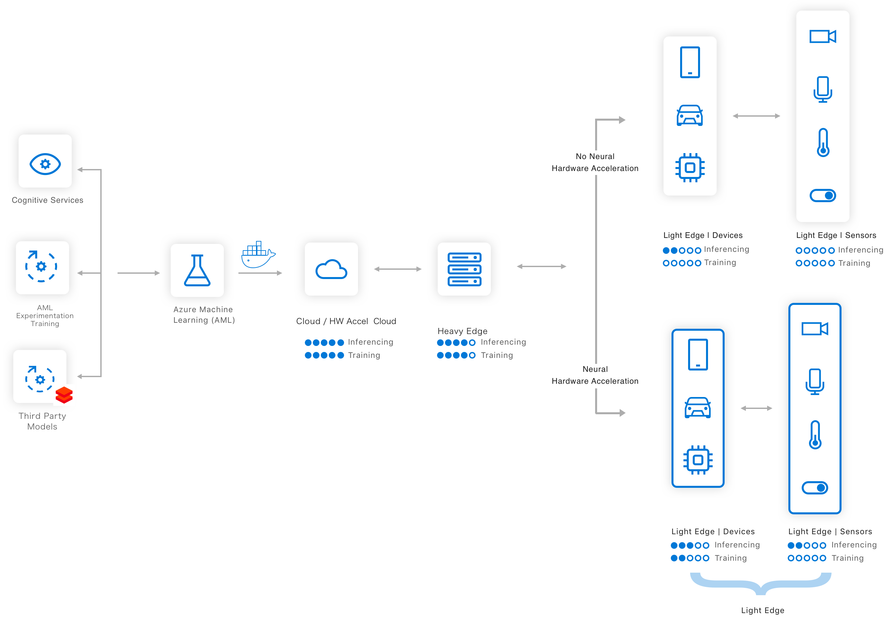

# Manage, deploy, and monitor models with Azure Machine Learning Service

In this article, you can learn how to use Azure Machine Learning Service to deploy, manage, and monitor your models to continuously improve them. You can deploy the models you trained with Azure Machine Learning, on your local machine, or from other sources. 

The following diagram illustrates the complete deployment workflow:

The deployment workflow includes the following steps:
1. **Register the model** in a registry hosted in your Azure Machine Learning Service workspace
1. **Register an image** that pairs a model with a scoring script and dependencies in a portable container 
1. **Deploy** the image as a web service in the cloud or to edge devices
1. **Monitor and collect data**
1. **Update** a deployment to use a new image.

Each step can be performed independently or as part of a single deployment command. Additionally, you can integrate deployment into a **CI/CD workflow** as illustrated in this graphic.

## Step 1: Register model

Model registration allows you to store and version your models in the Azure cloud, in your workspace. The model registry makes it easy to organize and keep track of your trained models.
 
Registered models are identified by name and version. Each time you register a model with the same name as an existing one, the registry increments the version. You can also provide additional metadata tags during registration that can be used when searching for models. The Azure Machine Learning service supports any model that can be loaded using Python 3. 

You can't delete models that are being used by an image.

For more information, see the register model section of [Deploy models](how-to-deploy-and-where.md#registermodel).

For an example of registering a model stored in pickle format, see [Tutorial: Train an image classification model](tutorial-deploy-models-with-aml.md).

For information on using ONNX models, see the [ONNX and Azure Machine Learning](how-to-build-deploy-onnx.md) document.

## Step 2: Register image

Images allow for reliable model deployment, along with all components needed to use the model. An image contains the following items:

* The model
* The scoring engine
* The scoring file or application
* Any dependencies needed to score the model

The image can also include SDK components for logging and monitoring. The SDK logs data can be used to fine-tune or retrain your model, including the input and output of the model.

Azure Machine Learning supports the most popular frameworks, but in general any framework that can be pip installed can work.

When your workspace was created, so were other several other Azure resources used by that workspace.
All the objects used to create the image are stored in the Azure storage account in your workspace. You can provide additional metadata tags when creating the image. The metadata tags are also stored by the image registry, and can be queried to find your image.

For more information, see the configure and register image section of [Deploy models](how-to-deploy-and-where.md#configureimage).

## Step 3: Deploy image

You can deploy registered images into the cloud or to edge devices. The deployment process creates all the resources needed to monitor, load-balance, and autoscale your model. Access to the deployed services can be secured with certificate-based authentication by providing the security assets during deployment. You can also upgrade an existing deployment to use a newer image.

Web service deployments are also searchable. For example, you can search for all deployments of a specific model or image.

You can deploy your images to the following deployment targets in the cloud:

* Azure Container Instance
* Azure Kubernetes Service
* Azure FPGA machines
* Azure IoT Edge devices

As your service is deployed, the inferencing request is automatically load-balanced and the cluster is scaled to satisfy any spikes on demand. [Telemetry about your service can be captured](how-to-enable-app-insights.md) into the Azure Application Insights service associated with your Workspace.

For more information, see the deploy section of [Deploy models](how-to-deploy-and-where.md#deploy).

## Step 4: Monitor models and collect data

An SDK for model logging and data capture is available so you can monitor input, output, and other relevant data from your model. The data is stored as a blob in the Azure Storage account for your workspace.

To use the SDK with your model, you import the SDK into your scoring script or application. You can then use the SDK to log data such as parameters, results, or input details.

If you decide to enable model data collection every time you deploy the image, the details needed to capture the data, such as the credentials to your personal blob store, are provisioned automatically.

> [!Important]
> Microsoft does not see the data you collect from your model. The data is sent directly to the Azure storage account for your workspace.

For more information, see [How to enable model data collection](how-to-enable-data-collection.md).

## Step 5: Update the deployment

Updates to your model are not automatically registered. Similarly, registering a new image does not automatically update deployments that were created from a previous version of the image. Instead, you must manually register the model, register the image, and then update the model. For more information, see update section of [Deploy models](how-to-deploy-and-where.md#update).

## Next steps

Learn more about [how and where you can deploy models](how-to-deploy-and-where.md) with the Azure Machine Learning service.

Learn how to create client applications and services that [Consume a model deployed as a web service](how-to-consume-web-service.md).
