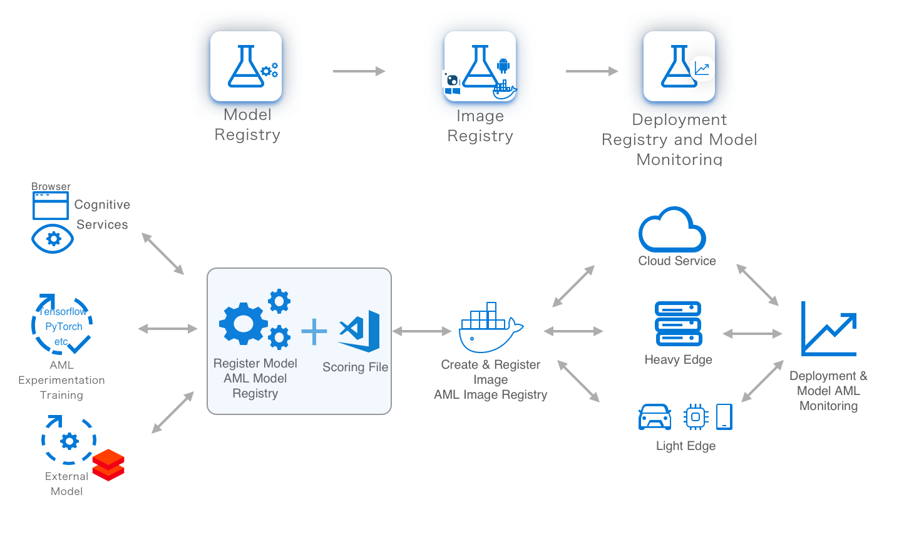
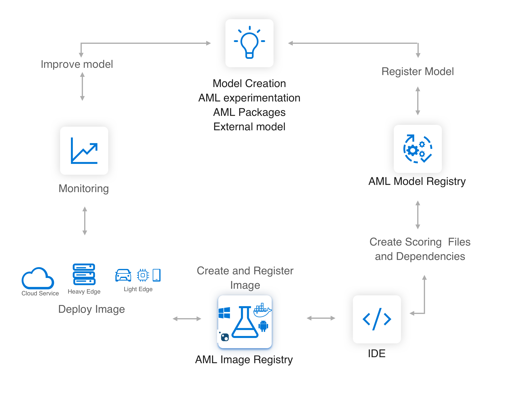

# MLOps: Manage, deploy, and monitor models with Azure Machine Learning Service

In this article, you can learn how to use Azure Machine Learning Service to deploy, manage, and monitor your models to continuously improve them. You can deploy the models you trained with Azure Machine Learning, on your local machine, or from other sources. 

The following diagram illustrates the complete deployment workflow:

The MLOps / deployment workflow includes the following steps:
1. **Register the model** in a registry hosted in your Azure Machine Learning Service workspace
1. **Use** the model in a web service in the cloud, on an IoT device, or for analytics with Power BI.
1. **Monitor and collect data**
1. **Update** a deployment to use a new image.

Each step can be performed independently or as part of a single command. Additionally, you can create a **CI/CD workflow** as illustrated in this graphic.

> [!VIDEO https://www.youtube.com/embed/0MaHb070H_8]

## Step 1: Register model

Model registration allows you to store and version your models in the Azure cloud, in your workspace. The model registry makes it easy to organize and keep track of your trained models.
 
Registered models are identified by name and version. Each time you register a model with the same name as an existing one, the registry increments the version. You can also provide additional metadata tags during registration that can be used when searching for models. The Azure Machine Learning service supports any model that can be loaded using Python 3.5.2 or higher.

You can't delete models that are being used in an active deployment.

For more information, see the register model section of [Deploy models](how-to-deploy-and-where.md#registermodel).

For an example of registering a model stored in pickle format, see [Tutorial: Train an image classification model](tutorial-deploy-models-with-aml.md).

## Step 2: Use the model

Machine learning models can be used as a web service, on IoT Edge devices, or for analytics from services such as Power BI.

### Web service

You can use your models in **web services** with the following compute targets:

* Azure Container Instance
* Azure Kubernetes Service

To deploy the model as a web service, you must provide the following:

* The model or ensemble of models.
* Dependencies required to use the model. For example, a script that accepts requests and invokes the model, conda dependencies, etc.
* Deployment configuration that describes how and where to deploy the model.

For more information, see [Deploy models](how-to-deploy-and-where.md).

### IoT Edge devices

You can use models with IoT devices through **Azure IoT Edge modules**. IoT Edge modules are deployed to hardware devices, which enables inferencing on the device.

For more information, see [Deploy models](how-to-deploy-and-where.md).

### Analytics

Microsoft Power BI supports using machine learning models for data analytics. For more information, see [Azure Machine Learning integration in Power BI (Preview)](https://docs.microsoft.com/power-bi/service-machine-learning-integration).

## Step 3: Monitor models and collect data

Monitoring enables you to understand what data is being sent to your model, and the predictions that it returns.

This information helps you understand how your model is being used. The collected input data may also be useful in training future versions of the model.

For more information, see [How to enable model data collection](how-to-enable-data-collection.md).

## Step 4: Update the deployment

Deployments must be explicitly updated. For more information, see update section of [Deploy models](how-to-deploy-and-where.md#update).

## Next steps

Learn more about [how and where you can deploy models](how-to-deploy-and-where.md) with the Azure Machine Learning service. For an example of deployment, see [Tutorial: Deploy an image classification model in Azure Container Instances](tutorial-deploy-models-with-aml.md).

Learn how to create client applications and services that [Consume a model deployed as a web service](how-to-consume-web-service.md).
