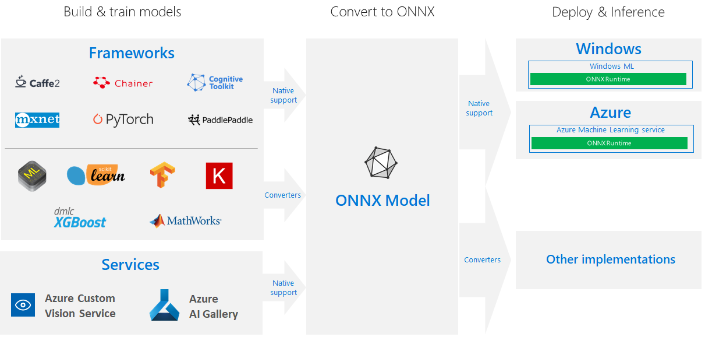

# ONNX and Azure Machine Learning: Create and accelerate ML models

Learn how using the [Open Neural Network Exchange](https://onnx.ai) (ONNX) can help optimize the inference of your machine learning model. Inference, or model scoring, is the phase where the deployed model is used for prediction, most commonly on production data. 

Optimizing machine learning models for inference (or model scoring) is difficult since you need to tune the model and the inference library to make the most of the hardware capabilities. The problem becomes extremely hard if you want to get optimal performance on different kinds of platforms (cloud/edge, CPU/GPU, etc.), since each one has different capabilities and characteristics. The complexity increases if you have models from a variety of frameworks that need to run on a variety of platforms. It's very time consuming to optimize all the different combinations of frameworks and hardware. A solution to train once in your preferred framework and run anywhere on the cloud or edge is needed. This is where ONNX comes in.

Microsoft and a community of partners created ONNX as an open standard for representing machine learning models. Models from [many frameworks](https://onnx.ai/supported-tools) including TensorFlow, PyTorch, SciKit-Learn, Keras, Chainer, MXNet, and MATLAB can be exported or converted to the standard ONNX format. Once the models are in the ONNX format, they can be run on a variety of platforms and devices.

[ONNX Runtime](https://github.com/Microsoft/onnxruntime) is a high-performance inference engine for deploying ONNX models to production. It's optimized for both cloud and edge and works on Linux, Windows, and Mac. Written in C++, it also has C, Python, and C# APIs. ONNX Runtime provides support for all of the ONNX-ML specification and also integrates with accelerators on different hardware such as TensorRT on NVidia GPUs.

The ONNX Runtime is used in high scale Microsoft services such as Bing, Office, and Cognitive Services. Performance gains are dependent on a number of factors but these Microsoft services have seen an __average 2x performance gain on CPU__. ONNX Runtime is also used as part of Windows ML on hundreds of millions of devices. You can use the runtime with Azure Machine Learning services. By using ONNX Runtime, you can benefit from the extensive production-grade optimizations, testing, and ongoing improvements.

[](./media/concept-onnx/onnx.png#lightbox)

## Get ONNX models

You can obtain ONNX models in several ways:
+ Train a new ONNX model in Azure Machine Learning service (see examples at the bottom of this article)
+ Convert existing model from another format to ONNX (see the [tutorials](https://github.com/onnx/tutorials)) 
+ Get a pre-trained ONNX model from the [ONNX Model Zoo](https://github.com/onnx/models) (see examples at the bottom of this article)
+ Generate a customized ONNX model from [Azure Custom Vision service](https://docs.microsoft.com/azure/cognitive-services/Custom-Vision-Service/) 

Many models including image classification, object detection, and text processing can be represented as ONNX models. However some models may not be able to be converted successfully. If you run into this situation, please file an issue in the GitHub of the respective converter that you used. You can continue using your existing format model until the issue is addressed.

## Deploy ONNX models in Azure

With Azure Machine Learning service, you can deploy, manage, and monitor your ONNX models. Using the standard [deployment workflow](concept-model-management-and-deployment.md) and ONNX Runtime, you can create a REST endpoint hosted in the cloud. See example Jupyter notebooks at the end of this article to try it out for yourself. 

### Install and use ONNX Runtime with Python

Python packages for ONNX Runtime are available on [PyPi.org](https://pypi.org) ([CPU](https://pypi.org/project/onnxruntime), [GPU](https://pypi.org/project/onnxruntime-gpu)). Please read [system requirements](https://github.com/Microsoft/onnxruntime#system-requirements) before installation.	

 To install ONNX Runtime for Python, use one of the following commands:	
```python	
pip install onnxruntime	      # CPU build
pip install onnxruntime-gpu   # GPU build
```	

To call ONNX Runtime in your Python script, use:	
```python	
import onnxruntime	
session = onnxruntime.InferenceSession("path to model")	
```	

The documentation accompanying the model usually tells you the inputs and outputs for using the model. You can also use a visualization tool such as [Netron](https://github.com/lutzroeder/Netron) to view the model. ONNX Runtime also lets you query the model metadata, inputs, and outputs:	
```python	
session.get_modelmeta()	
first_input_name = session.get_inputs()[0].name	
first_output_name = session.get_outputs()[0].name	
```	

To inference your model, use `run` and pass in the list of outputs you want returned (leave empty if you want all of them) and a map of the input values. The result is a list of the outputs.	
```python	
results = session.run(["output1", "output2"], {"input1": indata1, "input2": indata2})	
results = session.run([], {"input1": indata1, "input2": indata2})	
```	

For the complete Python API reference, see the [ONNX Runtime reference docs](https://aka.ms/onnxruntime-python).	

## Examples

See [how-to-use-azureml/deployment/onnx](https://github.com/Azure/MachineLearningNotebooks/blob/master/how-to-use-azureml/deployment/onnx) for example notebooks that create and deploy ONNX models.

[!INCLUDE [aml-clone-in-azure-notebook](../../../includes/aml-clone-for-examples.md)]

## More info

Learn more about ONNX or contribute to the project:
+ [ONNX project website](https://onnx.ai)
+ [ONNX code on GitHub](https://github.com/onnx/onnx)

Learn more about ONNX Runtime or contribute to the project:
+ [ONNX Runtime GitHub Repo](https://github.com/Microsoft/onnxruntime)


