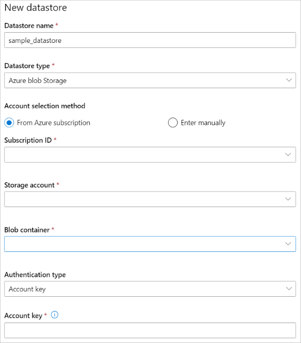

# Access data in Azure storage services
[!INCLUDE [aml-applies-to-basic-enterprise-sku](../../../includes/aml-applies-to-basic-enterprise-sku.md)]

In this article, learn how to easily access your data in Azure storage services via Azure Machine Learning datastores. Datastores are used to store connection information, like your subscription ID and token authorization. Using datastores allows you to access your storage without having to hard code connection information in your scripts. You can create datastores from these [Azure storage solutions](#matrix). For unsupported storage solutions, to save data egress cost during machine learning experiments, we recommend you move your data to our supported Azure storage solutions. [Learn how to move your data](#move). 

This how-to shows examples of the following tasks:
* [Register datastores](#access)
* [Get datastores from workspace](#get)
* [Upload and download data using datastores](#up-and-down)
* [Access data during training](#train)
* [Move data to Azure](#move)

## Prerequisites

- An Azure subscription. If you don’t have an Azure subscription, create a free account before you begin. Try the [free or paid version of Azure Machine Learning](https://aka.ms/AMLFree) today.

- An Azure storage account with an [Azure Blob Container](https://docs.microsoft.com/azure/storage/blobs/storage-blobs-overview) or [Azure File Share](https://docs.microsoft.com/azure/storage/files/storage-files-introduction).

- The [Azure Machine Learning SDK for Python](https://docs.microsoft.com/python/api/overview/azure/ml/intro?view=azure-ml-py), or access to [Azure Machine Learning studio](https://ml.azure.com/).

- An Azure Machine Learning workspace. 
    - Either [Create an Azure Machine Learning workspace](how-to-manage-workspace.md) or use an existing one using the Python SDK.

        ```Python
        import azureml.core
        from azureml.core import Workspace, Datastore
        
        ws = Workspace.from_config()
        ```

<a name="access"></a>

## Create and register datastores

When you register an Azure storage solution as a datastore, you automatically create that datastore in a specific workspace. You can create and register datastores to a workspace using the Python SDK or Azure Machine Learning studio.

### Using the Python SDK

All the register methods are on the [`Datastore`](https://docs.microsoft.com/python/api/azureml-core/azureml.core.datastore(class)?view=azure-ml-py) class and have the form register_azure_*.

The information you need to populate the register() method can be found via  [Azure Machine Learning studio](https://ml.azure.com). Select **Storage Accounts** on the left pane and choose the storage account you want to register. The **Overview** page provides information such as, the account name and container or file share name. For authentication information, like account key or SAS token, navigate to **Account Keys** under the **Settings** pane on the left. 

The following examples show you to register an Azure Blob Container or an Azure File Share as a datastore.

+ For an **Azure Blob Container Datastore**, use [`register_azure_blob-container()`](https://docs.microsoft.com/python/api/azureml-core/azureml.core.datastore(class)?view=azure-ml-py#register-azure-blob-container-workspace--datastore-name--container-name--account-name--sas-token-none--account-key-none--protocol-none--endpoint-none--overwrite-false--create-if-not-exists-false--skip-validation-false--blob-cache-timeout-none--grant-workspace-access-false--subscription-id-none--resource-group-none-)

    The following code creates and registers the datastore, `my_datastore`, to the workspace, `ws`. This datastore accesses the Azure blob container, `my_blob_container`, on the Azure storage account, `my_storage_account` using the provided account key.

    ```Python
       datastore = Datastore.register_azure_blob_container(workspace=ws, 
                                                          datastore_name='my_datastore', 
                                                          container_name='my_blob_container',
                                                          account_name='my_storage_account', 
                                                          account_key='your storage account key',
                                                          create_if_not_exists=True)
    ```
    If your storage account is in a VNET, only Azure blob datastore creation is supported. Set the parameter, `grant_workspace_access` to `True` to grant your workspace access to your storage account.

+ For an **Azure File Share Datastore**, use [`register_azure_file_share()`](https://docs.microsoft.com/python/api/azureml-core/azureml.core.datastore(class)?view=azure-ml-py#register-azure-file-share-workspace--datastore-name--file-share-name--account-name--sas-token-none--account-key-none--protocol-none--endpoint-none--overwrite-false--create-if-not-exists-false--skip-validation-false-). 

    The following code creates and registers the datastore, `my_datastore`, to the workspace, `ws`. This datastore accesses the Azure file share, `my_file_share`, on the Azure storage account, `my_storage_account` using the provided account key.

    ```Python
       datastore = Datastore.register_azure_file_share(workspace=ws, 
                                                      datastore_name='my_datastore', 
                                                      file_share_name='my_file_share',
                                                      account_name='my_storage account', 
                                                      account_key='your storage account key',
                                                      create_if_not_exists=True)
    ```

####  Storage guidance

We recommend Azure Blob Container. Both standard and premium storage are available for blobs. Although more expensive, we suggest premium storage due to faster throughput speeds that may improve the speed of your training runs, particularly if you train against a large data set. See the [Azure pricing calculator](https://azure.microsoft.com/pricing/calculator/?service=machine-learning-service) for storage account cost information.

### Using Azure Machine Learning studio 

Create a new datastore in a few steps in Azure Machine Learning studio.

1. Sign in to [Azure Machine Learning studio](https://ml.azure.com/).
1. Select **Datastores** in the left pane under **Manage**.
1. Select **+ New datastore**.
1. Complete the New datastore form. The form intelligently updates based on the Azure storage type and authentication type selections.
  
The information you need to populate the form can be found via [Azure Machine Learning studio](https://ml.azure.com). Select **Storage Accounts** on the left pane and choose the storage account you want to register. The **Overview** page provides information such as, the account name and container or file share name. For authentication items, like account key or SAS token, navigate to **Account Keys** under the **Settings** pane on the left .

The following example demonstrates what the form would look like for creating an Azure blob datastore. 
    
 


<a name="get"></a>

## Get datastores from your workspace

To get a specific datastore registered in the current workspace, use the [`get()`](https://docs.microsoft.com/python/api/azureml-core/azureml.core.datastore(class)?view=azure-ml-py#get-workspace--datastore-name-) static method on Datastore class:

```Python
#get named datastore from current workspace
datastore = Datastore.get(ws, datastore_name='your datastore name')
```
To get the list of datastores registered with a given workspace, you can use the [`datastores`](https://docs.microsoft.com/python/api/azureml-core/azureml.core.workspace%28class%29?view=azure-ml-py#datastores) property on a workspace object:

```Python
#list all datastores registered in current workspace
datastores = ws.datastores
for name, datastore in datastores.items():
    print(name, datastore.datastore_type)
```

When you create a workspace, an Azure Blob Container and an Azure File Share are registered to the workspace named `workspaceblobstore` and `workspacefilestore` respectively. They store the connection information of the Blob Container and the File Share that is provisioned in the storage account attached to the workspace. The `workspaceblobstore` is set as the default datastore.

To get the workspace's default datastore:

```Python
datastore = ws.get_default_datastore()
```

To define a different default datastore for the current workspace, use [`set_default_datastore()`](https://docs.microsoft.com/python/api/azureml-core/azureml.core.workspace(class)?view=azure-ml-py#set-default-datastore-name-) method on the workspace object:

```Python
#define default datastore for current workspace
ws.set_default_datastore('your datastore name')
```

<a name="up-and-down"></a>
## Upload & download data
The [`upload()`](https://docs.microsoft.com/python/api/azureml-core/azureml.data.azure_storage_datastore.azureblobdatastore?view=azure-ml-py#upload-src-dir--target-path-none--overwrite-false--show-progress-true-) and [`download()`](https://docs.microsoft.com/python/api/azureml-core/azureml.data.azure_storage_datastore.azureblobdatastore?view=azure-ml-py#download-target-path--prefix-none--overwrite-false--show-progress-true-) methods described in the following examples are specific to and operate identically for the [AzureBlobDatastore](https://docs.microsoft.com/python/api/azureml-core/azureml.data.azure_storage_datastore.azureblobdatastore?view=azure-ml-py) and [AzureFileDatastore](https://docs.microsoft.com/python/api/azureml-core/azureml.data.azure_storage_datastore.azurefiledatastore?view=azure-ml-py) classes.

### Upload

 Upload either a directory or individual files to the datastore using the Python SDK.

To upload a directory to a datastore `datastore`:

```Python
import azureml.data
from azureml.data.azure_storage_datastore import AzureFileDatastore, AzureBlobDatastore

datastore.upload(src_dir='your source directory',
                 target_path='your target path',
                 overwrite=True,
                 show_progress=True)
```

The `target_path` parameter specifies the location in the file share (or blob container) to upload. It defaults to `None`, in which case the data gets uploaded to root. When `overwrite=True` any existing data at `target_path` is overwritten.

Or upload a list of individual files to the datastore via the `upload_files()` method.

### Download

Similarly, download data from a datastore to your local file system.

```Python
datastore.download(target_path='your target path',
                   prefix='your prefix',
                   show_progress=True)
```

The `target_path` parameter is the location of the local directory to download the data to. To specify a path to the folder in the file share (or blob container) to download, provide that path to `prefix`. If `prefix` is `None`, all the contents of your file share (or blob container) will get downloaded.

<a name="train"></a>
## Access your data during training

> [!IMPORTANT]
> Using [Azure Machine Learning datasets (preview)](how-to-create-register-datasets.md) is the new recommended way to access your data in training. Datasets provide functions that load tabular data into pandas or spark DataFrame, and the ability to download or mount files of any format from Azure Blob, Azure File, Azure Data Lake Gen 1, Azure Data Lake Gen 2, Azure SQL, Azure PostgreSQL. Learn more about [how to train with datasets](how-to-train-with-datasets.md).

The following table lists the methods that tell the compute target how to use the datastores during runs. 

Way|Method|Description|
----|-----|--------
Mount| [`as_mount()`](https://docs.microsoft.com/python/api/azureml-core/azureml.data.azure_storage_datastore.abstractazurestoragedatastore?view=azure-ml-py#as-mount--)| Use to mount the datastore on the compute target.
Download|[`as_download()`](https://docs.microsoft.com/python/api/azureml-core/azureml.data.azure_storage_datastore.abstractazurestoragedatastore?view=azure-ml-py#as-download-path-on-compute-none-)|Use to download the contents of your datastore to the location specified by `path_on_compute`. <br><br> This download happens before the run.
Upload|[`as_upload()`](https://docs.microsoft.com/python/api/azureml-core/azureml.data.azure_storage_datastore.abstractazurestoragedatastore?view=azure-ml-py#as-upload-path-on-compute-none-)| Use to upload a file from the location specified by `path_on_compute` to your datastore. <br><br> This upload happens after your run.

To reference a specific folder or file in your datastore and make it available on the compute target, use the datastore [`path()`](https://docs.microsoft.com/python/api/azureml-core/azureml.data.azure_storage_datastore.abstractazurestoragedatastore?view=azure-ml-py#path-path-none--data-reference-name-none-) method.

```Python
#to mount the full contents in your storage to the compute target
datastore.as_mount()

#to download the contents of the `./bar` directory in your storage to the compute target
datastore.path('./bar').as_download()
```
> [!NOTE]
> Any specified `datastore` or `datastore.path` object resolves to an environment variable name of the format `"$AZUREML_DATAREFERENCE_XXXX"`, whose value represents the mount/download path on the target compute. The datastore path on the target compute might not be the same as the execution path for the training script.

### Examples 

The following code examples are specific to the [`Estimator`](https://docs.microsoft.com/python/api/azureml-train-core/azureml.train.estimator.estimator?view=azure-ml-py) class for accessing data during training. 

`script_params` is a dictionary containing parameters to the entry_script. Use it to pass in a datastore and describe how data is made available on the compute target. Learn more from our end-to-end [tutorial](tutorial-train-models-with-aml.md).

```Python
from azureml.train.estimator import Estimator

script_params = {
    '--data_dir': datastore.path('/bar').as_mount()
}

est = Estimator(source_directory='your code directory',
                entry_script='train.py',
                script_params=script_params,
                compute_target=compute_target
                )
```

You can also pass in a list of datastores to the Estimator constructor `inputs` parameter to mount or copy data to/from your datastore(s). This code example:
* Downloads all the contents in `datastore1` to the compute target before your training script `train.py` is run
* Downloads the folder `'./foo'` in `datastore2` to the compute target before `train.py` is run
* Uploads the file `'./bar.pkl'` from the compute target to the `datastore3` after your script has run

```Python
est = Estimator(source_directory='your code directory',
                compute_target=compute_target,
                entry_script='train.py',
                inputs=[datastore1.as_download(), datastore2.path('./foo').as_download(), datastore3.as_upload(path_on_compute='./bar.pkl')])
```
<a name="matrix"></a>

### Compute and datastore matrix

Datastores currently support storing connection information to the storage services listed in the following matrix. This matrix displays the available data access functionalities for the different compute targets and datastore scenarios. Learn more about the [compute targets for Azure Machine Learning](how-to-set-up-training-targets.md#compute-targets-for-training).

|Compute|[AzureBlobDatastore](https://docs.microsoft.com/python/api/azureml-core/azureml.data.azure_storage_datastore.azureblobdatastore?view=azure-ml-py)                                       |[AzureFileDatastore](https://docs.microsoft.com/python/api/azureml-core/azureml.data.azure_storage_datastore.azurefiledatastore?view=azure-ml-py)                                      |[AzureDataLakeDatastore](https://docs.microsoft.com/python/api/azureml-core/azureml.data.azure_data_lake_datastore.azuredatalakedatastore?view=azure-ml-py) |[AzureDataLakeGen2Datastore](https://docs.microsoft.com/python/api/azureml-core/azureml.data.azure_data_lake_datastore.azuredatalakegen2datastore?view=azure-ml-py) [AzurePostgreSqlDatastore](https://docs.microsoft.com/python/api/azureml-core/azureml.data.azure_postgre_sql_datastore.azurepostgresqldatastore?view=azure-ml-py) [AzureSqlDatabaseDatastore](https://docs.microsoft.com/python/api/azureml-core/azureml.data.azure_sql_database_datastore.azuresqldatabasedatastore?view=azure-ml-py) |
|--------------------------------|----------------------------------------------------------|----------------------------------------------------------|------------------------|----------------------------------------------------------------------------------------|
| Local|[as_download()](https://docs.microsoft.com/python/api/azureml-core/azureml.data.data_reference.datareference?view=azure-ml-py#as-download-path-on-compute-none--overwrite-false-), [as_upload()](https://docs.microsoft.com/python/api/azureml-core/azureml.data.data_reference.datareference?view=azure-ml-py#as-upload-path-on-compute-none--overwrite-false-)|[as_download()](https://docs.microsoft.com/python/api/azureml-core/azureml.data.data_reference.datareference?view=azure-ml-py#as-download-path-on-compute-none--overwrite-false-), [as_upload()](https://docs.microsoft.com/python/api/azureml-core/azureml.data.data_reference.datareference?view=azure-ml-py#as-upload-path-on-compute-none--overwrite-false-)|N/A         |N/A                                                                         |
| Azure Machine Learning Compute |[as_mount()](https://docs.microsoft.com/python/api/azureml-core/azureml.data.data_reference.datareference?view=azure-ml-py#as-mount--), [as_download()](https://docs.microsoft.com/python/api/azureml-core/azureml.data.data_reference.datareference?view=azure-ml-py#as-download-path-on-compute-none--overwrite-false-), [as_upload()](https://docs.microsoft.com/python/api/azureml-core/azureml.data.data_reference.datareference?view=azure-ml-py#as-upload-path-on-compute-none--overwrite-false-), [ML&nbsp;pipelines](concept-ml-pipelines.md)|[as_mount()](https://docs.microsoft.com/python/api/azureml-core/azureml.data.data_reference.datareference?view=azure-ml-py#as-mount--), [as_download()](https://docs.microsoft.com/python/api/azureml-core/azureml.data.data_reference.datareference?view=azure-ml-py#as-download-path-on-compute-none--overwrite-false-), [as_upload()](https://docs.microsoft.com/python/api/azureml-core/azureml.data.data_reference.datareference?view=azure-ml-py#as-upload-path-on-compute-none--overwrite-false-), [ML&nbsp;pipelines](concept-ml-pipelines.md)|N/A         |N/A                                                                         |
| Virtual machines               |[as_download()](https://docs.microsoft.com/python/api/azureml-core/azureml.data.data_reference.datareference?view=azure-ml-py#as-download-path-on-compute-none--overwrite-false-), [as_upload()](https://docs.microsoft.com/python/api/azureml-core/azureml.data.data_reference.datareference?view=azure-ml-py#as-upload-path-on-compute-none--overwrite-false-)                           | [as_download()](https://docs.microsoft.com/python/api/azureml-core/azureml.data.data_reference.datareference?view=azure-ml-py#as-download-path-on-compute-none--overwrite-false-) [as_upload()](https://docs.microsoft.com/python/api/azureml-core/azureml.data.data_reference.datareference?view=azure-ml-py#as-upload-path-on-compute-none--overwrite-false-)                            |N/A         |N/A                                                                         |
| HDInsight                      |[as_download()](https://docs.microsoft.com/python/api/azureml-core/azureml.data.data_reference.datareference?view=azure-ml-py#as-download-path-on-compute-none--overwrite-false-) [as_upload()](https://docs.microsoft.com/python/api/azureml-core/azureml.data.data_reference.datareference?view=azure-ml-py#as-upload-path-on-compute-none--overwrite-false-)                            | [as_download()](https://docs.microsoft.com/python/api/azureml-core/azureml.data.data_reference.datareference?view=azure-ml-py#as-download-path-on-compute-none--overwrite-false-) [as_upload()](https://docs.microsoft.com/python/api/azureml-core/azureml.data.data_reference.datareference?view=azure-ml-py#as-upload-path-on-compute-none--overwrite-false-)                            |N/A         |N/A                                                                         |
| Data transfer                  |[ML&nbsp;pipelines](concept-ml-pipelines.md)                                               |N/A                                           |[ML&nbsp;pipelines](concept-ml-pipelines.md)            |[ML&nbsp;pipelines](concept-ml-pipelines.md)                                                                            |
| Databricks                     |[ML&nbsp;pipelines](concept-ml-pipelines.md)                                              |N/A                                           |[ML&nbsp;pipelines](concept-ml-pipelines.md)             |N/A                                                                         |
| Azure Batch                    |[ML&nbsp;pipelines](concept-ml-pipelines.md)                                               |N/A                                           |N/A         |N/A                                                                         |
| Azure DataLake Analytics       |N/A                                           |N/A                                           |[ML&nbsp;pipelines](concept-ml-pipelines.md)             |N/A                                                                         |

> [!NOTE]
> There may be scenarios in which highly iterative, large data processes run faster using `as_download()` instead of `as_mount()`; this can be validated experimentally.

### Accessing source code during training

Azure blob storage has higher throughput speeds than Azure file share and will scale to large numbers of jobs started in parallel. For this reason, we recommend configuring your runs to use blob storage for transferring source code files.

The following code example specifies in the run configuration which blob datastore to use for source code transfers.

```python 
# workspaceblobstore is the default blob storage
run_config.source_directory_data_store = "workspaceblobstore" 
```

## Access data during scoring

Azure Machine Learning provides several ways to use your models for scoring. Some of these methods do not provide access to datastores. Use the following table to understand which methods allow you to access datastores during scoring:

| Method | Datastore access | Description |
| ----- | :-----: | ----- |
| [Batch prediction](how-to-run-batch-predictions.md) | ✔ | Make predictions on large quantities of data asynchronously. |
| [Web service](how-to-deploy-and-where.md) | &nbsp; | Deploy model(s) as a web service. |
| [IoT Edge module](how-to-deploy-and-where.md) | &nbsp; | Deploy model(s) to IoT Edge devices. |

For situations where the SDK doesn't provide access to datastores, you may be able to create custom code using the relevant Azure SDK to access the data. For example, the [Azure Storage SDK for Python](https://github.com/Azure/azure-storage-python) is a client library that you can use to access data stored in blobs or files.

<a name="move"></a>
## Move data to supported Azure storage solutions

Azure Machine Learning supports accessing data from Azure Blob, Azure File, Azure Data Lake Gen 1, Azure Data Lake Gen 2, Azure SQL, Azure PostgreSQL. For unsupported storage, to save data egress cost during machine learning experiments, we recommend you move your data to our supported Azure storage solutions using Azure Data Factory. Azure Data Factory provides efficient and resilient data transfer with more than 80 prebuilt connectors—including Azure data services, on-premises data sources, Amazon S3 and Redshift, and Google BigQuery—at no additional cost. [Follow step by step guide to move your data using Azure Data Factory](https://docs.microsoft.com/azure/data-factory/quickstart-create-data-factory-copy-data-tool).

## Next steps

* [Train a model](how-to-train-ml-models.md).

* [Deploy a model](how-to-deploy-and-where.md).