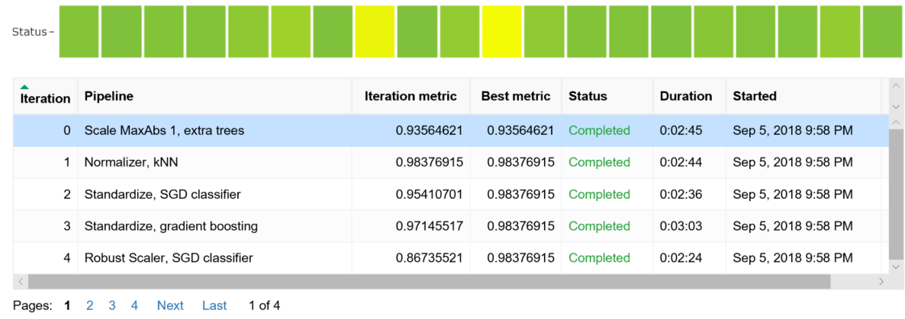
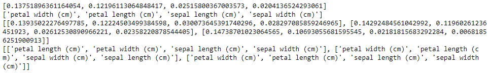

# Train models with automated machine learning in the cloud

In Azure Machine Learning, you train your model on different types of compute resources that you manage. The compute target could be a local computer or a resource in the cloud.

You can easily scale up or scale out your machine learning experiment by adding additional compute targets, such as Azure Machine Learning Compute (AmlCompute). AmlCompute is a managed-compute infrastructure that allows you to easily create a single or multi-node compute.

In this article, you learn how to build a model using automated ML with AmlCompute.

## How does remote differ from local?

The tutorial "[Train a classification model with automated machine learning](tutorial-auto-train-models.md)" teaches you how to use a local computer to train a model with automated ML. The workflow when training locally also applies to  remote targets as well. However, with remote compute, automated ML experiment iterations are executed asynchronously. This functionality allows you to cancel a particular iteration, watch the status of the execution, or continue to work on other cells in the Jupyter notebook. To train remotely, you first create a remote compute target such as AmlCompute. Then you configure the remote resource and submit your code there.

This article shows the extra steps needed to run an automated ML experiment on a remote AmlCompute target. The workspace object, `ws`, from the tutorial is used throughout the code here.

```python
ws = Workspace.from_config()
```

## Create resource

Create the AmlCompute target in your workspace (`ws`) if it doesn't already exist.

**Time estimate**: Creation of the AmlCompute target takes approximately 5 minutes.

```python
from azureml.core.compute import AmlCompute
from azureml.core.compute import ComputeTarget

amlcompute_cluster_name = "automlcl" #Name your cluster
provisioning_config = AmlCompute.provisioning_configuration(vm_size = "STANDARD_D2_V2",
                                                            # for GPU, use "STANDARD_NC6"
                                                            #vm_priority = 'lowpriority', # optional
                                                            max_nodes = 6)

compute_target = ComputeTarget.create(ws, amlcompute_cluster_name, provisioning_config)

# Can poll for a minimum number of nodes and for a specific timeout.
# If no min_node_count is provided, it will use the scale settings for the cluster.
compute_target.wait_for_completion(show_output = True, min_node_count = None, timeout_in_minutes = 20)
```

You can now use the `compute_target` object as the remote compute target.

Cluster name restrictions include:
+ Must be shorter than 64 characters.
+ Cannot include any of the following characters:
  `\` ~ ! @ # $ % ^ & * ( ) = + _ [ ] { } \\\\ | ; : \' \\" , < > / ?.`

## Access data using get_data() function

Provide the remote resource access to your training data. For automated machine learning experiments running on remote compute, the data needs to be fetched using a `get_data()` function.

To provide access, you must:
+ Create a get_data.py file containing a `get_data()` function
+ Place that file in a directory accessible as an absolute path

You can encapsulate code to read data from a blob storage or local disk in the get_data.py file. In the following code sample, the data comes from the sklearn package.

```python
# Create a project_folder if it doesn't exist
if not os.path.exists(project_folder):
    os.makedirs(project_folder)

#Write the get_data file.
%%writefile $project_folder/get_data.py

from sklearn import datasets
from scipy import sparse
import numpy as np

def get_data():

    digits = datasets.load_digits()
    X_digits = digits.data[10:,:]
    y_digits = digits.target[10:]

    return { "X" : X_digits, "y" : y_digits }
```

## Create run configuration

To make dependencies available to the get_data.py script, define a `RunConfiguration` object with defined `CondaDependencies`. Use this object for the `run_configuration` parameter in `AutoMLConfig`.

```python
from azureml.core.runconfig import RunConfiguration
from azureml.core.conda_dependencies import CondaDependencies

run_config = RunConfiguration(framework="python")
run_config.target = compute_target
run_config.environment.docker.enabled = True
run_config.environment.docker.base_image = azureml.core.runconfig.DEFAULT_CPU_IMAGE

dependencies = CondaDependencies.create(pip_packages=["scikit-learn", "scipy", "numpy"])
run_config.environment.python.conda_dependencies = dependencies
```

See this [sample notebook](https://github.com/Azure/MachineLearningNotebooks/blob/master/how-to-use-azureml/automated-machine-learning/remote-amlcompute/auto-ml-remote-amlcompute.ipynb) for an additional example of this design pattern.

## Configure experiment

Specify the settings for `AutoMLConfig`.  (See a [full list of parameters](how-to-configure-auto-train.md#configure-experiment) and their possible values.)

```python
from azureml.train.automl import AutoMLConfig
import time
import logging

automl_settings = {
    "name": "AutoML_Demo_Experiment_{0}".format(time.time()),
    "iteration_timeout_minutes": 10,
    "iterations": 20,
    "n_cross_validations": 5,
    "primary_metric": 'AUC_weighted',
    "preprocess": False,
    "max_concurrent_iterations": 10,
    "verbosity": logging.INFO
}

automl_config = AutoMLConfig(task='classification',
                             debug_log='automl_errors.log',
                             path=project_folder,
                             compute_target=compute_target,
                             run_configuration=run_config,
                             data_script=project_folder + "/get_data.py",
                             **automl_settings,
                            )
```

### Enable model explanations

Set the optional `model_explainability` parameter in the `AutoMLConfig` constructor. Additionally, a validation dataframe object must be passed as a parameter `X_valid` to use the model explainability feature.

```python
automl_config = AutoMLConfig(task='classification',
                             debug_log='automl_errors.log',
                             path=project_folder,
                             compute_target = compute_target,
                             run_configuration=run_config,
                             data_script=project_folder + "/get_data.py",
                             **automl_settings,
                             model_explainability=True,
                             X_valid = X_test
                            )
```

## Submit training experiment

Now submit the configuration to automatically select the algorithm, hyper parameters, and train the model.

```python
from azureml.core.experiment import Experiment
experiment = Experiment(ws, 'automl_remote')
remote_run = experiment.submit(automl_config, show_output=True)
```

You will see output similar to the following example:

    Running on remote compute: mydsvmParent Run ID: AutoML_015ffe76-c331-406d-9bfd-0fd42d8ab7f6
    ***********************************************************************************************
    ITERATION: The iteration being evaluated.
    PIPELINE:  A summary description of the pipeline being evaluated.
    DURATION: Time taken for the current iteration.
    METRIC: The result of computing score on the fitted pipeline.
    BEST: The best observed score thus far.
    ***********************************************************************************************

     ITERATION     PIPELINE                               DURATION                METRIC      BEST
             2      Standardize SGD classifier            0:02:36                  0.954     0.954
             7      Normalizer DT                         0:02:22                  0.161     0.954
             0      Scale MaxAbs 1 extra trees            0:02:45                  0.936     0.954
             4      Robust Scaler SGD classifier          0:02:24                  0.867     0.954
             1      Normalizer kNN                        0:02:44                  0.984     0.984
             9      Normalizer extra trees                0:03:15                  0.834     0.984
             5      Robust Scaler DT                      0:02:18                  0.736     0.984
             8      Standardize kNN                       0:02:05                  0.981     0.984
             6      Standardize SVM                       0:02:18                  0.984     0.984
            10      Scale MaxAbs 1 DT                     0:02:18                  0.077     0.984
            11      Standardize SGD classifier            0:02:24                  0.863     0.984
             3      Standardize gradient boosting         0:03:03                  0.971     0.984
            12      Robust Scaler logistic regression     0:02:32                  0.955     0.984
            14      Scale MaxAbs 1 SVM                    0:02:15                  0.989     0.989
            13      Scale MaxAbs 1 gradient boosting      0:02:15                  0.971     0.989
            15      Robust Scaler kNN                     0:02:28                  0.904     0.989
            17      Standardize kNN                       0:02:22                  0.974     0.989
            16      Scale 0/1 gradient boosting           0:02:18                  0.968     0.989
            18      Scale 0/1 extra trees                 0:02:18                  0.828     0.989
            19      Robust Scaler kNN                     0:02:32                  0.983     0.989


## Explore results

You can use the same Jupyter widget as the one in [the training tutorial](tutorial-auto-train-models.md#explore-the-results) to see a graph and table of results.

```python
from azureml.widgets import RunDetails
RunDetails(remote_run).show()
```
Here is a static image of the widget.  In the notebook, you can click on any line in the table to see run properties and output logs for that run.   You can also use the dropdown above the graph to view a graph of each available metric for each iteration.




The widget displays a URL you can use to see and explore the individual run details.

### View logs

Find logs on the DSVM under `/tmp/azureml_run/{iterationid}/azureml-logs`.

## Best model explanation

Retrieving model explanation data allows you to see detailed information about the models to increase transparency into what's running on the back-end. In this example, you run model explanations only for the best fit model. If you run for all models in the pipeline, it will result in significant run time. Model explanation information includes:

* shap_values: The explanation information generated by shap lib.
* expected_values: The expected value of the model applied to set of X_train data.
* overall_summary: The model level feature importance values sorted in descending order.
* overall_imp: The feature names sorted in the same order as in overall_summary.
* per_class_summary: The class level feature importance values sorted in descending order. Only available for the classification case.
* per_class_imp: The feature names sorted in the same order as in per_class_summary. Only available for the classification case.

Use the following code to select the best pipeline from your iterations. The `get_output` method returns the best run and the fitted model for the last fit invocation.

```python
best_run, fitted_model = remote_run.get_output()
```

Import the `retrieve_model_explanation` function and run on the best model.

```python
from azureml.train.automl.automlexplainer import retrieve_model_explanation

shap_values, expected_values, overall_summary, overall_imp, per_class_summary, per_class_imp = \
    retrieve_model_explanation(best_run)
```

Print results for the `best_run` explanation variables you want to view.

```python
print(overall_summary)
print(overall_imp)
print(per_class_summary)
print(per_class_imp)
```

Printing the `best_run` explanation summary variables results in the following output.



You can also visualize feature importance through the widget UI as well as the web UI on Azure portal inside your workspace.


## Example

The [how-to-use-azureml/automated-machine-learning/remote-amlcompute/auto-ml-remote-amlcompute.ipynb](https://github.com/Azure/MachineLearningNotebooks/blob/master/how-to-use-azureml/automated-machine-learning/remote-amlcompute/auto-ml-remote-amlcompute.ipynb) notebook demonstrates concepts in this article.

[!INCLUDE [aml-clone-in-azure-notebook](../../../includes/aml-clone-for-examples.md)]

## Next steps

Learn [how to configure settings for automatic training](how-to-configure-auto-train.md).
