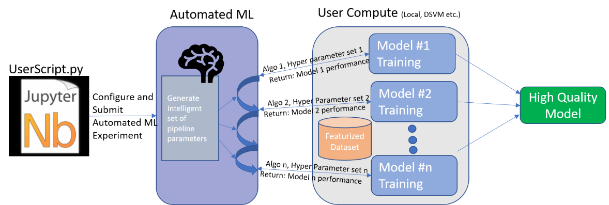

# What is automated machine learning?

In this article, you can learn about automated machine learning. The Azure Machine Learning service can automatically pick an algorithm for you, and generate a model from it. Automated machine learning helps save you time by using the parameters and criteria you provide to select the best algorithm for your model.

## How it works

1. You configure the type of machine learning problem you are trying to solve. Two categories of supervised learning are supported:
   + Classification
   + Regression

   See the [list of models](how-to-configure-auto-train.md#select-your-experiment-type) Azure Machine Learning can try when training.

1. You specify the source and format for the training data. The data must be labeled, and can be stored on your development environment or in Azure Blob Storage. If the data is stored on your development environment, it must be in the same directory as your training scripts. This directory is copied to the compute target you select for training.

    In your training script, the data can be read into Numpy arrays or a Pandas dataframe.

    You can configure split options for selecting training and validation data, or you can specify separate training and validation data sets.

1. Configure the [compute target](how-to-set-up-training-targets.md) that is used to train the model.

1. Configure the automated machine learning configuration. This controls the parameters used as Azure Machine Learning iterates over different models, hyperparameter settings, and what metrics to look at when determining the best model. 

1. Submit a training run.

During training, the Azure Machine Learning service creates a number of pipelines that try different algorithms and parameters. It will stop once it hits the iteration limit you provide, or when it reaches the target value for the metric you specify.

You can inspect the logged run information, which contains metrics gathered during the run. The training run also produces a Python serialized object (.pkl file) that contains the model and data preprocessing.

## Next steps

See examples and learn how to build models using Automated Machine Learning:

+ [Tutorial: Automatically train a classification model with Azure Automated Machine Learning](tutorial-auto-train-models.md)

+ [How to configure settings for automatic training](how-to-configure-auto-train.md)

+ [How to use automatic training on a remote resource](how-to-auto-train-remote.md) 
