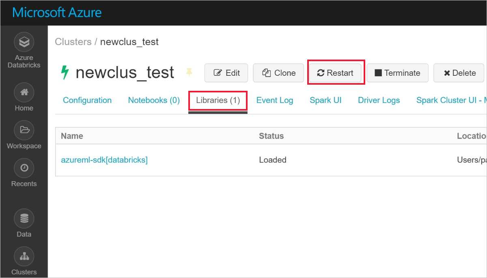

# Use the Azure Machine Learning SDK on Databricks

Use the Azure Machine Learning SDK for end to end custom machine learning on Azure Databricks. Or train your model within Databricks and use [Visual Studio Code](how-to-vscode-train-deploy.md#deploy-your-service-from-vs-code) to deploy the model

If you don’t have an Azure subscription, create a [free account](https://aka.ms/AMLfree) before you begin.

## Prepare your Databricks cluster

1. Create a [Databricks cluster](https://docs.microsoft.com/azure/azure-databricks/quickstart-create-databricks-workspace-portal). Create your Azure Databricks cluster as v4.x (high concurrency preferred) with **Python 3**. 

1. Create a library to [install and attach](https://docs.databricks.com/user-guide/libraries.html#create-a-library) the `azureml-sdk[databricks]` PyPi package to your cluster. When you are done you will see the library attached.

   

   If this step fails, you may need to restart your cluster.  In your Databricks workspace, select `Clusters` > `your-cluster-name`.  On the `Libraries` tab, select `Restart`.

   

   Be aware of these [common Databricks issues](resource-known-issues.md#databricks).

1. Download the [Azure Databricks Azure Machine Learning SDK](https://github.com/Azure/MachineLearningNotebooks/blob/master/databricks/Databricks_AMLSDK_github.dbc) Databricks notebooks archive file.

1.  [Import the archive file](https://docs.azuredatabricks.net/user-guide/notebooks/notebook-manage.html#import-an-archive) into your Databricks cluster.  

 

## Try it out

The Databricks notebooks demonstrate how to prepare data, train, and deploy a Spark ML model from within Azure Databricks using the Azure Machine Learning Python SDK. 

Use the **Databricks notebooks** to predict income based on [census data](https://archive.ics.uci.edu/ml/datasets/adult).  This notebook trains an income prediction model. The model predicts whether an individual's income is >50 K or <50 K based on demographic data.

1. Set up your development environment by running the [Installation and Configuration](https://github.com/Azure/MachineLearningNotebooks/blob/master/databricks/01.Installation_and_Configuration.ipynb) Databricks notebook to:

    * Create an Azure Machine Learning workspace
    * Save the machine learning workspace configuration

2. Prepare your data by running the [Ingest data](https://github.com/Azure/MachineLearningNotebooks/blob/master/databricks/02.Ingest_data.ipynb) notebook to download the Adult Census Income data and split it into train and test sets.

3. Build models by running the [Build model with Run History](https://github.com/Azure/MachineLearningNotebooks/blob/master/databricks/03b.Build_model_runHistory.ipynb) notebook to:

    * Prepare data using Pandas
    * Split data into train and test sets
    * Log training metrics into your machine learning workspace
    * Manually train different models with Spark MLlib
    * Find the best model from your runs

4. Deploy your model and predict from within Azure Databricks by running these notebooks:  

    1. Test the deployment on [Azure Container Instances](https://azure.microsoft.com/services/container-instances/) (ACI) by running the [Deploy to ACI](https://github.com/Azure/MachineLearningNotebooks/blob/master/databricks/04.Deploy_to_ACI.ipynb) notebook to:

        * Register your best model in the machine learning workspace
        * Provide a scoring file and a conda config file
        * Deploy the model to ACI and test the webservice

    1. Use the image you created on ACI to deploy to [Azure Kubernetes Service](https://azure.microsoft.com/services/kubernetes-service/) (AKS) for scalable web service by running the [Deploy to AKS](https://github.com/Azure/MachineLearningNotebooks/blob/master/databricks/04.Deploy_to_AKS_existingImage.ipynb) notebook to:

        * Deploy the image created in the ACI notebook to AKS as a scalable webservice
        * Monitor the deployed webservice and model in Azure portal

>[!TIP]
> You can also train your model on Databricks and then use [Visual Studio Code](how-to-vscode-train-deploy.md#deploy-your-service-from-vs-code) to deploy the model.

## Next steps

See the [Databricks notebooks on GitHub](https://github.com/Azure/MachineLearningNotebooks/tree/master/databricks).
