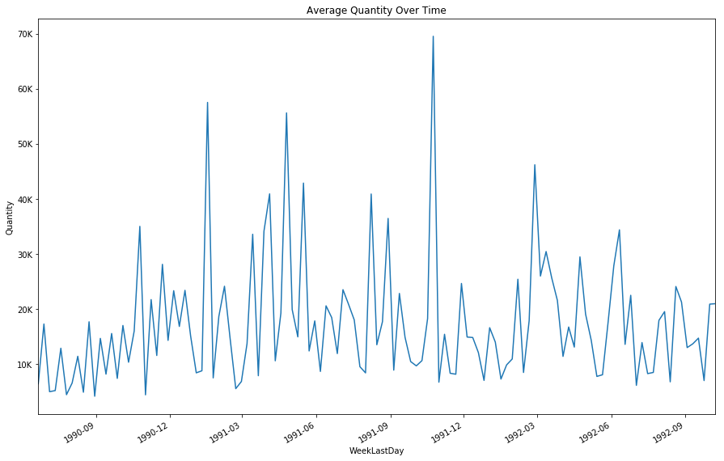
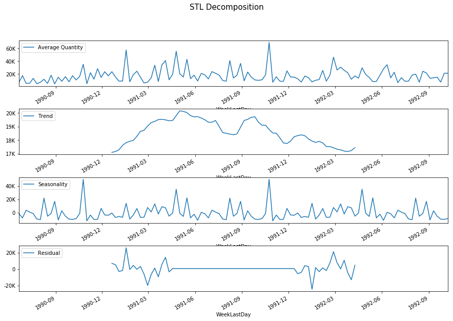
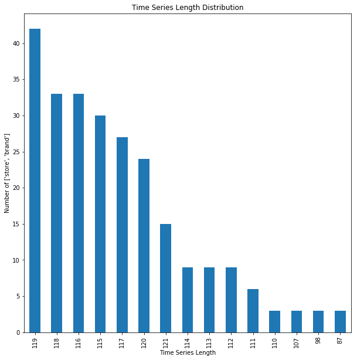

# Build and deploy forecasting models with Azure Machine Learning

In this article, learn how to use **Azure Machine Learning Package for Forecasting** (AMLPF) to quickly build and deploy a forecasting model. The workflow is as follows:

1. Load and explore data
2. Create features
3. Train and select the best model
4. Deploy the model and consume the web service

Consult the [package reference documentation](https://aka.ms/aml-packages/forecasting) for the full list of transformers and models as well as the detailed reference for each module and class.

## Prerequisites

1. If you don't have an Azure subscription, create a [free account](https://azure.microsoft.com/free/?WT.mc_id=A261C142F) before you begin.

1. The following accounts and application must be set up and installed:
   - An Azure Machine Learning Experimentation account 
   - An Azure Machine Learning Model Management account
   - Azure Machine Learning Workbench installed

   If these three are not yet created or installed, follow the [Azure Machine Learning Quickstart and Workbench installation](../service/quickstart-installation.md) article. 

1. The Azure Machine Learning Package for Forecasting must be installed. Learn how to [install this package here](https://aka.ms/aml-packages/forecasting).

## Sample data and Jupyter notebook

### Sample workflow 
The example follows the workflow:
 
1. **Ingest Data**: Load the dataset and convert it into TimeSeriesDataFrame. This dataframe is a time series data structure provided by Azure Machine Learning Package for Forecasting, herein referred to as **AMLPF**.

2. **Create Features**: Use various featurization transformers provided by AMLPF to create features.

3. **Train and Select Best Model**: Compare the performance of various univariate time series models and machine learning models. 

4. **Deploy Model**: Deploy the trained model pipeline as a web service via Azure Machine Learning Workbench so it can be consumed by others.

### Get the Jupyter notebook

Download the notebook to run the sample described here yourself.

> [!div class="nextstepaction"]
> [Get the Jupyter notebook](https://aka.ms/aml-packages/forecasting/notebooks/financial_forecasting)

### Explore the sample data

The machine learning forecasting examples herein use the [University of Chicago's Dominick's Finer Foods dataset](https://research.chicagobooth.edu/kilts/marketing-databases/dominicks) to forecast orange juice sales. Dominick's was a grocery chain in the Chicago metropolitan area.

### Import any dependencies for this sample

The following dependencies must be imported for the examples in this article.

```python
import pandas as pd
import numpy as np
import math
import pkg_resources
from datetime import timedelta
import matplotlib
matplotlib.use('agg')
from matplotlib import pyplot as plt

from sklearn.linear_model import Lasso, ElasticNet
from sklearn.ensemble import RandomForestRegressor, GradientBoostingRegressor
from sklearn.neighbors import KNeighborsRegressor

from ftk import TimeSeriesDataFrame, ForecastDataFrame, AzureMLForecastPipeline
from ftk.tsutils import last_n_periods_split

from ftk.transforms import LagLeadOperator, TimeSeriesImputer, TimeIndexFeaturizer, DropColumns
from ftk.transforms.grain_index_featurizer import GrainIndexFeaturizer
from ftk.models import Arima, SeasonalNaive, Naive, RegressionForecaster, ETS
from ftk.models.forecasterunion import ForecasterUnion
from ftk.model_selection import TSGridSearchCV, RollingOriginValidator

from azuremltkbase.deployment import AMLSettings
from ftk.operationalization.forecast_webservice_factory import ForecastWebserviceFactory
from ftk.operationalization import ScoreContext

from ftk.data import get_a_year_of_daily_weather_data
print('imports done')
```

    imports done
    

## Load data and explore

This example shows the typical process of starting with a raw data set, in this case [Dominick's Finer Foods data](https://research.chicagobooth.edu/kilts/marketing-databases/dominicks).  You can also use the convenience function `load_dominicks_oj_data`.

```python
# Load the data into a pandas DataFrame
csv_path = pkg_resources.resource_filename('ftk', 'data/dominicks_oj/dominicks_oj.csv')
whole_df = pd.read_csv(csv_path, low_memory = False)
whole_df.head()
```

<table border="1" class="dataframe">
  <thead>
    <tr style="text-align: right;">
      <th></th>
      <th>store</th>
      <th>brand</th>
      <th>week</th>
      <th>logmove</th>
      <th>feat</th>
      <th>price</th>
      <th>AGE60</th>
      <th>EDUC</th>
      <th>ETHNIC</th>
      <th>INCOME</th>
      <th>HHLARGE</th>
      <th>WORKWOM</th>
      <th>HVAL150</th>
      <th>SSTRDIST</th>
      <th>SSTRVOL</th>
      <th>CPDIST5</th>
      <th>CPWVOL5</th>
    </tr>
  </thead>
  <tbody>
    <tr>
      <th>0</th>
      <td>2</td>
      <td>tropicana</td>
      <td>40</td>
      <td>9.02</td>
      <td>0</td>
      <td>3.87</td>
      <td>0.23</td>
      <td>0.25</td>
      <td>0.11</td>
      <td>10.55</td>
      <td>0.10</td>
      <td>0.30</td>
      <td>0.46</td>
      <td>2.11</td>
      <td>1.14</td>
      <td>1.93</td>
      <td>0.38</td>
    </tr>
    <tr>
      <th>1</th>
      <td>2</td>
      <td>tropicana</td>
      <td>46</td>
      <td>8.72</td>
      <td>0</td>
      <td>3.87</td>
      <td>0.23</td>
      <td>0.25</td>
      <td>0.11</td>
      <td>10.55</td>
      <td>0.10</td>
      <td>0.30</td>
      <td>0.46</td>
      <td>2.11</td>
      <td>1.14</td>
      <td>1.93</td>
      <td>0.38</td>
    </tr>
    <tr>
      <th>2</th>
      <td>2</td>
      <td>tropicana</td>
      <td>47</td>
      <td>8.25</td>
      <td>0</td>
      <td>3.87</td>
      <td>0.23</td>
      <td>0.25</td>
      <td>0.11</td>
      <td>10.55</td>
      <td>0.10</td>
      <td>0.30</td>
      <td>0.46</td>
      <td>2.11</td>
      <td>1.14</td>
      <td>1.93</td>
      <td>0.38</td>
    </tr>
    <tr>
      <th>3</th>
      <td>2</td>
      <td>tropicana</td>
      <td>48</td>
      <td>8.99</td>
      <td>0</td>
      <td>3.87</td>
      <td>0.23</td>
      <td>0.25</td>
      <td>0.11</td>
      <td>10.55</td>
      <td>0.10</td>
      <td>0.30</td>
      <td>0.46</td>
      <td>2.11</td>
      <td>1.14</td>
      <td>1.93</td>
      <td>0.38</td>
    </tr>
    <tr>
      <th>4</th>
      <td>2</td>
      <td>tropicana</td>
      <td>50</td>
      <td>9.09</td>
      <td>0</td>
      <td>3.87</td>
      <td>0.23</td>
      <td>0.25</td>
      <td>0.11</td>
      <td>10.55</td>
      <td>0.10</td>
      <td>0.30</td>
      <td>0.46</td>
      <td>2.11</td>
      <td>1.14</td>
      <td>1.93</td>
      <td>0.38</td>
    </tr>
  </tbody>
</table>

The data consist of weekly sales by brand and store. The logarithm of the quantity sold is in the 'logmove' column. The data also includes some customer demographic features. 

To model the time series, you need to extract the following elements from this dataframe: a date/time axis and the sales quantity to be forecast.

```python
# The sales are contained in the 'logmove' column. 
# Values are logarithmic, so exponentiate and round them to get quantity sold

def expround(x):
    return math.floor(math.exp(x) + 0.5)
whole_df['Quantity'] = whole_df['logmove'].apply(expround)

# The time axis is in the 'week' column
# This is the week offset from the week of 1989-09-07 through 1989-09-13 inclusive
# Create new datetime columns containing the start and end of each week period

weekZeroStart = pd.to_datetime('1989-09-07 00:00:00')
weekZeroEnd = pd.to_datetime('1989-09-13 23:59:59')
whole_df['WeekFirstDay'] = whole_df['week'].apply(lambda n: weekZeroStart + timedelta(weeks=n))
whole_df['WeekLastDay'] = whole_df['week'].apply(lambda n: weekZeroEnd + timedelta(weeks=n))
whole_df[['store','brand','WeekLastDay','Quantity']].head()
```

<table border="1" class="dataframe">
  <thead>
    <tr style="text-align: right;">
      <th></th>
      <th>store</th>
      <th>brand</th>
      <th>WeekLastDay</th>
      <th>Quantity</th>
    </tr>
  </thead>
  <tbody>
    <tr>
      <th>0</th>
      <td>2</td>
      <td>tropicana</td>
      <td>1990-06-20 23:59:59</td>
      <td>8256</td>
    </tr>
    <tr>
      <th>1</th>
      <td>2</td>
      <td>tropicana</td>
      <td>1990-08-01 23:59:59</td>
      <td>6144</td>
    </tr>
    <tr>
      <th>2</th>
      <td>2</td>
      <td>tropicana</td>
      <td>1990-08-08 23:59:59</td>
      <td>3840</td>
    </tr>
    <tr>
      <th>3</th>
      <td>2</td>
      <td>tropicana</td>
      <td>1990-08-15 23:59:59</td>
      <td>8000</td>
    </tr>
    <tr>
      <th>4</th>
      <td>2</td>
      <td>tropicana</td>
      <td>1990-08-29 23:59:59</td>
      <td>8896</td>
    </tr>
  </tbody>
</table>


The data contains approximately 250 different combinations of store and brand in a data frame. Each combination defines its own time series of sales. You can use the time series [TimeSeriesDataFrame class](https://docs.microsoft.com/python/api/ftk.dataframets.timeseriesdataframe) to conveniently model multiple series in one data structure using the _grain_. The grain is specified by the `store` and `brand` columns.

```python
nseries = whole_df.groupby(['store', 'brand']).ngroups
print('{} time series in the data frame.'.format(nseries))
```

    249 time series in the data frame.
    


The difference between _grain_ and _group_ is that grain is always physically meaningful in the real world, while group doesn't have to be. Internal package functions use group to build a single model from multiple time series if the user believes this grouping helps improve model performance. By default, group is set to be equal to grain, and a single model is built for each grain. 


```python
# Create a TimeSeriesDataFrame
# Use end of period as the time index
# Store and brand combinations label the grain 
# i.e. there is one time series for each unique pair of store and grain
whole_tsdf = TimeSeriesDataFrame(whole_df, 
                                 grain_colnames=['store', 'brand'],
                                 time_colname='WeekLastDay', 
                                 ts_value_colname='Quantity',
                                 group_colnames='store')

whole_tsdf[['Quantity']].head()
```


<table border="1" class="dataframe">
  <thead>
    <tr style="text-align: right;">
      <th></th>
      <th></th>
      <th></th>
      <th>Quantity</th>
    </tr>
    <tr>
      <th>WeekLastDay</th>
      <th>store</th>
      <th>brand</th>
      <th></th>
    </tr>
  </thead>
  <tbody>
    <tr>
      <th>1990-06-20 23:59:59</th>
      <th>2</th>
      <th>tropicana</th>
      <td>8256</td>
    </tr>
    <tr>
      <th>1990-08-01 23:59:59</th>
      <th>2</th>
      <th>tropicana</th>
      <td>6144</td>
    </tr>
    <tr>
      <th>1990-08-08 23:59:59</th>
      <th>2</th>
      <th>tropicana</th>
      <td>3840</td>
    </tr>
    <tr>
      <th>1990-08-15 23:59:59</th>
      <th>2</th>
      <th>tropicana</th>
      <td>8000</td>
    </tr>
    <tr>
      <th>1990-08-29 23:59:59</th>
      <th>2</th>
      <th>tropicana</th>
      <td>8896</td>
    </tr>
  </tbody>
</table>


In the TimeSeriesDataFrame representation, the time axis and grain are now part of the data frame index, and allows easy access to Pandas datetime slicing functionality.


```python
# sort so we can slice
whole_tsdf.sort_index(inplace=True)

# Get sales of dominick's brand orange juice from store 2 during summer 1990
whole_tsdf.loc[pd.IndexSlice['1990-06':'1990-09', 2, 'dominicks'], ['Quantity']]
```

<table border="1" class="dataframe">
  <thead>
    <tr style="text-align: right;">
      <th></th>
      <th></th>
      <th></th>
      <th>Quantity</th>
    </tr>
    <tr>
      <th>WeekLastDay</th>
      <th>store</th>
      <th>brand</th>
      <th></th>
    </tr>
  </thead>
  <tbody>
    <tr>
      <th>1990-06-20 23:59:59</th>
      <th>2</th>
      <th>dominicks</th>
      <td>10560</td>
    </tr>
    <tr>
      <th>1990-08-01 23:59:59</th>
      <th>2</th>
      <th>dominicks</th>
      <td>8000</td>
    </tr>
    <tr>
      <th>1990-08-08 23:59:59</th>
      <th>2</th>
      <th>dominicks</th>
      <td>6848</td>
    </tr>
    <tr>
      <th>1990-08-15 23:59:59</th>
      <th>2</th>
      <th>dominicks</th>
      <td>2880</td>
    </tr>
    <tr>
      <th>1990-08-29 23:59:59</th>
      <th>2</th>
      <th>dominicks</th>
      <td>1600</td>
    </tr>
    <tr>
      <th>1990-09-05 23:59:59</th>
      <th>2</th>
      <th>dominicks</th>
      <td>25344</td>
    </tr>
    <tr>
      <th>1990-09-12 23:59:59</th>
      <th>2</th>
      <th>dominicks</th>
      <td>10752</td>
    </tr>
    <tr>
      <th>1990-09-19 23:59:59</th>
      <th>2</th>
      <th>dominicks</th>
      <td>6656</td>
    </tr>
    <tr>
      <th>1990-09-26 23:59:59</th>
      <th>2</th>
      <th>dominicks</th>
      <td>6592</td>
    </tr>
  </tbody>
</table>


The ```TimeSeriesDataFrame.ts_report()``` function generates a comprehensive report of the time series data frame. The report includes both a general data description as well as statistics specific to time series data. 


```python
%matplotlib inline
whole_tsdf.ts_report()
```

    --------------------------------  Data Overview  ---------------------------------
    <class 'ftk.dataframets.TimeSeriesDataFrame'>
    MultiIndex: 28947 entries, (1990-06-20 23:59:59, 2, dominicks) to (1992-10-07 23:59:59, 137, tropicana)
    Data columns (total 17 columns):
    week            28947 non-null int64
    logmove         28947 non-null float64
    feat            28947 non-null int64
    price           28947 non-null float64
    AGE60           28947 non-null float64
    EDUC            28947 non-null float64
    ETHNIC          28947 non-null float64
    INCOME          28947 non-null float64
    HHLARGE         28947 non-null float64
    WORKWOM         28947 non-null float64
    HVAL150         28947 non-null float64
    SSTRDIST        28947 non-null float64
    SSTRVOL         28947 non-null float64
    CPDIST5         28947 non-null float64
    CPWVOL5         28947 non-null float64
    Quantity        28947 non-null int64
    WeekFirstDay    28947 non-null datetime64[ns]
    dtypes: datetime64[ns](1), float64(13), int64(3)
    memory usage: 3.8+ MB
    --------------------------  Numerical Variable Summary  --------------------------
              week  logmove     feat    price    AGE60     EDUC   ETHNIC   INCOME  \
    count 28947.00 28947.00 28947.00 28947.00 28947.00 28947.00 28947.00 28947.00   
    mean    100.46     9.17     0.24     2.28     0.17     0.23     0.16    10.62   
    std      34.69     1.02     0.43     0.65     0.06     0.11     0.19     0.28   
    min      40.00     4.16     0.00     0.52     0.06     0.05     0.02     9.87   
    25%      70.00     8.49     0.00     1.79     0.12     0.15     0.04    10.46   
    50%     101.00     9.03     0.00     2.17     0.17     0.23     0.07    10.64   
    75%     130.00     9.76     0.00     2.73     0.21     0.28     0.19    10.80   
    max     160.00    13.48     1.00     3.87     0.31     0.53     1.00    11.24   
    
           HHLARGE  WORKWOM  HVAL150  SSTRDIST  SSTRVOL  CPDIST5  CPWVOL5  \
    count 28947.00 28947.00 28947.00  28947.00 28947.00 28947.00 28947.00   
    mean      0.12     0.36     0.34      5.10     1.21     2.12     0.44   
    std       0.03     0.05     0.24      3.47     0.53     0.73     0.22   
    min       0.01     0.24     0.00      0.13     0.40     0.77     0.09   
    25%       0.10     0.31     0.12      2.77     0.73     1.63     0.27   
    50%       0.11     0.36     0.35      4.65     1.12     1.96     0.38   
    75%       0.14     0.40     0.53      6.65     1.54     2.53     0.56   
    max       0.22     0.47     0.92     17.86     2.57     4.11     1.14   
    
           Quantity  
    count  28947.00  
    mean   17312.21  
    std    27477.66  
    min       64.00  
    25%     4864.00  
    50%     8384.00  
    75%    17408.00  
    max   716416.00  
    ------------------------  Non-Numerical Variable Summary  -----------------------
                   WeekFirstDay
    count                 28947
    unique                  121
    top     1992-03-12 00:00:00
    freq                    249
    first   1990-06-14 00:00:00
    last    1992-10-01 00:00:00
    ------------------------------  Time Series Summary  -----------------------------
    Number of time series                 249
    Minimum time                    1990-06-20 23:59:59
    Maximum time                    1992-10-07 23:59:59
    
    Inferred frequencies
    Number of ['store', 'brand']s with frequency W-WED     249
    Use get_frequency_dict() method to explore ['store', 'brand']s with unusual frequency and clean data
    
    Detected seasonalities
    Number of ['store', 'brand']s with seasonality 1         190
    Number of ['store', 'brand']s with seasonality 15        15
    Number of ['store', 'brand']s with seasonality 14        11
    Number of ['store', 'brand']s with seasonality 7         9
    Number of ['store', 'brand']s with seasonality 6         8
    Number of ['store', 'brand']s with seasonality 8         5
    Number of ['store', 'brand']s with seasonality 2         4
    Number of ['store', 'brand']s with seasonality 23        2
    Number of ['store', 'brand']s with seasonality 3         1
    Number of ['store', 'brand']s with seasonality 11        1
    Number of ['store', 'brand']s with seasonality 12        1
    Number of ['store', 'brand']s with seasonality 13        1
    Number of ['store', 'brand']s with seasonality 47        1
    Use get_seasonality_dict() method to explore ['store', 'brand']s with unusual seasonality and clean data
    -----------------------------  Value Column Summary  -----------------------------
    Value column                        Quantity
    Percentage of missing values        0.00
    Percentage of zero values           0.00
    Mean coefficient of variation       31688.52
    Median coefficient of variation     24000.20
    Minimum coefficient of variation    ['store', 'brand'] (48, 'tropicana'): 4475.53
    Maximum coefficient of variation    ['store', 'brand'] (111, 'dominicks'): 193333.55
    ------------------------------  Correlation Matrix  ------------------------------
        week  logmove  feat  price  AGE60  EDUC  ETHNIC  INCOME  HHLARGE  WORKWOM  \
    0   1.00     0.10  0.04  -0.21  -0.01  0.01    0.00    0.00     0.01    -0.00   
    1   0.10     1.00  0.54  -0.43   0.09  0.00    0.06   -0.04    -0.06    -0.08   
    2   0.04     0.54  1.00  -0.29  -0.00  0.00    0.00   -0.00    -0.00     0.00   
    3  -0.21    -0.43 -0.29   1.00   0.04  0.02    0.04   -0.03    -0.04    -0.02   
    4  -0.01     0.09 -0.00   0.04   1.00 -0.31   -0.09   -0.15    -0.32    -0.63   
    5   0.01     0.00  0.00   0.02  -0.31  1.00   -0.34    0.66    -0.39     0.56   
    6   0.00     0.06  0.00   0.04  -0.09 -0.34    1.00   -0.72     0.25    -0.29   
    7   0.00    -0.04 -0.00  -0.03  -0.15  0.66   -0.72    1.00    -0.08     0.40   
    8   0.01    -0.06 -0.00  -0.04  -0.32 -0.39    0.25   -0.08     1.00    -0.28   
    9  -0.00    -0.08  0.00  -0.02  -0.63  0.56   -0.29    0.40    -0.28     1.00   
    10  0.01     0.02  0.00   0.04  -0.11  0.89   -0.42    0.64    -0.48     0.45   
    11  0.01    -0.00  0.00   0.08   0.07 -0.12    0.54   -0.41     0.06    -0.19   
    12 -0.01    -0.09 -0.00   0.03  -0.05 -0.13    0.23   -0.26     0.04    -0.06   
    13 -0.01     0.02 -0.00  -0.06   0.09 -0.20   -0.22    0.21     0.19    -0.13   
    14 -0.00    -0.12 -0.00  -0.01  -0.09  0.28   -0.38    0.36    -0.20     0.37   
    15  0.03     0.76  0.47  -0.36   0.08 -0.04    0.11   -0.08    -0.00    -0.10   
    
        HVAL150  SSTRDIST  SSTRVOL  CPDIST5  CPWVOL5  Quantity  
    0      0.01      0.01    -0.01    -0.01    -0.00      0.03  
    1      0.02     -0.00    -0.09     0.02    -0.12      0.76  
    2      0.00      0.00    -0.00    -0.00    -0.00      0.47  
    3      0.04      0.08     0.03    -0.06    -0.01     -0.36  
    4     -0.11      0.07    -0.05     0.09    -0.09      0.08  
    5      0.89     -0.12    -0.13    -0.20     0.28     -0.04  
    6     -0.42      0.54     0.23    -0.22    -0.38      0.11  
    7      0.64     -0.41    -0.26     0.21     0.36     -0.08  
    8     -0.48      0.06     0.04     0.19    -0.20     -0.00  
    9      0.45     -0.19    -0.06    -0.13     0.37     -0.10  
    10     1.00     -0.17    -0.24    -0.22     0.27     -0.04  
    11    -0.17      1.00     0.17    -0.11    -0.40      0.06  
    12    -0.24      0.17     1.00    -0.05     0.36     -0.02  
    13    -0.22     -0.11    -0.05     1.00     0.02     -0.00  
    14     0.27     -0.40     0.36     0.02     1.00     -0.11  
    15    -0.04      0.06    -0.02    -0.00    -0.11      1.00  
    You may call TimeSeriesDataFrame.plot_scatter_matrix() to get a correlation matrix plot. However, this
    is not recommended if your data is big.
    











## Integrate with external data

Sometimes it's useful to integrate external data as additional features for forecasting. Use weather data as an example to understand how to join TimeSeriesDataFrame with external data.


```python
# Load weather data
weather_1990 = get_a_year_of_daily_weather_data(year=1990)
weather_1991 = get_a_year_of_daily_weather_data(year=1991)
weather_1992 = get_a_year_of_daily_weather_data(year=1992)

# Preprocess weather data
weather_all = pd.concat([weather_1990, weather_1991, weather_1992])
weather_all.reset_index(inplace=True)

# Only use a subset of columns
weather_all = weather_all[['TEMP', 'DEWP', 'WDSP', 'PRCP']]

# Compute the WeekLastDay column, in order to merge with sales data
weather_all['WeekLastDay'] = pd.Series(
    weather_all.time_index - weekZeroStart, 
    index=weather_all.time_index).apply(lambda n: weekZeroEnd + timedelta(weeks=math.floor(n.days/7)))

# Resample daily weather data to weekly data
weather_all = weather_all.groupby('WeekLastDay').mean()

# Set WeekLastDay as new time index
weather_all = TimeSeriesDataFrame(weather_all, time_colname='WeekLastDay')

# Merge weather data with sales data
whole_tsdf = whole_tsdf.merge(weather_all, how='left', on='WeekLastDay')
whole_tsdf.head()
```

<table border="1" class="dataframe">
  <thead>
    <tr style="text-align: right;">
      <th></th>
      <th></th>
      <th></th>
      <th>week</th>
      <th>logmove</th>
      <th>feat</th>
      <th>price</th>
      <th>AGE60</th>
      <th>EDUC</th>
      <th>ETHNIC</th>
      <th>INCOME</th>
      <th>HHLARGE</th>
      <th>WORKWOM</th>
      <th>...</th>
      <th>SSTRDIST</th>
      <th>SSTRVOL</th>
      <th>CPDIST5</th>
      <th>CPWVOL5</th>
      <th>Quantity</th>
      <th>WeekFirstDay</th>
      <th>TEMP</th>
      <th>DEWP</th>
      <th>WDSP</th>
      <th>PRCP</th>
    </tr>
    <tr>
      <th>WeekLastDay</th>
      <th>store</th>
      <th>brand</th>
      <th></th>
      <th></th>
      <th></th>
      <th></th>
      <th></th>
      <th></th>
      <th></th>
      <th></th>
      <th></th>
      <th></th>
      <th></th>
      <th></th>
      <th></th>
      <th></th>
      <th></th>
      <th></th>
      <th></th>
      <th></th>
      <th></th>
      <th></th>
      <th></th>
    </tr>
  </thead>
  <tbody>
    <tr>
      <th rowspan="5" valign="top">1990-06-20 23:59:59</th>
      <th rowspan="3" valign="top">2</th>
      <th>dominicks</th>
      <td>40</td>
      <td>9.26</td>
      <td>1</td>
      <td>1.59</td>
      <td>0.23</td>
      <td>0.25</td>
      <td>0.11</td>
      <td>10.55</td>
      <td>0.10</td>
      <td>0.30</td>
      <td>...</td>
      <td>2.11</td>
      <td>1.14</td>
      <td>1.93</td>
      <td>0.38</td>
      <td>10560</td>
      <td>1990-06-14</td>
      <td>72.00</td>
      <td>61.87</td>
      <td>9.74</td>
      <td>0.19</td>
    </tr>
    <tr>
      <th>minute.maid</th>
      <td>40</td>
      <td>8.41</td>
      <td>0</td>
      <td>3.17</td>
      <td>0.23</td>
      <td>0.25</td>
      <td>0.11</td>
      <td>10.55</td>
      <td>0.10</td>
      <td>0.30</td>
      <td>...</td>
      <td>2.11</td>
      <td>1.14</td>
      <td>1.93</td>
      <td>0.38</td>
      <td>4480</td>
      <td>1990-06-14</td>
      <td>72.00</td>
      <td>61.87</td>
      <td>9.74</td>
      <td>0.19</td>
    </tr>
    <tr>
      <th>tropicana</th>
      <td>40</td>
      <td>9.02</td>
      <td>0</td>
      <td>3.87</td>
      <td>0.23</td>
      <td>0.25</td>
      <td>0.11</td>
      <td>10.55</td>
      <td>0.10</td>
      <td>0.30</td>
      <td>...</td>
      <td>2.11</td>
      <td>1.14</td>
      <td>1.93</td>
      <td>0.38</td>
      <td>8256</td>
      <td>1990-06-14</td>
      <td>72.00</td>
      <td>61.87</td>
      <td>9.74</td>
      <td>0.19</td>
    </tr>
    <tr>
      <th rowspan="2" valign="top">5</th>
      <th>dominicks</th>
      <td>40</td>
      <td>7.49</td>
      <td>1</td>
      <td>1.59</td>
      <td>0.12</td>
      <td>0.32</td>
      <td>0.05</td>
      <td>10.92</td>
      <td>0.10</td>
      <td>0.41</td>
      <td>...</td>
      <td>3.80</td>
      <td>0.68</td>
      <td>1.60</td>
      <td>0.74</td>
      <td>1792</td>
      <td>1990-06-14</td>
      <td>72.00</td>
      <td>61.87</td>
      <td>9.74</td>
      <td>0.19</td>
    </tr>
    <tr>
      <th>minute.maid</th>
      <td>40</td>
      <td>8.35</td>
      <td>0</td>
      <td>2.99</td>
      <td>0.12</td>
      <td>0.32</td>
      <td>0.05</td>
      <td>10.92</td>
      <td>0.10</td>
      <td>0.41</td>
      <td>...</td>
      <td>3.80</td>
      <td>0.68</td>
      <td>1.60</td>
      <td>0.74</td>
      <td>4224</td>
      <td>1990-06-14</td>
      <td>72.00</td>
      <td>61.87</td>
      <td>9.74</td>
      <td>0.19</td>
    </tr>
  </tbody>
</table>


## Data preprocessing - impute missing values

Start by splitting the data into training and testing sets. The testing set will contain the last 40 observations of each time series. To create the split, use [this utility function](https://docs.microsoft.com/python/api/ftk.tsutils), ```ftk.tsutils.last_n_periods_split```:


```python
train_tsdf, test_tsdf = last_n_periods_split(whole_tsdf, 40)
```

Basic time series models require contiguous time series. Check to see if the series are regular, meaning that they have a time index sampled at regular intervals, with the [`check_regularity_by_grain`](https://docs.microsoft.compython/api/ftk.dataframets.timeseriesdataframe) function.


```python
ts_regularity = train_tsdf.check_regularity_by_grain()
print(ts_regularity[ts_regularity['regular'] == False])
```

                                              problems  regular
    store brand                                                
    2     dominicks    [Irregular datetime gaps exist]    False
          minute.maid  [Irregular datetime gaps exist]    False
          tropicana    [Irregular datetime gaps exist]    False
    5     dominicks    [Irregular datetime gaps exist]    False
          minute.maid  [Irregular datetime gaps exist]    False
          tropicana    [Irregular datetime gaps exist]    False
    8     dominicks    [Irregular datetime gaps exist]    False
          minute.maid  [Irregular datetime gaps exist]    False
          tropicana    [Irregular datetime gaps exist]    False
    9     dominicks    [Irregular datetime gaps exist]    False
          minute.maid  [Irregular datetime gaps exist]    False
          tropicana    [Irregular datetime gaps exist]    False
    12    dominicks    [Irregular datetime gaps exist]    False
          minute.maid  [Irregular datetime gaps exist]    False
          tropicana    [Irregular datetime gaps exist]    False
    14    dominicks    [Irregular datetime gaps exist]    False
          minute.maid  [Irregular datetime gaps exist]    False
          tropicana    [Irregular datetime gaps exist]    False
    18    dominicks    [Irregular datetime gaps exist]    False
          minute.maid  [Irregular datetime gaps exist]    False
          tropicana    [Irregular datetime gaps exist]    False
    21    dominicks    [Irregular datetime gaps exist]    False
          minute.maid  [Irregular datetime gaps exist]    False
          tropicana    [Irregular datetime gaps exist]    False
    28    dominicks    [Irregular datetime gaps exist]    False
          minute.maid  [Irregular datetime gaps exist]    False
          tropicana    [Irregular datetime gaps exist]    False
    33    dominicks    [Irregular datetime gaps exist]    False
          minute.maid  [Irregular datetime gaps exist]    False
          tropicana    [Irregular datetime gaps exist]    False
    ...                                            ...      ...
    119   dominicks    [Irregular datetime gaps exist]    False
          minute.maid  [Irregular datetime gaps exist]    False
          tropicana    [Irregular datetime gaps exist]    False
    121   dominicks    [Irregular datetime gaps exist]    False
          minute.maid  [Irregular datetime gaps exist]    False
          tropicana    [Irregular datetime gaps exist]    False
    123   dominicks    [Irregular datetime gaps exist]    False
          minute.maid  [Irregular datetime gaps exist]    False
          tropicana    [Irregular datetime gaps exist]    False
    126   dominicks    [Irregular datetime gaps exist]    False
          minute.maid  [Irregular datetime gaps exist]    False
          tropicana    [Irregular datetime gaps exist]    False
    128   dominicks    [Irregular datetime gaps exist]    False
          minute.maid  [Irregular datetime gaps exist]    False
          tropicana    [Irregular datetime gaps exist]    False
    129   dominicks    [Irregular datetime gaps exist]    False
          minute.maid  [Irregular datetime gaps exist]    False
          tropicana    [Irregular datetime gaps exist]    False
    130   dominicks    [Irregular datetime gaps exist]    False
          minute.maid  [Irregular datetime gaps exist]    False
          tropicana    [Irregular datetime gaps exist]    False
    131   dominicks    [Irregular datetime gaps exist]    False
          minute.maid  [Irregular datetime gaps exist]    False
          tropicana    [Irregular datetime gaps exist]    False
    134   dominicks    [Irregular datetime gaps exist]    False
          minute.maid  [Irregular datetime gaps exist]    False
          tropicana    [Irregular datetime gaps exist]    False
    137   dominicks    [Irregular datetime gaps exist]    False
          minute.maid  [Irregular datetime gaps exist]    False
          tropicana    [Irregular datetime gaps exist]    False
    
    [213 rows x 2 columns]
    

You can see that most of the series (213 of them) aren't regular. An [imputation transform](https://docs.microsoft.com/python/api/ftk.transforms.tsimputer.timeseriesimputer) is required to fill missing sales quantity values. There are many imputation options, but you can use a linear interpolation here.


```python
# Use a TimeSeriesImputer to linearly interpolate missing values
imputer = TimeSeriesImputer(input_column='Quantity', 
                            option='interpolate',
                            method='linear',
                            freq='W-WED')

train_imputed_tsdf = imputer.transform(train_tsdf)
```

Now all series have a regular frequency:


```python
ts_regularity_imputed = train_imputed_tsdf.check_regularity_by_grain()
print(ts_regularity_imputed[ts_regularity_imputed['regular'] == False])
```

    Empty DataFrame
    Columns: [problems, regular]
    Index: []
    

## Univariate Time Series Models

Now that you have cleaned up the data, you can begin modeling.  Start by creating three univariate models: the "naive" model, the "seasonal naive" model, and an "ARIMA" model.
* The Naive forecasting algorithm uses the actual target variable value of the last period as the forecasted value of the current period.

* The Seasonal Naive algorithm uses the actual target variable value of the same time point of the previous season as the forecasted value of the current time point. Some examples: use the actual value of the same month of last year to forecast months of the current year; use the same hour of yesterday to forecast hours today. 

* The exponential smoothing (ETS) algorithm generates forecasts by computing the weighted averages of past observations, with the weights decaying exponentially as the observations get older. 

* The AutoRegressive Integrated Moving Average (ARIMA) algorithm captures the autocorrelation in time series data. For more information about ARIMA, see [this link](https://en.wikipedia.org/wiki/Autoregressive_integrated_moving_average)

Start by setting certain model parameters based on your data exploration. 


```python
oj_series_freq = 'W-WED'
oj_series_seasonality = 52
```

### Initialize Models


```python
# Initialize naive model.
naive_model = Naive(freq=oj_series_freq)

# Initialize seasonal naive model. 
seasonal_naive_model = SeasonalNaive(freq=oj_series_freq, 
                                     seasonality=oj_series_seasonality)

# Initialize ETS model.
ets_model = ETS(freq=oj_series_freq, seasonality=oj_series_seasonality)

# Initialize ARIMA(p,d,q) model.
arima_order = [2, 1, 0]
arima_model = Arima(oj_series_freq, arima_order)
```

### Combine Multiple Models

The [`ForecasterUnion` estimator](https://docs.microsoft.com/python/api/ftk.models.forecasterunion.forecasterunion) allows you to combine multiple estimators and fit/predict on them using one line of code.


```python
forecaster_union = ForecasterUnion(
    forecaster_list=[('naive', naive_model), ('seasonal_naive', seasonal_naive_model), 
                     ('ets', ets_model)]) 
```

### Fit and Predict
The estimators in AMLPF follow the same API as scikit-learn estimators: a fit method for model training and a predict method for generating forecasts. 

**Train models**  
Since these models are all univariate models, one model is fit to each grain of the data. Using AMLPF, all 249 models can be fit with just one function call.


```python
forecaster_union_fitted = forecaster_union.fit(train_imputed_tsdf)
arima_model_fitted = arima_model.fit(train_imputed_tsdf)
```

**Forecast sales on test data**  
Similar to the fit method, you can create predictions for all 249 series in the testing data set with one call to the `predict` function. 


```python
forecaster_union_prediction = forecaster_union_fitted.predict(test_tsdf, retain_feature_column=True)
arima_prediction= arima_model_fitted.predict(test_tsdf)
```

**Evaluate model performance**   
Now you can calculate the forecast errors on the test set. You can use the mean absolute percentage error (MAPE) here. MAPE is the mean absolute error relative to the actual sales values. The ```calc_error``` function provides a few built-in functions for commonly used error metrics. You can also define your custom error function and pass it to the ```err_fun``` argument.


```python
forecaster_union_error = forecaster_union_prediction.calc_error(err_name='MAPE', by='ModelName')
arima_error = pd.DataFrame({'ModelName': 'arima','MAPE': arima_prediction.calc_error(err_name='MAPE')}, 
                           index=[len(forecaster_union_error)])

all_model_errors = pd.concat([forecaster_union_error, arima_error])
print(all_model_errors)
```

        MAPE       ModelName
    0 187.89             ets
    1 103.57           naive
    2 180.54  seasonal_naive
    3 126.57           arima
    

It's valuable to see the distribution of these errors over the 250 time series in the data. To see the distribution of errors, calculate errors for each series using the `by` argument in `calc_error` and then create a box plot to visualize them.


```python
# Compute MAPE by grain for each model
forecaster_union_error_bygrain = forecaster_union_prediction.calc_error(err_name='MAPE',
                                                                        by=['ModelName'] + test_tsdf.grain_colnames)
arima_error_bygrain = arima_prediction.calc_error(err_name='MAPE', 
                                                  by=test_tsdf.grain_colnames)
arima_error_bygrain['ModelName'] = 'arima'

error_bygrain_univariate = pd.concat([forecaster_union_error_bygrain, arima_error_bygrain])

# Display a boxplot to visualize the forecast error distributions
error_bygrain_univariate[['ModelName', 'MAPE']].groupby('ModelName').boxplot(subplots=False, figsize=[10, 8])
```


    <matplotlib.axes._subplots.AxesSubplot at 0x15b5d60d4a8>


Overall, the Naive model seems to make better forecasts despite some outliers, which are less accurate. 

## Build machine learning models
In addition to traditional univariate models, Azure Machine Learning Package for Forecasting enables users to create machine learning models as well. 
You begin by creating features for modeling.

### Feature Engineering
**Transformers**   
The package provides many transformers for time series data preprocessing and featurization. The examples that follow demonstrate some of the preprocessing and featurization functionality.


```python
# DropColumns: Drop columns that should not be included for modeling. `logmove` is the log of the number of 
# units sold, so providing this number would be cheating. `WeekFirstDay` would be 
# redundant since we already have a feature for the last day of the week.
columns_to_drop = ['logmove', 'WeekFirstDay', 'week']
column_dropper = DropColumns(columns_to_drop)

# TimeSeriesImputer: Fill missing values in the features
# First, we need to create a dictionary with key as column names and value as values used to fill missing 
# values for that column. We are going to use the mean to fill missing values for each column.
columns_with_missing_values = train_imputed_tsdf.columns[pd.DataFrame(train_imputed_tsdf).isnull().any()].tolist()
columns_with_missing_values = [c for c in columns_with_missing_values if c not in columns_to_drop]
missing_value_imputation_dictionary = {}
for c in columns_with_missing_values:
    missing_value_imputation_dictionary[c] = train_imputed_tsdf[c].mean()
fillna_imputer = TimeSeriesImputer(option='fillna', 
                                   input_column=columns_with_missing_values,
                                   value=missing_value_imputation_dictionary)

# TimeIndexFeaturizer: extract temporal features from timestamps
time_index_featurizer = TimeIndexFeaturizer(correlation_cutoff=0.1, overwrite_columns=True)

# LagOperator: create features from the past values of the series
lag_operator = LagLeadOperator({'price': [1, 2]}, dropna=True)

# GrainIndexFeaturizer: create indicator variables for stores and brands
grain_featurizer = GrainIndexFeaturizer(overwrite_columns=True, ts_frequency=oj_series_freq)
```

**Pipelines**   
Pipeline objects make it easy to save a set of steps so they can be applied over and over again to different objects. Also, pipeline objects are pickelable, making it easy to port them to other machines for deployment. You can chain  all the transformers you've created so far using a pipeline. 


```python
pipeline_ml = AzureMLForecastPipeline([('drop_columns', column_dropper), 
                                       ('fillna_imputer', fillna_imputer),
                                       ('time_index_featurizer', time_index_featurizer),
                                       ('lag_operator', lag_operator),
                                       ('grain_featurizer', grain_featurizer)
                                      ])

train_feature_tsdf = pipeline_ml.fit_transform(train_imputed_tsdf)
test_feature_tsdf = pipeline_ml.transform(test_tsdf)

# Let's get a look at our new feature set
print(train_feature_tsdf.head())
```

    F1 2018-04-26 17:02:33,633 INFO azureml.timeseries - pipeline fit_transform started. 
    F1 2018-04-26 17:03:51,556 INFO azureml.timeseries - pipeline fit_transform finished. Time elapsed 0:01:17.920637
    F1 2018-04-26 17:03:51,602 INFO azureml.timeseries - pipeline fit_transform started. 
    F1 2018-04-26 17:04:40,372 INFO azureml.timeseries - pipeline fit_transform finished. Time elapsed 0:00:48.770162
                                                               AGE60  CPDIST5  \
    WeekLastDay         store brand       origin                                
    1990-07-04 23:59:59 2     dominicks   1990-06-27 23:59:59   0.17     2.12   
                              minute.maid 1990-06-27 23:59:59   0.17     2.12   
                              tropicana   1990-06-27 23:59:59   0.17     2.12   
    1990-07-11 23:59:59 2     dominicks   1990-07-04 23:59:59   0.17     2.12   
                              minute.maid 1990-07-04 23:59:59   0.17     2.12   
    
                                                               CPWVOL5  DEWP  \
    WeekLastDay         store brand       origin                               
    1990-07-04 23:59:59 2     dominicks   1990-06-27 23:59:59     0.44 43.23   
                              minute.maid 1990-06-27 23:59:59     0.44 43.23   
                              tropicana   1990-06-27 23:59:59     0.44 43.23   
    1990-07-11 23:59:59 2     dominicks   1990-07-04 23:59:59     0.44 43.23   
                              minute.maid 1990-07-04 23:59:59     0.44 43.23   
    
                                                               EDUC  ETHNIC  \
    WeekLastDay         store brand       origin                              
    1990-07-04 23:59:59 2     dominicks   1990-06-27 23:59:59  0.22    0.16   
                              minute.maid 1990-06-27 23:59:59  0.22    0.16   
                              tropicana   1990-06-27 23:59:59  0.22    0.16   
    1990-07-11 23:59:59 2     dominicks   1990-07-04 23:59:59  0.22    0.16   
                              minute.maid 1990-07-04 23:59:59  0.22    0.16   
    
                                                               HHLARGE  HVAL150  \
    WeekLastDay         store brand       origin                                  
    1990-07-04 23:59:59 2     dominicks   1990-06-27 23:59:59     0.12     0.34   
                              minute.maid 1990-06-27 23:59:59     0.12     0.34   
                              tropicana   1990-06-27 23:59:59     0.12     0.34   
    1990-07-11 23:59:59 2     dominicks   1990-07-04 23:59:59     0.12     0.34   
                              minute.maid 1990-07-04 23:59:59     0.12     0.34   
    
                                                               INCOME  PRCP  \
    WeekLastDay         store brand       origin                              
    1990-07-04 23:59:59 2     dominicks   1990-06-27 23:59:59   10.62  0.11   
                              minute.maid 1990-06-27 23:59:59   10.62  0.11   
                              tropicana   1990-06-27 23:59:59   10.62  0.11   
    1990-07-11 23:59:59 2     dominicks   1990-07-04 23:59:59   10.62  0.11   
                              minute.maid 1990-07-04 23:59:59   10.62  0.11   
    
                                                                    ...        \
    WeekLastDay         store brand       origin                    ...         
    1990-07-04 23:59:59 2     dominicks   1990-06-27 23:59:59       ...         
                              minute.maid 1990-06-27 23:59:59       ...         
                              tropicana   1990-06-27 23:59:59       ...         
    1990-07-11 23:59:59 2     dominicks   1990-07-04 23:59:59       ...         
                              minute.maid 1990-07-04 23:59:59       ...         
    
                                                               WORKWOM  day  feat  \
    WeekLastDay         store brand       origin                                    
    1990-07-04 23:59:59 2     dominicks   1990-06-27 23:59:59     0.36    4  0.23   
                              minute.maid 1990-06-27 23:59:59     0.36    4  0.23   
                              tropicana   1990-06-27 23:59:59     0.36    4  0.23   
    1990-07-11 23:59:59 2     dominicks   1990-07-04 23:59:59     0.36   11  0.23   
                              minute.maid 1990-07-04 23:59:59     0.36   11  0.23   
    
                                                               price  year  \
    WeekLastDay         store brand       origin                             
    1990-07-04 23:59:59 2     dominicks   1990-06-27 23:59:59   2.33  1990   
                              minute.maid 1990-06-27 23:59:59   2.33  1990   
                              tropicana   1990-06-27 23:59:59   2.33  1990   
    1990-07-11 23:59:59 2     dominicks   1990-07-04 23:59:59   2.33  1990   
                              minute.maid 1990-07-04 23:59:59   2.33  1990   
    
                                                               price_lag1  \
    WeekLastDay         store brand       origin                            
    1990-07-04 23:59:59 2     dominicks   1990-06-27 23:59:59        2.33   
                              minute.maid 1990-06-27 23:59:59        2.33   
                              tropicana   1990-06-27 23:59:59        2.33   
    1990-07-11 23:59:59 2     dominicks   1990-07-04 23:59:59        2.33   
                              minute.maid 1990-07-04 23:59:59        2.33   
    
                                                               price_lag2  \
    WeekLastDay         store brand       origin                            
    1990-07-04 23:59:59 2     dominicks   1990-06-27 23:59:59        1.59   
                              minute.maid 1990-06-27 23:59:59        3.17   
                              tropicana   1990-06-27 23:59:59        3.87   
    1990-07-11 23:59:59 2     dominicks   1990-07-04 23:59:59        2.33   
                              minute.maid 1990-07-04 23:59:59        2.33   
    
                                                               grain_brand  \
    WeekLastDay         store brand       origin                             
    1990-07-04 23:59:59 2     dominicks   1990-06-27 23:59:59    dominicks   
                              minute.maid 1990-06-27 23:59:59  minute.maid   
                              tropicana   1990-06-27 23:59:59    tropicana   
    1990-07-11 23:59:59 2     dominicks   1990-07-04 23:59:59    dominicks   
                              minute.maid 1990-07-04 23:59:59  minute.maid   
    
                                                               grain_store  \
    WeekLastDay         store brand       origin                             
    1990-07-04 23:59:59 2     dominicks   1990-06-27 23:59:59            2   
                              minute.maid 1990-06-27 23:59:59            2   
                              tropicana   1990-06-27 23:59:59            2   
    1990-07-11 23:59:59 2     dominicks   1990-07-04 23:59:59            2   
                              minute.maid 1990-07-04 23:59:59            2   
    
                                                               horizon_origin  
    WeekLastDay         store brand       origin                               
    1990-07-04 23:59:59 2     dominicks   1990-06-27 23:59:59               1  
                              minute.maid 1990-06-27 23:59:59               1  
                              tropicana   1990-06-27 23:59:59               1  
    1990-07-11 23:59:59 2     dominicks   1990-07-04 23:59:59               1  
                              minute.maid 1990-07-04 23:59:59               1  
    
    [5 rows x 25 columns]
    

**RegressionForecaster**   
The [RegressionForecaster function](https://docs.microsoft.com/python/api/ftk.models.regressionforecaster.regressionforecaster) wraps sklearn regression estimators so that they can be trained on TimeSeriesDataFrame. The wrapped forecaster also puts each group (in this case store) into the same model. The forecaster can learn one model for a group of series that are deemed similar and can be pooled together, which can improve forecasts for short series using data from longer series. Use the `Lasso` and `RandomForest` model directly from `scikit-learn`.  You can substitute these models for any other models in the library that support regression. 


```python
lasso_model = RegressionForecaster(estimator=Lasso())
elastic_net_model = RegressionForecaster(estimator=ElasticNet())
knn_model = RegressionForecaster(estimator=KNeighborsRegressor())
random_forest_model = RegressionForecaster(estimator=RandomForestRegressor())
boosted_trees_model = RegressionForecaster(estimator=GradientBoostingRegressor())

ml_union = ForecasterUnion(forecaster_list=[
    ('lasso', lasso_model), 
    ('elastic_net', elastic_net_model), 
    ('knn', knn_model), 
    ('random_forest', random_forest_model), 
    ('boosted_trees', boosted_trees_model)
]) 
```


```python
warnings.filterwarnings("ignore") 
ml_union.fit(train_feature_tsdf, y=train_feature_tsdf.ts_value)
ml_results = ml_union.predict(test_feature_tsdf, retain_feature_column=True)
```


```python
ml_results_by_grain = ml_results.calc_error(err_name='MAPE', by=ml_results.slice_key_colnames)
ml_results_no_origin = ml_results_by_grain.copy()
del ml_results_no_origin['ForecastOriginTime']
all_results = pd.concat([error_bygrain_univariate, ml_results_no_origin])
all_results[['ModelName', 'MAPE']].groupby('ModelName').median()
```


<table border="1" class="dataframe">
  <thead>
    <tr style="text-align: right;">
      <th></th>
      <th>MAPE</th>
    </tr>
    <tr>
      <th>ModelName</th>
      <th></th>
    </tr>
  </thead>
  <tbody>
    <tr>
      <th>arima</th>
      <td>81.21</td>
    </tr>
    <tr>
      <th>boosted_trees</th>
      <td>45.31</td>
    </tr>
    <tr>
      <th>elastic_net</th>
      <td>65.70</td>
    </tr>
    <tr>
      <th>ets</th>
      <td>159.17</td>
    </tr>
    <tr>
      <th>knn</th>
      <td>67.94</td>
    </tr>
    <tr>
      <th>lasso</th>
      <td>63.18</td>
    </tr>
    <tr>
      <th>naive</th>
      <td>61.64</td>
    </tr>
    <tr>
      <th>random_forest</th>
      <td>43.56</td>
    </tr>
    <tr>
      <th>seasonal_naive</th>
      <td>154.60</td>
    </tr>
  </tbody>
</table>


The machine learning model was able to take advantage of the added features and the similarities between series to get better forecast accuracy.

**Cross-Validation and Parameter Sweeping**    
The package adapts some traditional machine learning functions for a forecasting application.  `RollingOriginValidator` does cross-validation temporally, respecting what would and would not be known in a forecasting framework. In the figure below, each square represents data from one time point. The blue squares represent training and orange squares represent testing in each fold. Testing data must come from the time points after the largest training time point. Otherwise, future data is leaked into training data causing the model evaluation to become invalid. 


```python
# Set up the `RollingOriginValidator` to do 2 folds of rolling origin cross-validation
rollcv = RollingOriginValidator(n_splits=2)
randomforest_model_for_cv = RegressionForecaster(estimator=RandomForestRegressor(),
                                                 make_grain_features=False)

# Set up our parameter grid and feed it to our grid search algorithm
param_grid_rf = {'estimator__n_estimators': np.array([10, 50, 100])}
grid_cv_rf = TSGridSearchCV(randomforest_model_for_cv, param_grid_rf, cv=rollcv)

# fit and predict
randomforest_cv_fitted= grid_cv_rf.fit(train_feature_tsdf, y=train_feature_tsdf.ts_value)
print('Best paramter: {}'.format(randomforest_cv_fitted.best_params_))
```

    Best paramter: {'estimator__n_estimators': 100}
    


**Build the final pipeline**   
Now that you have identified the best model, build, and fit your final pipeline with all transformers and the best model. 


```python
random_forest_model_final = RegressionForecaster(estimator=RandomForestRegressor(n_estimators=100))
pipeline_ml.add_pipeline_step('random_forest_estimator', random_forest_model_final)
pipeline_ml_fitted = pipeline_ml.fit(train_imputed_tsdf)
final_prediction = pipeline_ml_fitted.predict(test_tsdf)
```

## Operationalization: deploy and consume

In this section, you deploy a pipeline as an Azure Machine Learning web service and consume it for training and scoring.
The pipelines are not fitted for deployment. Scoring the deployed web service retrains the model and generates forecasts on new data. 

### Set model deployment parameters
Change the following parameters to your own values. Make sure your Azure Machine Learning environment, model management account, and resource group are located in the same region.


```python
azure_subscription = '<subscription name>'

# Two deployment modes are supported: 'local' and 'cluster'. 
# 'local' deployment deploys to a local docker container.
# 'cluster' deployment deploys to a Azure Container Service Kubernetes-based cluster
deployment_type = '<deployment mode>'

# The deployment environment name. 
# This could be an existing environment or a new environment to be created automatically.
aml_env_name = '<deployment env name>'

# The resource group that contains the Azure resources related to the AML environment.
aml_env_resource_group = '<env resource group name>'

# The location where the Azure resources related to the AML environment are located at.
aml_env_location = '<env resource location>'

# The AML model management account name. This could be an existing model management account a new model management 
# account to be created automatically. 
model_management_account_name = '<model management account name>'

# The resource group that contains the Azure resources related to the model management account.
model_management_account_resource_group = '<model management account resource group>'

# The location where the Azure resources related to the model management account are located at.
model_management_account_location = '<model management account location>'

# The name of the deployment/web service.
deployment_name = '<web service name?'

# The directory to store deployment related files, such as pipeline pickle file, score script, 
# and conda dependencies file. 
deployment_working_directory = '<local working directory>'
```

### Define the Azure Machine Learning environment and deployment


```python
aml_settings = AMLSettings(azure_subscription=azure_subscription,
                     env_name=aml_env_name, 
                     env_resource_group=aml_env_resource_group,
                     env_location=aml_env_location, 
                     model_management_account_name=model_management_account_name, 
                     model_management_account_resource_group=model_management_account_resource_group,
                     model_management_account_location=model_management_account_location,
                     cluster=deployment_type)

pipeline_deploy = AzureMLForecastPipeline([('drop_columns', column_dropper), 
                                           ('fillna_imputer', fillna_imputer),
                                           ('time_index_featurizer', time_index_featurizer),
                                           ('random_forest_estimator', random_forest_model_final)
                                          ])

aml_deployment = ForecastWebserviceFactory(deployment_name=deployment_name,
                                           aml_settings=aml_settings, 
                                           pipeline=pipeline_deploy,
                                           deployment_working_directory=deployment_working_directory,
                                           ftk_wheel_loc='https://azuremlftkrelease.blob.core.windows.net/latest/azuremlftk-1.0.0b1-py3-none-any.whl')
```

### Create the web service


```python
# This step can take 5 to 20 minutes if a new cluster needs to be provisioned
aml_deployment.deploy()
```

### Score the web service
To score a small dataset, use [the score method](https://docs.microsoft.com/python/api/ftk.operationalization.deployment.amlwebservice) to submit one web service call for all the data.


```python
# Need to add empty prediction columns to the validation data frame and create a ForecastDataFrame.
# The scoring API will be updated in later versions to take TimeSeriesDataFrame directly. 
validate_tsdf = test_tsdf.assign(PointForecast=0.0, DistributionForecast=np.nan)
validate_fcast = ForecastDataFrame(validate_tsdf, pred_point='PointForecast', pred_dist='DistributionForecast')

# Define Score Context
score_context = ScoreContext(input_training_data_tsdf=train_imputed_tsdf,
                             input_scoring_data_fcdf=validate_fcast, 
                             pipeline_execution_type='train_predict')

# Get deployed web service
aml_web_service = aml_deployment.get_deployment()

# Score the web service
results = aml_web_service.score(score_context=score_context)

```

To score a large dataset, use the parallel scoring mode to submit multiple web service calls, one for each group of data.


```python
results = aml_web_service.score(score_context=score_context, method='parallel')
```

## Next steps

Learn more about the Azure Machine Learning Package for Forecasting in these articles:

+ Read the [package overview and learn how to install it](https://aka.ms/aml-packages/forecasting).

+ Explore the [reference docs](https://aka.ms/aml-packages/forecasting) for this package.

+ Learn about [other Python packages for Azure Machine Learning](reference-python-package-overview.md).