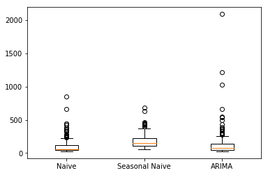
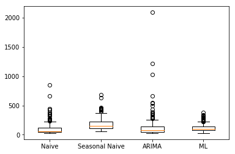

# Build and deploy forecasting models with Azure Machine Learning

In this article, learn how to use **Azure Machine Learning Package for Forecasting** to build and deploy a forecasting model. Consult the [full package reference documentation](https://docs.microsoft.com/python/api/overview/azure-machine-learning/forecasting) for the full list of transformers and models as well as detailed reference for each class.

The model building and deployment workflow is as follows:

1. **Ingest Data**: Load the dataset and convert it into TimeSeriesDataFrame. This dataframe is a time series data structure provided by Azure Machine Learning Package for Forecasting, herein referred to as **AMLPF**.

2. **Create Features**: Use various featurization transformers provided by AMLPF to create features.

3. **Train and Select Best Model**: Compare the performance of various univariate time series models and machine learning models. 

4. **Deploy Model**: Deploy the trained model pipeline as a web service via Azure Machine Learning Workbench so it can be consumed by others.

## Prerequisites 

1. If you don't have an Azure subscription, create a [free account](https://azure.microsoft.com/free/?WT.mc_id=A261C142F) before you begin.

1. The following accounts and application must be set up and installed:
   - An Azure Machine Learning Experimentation account 
   - An Azure Machine Learning Model Management account
   - Azure Machine Learning Workbench installed

   If these accounts and Workbench are not yet installed, follow the steps in the [Quickstart: Install and start](../service/quickstart-installation.md) article. 

1. The Azure Machine Learning Package for Forecasting must be [installed](https://docs.microsoft.com/python/api/overview/azure-machine-learning/forecasting).

1. The following dependencies should be imported or loaded.
```python
### Import dependencies for example ###
import warnings

# Suppress warnings
warnings.filterwarnings("ignore") 

# Import packages
import pandas as pd
import numpy as np
import math
import pkg_resources
from datetime import timedelta
import datetime
import matplotlib
matplotlib.use('agg')
from matplotlib import pyplot as plt
from sklearn.linear_model import Lasso

from ftk.tsutils import last_n_periods_split
from ftk.dataframets import TimeSeriesDataFrame
from ftk.dataframeforecast import ForecastDataFrame
from ftk.pipeline import AzureMLForecastPipeline

from ftk.transforms.lagoperator import LagOperator
from ftk.transforms.rollingwindow import RollingWindow
from ftk.transforms.tsimputer import TimeSeriesImputer
from ftk.transforms.time_index_featurizer import TimeIndexFeaturizer
from ftk.transforms.dropcolumns import DropColumns

from ftk.models.arima import Arima
from ftk.models.naive import SeasonalNaive, Naive
from ftk.models.regressionforecaster import RegressionForecaster

from ftk.operationalization.scorecontext import ScoreContext
from ftk.operationalization.deployment import AMLEnvironment, AMLDeployment

from ftk.model_selection import (TSGridSearchCV, RollingOriginValidator)
from ftk.data.weather.noaa_weather_data import get_a_year_of_daily_weather_data
```

## Sample dataset and notebook

This following sections show you how to perform machine learning sales forecasting using the [Dominick's Finer Foods dataset](https://research.chicagobooth.edu/kilts/marketing-databases/dominicks) from the University of Chicago to forecast orange juice sales. Dominick's was a grocery chain in the Chicago metropolitan area. 

> [!div class="nextstepaction"]
> [Get the Jupyter notebook](https://github.com/Microsoft/ML-Server-Python-Samples/blob/master/operationalize/Explore_Consume_Python_Web_Services.ipynb)
 
## Load data and explore

```python
# Load the OJ data into a pandas DataFrame
csv_path = pkg_resources.resource_filename('ftk', 'data/dominicks_oj/dominicks_oj.csv')
whole_df = pd.read_csv(csv_path, low_memory = False)
whole_df.head()
```

<table border="1" class="dataframe">
  <thead>
    <tr style="text-align: right;">
      <th></th>
      <th>store</th>
      <th>brand</th>
      <th>week</th>
      <th>logmove</th>
      <th>feat</th>
      <th>price</th>
      <th>AGE60</th>
      <th>EDUC</th>
      <th>ETHNIC</th>
      <th>INCOME</th>
      <th>HHLARGE</th>
      <th>WORKWOM</th>
      <th>HVAL150</th>
      <th>SSTRDIST</th>
      <th>SSTRVOL</th>
      <th>CPDIST5</th>
      <th>CPWVOL5</th>
    </tr>
  </thead>
  <tbody>
    <tr>
      <th>0</th>
      <td>2</td>
      <td>tropicana</td>
      <td>40</td>
      <td>9.02</td>
      <td>0</td>
      <td>3.87</td>
      <td>0.23</td>
      <td>0.25</td>
      <td>0.11</td>
      <td>10.55</td>
      <td>0.10</td>
      <td>0.30</td>
      <td>0.46</td>
      <td>2.11</td>
      <td>1.14</td>
      <td>1.93</td>
      <td>0.38</td>
    </tr>
    <tr>
      <th>1</th>
      <td>2</td>
      <td>tropicana</td>
      <td>46</td>
      <td>8.72</td>
      <td>0</td>
      <td>3.87</td>
      <td>0.23</td>
      <td>0.25</td>
      <td>0.11</td>
      <td>10.55</td>
      <td>0.10</td>
      <td>0.30</td>
      <td>0.46</td>
      <td>2.11</td>
      <td>1.14</td>
      <td>1.93</td>
      <td>0.38</td>
    </tr>
    <tr>
      <th>2</th>
      <td>2</td>
      <td>tropicana</td>
      <td>47</td>
      <td>8.25</td>
      <td>0</td>
      <td>3.87</td>
      <td>0.23</td>
      <td>0.25</td>
      <td>0.11</td>
      <td>10.55</td>
      <td>0.10</td>
      <td>0.30</td>
      <td>0.46</td>
      <td>2.11</td>
      <td>1.14</td>
      <td>1.93</td>
      <td>0.38</td>
    </tr>
    <tr>
      <th>3</th>
      <td>2</td>
      <td>tropicana</td>
      <td>48</td>
      <td>8.99</td>
      <td>0</td>
      <td>3.87</td>
      <td>0.23</td>
      <td>0.25</td>
      <td>0.11</td>
      <td>10.55</td>
      <td>0.10</td>
      <td>0.30</td>
      <td>0.46</td>
      <td>2.11</td>
      <td>1.14</td>
      <td>1.93</td>
      <td>0.38</td>
    </tr>
    <tr>
      <th>4</th>
      <td>2</td>
      <td>tropicana</td>
      <td>50</td>
      <td>9.09</td>
      <td>0</td>
      <td>3.87</td>
      <td>0.23</td>
      <td>0.25</td>
      <td>0.11</td>
      <td>10.55</td>
      <td>0.10</td>
      <td>0.30</td>
      <td>0.46</td>
      <td>2.11</td>
      <td>1.14</td>
      <td>1.93</td>
      <td>0.38</td>
    </tr>
  </tbody>
</table>

 
The data consist of weekly sales (the logarithm of the quantity sold is in the 'logmove' column) by brand and store. The data also includes some customer demographic features. To model the time series, you need to extract some essential elements from this dataframe: a date/time axis and a sales quantity that you wish to forecast.


```python
# The sales are contained in the 'logmove' column. 
# Values are logarithmic, so exponentiate and round them to get quantity sold
def expround(x):
    return math.floor(math.exp(x) + 0.5)
whole_df['Quantity'] = whole_df['logmove'].apply(expround)

# The time axis is in the 'week' column
# This is the week offset from the week of 1989-09-07 through 1989-09-13 inclusive
# Create new datetime columns containing the start and end of each week period
weekZeroStart = pd.to_datetime('1989-09-07 00:00:00')
weekZeroEnd = pd.to_datetime('1989-09-13 23:59:59')
whole_df['WeekFirstDay'] = whole_df['week'].apply(lambda n: weekZeroStart + timedelta(weeks=n))
whole_df['WeekLastDay'] = whole_df['week'].apply(lambda n: weekZeroEnd + timedelta(weeks=n))
whole_df[['store','brand','WeekLastDay','Quantity']].head()
```

<table border="1" class="dataframe">
  <thead>
    <tr style="text-align: right;">
      <th></th>
      <th>store</th>
      <th>brand</th>
      <th>WeekLastDay</th>
      <th>Quantity</th>
    </tr>
  </thead>
  <tbody>
    <tr>
      <th>0</th>
      <td>2</td>
      <td>tropicana</td>
      <td>1990-06-20 23:59:59</td>
      <td>8256</td>
    </tr>
    <tr>
      <th>1</th>
      <td>2</td>
      <td>tropicana</td>
      <td>1990-08-01 23:59:59</td>
      <td>6144</td>
    </tr>
    <tr>
      <th>2</th>
      <td>2</td>
      <td>tropicana</td>
      <td>1990-08-08 23:59:59</td>
      <td>3840</td>
    </tr>
    <tr>
      <th>3</th>
      <td>2</td>
      <td>tropicana</td>
      <td>1990-08-15 23:59:59</td>
      <td>8000</td>
    </tr>
    <tr>
      <th>4</th>
      <td>2</td>
      <td>tropicana</td>
      <td>1990-08-29 23:59:59</td>
      <td>8896</td>
    </tr>
  </tbody>
</table>


```python
nseries = whole_df.groupby(['store', 'brand']).ngroups
print('{} time series in the data frame.'.format(nseries))
```

    249 time series in the data frame.
    

The data contains ~250 different combinations of store and brand in this data frame, each one defining its own time series of sales. You can use the time series TimeSeriesDataFrame object to conveniently model multiple series in one data structure using the concept of "grain." The grain is specified by the `store` and `brand` columns.
    


```python
# Create a TimeSeriesDataFrame
# Use end of period as the time index
# Store and brand combinations label the grain 
# i.e. there is one time series for each unique pair of store and grain
whole_tsdf = TimeSeriesDataFrame(whole_df, 
                                 grain_colnames = ['store', 'brand'],
                                 time_colname = 'WeekLastDay', 
                                 ts_value_colname = 'Quantity',
                                 group_colnames = 'store')

whole_tsdf[['Quantity']].head()
```


<table border="1" class="dataframe">
  <thead>
    <tr style="text-align: right;">
      <th></th>
      <th></th>
      <th></th>
      <th>Quantity</th>
    </tr>
    <tr>
      <th>WeekLastDay</th>
      <th>store</th>
      <th>brand</th>
      <th></th>
    </tr>
  </thead>
  <tbody>
    <tr>
      <th>1990-06-20 23:59:59</th>
      <th>2</th>
      <th>tropicana</th>
      <td>8256</td>
    </tr>
    <tr>
      <th>1990-08-01 23:59:59</th>
      <th>2</th>
      <th>tropicana</th>
      <td>6144</td>
    </tr>
    <tr>
      <th>1990-08-08 23:59:59</th>
      <th>2</th>
      <th>tropicana</th>
      <td>3840</td>
    </tr>
    <tr>
      <th>1990-08-15 23:59:59</th>
      <th>2</th>
      <th>tropicana</th>
      <td>8000</td>
    </tr>
    <tr>
      <th>1990-08-29 23:59:59</th>
      <th>2</th>
      <th>tropicana</th>
      <td>8896</td>
    </tr>
  </tbody>
</table>


In the TimeSeriesDataFrame representation, the time axis and grain are now part of the data frame index, and allows easy access to Pandas datetime slicing functionality.


```python
# sort so you can slice
whole_tsdf.sort_index(inplace=True)

# Get sales of dominick's brand OJ from store 2 during summer 1990
whole_tsdf.loc[pd.IndexSlice['1990-06':'1990-09', 2, 'dominicks'], ['Quantity']]
```


<table border="1" class="dataframe">
  <thead>
    <tr style="text-align: right;">
      <th></th>
      <th></th>
      <th></th>
      <th>Quantity</th>
    </tr>
    <tr>
      <th>WeekLastDay</th>
      <th>store</th>
      <th>brand</th>
      <th></th>
    </tr>
  </thead>
  <tbody>
    <tr>
      <th>1990-06-20 23:59:59</th>
      <th>2</th>
      <th>dominicks</th>
      <td>10560</td>
    </tr>
    <tr>
      <th>1990-08-01 23:59:59</th>
      <th>2</th>
      <th>dominicks</th>
      <td>8000</td>
    </tr>
    <tr>
      <th>1990-08-08 23:59:59</th>
      <th>2</th>
      <th>dominicks</th>
      <td>6848</td>
    </tr>
    <tr>
      <th>1990-08-15 23:59:59</th>
      <th>2</th>
      <th>dominicks</th>
      <td>2880</td>
    </tr>
    <tr>
      <th>1990-08-29 23:59:59</th>
      <th>2</th>
      <th>dominicks</th>
      <td>1600</td>
    </tr>
    <tr>
      <th>1990-09-05 23:59:59</th>
      <th>2</th>
      <th>dominicks</th>
      <td>25344</td>
    </tr>
    <tr>
      <th>1990-09-12 23:59:59</th>
      <th>2</th>
      <th>dominicks</th>
      <td>10752</td>
    </tr>
    <tr>
      <th>1990-09-19 23:59:59</th>
      <th>2</th>
      <th>dominicks</th>
      <td>6656</td>
    </tr>
    <tr>
      <th>1990-09-26 23:59:59</th>
      <th>2</th>
      <th>dominicks</th>
      <td>6592</td>
    </tr>
  </tbody>
</table>


The ```TimeSeriesDataFrame.ts_report()``` function generates a comprehensive report of the time series data frame. The report includes both a general data description and statistics specific to time series data.  


```python
%matplotlib inline
whole_tsdf.ts_report()
```

    --------------------------------  Data Overview  ---------------------------------
    <class 'ftk.dataframets.TimeSeriesDataFrame'>
    MultiIndex: 28947 entries, (1990-06-20 23:59:59, 2, dominicks) to (1992-10-07 23:59:59, 137, tropicana)
    Data columns (total 17 columns):
    week            28947 non-null int64
    logmove         28947 non-null float64
    feat            28947 non-null int64
    price           28947 non-null float64
    AGE60           28947 non-null float64
    EDUC            28947 non-null float64
    ETHNIC          28947 non-null float64
    INCOME          28947 non-null float64
    HHLARGE         28947 non-null float64
    WORKWOM         28947 non-null float64
    HVAL150         28947 non-null float64
    SSTRDIST        28947 non-null float64
    SSTRVOL         28947 non-null float64
    CPDIST5         28947 non-null float64
    CPWVOL5         28947 non-null float64
    Quantity        28947 non-null int64
    WeekFirstDay    28947 non-null datetime64[ns]
    dtypes: datetime64[ns](1), float64(13), int64(3)
    memory usage: 3.8+ MB
    --------------------------  Numerical Variable Summary  --------------------------
              week  logmove     feat    price    AGE60     EDUC   ETHNIC   INCOME  \
    count 28947.00 28947.00 28947.00 28947.00 28947.00 28947.00 28947.00 28947.00   
    mean    100.46     9.17     0.24     2.28     0.17     0.23     0.16    10.62   
    std      34.69     1.02     0.43     0.65     0.06     0.11     0.19     0.28   
    min      40.00     4.16     0.00     0.52     0.06     0.05     0.02     9.87   
    25%      70.00     8.49     0.00     1.79     0.12     0.15     0.04    10.46   
    50%     101.00     9.03     0.00     2.17     0.17     0.23     0.07    10.64   
    75%     130.00     9.76     0.00     2.73     0.21     0.28     0.19    10.80   
    max     160.00    13.48     1.00     3.87     0.31     0.53     1.00    11.24   
    
           HHLARGE  WORKWOM  HVAL150  SSTRDIST  SSTRVOL  CPDIST5  CPWVOL5  \
    count 28947.00 28947.00 28947.00  28947.00 28947.00 28947.00 28947.00   
    mean      0.12     0.36     0.34      5.10     1.21     2.12     0.44   
    std       0.03     0.05     0.24      3.47     0.53     0.73     0.22   
    min       0.01     0.24     0.00      0.13     0.40     0.77     0.09   
    25%       0.10     0.31     0.12      2.77     0.73     1.63     0.27   
    50%       0.11     0.36     0.35      4.65     1.12     1.96     0.38   
    75%       0.14     0.40     0.53      6.65     1.54     2.53     0.56   
    max       0.22     0.47     0.92     17.86     2.57     4.11     1.14   
    
           Quantity  
    count  28947.00  
    mean   17312.21  
    std    27477.66  
    min       64.00  
    25%     4864.00  
    50%     8384.00  
    75%    17408.00  
    max   716416.00  
    ------------------------  Non-Numerical Variable Summary  -----------------------
                   WeekFirstDay
    count                 28947
    unique                  121
    top     1992-03-12 00:00:00
    freq                    249
    first   1990-06-14 00:00:00
    last    1992-10-01 00:00:00
    ------------------------------  Time Series Summary  -----------------------------
    Number of time series                 249
    Minimum time                    1990-06-20 23:59:59
    Maximum time                    1992-10-07 23:59:59
    
    Inferred frequencies
    Number of ['store', 'brand']s with frequency W-WED     249
    Use get_frequency_dict() method to explore ['store', 'brand']s with unusual frequency and clean data
    
    Detected seasonalities
    Number of ['store', 'brand']s with seasonality 1         190
    Number of ['store', 'brand']s with seasonality 15        15
    Number of ['store', 'brand']s with seasonality 14        11
    Number of ['store', 'brand']s with seasonality 7         9
    Number of ['store', 'brand']s with seasonality 6         8
    Number of ['store', 'brand']s with seasonality 8         5
    Number of ['store', 'brand']s with seasonality 2         4
    Number of ['store', 'brand']s with seasonality 23        2
    Number of ['store', 'brand']s with seasonality 3         1
    Number of ['store', 'brand']s with seasonality 11        1
    Number of ['store', 'brand']s with seasonality 12        1
    Number of ['store', 'brand']s with seasonality 13        1
    Number of ['store', 'brand']s with seasonality 47        1
    Use get_seasonality_dict() method to explore ['store', 'brand']s with unusual seasonality and clean data
    -----------------------------  Value Column Summary  -----------------------------
    Value column                        Quantity
    Percentage of missing values        0.00
    Percentage of zero values           0.00
    Mean coefficient of variation       31688.52
    Median coefficient of variation     24000.20
    Minimum coefficient of variation    ['store', 'brand'] (48, 'tropicana'): 4475.53
    Maximum coefficient of variation    ['store', 'brand'] (111, 'dominicks'): 193333.55
    ------------------------------  Correlation Matrix  ------------------------------
        week  logmove  feat  price  AGE60  EDUC  ETHNIC  INCOME  HHLARGE  WORKWOM  \
    0   1.00     0.10  0.04  -0.21  -0.01  0.01    0.00    0.00     0.01    -0.00   
    1   0.10     1.00  0.54  -0.43   0.09  0.00    0.06   -0.04    -0.06    -0.08   
    2   0.04     0.54  1.00  -0.29  -0.00  0.00    0.00   -0.00    -0.00     0.00   
    3  -0.21    -0.43 -0.29   1.00   0.04  0.02    0.04   -0.03    -0.04    -0.02   
    4  -0.01     0.09 -0.00   0.04   1.00 -0.31   -0.09   -0.15    -0.32    -0.63   
    5   0.01     0.00  0.00   0.02  -0.31  1.00   -0.34    0.66    -0.39     0.56   
    6   0.00     0.06  0.00   0.04  -0.09 -0.34    1.00   -0.72     0.25    -0.29   
    7   0.00    -0.04 -0.00  -0.03  -0.15  0.66   -0.72    1.00    -0.08     0.40   
    8   0.01    -0.06 -0.00  -0.04  -0.32 -0.39    0.25   -0.08     1.00    -0.28   
    9  -0.00    -0.08  0.00  -0.02  -0.63  0.56   -0.29    0.40    -0.28     1.00   
    10  0.01     0.02  0.00   0.04  -0.11  0.89   -0.42    0.64    -0.48     0.45   
    11  0.01    -0.00  0.00   0.08   0.07 -0.12    0.54   -0.41     0.06    -0.19   
    12 -0.01    -0.09 -0.00   0.03  -0.05 -0.13    0.23   -0.26     0.04    -0.06   
    13 -0.01     0.02 -0.00  -0.06   0.09 -0.20   -0.22    0.21     0.19    -0.13   
    14 -0.00    -0.12 -0.00  -0.01  -0.09  0.28   -0.38    0.36    -0.20     0.37   
    15  0.03     0.76  0.47  -0.36   0.08 -0.04    0.11   -0.08    -0.00    -0.10   
    
        HVAL150  SSTRDIST  SSTRVOL  CPDIST5  CPWVOL5  Quantity  
    0      0.01      0.01    -0.01    -0.01    -0.00      0.03  
    1      0.02     -0.00    -0.09     0.02    -0.12      0.76  
    2      0.00      0.00    -0.00    -0.00    -0.00      0.47  
    3      0.04      0.08     0.03    -0.06    -0.01     -0.36  
    4     -0.11      0.07    -0.05     0.09    -0.09      0.08  
    5      0.89     -0.12    -0.13    -0.20     0.28     -0.04  
    6     -0.42      0.54     0.23    -0.22    -0.38      0.11  
    7      0.64     -0.41    -0.26     0.21     0.36     -0.08  
    8     -0.48      0.06     0.04     0.19    -0.20     -0.00  
    9      0.45     -0.19    -0.06    -0.13     0.37     -0.10  
    10     1.00     -0.17    -0.24    -0.22     0.27     -0.04  
    11    -0.17      1.00     0.17    -0.11    -0.40      0.06  
    12    -0.24      0.17     1.00    -0.05     0.36     -0.02  
    13    -0.22     -0.11    -0.05     1.00     0.02     -0.00  
    14     0.27     -0.40     0.36     0.02     1.00     -0.11  
    15    -0.04      0.06    -0.02    -0.00    -0.11      1.00  
    You may call TimeSeriesDataFrame.plot_scatter_matrix() to get a correlation matrix plot. However, this
    is not recommended if your data is big.
    


## Integrate with external data


```python
# Load weather data
weather_1990 = get_a_year_of_daily_weather_data(year=1990)
weather_1991 = get_a_year_of_daily_weather_data(year=1991)
weather_1992 = get_a_year_of_daily_weather_data(year=1992)

# Preprocess weather data
weather_all = pd.concat([weather_1990, weather_1991, weather_1992])
weather_all.reset_index(inplace=True)

# Only use a subset of columns
weather_all = weather_all[['TEMP', 'DEWP', 'WDSP', 'PRCP']]

# Compute the WeekLastDay column, in order to merge with sales data
weekZeroStart = pd.to_datetime('1989-09-07 00:00:00')
weekZeroEnd = pd.to_datetime('1989-09-13 23:59:59')
weather_all['WeekLastDay'] = pd.Series(
    (weather_all.index.get_level_values('YEARMODA') - weekZeroStart), 
    index=weather_all.index.get_level_values('YEARMODA')).apply(lambda n: weekZeroEnd 
                                                                + timedelta(weeks=math.floor(n.days/7)))
weather_all = weather_all.groupby('WeekLastDay').mean()
weather_all = TimeSeriesDataFrame(weather_all, time_colname='WeekLastDay')

# Merge weather data with sales data
whole_tsdf = whole_tsdf.merge(weather_all, how='left', on='WeekLastDay')
whole_tsdf.head()
```

<table border="1" class="dataframe">
  <thead>
    <tr style="text-align: right;">
      <th></th>
      <th></th>
      <th></th>
      <th>week</th>
      <th>logmove</th>
      <th>feat</th>
      <th>price</th>
      <th>AGE60</th>
      <th>EDUC</th>
      <th>ETHNIC</th>
      <th>INCOME</th>
      <th>HHLARGE</th>
      <th>WORKWOM</th>
      <th>...</th>
      <th>SSTRDIST</th>
      <th>SSTRVOL</th>
      <th>CPDIST5</th>
      <th>CPWVOL5</th>
      <th>Quantity</th>
      <th>WeekFirstDay</th>
      <th>TEMP</th>
      <th>DEWP</th>
      <th>WDSP</th>
      <th>PRCP</th>
    </tr>
    <tr>
      <th>WeekLastDay</th>
      <th>store</th>
      <th>brand</th>
      <th></th>
      <th></th>
      <th></th>
      <th></th>
      <th></th>
      <th></th>
      <th></th>
      <th></th>
      <th></th>
      <th></th>
      <th></th>
      <th></th>
      <th></th>
      <th></th>
      <th></th>
      <th></th>
      <th></th>
      <th></th>
      <th></th>
      <th></th>
      <th></th>
    </tr>
  </thead>
  <tbody>
    <tr>
      <th rowspan="5" valign="top">1990-06-20 23:59:59</th>
      <th rowspan="3" valign="top">2</th>
      <th>dominicks</th>
      <td>40</td>
      <td>9.26</td>
      <td>1</td>
      <td>1.59</td>
      <td>0.23</td>
      <td>0.25</td>
      <td>0.11</td>
      <td>10.55</td>
      <td>0.10</td>
      <td>0.30</td>
      <td>...</td>
      <td>2.11</td>
      <td>1.14</td>
      <td>1.93</td>
      <td>0.38</td>
      <td>10560</td>
      <td>1990-06-14</td>
      <td>72.00</td>
      <td>61.87</td>
      <td>9.74</td>
      <td>0.19</td>
    </tr>
    <tr>
      <th>minute.maid</th>
      <td>40</td>
      <td>8.41</td>
      <td>0</td>
      <td>3.17</td>
      <td>0.23</td>
      <td>0.25</td>
      <td>0.11</td>
      <td>10.55</td>
      <td>0.10</td>
      <td>0.30</td>
      <td>...</td>
      <td>2.11</td>
      <td>1.14</td>
      <td>1.93</td>
      <td>0.38</td>
      <td>4480</td>
      <td>1990-06-14</td>
      <td>72.00</td>
      <td>61.87</td>
      <td>9.74</td>
      <td>0.19</td>
    </tr>
    <tr>
      <th>tropicana</th>
      <td>40</td>
      <td>9.02</td>
      <td>0</td>
      <td>3.87</td>
      <td>0.23</td>
      <td>0.25</td>
      <td>0.11</td>
      <td>10.55</td>
      <td>0.10</td>
      <td>0.30</td>
      <td>...</td>
      <td>2.11</td>
      <td>1.14</td>
      <td>1.93</td>
      <td>0.38</td>
      <td>8256</td>
      <td>1990-06-14</td>
      <td>72.00</td>
      <td>61.87</td>
      <td>9.74</td>
      <td>0.19</td>
    </tr>
    <tr>
      <th rowspan="2" valign="top">5</th>
      <th>dominicks</th>
      <td>40</td>
      <td>7.49</td>
      <td>1</td>
      <td>1.59</td>
      <td>0.12</td>
      <td>0.32</td>
      <td>0.05</td>
      <td>10.92</td>
      <td>0.10</td>
      <td>0.41</td>
      <td>...</td>
      <td>3.80</td>
      <td>0.68</td>
      <td>1.60</td>
      <td>0.74</td>
      <td>1792</td>
      <td>1990-06-14</td>
      <td>72.00</td>
      <td>61.87</td>
      <td>9.74</td>
      <td>0.19</td>
    </tr>
    <tr>
      <th>minute.maid</th>
      <td>40</td>
      <td>8.35</td>
      <td>0</td>
      <td>2.99</td>
      <td>0.12</td>
      <td>0.32</td>
      <td>0.05</td>
      <td>10.92</td>
      <td>0.10</td>
      <td>0.41</td>
      <td>...</td>
      <td>3.80</td>
      <td>0.68</td>
      <td>1.60</td>
      <td>0.74</td>
      <td>4224</td>
      <td>1990-06-14</td>
      <td>72.00</td>
      <td>61.87</td>
      <td>9.74</td>
      <td>0.19</td>
    </tr>
  </tbody>
</table>


## Train models

In this step, split the data into training and testing sets. The testing set has the last 40 observations of each time series. To accomplish the split, you use a utility function, ```ftk.tsutils.last_n_periods_split```:


```python
# Train/Test split
# Test data is last 40 time points from all time series 
train_tsdf, test_tsdf = last_n_periods_split(whole_tsdf, 40)
```

Basic time series models require contiguous time series. Check to see if the series are regular, that is, that they have a time index sampled at regular intervals. Check this using the check_regularity_by_grain method.


```python
ts_regularity = train_tsdf.check_regularity_by_grain()
print(ts_regularity[ts_regularity['regular'] == False])
```

                                              problems  regular
    store brand                                                
    2     dominicks    [Irregular datetime gaps exist]    False
          minute.maid  [Irregular datetime gaps exist]    False
          tropicana    [Irregular datetime gaps exist]    False
    5     dominicks    [Irregular datetime gaps exist]    False
          minute.maid  [Irregular datetime gaps exist]    False
          tropicana    [Irregular datetime gaps exist]    False
    8     dominicks    [Irregular datetime gaps exist]    False
          minute.maid  [Irregular datetime gaps exist]    False
          tropicana    [Irregular datetime gaps exist]    False
    9     dominicks    [Irregular datetime gaps exist]    False
          minute.maid  [Irregular datetime gaps exist]    False
          tropicana    [Irregular datetime gaps exist]    False
    12    dominicks    [Irregular datetime gaps exist]    False
          minute.maid  [Irregular datetime gaps exist]    False
          tropicana    [Irregular datetime gaps exist]    False
    14    dominicks    [Irregular datetime gaps exist]    False
          minute.maid  [Irregular datetime gaps exist]    False
          tropicana    [Irregular datetime gaps exist]    False
    18    dominicks    [Irregular datetime gaps exist]    False
          minute.maid  [Irregular datetime gaps exist]    False
          tropicana    [Irregular datetime gaps exist]    False
    21    dominicks    [Irregular datetime gaps exist]    False
          minute.maid  [Irregular datetime gaps exist]    False
          tropicana    [Irregular datetime gaps exist]    False
    28    dominicks    [Irregular datetime gaps exist]    False
          minute.maid  [Irregular datetime gaps exist]    False
          tropicana    [Irregular datetime gaps exist]    False
    33    dominicks    [Irregular datetime gaps exist]    False
          minute.maid  [Irregular datetime gaps exist]    False
          tropicana    [Irregular datetime gaps exist]    False
    ...                                            ...      ...
    119   dominicks    [Irregular datetime gaps exist]    False
          minute.maid  [Irregular datetime gaps exist]    False
          tropicana    [Irregular datetime gaps exist]    False
    121   dominicks    [Irregular datetime gaps exist]    False
          minute.maid  [Irregular datetime gaps exist]    False
          tropicana    [Irregular datetime gaps exist]    False
    123   dominicks    [Irregular datetime gaps exist]    False
          minute.maid  [Irregular datetime gaps exist]    False
          tropicana    [Irregular datetime gaps exist]    False
    126   dominicks    [Irregular datetime gaps exist]    False
          minute.maid  [Irregular datetime gaps exist]    False
          tropicana    [Irregular datetime gaps exist]    False
    128   dominicks    [Irregular datetime gaps exist]    False
          minute.maid  [Irregular datetime gaps exist]    False
          tropicana    [Irregular datetime gaps exist]    False
    129   dominicks    [Irregular datetime gaps exist]    False
          minute.maid  [Irregular datetime gaps exist]    False
          tropicana    [Irregular datetime gaps exist]    False
    130   dominicks    [Irregular datetime gaps exist]    False
          minute.maid  [Irregular datetime gaps exist]    False
          tropicana    [Irregular datetime gaps exist]    False
    131   dominicks    [Irregular datetime gaps exist]    False
          minute.maid  [Irregular datetime gaps exist]    False
          tropicana    [Irregular datetime gaps exist]    False
    134   dominicks    [Irregular datetime gaps exist]    False
          minute.maid  [Irregular datetime gaps exist]    False
          tropicana    [Irregular datetime gaps exist]    False
    137   dominicks    [Irregular datetime gaps exist]    False
          minute.maid  [Irregular datetime gaps exist]    False
          tropicana    [Irregular datetime gaps exist]    False
    
    [213 rows x 2 columns]
    

You can see that most of the series (213 of them) aren't regular. An imputation transform is required to fill missing sales quantity values. There are many imputation options, but you should use a linear interpolation here.

```python
# Use a TimeSeriesImputer to linearly interpolate missing values
imputer = TimeSeriesImputer(input_column='Quantity', 
                            option='interpolate',
                            method='linear',
                            freq='W-WED')

train_imputed_tsdf = imputer.transform(train_tsdf)
```

Now all series have a regular frequency:


```python
ts_regularity_imputed = train_imputed_tsdf.check_regularity_by_grain()
print(ts_regularity_imputed[ts_regularity_imputed['regular'] == False])
```

    Empty DataFrame
    Columns: [problems, regular]
    Index: []
    

### Initialize Models

Now that you've cleaned up your data, you can begin modeling.  Start by using three univariate models: the "naive" model, the "seasonal naive" model, and an "ARIMA" model.


```python
# Model parameters
oj_series_freq = 'W-WED'
oj_series_seasonality = 52

# Initialize naive model
naive_model = Naive(freq=oj_series_freq)

# Initialize seasonal naive model
seasonal_naive_model = SeasonalNaive(freq=oj_series_freq, 
                                     seasonality=oj_series_seasonality)

# Initialize ARIMA(p,d,q) model
arima_order = [2, 1, 0]
arima_model = Arima(oj_series_freq, arima_order)
```

Next, you can start creating a pipeline. Pipeline objects make it easy to save a set of steps so they can be applied repeatedly to different objects. Also, pipeline objects are pickable making it easy to port them to other machines for deployment.


```python
pipeline_naive = AzureMLForecastPipeline([('naive_model', naive_model)])
pipeline_seasonal_naive = AzureMLForecastPipeline([('seasonal_naive_model', seasonal_naive_model)])
pipeline_arima = AzureMLForecastPipeline([('arima_model', arima_model)])
```

### Fit model pipelines
The model pipelines are then fit to the training data to get ready for forecasting. Since these models are all univariate models, one model is fit to each grain of the data. Using the forecasting toolkit, all 249 models can be fit with just one function call.


```python
pipeline_naive = pipeline_naive.fit(train_imputed_tsdf)
pipeline_seasonal_naive = pipeline_seasonal_naive.fit(train_imputed_tsdf)
pipeline_arima = pipeline_arima.fit(train_imputed_tsdf)
```

    F1 2018-04-18 22:24:07,009 INFO azureml.timeseries - pipeline fit started. 
    F1 2018-04-18 22:24:10,078 INFO azureml.timeseries - pipeline fit finished. Time elapsed 0:00:03.070034
    F1 2018-04-18 22:24:10,095 INFO azureml.timeseries - pipeline fit started. 
    F1 2018-04-18 22:24:13,242 INFO azureml.timeseries - pipeline fit finished. Time elapsed 0:00:03.146906
    F1 2018-04-18 22:24:13,257 INFO azureml.timeseries - pipeline fit started. 
    

    C:\Users\honglu\AppData\local\AmlWorkbench\Python\lib\site-packages\statsmodels\base\model.py:496: ConvergenceWarning: Maximum Likelihood optimization failed to converge. Check mle_retvals
      "Check mle_retvals", ConvergenceWarning)
    

    F1 2018-04-18 22:24:53,022 INFO azureml.timeseries - pipeline fit finished. Time elapsed 0:00:39.764837
    

### Forecast sales on testing set
You can create predictions for all 249 series in the testing data set with one call to predict on the testing data frame.


```python
# Compute a forecast on the test data for each model
validate_predicted_naive = pipeline_naive.predict(test_tsdf)
validate_predicted_seasonal_naive = pipeline_seasonal_naive.predict(test_tsdf)
validate_predicted_arima = pipeline_arima.predict(test_tsdf)
```

    F1 2018-04-18 22:24:58,787 INFO azureml.timeseries - pipeline predict started. 
    F1 2018-04-18 22:25:26,158 INFO azureml.timeseries - pipeline predict finished. Time elapsed 0:00:27.371015
    F1 2018-04-18 22:25:26,171 INFO azureml.timeseries - pipeline predict started. 
    F1 2018-04-18 22:25:53,283 INFO azureml.timeseries - pipeline predict finished. Time elapsed 0:00:27.112060
    F1 2018-04-18 22:25:53,300 INFO azureml.timeseries - pipeline predict started. 
    F1 2018-04-18 22:26:27,366 INFO azureml.timeseries - pipeline predict finished. Time elapsed 0:00:34.066486
    

Now you can calculate the forecast errors vs. the actual sales quantities on the test set. You can use the mean absolute scaled error here. The mean absolute scaled error is a mean absolute error compared to a naive forecast error on the training set.


```python
validate_error_naive = validate_predicted_naive.calc_error(err_name='MAPE')
validate_error_seasonal_naive = validate_predicted_seasonal_naive.calc_error(err_name='MAPE')
validate_error_arima = validate_predicted_arima.calc_error(err_name='MAPE')

print('Naive model MAPE: {0}'.format(validate_error_naive))
print('Seasonal naive model MAPE: {0}'.format(validate_error_seasonal_naive))
print('ARIMA model MAPE: {0}'.format(validate_error_arima))
```

    Naive model MAPE: 103.5742895882409
    Seasonal naive model MAPE: 180.53917120698878
    ARIMA model MAPE: 126.56764123561483
    

It's valuable to see the distribution of these errors over the 250 time series in the data. You can calculate the errors for each series using the `by` argument in `calc_error`. Create a box plot to visualize the errors.


```python
# Compute MASE by grain for each model
validate_error_naive_bygrain = validate_predicted_naive.calc_error(err_name='MAPE', 
                                                                   by=test_tsdf.grain_colnames)
validate_error_seasonal_naive_bygrain = validate_predicted_seasonal_naive.calc_error(err_name='MAPE', 
                                                                                     by=test_tsdf.grain_colnames)
validate_error_arima_bygrain = validate_predicted_arima.calc_error(err_name='MAPE', 
                                                                   by=test_tsdf.grain_colnames)

# Display a boxplot to visualize the forecast error distributions
bp = plt.boxplot([validate_error_naive_bygrain.MAPE, validate_error_seasonal_naive_bygrain.MAPE, 
                  validate_error_arima_bygrain.MAPE],
                  labels = ["Naive", "Seasonal Naive", "ARIMA"])
```





Overall, the ARIMA model seems to make the better forecasts despite some outliers that are less accurate.

## Build machine learning models

In addition to traditional univariate models, the Azure Machine Learning Package for Forecasting enables users to create machine learning models as well. 

You begin by creating features for modeling.


```python
# First impute the missing values in the training data to get a regular series
imputer = TimeSeriesImputer(input_column='Quantity', 
                            option='interpolate',
                            method='linear',
                            freq='W-WED')
whole_tsdf_imputed = imputer.transform(whole_tsdf)

# There are already some feature values in our dataset, but a few of them are missing.
# We will fill in these values using the column mean.
whole_tsdf_imputed.fillna(whole_tsdf_imputed.mean(), inplace=True)

# Now we add some features from the Forecasting Toolkit.  `TimeIndexFeaturizer()` will
# add features related to the time like indicators for month and day of year. `LagOperator()` 
# will create features from the past values of the series.
pipeline_ml = AzureMLForecastPipeline(
            steps = [('index_features', 
                      TimeIndexFeaturizer(correlation_cutoff=0.1, overwrite_columns=True)),
                    ('lag_operator', LagOperator([1, 2]))])

# There are a few features we need to remove.  `logmove` is the log of the number of 
# units sold, so providing this number would be cheating. `WeekFirstDay` would be 
# redundant since we already have a feature for the last day of the week.
pipeline_ml.add_pipeline_step('drop_columns', DropColumns(['logmove', 'WeekFirstDay']))
feature_tsdf = pipeline_ml.fit_transform(whole_tsdf_imputed)

# Since we used lags as features, some of the values at the beginning of the data will
# have missing values for these features, we will have to remove these values
feature_tsdf.dropna(inplace=True)

# Let's get a look at our new feature set
print(feature_tsdf.head())
```

    F1 2018-04-18 22:28:01,157 INFO azureml.timeseries - pipeline fit_transform started. 
    F1 2018-04-18 22:28:03,273 INFO azureml.timeseries - pipeline fit_transform finished. Time elapsed 0:00:02.115910
                                         feat  price  AGE60  EDUC  ETHNIC  INCOME  \
    WeekLastDay         store brand                                                 
    1990-07-04 23:59:59 2     dominicks  0.24   2.28   0.17  0.23    0.16   10.62   
    1990-07-11 23:59:59 2     dominicks  0.24   2.28   0.17  0.23    0.16   10.62   
    1990-07-18 23:59:59 2     dominicks  0.24   2.28   0.17  0.23    0.16   10.62   
    1990-07-25 23:59:59 2     dominicks  0.24   2.28   0.17  0.23    0.16   10.62   
    1990-08-01 23:59:59 2     dominicks  0.00   2.69   0.23  0.25    0.11   10.55   
    
                                         HHLARGE  WORKWOM  HVAL150  SSTRDIST  \
    WeekLastDay         store brand                                            
    1990-07-04 23:59:59 2     dominicks     0.12     0.36     0.34      5.10   
    1990-07-11 23:59:59 2     dominicks     0.12     0.36     0.34      5.10   
    1990-07-18 23:59:59 2     dominicks     0.12     0.36     0.34      5.10   
    1990-07-25 23:59:59 2     dominicks     0.12     0.36     0.34      5.10   
    1990-08-01 23:59:59 2     dominicks     0.10     0.30     0.46      2.11   
    
                                             ...        CPWVOL5  Quantity  TEMP  \
    WeekLastDay         store brand          ...                                  
    1990-07-04 23:59:59 2     dominicks      ...           0.44   9706.67 52.91   
    1990-07-11 23:59:59 2     dominicks      ...           0.44   9280.00 52.91   
    1990-07-18 23:59:59 2     dominicks      ...           0.44   8853.33 52.91   
    1990-07-25 23:59:59 2     dominicks      ...           0.44   8426.67 52.91   
    1990-08-01 23:59:59 2     dominicks      ...           0.38   8000.00 72.99   
    
                                         DEWP  WDSP  PRCP  year  day  \
    WeekLastDay         store brand                                    
    1990-07-04 23:59:59 2     dominicks 42.85  9.40  0.10  1990    4   
    1990-07-11 23:59:59 2     dominicks 42.85  9.40  0.10  1990   11   
    1990-07-18 23:59:59 2     dominicks 42.85  9.40  0.10  1990   18   
    1990-07-25 23:59:59 2     dominicks 42.85  9.40  0.10  1990   25   
    1990-08-01 23:59:59 2     dominicks 62.53  8.57  0.02  1990    1   
    
                                         Quantity_lag1  Quantity_lag2  
    WeekLastDay         store brand                                    
    1990-07-04 23:59:59 2     dominicks       10133.33       10560.00  
    1990-07-11 23:59:59 2     dominicks        9706.67       10133.33  
    1990-07-18 23:59:59 2     dominicks        9280.00        9706.67  
    1990-07-25 23:59:59 2     dominicks        8853.33        9280.00  
    1990-08-01 23:59:59 2     dominicks        8426.67        8853.33  
    
    [5 rows x 22 columns]
    

Start your modeling by trying the  `Lasso` model directly from `scikit-learn`.  You can replace this model in the notebook 
with any other model in the library that supports regression. The other functions in this example are from the Azure Machine Learning Package for Forecasting and adapt traditional machine learning to a 
forecasting application.  For example, `RollingOriginValidator` does cross-validation temporarily, respecting what would and 
would not be known in a forecasting framework.


```python
# Split our data for training and testing as we did previously
train_feature_tsdf, test_feature_tsdf = last_n_periods_split(feature_tsdf, 40)

# Set up the `RollingOriginValidator` to do 10 folds of rolling origin cross-validation
rollcv = RollingOriginValidator(n_splits=10)

# Set up our RegressionForecaster.  This forecaster knows how to handle 
# `TimeSeriesDataFrames` and puts each `group` (in our case `store`) into the 
# same model allowing it to learn across similar series.
reg_model = RegressionForecaster(estimator=Lasso())

# Set up our parameter grid and feed it to our grid search algorythm
param_grid = {'estimator__alpha': np.logspace(0., 3., 5)}
grid_cv = TSGridSearchCV(reg_model, param_grid, cv=rollcv)

# Finally we can fit our data to the training data and create predictions on
# our testing data.
fit_model = grid_cv.fit(train_feature_tsdf, y=train_feature_tsdf.ts_value)
validate_ml = fit_model.predict(test_feature_tsdf)
```

You can see this model's accuracy performance by calculating the MASE on the `ForecastDataFrame` output and comparing it to your previous models.


```python
validate_error_ml_bygrain = validate_ml.calc_error(err_name='MAPE', 
                                                   by=test_feature_tsdf.grain_colnames)

print('Naive model median MAPE: {0}'.format(validate_error_naive_bygrain.MAPE.median()))
print('Seasonal naive model median MAPE: {0}'.format(validate_error_seasonal_naive_bygrain.MAPE.median()))
print('ARIMA model median MAPE: {0}'.format(validate_error_arima_bygrain.MAPE.median()))
print('ML model median MAPE: {0}'.format(validate_error_ml_bygrain.MAPE.median()))

# Display a boxplot to visualize the forecast error distributions
bp = plt.boxplot([validate_error_naive_bygrain.MAPE, validate_error_seasonal_naive_bygrain.MAPE, 
                  validate_error_arima_bygrain.MAPE, validate_error_ml_bygrain.MAPE],
                  labels = ["Naive", "Seasonal Naive", "ARIMA", "ML"])
```

    Naive model median MAPE: 61.63583948177988
    Seasonal naive model median MAPE: 154.60447045521832
    ARIMA model median MAPE: 81.21102620346122
    ML model median MAPE: 101.2323663101166
    





The machine learning model could take advantage of the added features and the similarities between series to get better forecast accuracy.

## Operationalization: deploy and consume

In this section, you deploy a pipeline as an Azure Machine Learning web service and consume it for training and scoring. 

There are several workflows available:
1. Deploy a pipeline that's not fitted as a web service. Call the web service to do both training and scoring.
2. Deploy a fitted pipeline. Call the web service to score only.

### Set model deployment parameters
Change the following parameters to your own values. Make sure your AML environment, model management account, and resource group are located in the same region.


```python
azure_subscription = 'Team Ilan'

# If cluster is True, create a Azure Container Service cluster and deploy the web service there.
# If False, deploy the "web service" locally.
# Cluste deployment takes about 20 minutes and local takes about 5 minutes. 
cluster = False

# The AML environment name. This could be an existing AML environment or a new AML environment to be created automatically.
aml_env_name = 'hluoj4'

# The resource group that contains the Azure resources related to the AML environment.
aml_env_resource_group = 'hluamlrgeastus2'

# The location where the Azure resources related to the AML environment are located at.
aml_env_location = 'eastus2'

# The AML model management account name. This could be an existing model management account a new model management 
# account to be created automatically. 
model_management_account_name = 'hluaccountModelMgmt'

# The resource group that contains the Azure resources related to the model management account.
model_management_account_resource_group = aml_env_resource_group

# The location where the Azure resources related to the model management account are located at.
model_management_account_location = aml_env_location

# The name of the deployment/web service.
deployment_name = 'hluojwebservicenaivenew'

# The directory to store deployment related files, such as pipeline pickle file, score script, and conda dependencies file. 
deployment_working_directory = 'C:\\Users\\honglu\\ftk'
```

### Define the AML environment and deployment


```python
aml_env = AMLEnvironment(env_name=aml_env_name, 
                         env_resource_group=aml_env_resource_group,
                         env_location=aml_env_location, 
                         azure_subscription=azure_subscription,
                         model_management_account_name=model_management_account_name, 
                         model_management_account_resource_group=model_management_account_resource_group,
                         model_management_account_location=model_management_account_location,
                         cluster=cluster)

pipeline_naive = AzureMLForecastPipeline([('naive_model', naive_model)])
aml_deployment = AMLDeployment(aml_env=aml_env, 
                               deployment_name=deployment_name,
                               pipeline=pipeline_naive,
                               deployment_working_directory=deployment_working_directory,
                               ftk_wheel_loc = 'https://azuremlftkrelease.blob.core.windows.net/dailyrelease/azuremlftk-0.1.18100.14a1-py3-none-any.whl')
```

### Deploy model as a web service


```python
# This step can take 5 to 20 minutes
# NOTE: Currently, recreate=False is not supported for deploying to ACS clusters
aml_deployment.deploy()
```

    running az account set --subscription Team Ilan
    running az ml account modelmanagement list
    running az ml env list
    running az ml account modelmanagement set --name hluaccountModelMgmt --resource-group hluamlrgeastus2
    running az ml env show --cluster-name hluoj4 --resource-group hluamlrgeastus2
    running az ml env show --cluster-name hluoj4 --resource-group hluamlrgeastus2
    running az ml env set --cluster-name hluoj4 --resource-group hluamlrgeastus2 --disable-dashboard
    AML environment is set.
    running az ml service list realtime
    pipeline pickled to C:\Users\honglu\ftk\pipeline.pkl
    score script generated to C:\Users\honglu\ftk\score.py
    conda dependencies yml file created to C:\Users\honglu\ftk\conda_dependencies.yml
    changing the working directory temporarily to : C:\Users\honglu\ftk
    running az ml service create realtime -n hluojwebservicenaivenew -f score.py --model-file pipeline.pkl -r python --conda-file conda_dependencies.yml --enable-app-insights true
    changing the working directory back to : C:\Users\honglu\ftk
    F1 2018-04-12 11:19:28,612 INFO Deployment finished successfully! 
    


    (" pipeline.pkl\nSuccessfully registered model\nId: 9f428f5f25c64a99be53b4a7596617d0\nMore information: 'az ml model show -m 9f428f5f25c64a99be53b4a7596617d0'\nCreating new driver at C:\\Users\\honglu\\AppData\\Local\\Temp\\tmp0ugdkli_.py\n score.py\nSuccessfully created manifest\nId: a12e2cf6-c6cf-476a-8d18-d0ff233ec238\nMore information: 'az ml manifest show -i a12e2cf6-c6cf-476a-8d18-d0ff233ec238'\nCreating image......................................................................Done.\nImage ID: ea0ebe1e-7e76-44f7-86ad-23dd41f55700\nMore details: 'az ml image show -i ea0ebe1e-7e76-44f7-86ad-23dd41f55700'\nUsage information: 'az ml image usage -i ea0ebe1e-7e76-44f7-86ad-23dd41f55700'\n[Local mode] Running docker container.\n[Local mode] Pulling the image from mlcrpacrf82668671cad.azurecr.io/hluojwebservicenaivenew:1. This may take a few minutes, depending on your connection speed...\n[Local mode] Pulling................................................................................................\n[Local mode] Waiting for container to initialize\n[Local mode] Done\n[Local mode] Service ID: hluojwebservicenaivenew\n[Local mode] Usage for cmd: az ml service run realtime -i hluojwebservicenaivenew -d !! YOUR DATA HERE !!\n[Local mode] Usage for powershell: az ml service run realtime -i hluojwebservicenaivenew --% -d !! YOUR DATA HERE !!\n[Local mode] Additional usage information: 'az ml service usage realtime -i hluojwebservicenaivenew'\n",
     '')


### Score and evaluate web service
To score a small dataset, use the score method to submit one web service call for all the data.


```python
# Need to add empty prediction columns to the validation data frame 
# and create a ForecastDataFrame
validate_tsdf = test_tsdf.assign(NaivePointForecast=0.0,
                                 NaiveDistributionForecast=np.nan)
validate_fcast = ForecastDataFrame(validate_tsdf, pred_point='NaivePointForecast',
                                 pred_dist='NaiveDistributionForecast')

# Define Score Context
# This is for deploying a pipeline not fitted yet.
score_context = ScoreContext(input_training_data_tsdf=train_imputed_tsdf,
                             input_scoring_data_fcdf=validate_fcast, 
                             pipeline_execution_type='train_predict')

# If deploying a fitted pipeline use the following score_context
# score_context = ScoreContext(input_scoring_data_fcdf=input_scoring_data_df, 
#                             pipeline_execution_type='predict_only') 

# Get deployed web service
aml_web_service = aml_deployment.get_deployment()

# Score the web service
results = aml_web_service.score(score_context=score_context)
print(type(results))
print(results)

# Evaluate result
validate_error_ml_bygrain = results.calc_error(err_name='MAPE', 
                                                   by=['store', 'brand'])
# webservice_error = results.calc_error(err_name='MAPE')
print('Naive model median MAPE: {0}'.format(validate_error_naive_bygrain.MAPE.median()))
```

    running az ml service list realtime
    running az ml service show realtime --name hluojwebservicenaivenew
    {
      "Id": "hluojwebservicenaivenew",
      "Image": "mlcrpacrf82668671cad.azurecr.io/hluojwebservicenaivenew:1",
      "Name": "hluojwebservicenaivenew",
      "State": "running",
      "UpdatedAt": "2018-04-12T15:19:10.8361641Z"
    }
    
    running az ml service usage realtime --id hluojwebservicenaivenew
    Scoring URL:
        http://127.0.0.1:32776/score
    
    Headers:
        Content-Type: application/json
    
    Swagger URL:
        http://127.0.0.1:32776/swagger.json
    
    Sample CLI command:
        Usage for cmd: az ml service run realtime -i hluojwebservicenaivenew -d !! YOUR DATA HERE !!
        Usage for powershell: az ml service run realtime -i hluojwebservicenaivenew --% -d !! YOUR DATA HERE !!
    
    Sample CURL call:
        curl -X POST -H "Content-Type:application/json" --data !! YOUR DATA HERE !! http://127.0.0.1:32776/score
    
    Get debug logs by calling:
        az ml service logs realtime -i hluojwebservicenaivenew
    
    Get STDOUT/STDERR or Request/Response logs in App Insights:
        https://analytics.applicationinsights.io/subscriptions/ff18d7a8-962a-406c-858f-49acd23d6c01/resourcegroups/hluamlrgeastus2/components/mlcrpaidb106701c6d3#/discover/home?apptype=Other%20(preview)
    
    
    running az ml service show realtime --name hluojwebservicenaivenew
    {
      "Id": "hluojwebservicenaivenew",
      "Image": "mlcrpacrf82668671cad.azurecr.io/hluojwebservicenaivenew:1",
      "Name": "hluojwebservicenaivenew",
      "State": "running",
      "UpdatedAt": "2018-04-12T15:19:10.8361641Z"
    }
    
    running az ml service keys realtime --id hluojwebservicenaivenew
    F1 2018-04-12 11:44:14,873 INFO Web service scored. 
    <class 'ftk.dataframeforecast.ForecastDataFrame'>
                                                             week  logmove  feat  \
    WeekLastDay         store brand     ForecastOriginDate                         
    1992-01-08 23:59:59 2     dominicks 1992-01-01 23:59:59   121     9.37     0   
    1992-01-15 23:59:59 2     dominicks 1992-01-01 23:59:59   122     8.30     0   
    1992-01-22 23:59:59 2     dominicks 1992-01-01 23:59:59   123     8.75     0   
    1992-01-29 23:59:59 2     dominicks 1992-01-01 23:59:59   124     9.52     0   
    1992-02-05 23:59:59 2     dominicks 1992-01-01 23:59:59   125    10.72     0   
    1992-02-12 23:59:59 2     dominicks 1992-01-01 23:59:59   126     9.21     0   
    1992-02-19 23:59:59 2     dominicks 1992-01-01 23:59:59   127     8.48     0   
    1992-02-26 23:59:59 2     dominicks 1992-01-01 23:59:59   128     9.37     0   
    1992-03-04 23:59:59 2     dominicks 1992-01-01 23:59:59   129     9.36     0   
    1992-03-11 23:59:59 2     dominicks 1992-01-01 23:59:59   130    10.84     1   
    1992-03-18 23:59:59 2     dominicks 1992-01-01 23:59:59   131     9.61     0   
    1992-03-25 23:59:59 2     dominicks 1992-01-01 23:59:59   132    10.33     0   
    1992-04-01 23:59:59 2     dominicks 1992-01-01 23:59:59   133     9.43     0   
    1992-04-08 23:59:59 2     dominicks 1992-01-01 23:59:59   134     8.09     0   
    1992-04-15 23:59:59 2     dominicks 1992-01-01 23:59:59   135     9.08     0   
    1992-04-22 23:59:59 2     dominicks 1992-01-01 23:59:59   136    11.17     1   
    1992-04-29 23:59:59 2     dominicks 1992-01-01 23:59:59   137     9.83     0   
    1992-05-06 23:59:59 2     dominicks 1992-01-01 23:59:59   138     9.12     0   
    1992-05-13 23:59:59 2     dominicks 1992-01-01 23:59:59   139     9.17     0   
    1992-05-20 23:59:59 2     dominicks 1992-01-01 23:59:59   140     8.48     0   
    1992-05-27 23:59:59 2     dominicks 1992-01-01 23:59:59   141     9.18     0   
    1992-06-03 23:59:59 2     dominicks 1992-01-01 23:59:59   142    10.73     0   
    1992-06-10 23:59:59 2     dominicks 1992-01-01 23:59:59   143     9.95     0   
    1992-06-17 23:59:59 2     dominicks 1992-01-01 23:59:59   144     8.79     0   
    1992-06-24 23:59:59 2     dominicks 1992-01-01 23:59:59   145     8.52     0   
    1992-07-01 23:59:59 2     dominicks 1992-01-01 23:59:59   146     9.00     0   
    1992-07-08 23:59:59 2     dominicks 1992-01-01 23:59:59   147     8.90     0   
    1992-07-15 23:59:59 2     dominicks 1992-01-01 23:59:59   148     9.22     0   
    1992-07-22 23:59:59 2     dominicks 1992-01-01 23:59:59   149     9.22     0   
    1992-07-29 23:59:59 2     dominicks 1992-01-01 23:59:59   150     9.12     0   
    ...                                                       ...      ...   ...   
    1992-03-18 23:59:59 137   tropicana 1992-01-01 23:59:59   131    11.55     0   
    1992-03-25 23:59:59 137   tropicana 1992-01-01 23:59:59   132    10.60     0   
    1992-04-01 23:59:59 137   tropicana 1992-01-01 23:59:59   133    10.47     0   
    1992-04-08 23:59:59 137   tropicana 1992-01-01 23:59:59   134    11.52     1   
    1992-04-15 23:59:59 137   tropicana 1992-01-01 23:59:59   135    11.14     0   
    1992-04-22 23:59:59 137   tropicana 1992-01-01 23:59:59   136    10.07     0   
    1992-04-29 23:59:59 137   tropicana 1992-01-01 23:59:59   137    10.16     0   
    1992-05-06 23:59:59 137   tropicana 1992-01-01 23:59:59   138    11.29     1   
    1992-05-13 23:59:59 137   tropicana 1992-01-01 23:59:59   139    10.32     0   
    1992-05-20 23:59:59 137   tropicana 1992-01-01 23:59:59   140    10.24     0   
    1992-05-27 23:59:59 137   tropicana 1992-01-01 23:59:59   141     9.90     0   
    1992-06-03 23:59:59 137   tropicana 1992-01-01 23:59:59   142    10.05     0   
    1992-06-10 23:59:59 137   tropicana 1992-01-01 23:59:59   143    11.89     1   
    1992-06-17 23:59:59 137   tropicana 1992-01-01 23:59:59   144    11.51     0   
    1992-06-24 23:59:59 137   tropicana 1992-01-01 23:59:59   145    11.44     1   
    1992-07-01 23:59:59 137   tropicana 1992-01-01 23:59:59   146     9.62     1   
    1992-07-08 23:59:59 137   tropicana 1992-01-01 23:59:59   147    10.67     0   
    1992-07-15 23:59:59 137   tropicana 1992-01-01 23:59:59   148    10.19     0   
    1992-07-22 23:59:59 137   tropicana 1992-01-01 23:59:59   149    10.23     0   
    1992-07-29 23:59:59 137   tropicana 1992-01-01 23:59:59   150     9.77     0   
    1992-08-05 23:59:59 137   tropicana 1992-01-01 23:59:59   151     9.73     0   
    1992-08-12 23:59:59 137   tropicana 1992-01-01 23:59:59   152     9.91     1   
    1992-08-19 23:59:59 137   tropicana 1992-01-01 23:59:59   153     9.71     0   
    1992-08-26 23:59:59 137   tropicana 1992-01-01 23:59:59   154    10.78     1   
    1992-09-02 23:59:59 137   tropicana 1992-01-01 23:59:59   155    10.30     0   
    1992-09-09 23:59:59 137   tropicana 1992-01-01 23:59:59   156    11.31     1   
    1992-09-16 23:59:59 137   tropicana 1992-01-01 23:59:59   157    10.63     0   
    1992-09-23 23:59:59 137   tropicana 1992-01-01 23:59:59   158     9.94     0   
    1992-09-30 23:59:59 137   tropicana 1992-01-01 23:59:59   159    10.86     1   
    1992-10-07 23:59:59 137   tropicana 1992-01-01 23:59:59   160    10.24     0   
    
                                                             price  AGE60  EDUC  \
    WeekLastDay         store brand     ForecastOriginDate                        
    1992-01-08 23:59:59 2     dominicks 1992-01-01 23:59:59   1.69   0.23  0.25   
    1992-01-15 23:59:59 2     dominicks 1992-01-01 23:59:59   1.76   0.23  0.25   
    1992-01-22 23:59:59 2     dominicks 1992-01-01 23:59:59   1.82   0.23  0.25   
    1992-01-29 23:59:59 2     dominicks 1992-01-01 23:59:59   1.47   0.23  0.25   
    1992-02-05 23:59:59 2     dominicks 1992-01-01 23:59:59   1.29   0.23  0.25   
    1992-02-12 23:59:59 2     dominicks 1992-01-01 23:59:59   1.39   0.23  0.25   
    1992-02-19 23:59:59 2     dominicks 1992-01-01 23:59:59   1.82   0.23  0.25   
    1992-02-26 23:59:59 2     dominicks 1992-01-01 23:59:59   1.69   0.23  0.25   
    1992-03-04 23:59:59 2     dominicks 1992-01-01 23:59:59   1.54   0.23  0.25   
    1992-03-11 23:59:59 2     dominicks 1992-01-01 23:59:59   1.39   0.23  0.25   
    1992-03-18 23:59:59 2     dominicks 1992-01-01 23:59:59   1.44   0.23  0.25   
    1992-03-25 23:59:59 2     dominicks 1992-01-01 23:59:59   1.59   0.23  0.25   
    1992-04-01 23:59:59 2     dominicks 1992-01-01 23:59:59   1.60   0.23  0.25   
    1992-04-08 23:59:59 2     dominicks 1992-01-01 23:59:59   1.99   0.23  0.25   
    1992-04-15 23:59:59 2     dominicks 1992-01-01 23:59:59   1.48   0.23  0.25   
    1992-04-22 23:59:59 2     dominicks 1992-01-01 23:59:59   1.29   0.23  0.25   
    1992-04-29 23:59:59 2     dominicks 1992-01-01 23:59:59   1.42   0.23  0.25   
    1992-05-06 23:59:59 2     dominicks 1992-01-01 23:59:59   1.99   0.23  0.25   
    1992-05-13 23:59:59 2     dominicks 1992-01-01 23:59:59   2.00   0.23  0.25   
    1992-05-20 23:59:59 2     dominicks 1992-01-01 23:59:59   2.09   0.23  0.25   
    1992-05-27 23:59:59 2     dominicks 1992-01-01 23:59:59   1.69   0.23  0.25   
    1992-06-03 23:59:59 2     dominicks 1992-01-01 23:59:59   1.69   0.23  0.25   
    1992-06-10 23:59:59 2     dominicks 1992-01-01 23:59:59   1.74   0.23  0.25   
    1992-06-17 23:59:59 2     dominicks 1992-01-01 23:59:59   2.09   0.23  0.25   
    1992-06-24 23:59:59 2     dominicks 1992-01-01 23:59:59   2.05   0.23  0.25   
    1992-07-01 23:59:59 2     dominicks 1992-01-01 23:59:59   1.24   0.23  0.25   
    1992-07-08 23:59:59 2     dominicks 1992-01-01 23:59:59   1.61   0.23  0.25   
    1992-07-15 23:59:59 2     dominicks 1992-01-01 23:59:59   1.40   0.23  0.25   
    1992-07-22 23:59:59 2     dominicks 1992-01-01 23:59:59   1.91   0.23  0.25   
    1992-07-29 23:59:59 2     dominicks 1992-01-01 23:59:59   1.69   0.23  0.25   
    ...                                                        ...    ...   ...   
    1992-03-18 23:59:59 137   tropicana 1992-01-01 23:59:59   1.79   0.21  0.53   
    1992-03-25 23:59:59 137   tropicana 1992-01-01 23:59:59   1.95   0.21  0.53   
    1992-04-01 23:59:59 137   tropicana 1992-01-01 23:59:59   2.76   0.21  0.53   
    1992-04-08 23:59:59 137   tropicana 1992-01-01 23:59:59   2.50   0.21  0.53   
    1992-04-15 23:59:59 137   tropicana 1992-01-01 23:59:59   2.59   0.21  0.53   
    1992-04-22 23:59:59 137   tropicana 1992-01-01 23:59:59   3.19   0.21  0.53   
    1992-04-29 23:59:59 137   tropicana 1992-01-01 23:59:59   2.74   0.21  0.53   
    1992-05-06 23:59:59 137   tropicana 1992-01-01 23:59:59   2.39   0.21  0.53   
    1992-05-13 23:59:59 137   tropicana 1992-01-01 23:59:59   3.19   0.21  0.53   
    1992-05-20 23:59:59 137   tropicana 1992-01-01 23:59:59   3.19   0.21  0.53   
    1992-05-27 23:59:59 137   tropicana 1992-01-01 23:59:59   3.19   0.21  0.53   
    1992-06-03 23:59:59 137   tropicana 1992-01-01 23:59:59   3.19   0.21  0.53   
    1992-06-10 23:59:59 137   tropicana 1992-01-01 23:59:59   2.49   0.21  0.53   
    1992-06-17 23:59:59 137   tropicana 1992-01-01 23:59:59   2.25   0.21  0.53   
    1992-06-24 23:59:59 137   tropicana 1992-01-01 23:59:59   1.99   0.21  0.53   
    1992-07-01 23:59:59 137   tropicana 1992-01-01 23:59:59   3.13   0.21  0.53   
    1992-07-08 23:59:59 137   tropicana 1992-01-01 23:59:59   2.67   0.21  0.53   
    1992-07-15 23:59:59 137   tropicana 1992-01-01 23:59:59   3.15   0.21  0.53   
    1992-07-22 23:59:59 137   tropicana 1992-01-01 23:59:59   3.18   0.21  0.53   
    1992-07-29 23:59:59 137   tropicana 1992-01-01 23:59:59   3.19   0.21  0.53   
    1992-08-05 23:59:59 137   tropicana 1992-01-01 23:59:59   3.17   0.21  0.53   
    1992-08-12 23:59:59 137   tropicana 1992-01-01 23:59:59   3.09   0.21  0.53   
    1992-08-19 23:59:59 137   tropicana 1992-01-01 23:59:59   3.19   0.21  0.53   
    1992-08-26 23:59:59 137   tropicana 1992-01-01 23:59:59   2.79   0.21  0.53   
    1992-09-02 23:59:59 137   tropicana 1992-01-01 23:59:59   2.77   0.21  0.53   
    1992-09-09 23:59:59 137   tropicana 1992-01-01 23:59:59   2.49   0.21  0.53   
    1992-09-16 23:59:59 137   tropicana 1992-01-01 23:59:59   2.66   0.21  0.53   
    1992-09-23 23:59:59 137   tropicana 1992-01-01 23:59:59   3.11   0.21  0.53   
    1992-09-30 23:59:59 137   tropicana 1992-01-01 23:59:59   2.79   0.21  0.53   
    1992-10-07 23:59:59 137   tropicana 1992-01-01 23:59:59   2.88   0.21  0.53   
    
                                                             ETHNIC  INCOME  \
    WeekLastDay         store brand     ForecastOriginDate                    
    1992-01-08 23:59:59 2     dominicks 1992-01-01 23:59:59    0.11   10.55   
    1992-01-15 23:59:59 2     dominicks 1992-01-01 23:59:59    0.11   10.55   
    1992-01-22 23:59:59 2     dominicks 1992-01-01 23:59:59    0.11   10.55   
    1992-01-29 23:59:59 2     dominicks 1992-01-01 23:59:59    0.11   10.55   
    1992-02-05 23:59:59 2     dominicks 1992-01-01 23:59:59    0.11   10.55   
    1992-02-12 23:59:59 2     dominicks 1992-01-01 23:59:59    0.11   10.55   
    1992-02-19 23:59:59 2     dominicks 1992-01-01 23:59:59    0.11   10.55   
    1992-02-26 23:59:59 2     dominicks 1992-01-01 23:59:59    0.11   10.55   
    1992-03-04 23:59:59 2     dominicks 1992-01-01 23:59:59    0.11   10.55   
    1992-03-11 23:59:59 2     dominicks 1992-01-01 23:59:59    0.11   10.55   
    1992-03-18 23:59:59 2     dominicks 1992-01-01 23:59:59    0.11   10.55   
    1992-03-25 23:59:59 2     dominicks 1992-01-01 23:59:59    0.11   10.55   
    1992-04-01 23:59:59 2     dominicks 1992-01-01 23:59:59    0.11   10.55   
    1992-04-08 23:59:59 2     dominicks 1992-01-01 23:59:59    0.11   10.55   
    1992-04-15 23:59:59 2     dominicks 1992-01-01 23:59:59    0.11   10.55   
    1992-04-22 23:59:59 2     dominicks 1992-01-01 23:59:59    0.11   10.55   
    1992-04-29 23:59:59 2     dominicks 1992-01-01 23:59:59    0.11   10.55   
    1992-05-06 23:59:59 2     dominicks 1992-01-01 23:59:59    0.11   10.55   
    1992-05-13 23:59:59 2     dominicks 1992-01-01 23:59:59    0.11   10.55   
    1992-05-20 23:59:59 2     dominicks 1992-01-01 23:59:59    0.11   10.55   
    1992-05-27 23:59:59 2     dominicks 1992-01-01 23:59:59    0.11   10.55   
    1992-06-03 23:59:59 2     dominicks 1992-01-01 23:59:59    0.11   10.55   
    1992-06-10 23:59:59 2     dominicks 1992-01-01 23:59:59    0.11   10.55   
    1992-06-17 23:59:59 2     dominicks 1992-01-01 23:59:59    0.11   10.55   
    1992-06-24 23:59:59 2     dominicks 1992-01-01 23:59:59    0.11   10.55   
    1992-07-01 23:59:59 2     dominicks 1992-01-01 23:59:59    0.11   10.55   
    1992-07-08 23:59:59 2     dominicks 1992-01-01 23:59:59    0.11   10.55   
    1992-07-15 23:59:59 2     dominicks 1992-01-01 23:59:59    0.11   10.55   
    1992-07-22 23:59:59 2     dominicks 1992-01-01 23:59:59    0.11   10.55   
    1992-07-29 23:59:59 2     dominicks 1992-01-01 23:59:59    0.11   10.55   
    ...                                                         ...     ...   
    1992-03-18 23:59:59 137   tropicana 1992-01-01 23:59:59    0.11   10.97   
    1992-03-25 23:59:59 137   tropicana 1992-01-01 23:59:59    0.11   10.97   
    1992-04-01 23:59:59 137   tropicana 1992-01-01 23:59:59    0.11   10.97   
    1992-04-08 23:59:59 137   tropicana 1992-01-01 23:59:59    0.11   10.97   
    1992-04-15 23:59:59 137   tropicana 1992-01-01 23:59:59    0.11   10.97   
    1992-04-22 23:59:59 137   tropicana 1992-01-01 23:59:59    0.11   10.97   
    1992-04-29 23:59:59 137   tropicana 1992-01-01 23:59:59    0.11   10.97   
    1992-05-06 23:59:59 137   tropicana 1992-01-01 23:59:59    0.11   10.97   
    1992-05-13 23:59:59 137   tropicana 1992-01-01 23:59:59    0.11   10.97   
    1992-05-20 23:59:59 137   tropicana 1992-01-01 23:59:59    0.11   10.97   
    1992-05-27 23:59:59 137   tropicana 1992-01-01 23:59:59    0.11   10.97   
    1992-06-03 23:59:59 137   tropicana 1992-01-01 23:59:59    0.11   10.97   
    1992-06-10 23:59:59 137   tropicana 1992-01-01 23:59:59    0.11   10.97   
    1992-06-17 23:59:59 137   tropicana 1992-01-01 23:59:59    0.11   10.97   
    1992-06-24 23:59:59 137   tropicana 1992-01-01 23:59:59    0.11   10.97   
    1992-07-01 23:59:59 137   tropicana 1992-01-01 23:59:59    0.11   10.97   
    1992-07-08 23:59:59 137   tropicana 1992-01-01 23:59:59    0.11   10.97   
    1992-07-15 23:59:59 137   tropicana 1992-01-01 23:59:59    0.11   10.97   
    1992-07-22 23:59:59 137   tropicana 1992-01-01 23:59:59    0.11   10.97   
    1992-07-29 23:59:59 137   tropicana 1992-01-01 23:59:59    0.11   10.97   
    1992-08-05 23:59:59 137   tropicana 1992-01-01 23:59:59    0.11   10.97   
    1992-08-12 23:59:59 137   tropicana 1992-01-01 23:59:59    0.11   10.97   
    1992-08-19 23:59:59 137   tropicana 1992-01-01 23:59:59    0.11   10.97   
    1992-08-26 23:59:59 137   tropicana 1992-01-01 23:59:59    0.11   10.97   
    1992-09-02 23:59:59 137   tropicana 1992-01-01 23:59:59    0.11   10.97   
    1992-09-09 23:59:59 137   tropicana 1992-01-01 23:59:59    0.11   10.97   
    1992-09-16 23:59:59 137   tropicana 1992-01-01 23:59:59    0.11   10.97   
    1992-09-23 23:59:59 137   tropicana 1992-01-01 23:59:59    0.11   10.97   
    1992-09-30 23:59:59 137   tropicana 1992-01-01 23:59:59    0.11   10.97   
    1992-10-07 23:59:59 137   tropicana 1992-01-01 23:59:59    0.11   10.97   
    
                                                             HHLARGE  WORKWOM  \
    WeekLastDay         store brand     ForecastOriginDate                      
    1992-01-08 23:59:59 2     dominicks 1992-01-01 23:59:59     0.10     0.30   
    1992-01-15 23:59:59 2     dominicks 1992-01-01 23:59:59     0.10     0.30   
    1992-01-22 23:59:59 2     dominicks 1992-01-01 23:59:59     0.10     0.30   
    1992-01-29 23:59:59 2     dominicks 1992-01-01 23:59:59     0.10     0.30   
    1992-02-05 23:59:59 2     dominicks 1992-01-01 23:59:59     0.10     0.30   
    1992-02-12 23:59:59 2     dominicks 1992-01-01 23:59:59     0.10     0.30   
    1992-02-19 23:59:59 2     dominicks 1992-01-01 23:59:59     0.10     0.30   
    1992-02-26 23:59:59 2     dominicks 1992-01-01 23:59:59     0.10     0.30   
    1992-03-04 23:59:59 2     dominicks 1992-01-01 23:59:59     0.10     0.30   
    1992-03-11 23:59:59 2     dominicks 1992-01-01 23:59:59     0.10     0.30   
    1992-03-18 23:59:59 2     dominicks 1992-01-01 23:59:59     0.10     0.30   
    1992-03-25 23:59:59 2     dominicks 1992-01-01 23:59:59     0.10     0.30   
    1992-04-01 23:59:59 2     dominicks 1992-01-01 23:59:59     0.10     0.30   
    1992-04-08 23:59:59 2     dominicks 1992-01-01 23:59:59     0.10     0.30   
    1992-04-15 23:59:59 2     dominicks 1992-01-01 23:59:59     0.10     0.30   
    1992-04-22 23:59:59 2     dominicks 1992-01-01 23:59:59     0.10     0.30   
    1992-04-29 23:59:59 2     dominicks 1992-01-01 23:59:59     0.10     0.30   
    1992-05-06 23:59:59 2     dominicks 1992-01-01 23:59:59     0.10     0.30   
    1992-05-13 23:59:59 2     dominicks 1992-01-01 23:59:59     0.10     0.30   
    1992-05-20 23:59:59 2     dominicks 1992-01-01 23:59:59     0.10     0.30   
    1992-05-27 23:59:59 2     dominicks 1992-01-01 23:59:59     0.10     0.30   
    1992-06-03 23:59:59 2     dominicks 1992-01-01 23:59:59     0.10     0.30   
    1992-06-10 23:59:59 2     dominicks 1992-01-01 23:59:59     0.10     0.30   
    1992-06-17 23:59:59 2     dominicks 1992-01-01 23:59:59     0.10     0.30   
    1992-06-24 23:59:59 2     dominicks 1992-01-01 23:59:59     0.10     0.30   
    1992-07-01 23:59:59 2     dominicks 1992-01-01 23:59:59     0.10     0.30   
    1992-07-08 23:59:59 2     dominicks 1992-01-01 23:59:59     0.10     0.30   
    1992-07-15 23:59:59 2     dominicks 1992-01-01 23:59:59     0.10     0.30   
    1992-07-22 23:59:59 2     dominicks 1992-01-01 23:59:59     0.10     0.30   
    1992-07-29 23:59:59 2     dominicks 1992-01-01 23:59:59     0.10     0.30   
    ...                                                          ...      ...   
    1992-03-18 23:59:59 137   tropicana 1992-01-01 23:59:59     0.09     0.33   
    1992-03-25 23:59:59 137   tropicana 1992-01-01 23:59:59     0.09     0.33   
    1992-04-01 23:59:59 137   tropicana 1992-01-01 23:59:59     0.09     0.33   
    1992-04-08 23:59:59 137   tropicana 1992-01-01 23:59:59     0.09     0.33   
    1992-04-15 23:59:59 137   tropicana 1992-01-01 23:59:59     0.09     0.33   
    1992-04-22 23:59:59 137   tropicana 1992-01-01 23:59:59     0.09     0.33   
    1992-04-29 23:59:59 137   tropicana 1992-01-01 23:59:59     0.09     0.33   
    1992-05-06 23:59:59 137   tropicana 1992-01-01 23:59:59     0.09     0.33   
    1992-05-13 23:59:59 137   tropicana 1992-01-01 23:59:59     0.09     0.33   
    1992-05-20 23:59:59 137   tropicana 1992-01-01 23:59:59     0.09     0.33   
    1992-05-27 23:59:59 137   tropicana 1992-01-01 23:59:59     0.09     0.33   
    1992-06-03 23:59:59 137   tropicana 1992-01-01 23:59:59     0.09     0.33   
    1992-06-10 23:59:59 137   tropicana 1992-01-01 23:59:59     0.09     0.33   
    1992-06-17 23:59:59 137   tropicana 1992-01-01 23:59:59     0.09     0.33   
    1992-06-24 23:59:59 137   tropicana 1992-01-01 23:59:59     0.09     0.33   
    1992-07-01 23:59:59 137   tropicana 1992-01-01 23:59:59     0.09     0.33   
    1992-07-08 23:59:59 137   tropicana 1992-01-01 23:59:59     0.09     0.33   
    1992-07-15 23:59:59 137   tropicana 1992-01-01 23:59:59     0.09     0.33   
    1992-07-22 23:59:59 137   tropicana 1992-01-01 23:59:59     0.09     0.33   
    1992-07-29 23:59:59 137   tropicana 1992-01-01 23:59:59     0.09     0.33   
    1992-08-05 23:59:59 137   tropicana 1992-01-01 23:59:59     0.09     0.33   
    1992-08-12 23:59:59 137   tropicana 1992-01-01 23:59:59     0.09     0.33   
    1992-08-19 23:59:59 137   tropicana 1992-01-01 23:59:59     0.09     0.33   
    1992-08-26 23:59:59 137   tropicana 1992-01-01 23:59:59     0.09     0.33   
    1992-09-02 23:59:59 137   tropicana 1992-01-01 23:59:59     0.09     0.33   
    1992-09-09 23:59:59 137   tropicana 1992-01-01 23:59:59     0.09     0.33   
    1992-09-16 23:59:59 137   tropicana 1992-01-01 23:59:59     0.09     0.33   
    1992-09-23 23:59:59 137   tropicana 1992-01-01 23:59:59     0.09     0.33   
    1992-09-30 23:59:59 137   tropicana 1992-01-01 23:59:59     0.09     0.33   
    1992-10-07 23:59:59 137   tropicana 1992-01-01 23:59:59     0.09     0.33   
    
                                                                    ...          \
    WeekLastDay         store brand     ForecastOriginDate          ...           
    1992-01-08 23:59:59 2     dominicks 1992-01-01 23:59:59         ...           
    1992-01-15 23:59:59 2     dominicks 1992-01-01 23:59:59         ...           
    1992-01-22 23:59:59 2     dominicks 1992-01-01 23:59:59         ...           
    1992-01-29 23:59:59 2     dominicks 1992-01-01 23:59:59         ...           
    1992-02-05 23:59:59 2     dominicks 1992-01-01 23:59:59         ...           
    1992-02-12 23:59:59 2     dominicks 1992-01-01 23:59:59         ...           
    1992-02-19 23:59:59 2     dominicks 1992-01-01 23:59:59         ...           
    1992-02-26 23:59:59 2     dominicks 1992-01-01 23:59:59         ...           
    1992-03-04 23:59:59 2     dominicks 1992-01-01 23:59:59         ...           
    1992-03-11 23:59:59 2     dominicks 1992-01-01 23:59:59         ...           
    1992-03-18 23:59:59 2     dominicks 1992-01-01 23:59:59         ...           
    1992-03-25 23:59:59 2     dominicks 1992-01-01 23:59:59         ...           
    1992-04-01 23:59:59 2     dominicks 1992-01-01 23:59:59         ...           
    1992-04-08 23:59:59 2     dominicks 1992-01-01 23:59:59         ...           
    1992-04-15 23:59:59 2     dominicks 1992-01-01 23:59:59         ...           
    1992-04-22 23:59:59 2     dominicks 1992-01-01 23:59:59         ...           
    1992-04-29 23:59:59 2     dominicks 1992-01-01 23:59:59         ...           
    1992-05-06 23:59:59 2     dominicks 1992-01-01 23:59:59         ...           
    1992-05-13 23:59:59 2     dominicks 1992-01-01 23:59:59         ...           
    1992-05-20 23:59:59 2     dominicks 1992-01-01 23:59:59         ...           
    1992-05-27 23:59:59 2     dominicks 1992-01-01 23:59:59         ...           
    1992-06-03 23:59:59 2     dominicks 1992-01-01 23:59:59         ...           
    1992-06-10 23:59:59 2     dominicks 1992-01-01 23:59:59         ...           
    1992-06-17 23:59:59 2     dominicks 1992-01-01 23:59:59         ...           
    1992-06-24 23:59:59 2     dominicks 1992-01-01 23:59:59         ...           
    1992-07-01 23:59:59 2     dominicks 1992-01-01 23:59:59         ...           
    1992-07-08 23:59:59 2     dominicks 1992-01-01 23:59:59         ...           
    1992-07-15 23:59:59 2     dominicks 1992-01-01 23:59:59         ...           
    1992-07-22 23:59:59 2     dominicks 1992-01-01 23:59:59         ...           
    1992-07-29 23:59:59 2     dominicks 1992-01-01 23:59:59         ...           
    ...                                                             ...           
    1992-03-18 23:59:59 137   tropicana 1992-01-01 23:59:59         ...           
    1992-03-25 23:59:59 137   tropicana 1992-01-01 23:59:59         ...           
    1992-04-01 23:59:59 137   tropicana 1992-01-01 23:59:59         ...           
    1992-04-08 23:59:59 137   tropicana 1992-01-01 23:59:59         ...           
    1992-04-15 23:59:59 137   tropicana 1992-01-01 23:59:59         ...           
    1992-04-22 23:59:59 137   tropicana 1992-01-01 23:59:59         ...           
    1992-04-29 23:59:59 137   tropicana 1992-01-01 23:59:59         ...           
    1992-05-06 23:59:59 137   tropicana 1992-01-01 23:59:59         ...           
    1992-05-13 23:59:59 137   tropicana 1992-01-01 23:59:59         ...           
    1992-05-20 23:59:59 137   tropicana 1992-01-01 23:59:59         ...           
    1992-05-27 23:59:59 137   tropicana 1992-01-01 23:59:59         ...           
    1992-06-03 23:59:59 137   tropicana 1992-01-01 23:59:59         ...           
    1992-06-10 23:59:59 137   tropicana 1992-01-01 23:59:59         ...           
    1992-06-17 23:59:59 137   tropicana 1992-01-01 23:59:59         ...           
    1992-06-24 23:59:59 137   tropicana 1992-01-01 23:59:59         ...           
    1992-07-01 23:59:59 137   tropicana 1992-01-01 23:59:59         ...           
    1992-07-08 23:59:59 137   tropicana 1992-01-01 23:59:59         ...           
    1992-07-15 23:59:59 137   tropicana 1992-01-01 23:59:59         ...           
    1992-07-22 23:59:59 137   tropicana 1992-01-01 23:59:59         ...           
    1992-07-29 23:59:59 137   tropicana 1992-01-01 23:59:59         ...           
    1992-08-05 23:59:59 137   tropicana 1992-01-01 23:59:59         ...           
    1992-08-12 23:59:59 137   tropicana 1992-01-01 23:59:59         ...           
    1992-08-19 23:59:59 137   tropicana 1992-01-01 23:59:59         ...           
    1992-08-26 23:59:59 137   tropicana 1992-01-01 23:59:59         ...           
    1992-09-02 23:59:59 137   tropicana 1992-01-01 23:59:59         ...           
    1992-09-09 23:59:59 137   tropicana 1992-01-01 23:59:59         ...           
    1992-09-16 23:59:59 137   tropicana 1992-01-01 23:59:59         ...           
    1992-09-23 23:59:59 137   tropicana 1992-01-01 23:59:59         ...           
    1992-09-30 23:59:59 137   tropicana 1992-01-01 23:59:59         ...           
    1992-10-07 23:59:59 137   tropicana 1992-01-01 23:59:59         ...           
    
                                                             CPDIST5  CPWVOL5  \
    WeekLastDay         store brand     ForecastOriginDate                      
    1992-01-08 23:59:59 2     dominicks 1992-01-01 23:59:59     1.93     0.38   
    1992-01-15 23:59:59 2     dominicks 1992-01-01 23:59:59     1.93     0.38   
    1992-01-22 23:59:59 2     dominicks 1992-01-01 23:59:59     1.93     0.38   
    1992-01-29 23:59:59 2     dominicks 1992-01-01 23:59:59     1.93     0.38   
    1992-02-05 23:59:59 2     dominicks 1992-01-01 23:59:59     1.93     0.38   
    1992-02-12 23:59:59 2     dominicks 1992-01-01 23:59:59     1.93     0.38   
    1992-02-19 23:59:59 2     dominicks 1992-01-01 23:59:59     1.93     0.38   
    1992-02-26 23:59:59 2     dominicks 1992-01-01 23:59:59     1.93     0.38   
    1992-03-04 23:59:59 2     dominicks 1992-01-01 23:59:59     1.93     0.38   
    1992-03-11 23:59:59 2     dominicks 1992-01-01 23:59:59     1.93     0.38   
    1992-03-18 23:59:59 2     dominicks 1992-01-01 23:59:59     1.93     0.38   
    1992-03-25 23:59:59 2     dominicks 1992-01-01 23:59:59     1.93     0.38   
    1992-04-01 23:59:59 2     dominicks 1992-01-01 23:59:59     1.93     0.38   
    1992-04-08 23:59:59 2     dominicks 1992-01-01 23:59:59     1.93     0.38   
    1992-04-15 23:59:59 2     dominicks 1992-01-01 23:59:59     1.93     0.38   
    1992-04-22 23:59:59 2     dominicks 1992-01-01 23:59:59     1.93     0.38   
    1992-04-29 23:59:59 2     dominicks 1992-01-01 23:59:59     1.93     0.38   
    1992-05-06 23:59:59 2     dominicks 1992-01-01 23:59:59     1.93     0.38   
    1992-05-13 23:59:59 2     dominicks 1992-01-01 23:59:59     1.93     0.38   
    1992-05-20 23:59:59 2     dominicks 1992-01-01 23:59:59     1.93     0.38   
    1992-05-27 23:59:59 2     dominicks 1992-01-01 23:59:59     1.93     0.38   
    1992-06-03 23:59:59 2     dominicks 1992-01-01 23:59:59     1.93     0.38   
    1992-06-10 23:59:59 2     dominicks 1992-01-01 23:59:59     1.93     0.38   
    1992-06-17 23:59:59 2     dominicks 1992-01-01 23:59:59     1.93     0.38   
    1992-06-24 23:59:59 2     dominicks 1992-01-01 23:59:59     1.93     0.38   
    1992-07-01 23:59:59 2     dominicks 1992-01-01 23:59:59     1.93     0.38   
    1992-07-08 23:59:59 2     dominicks 1992-01-01 23:59:59     1.93     0.38   
    1992-07-15 23:59:59 2     dominicks 1992-01-01 23:59:59     1.93     0.38   
    1992-07-22 23:59:59 2     dominicks 1992-01-01 23:59:59     1.93     0.38   
    1992-07-29 23:59:59 2     dominicks 1992-01-01 23:59:59     1.93     0.38   
    ...                                                          ...      ...   
    1992-03-18 23:59:59 137   tropicana 1992-01-01 23:59:59     0.77     0.33   
    1992-03-25 23:59:59 137   tropicana 1992-01-01 23:59:59     0.77     0.33   
    1992-04-01 23:59:59 137   tropicana 1992-01-01 23:59:59     0.77     0.33   
    1992-04-08 23:59:59 137   tropicana 1992-01-01 23:59:59     0.77     0.33   
    1992-04-15 23:59:59 137   tropicana 1992-01-01 23:59:59     0.77     0.33   
    1992-04-22 23:59:59 137   tropicana 1992-01-01 23:59:59     0.77     0.33   
    1992-04-29 23:59:59 137   tropicana 1992-01-01 23:59:59     0.77     0.33   
    1992-05-06 23:59:59 137   tropicana 1992-01-01 23:59:59     0.77     0.33   
    1992-05-13 23:59:59 137   tropicana 1992-01-01 23:59:59     0.77     0.33   
    1992-05-20 23:59:59 137   tropicana 1992-01-01 23:59:59     0.77     0.33   
    1992-05-27 23:59:59 137   tropicana 1992-01-01 23:59:59     0.77     0.33   
    1992-06-03 23:59:59 137   tropicana 1992-01-01 23:59:59     0.77     0.33   
    1992-06-10 23:59:59 137   tropicana 1992-01-01 23:59:59     0.77     0.33   
    1992-06-17 23:59:59 137   tropicana 1992-01-01 23:59:59     0.77     0.33   
    1992-06-24 23:59:59 137   tropicana 1992-01-01 23:59:59     0.77     0.33   
    1992-07-01 23:59:59 137   tropicana 1992-01-01 23:59:59     0.77     0.33   
    1992-07-08 23:59:59 137   tropicana 1992-01-01 23:59:59     0.77     0.33   
    1992-07-15 23:59:59 137   tropicana 1992-01-01 23:59:59     0.77     0.33   
    1992-07-22 23:59:59 137   tropicana 1992-01-01 23:59:59     0.77     0.33   
    1992-07-29 23:59:59 137   tropicana 1992-01-01 23:59:59     0.77     0.33   
    1992-08-05 23:59:59 137   tropicana 1992-01-01 23:59:59     0.77     0.33   
    1992-08-12 23:59:59 137   tropicana 1992-01-01 23:59:59     0.77     0.33   
    1992-08-19 23:59:59 137   tropicana 1992-01-01 23:59:59     0.77     0.33   
    1992-08-26 23:59:59 137   tropicana 1992-01-01 23:59:59     0.77     0.33   
    1992-09-02 23:59:59 137   tropicana 1992-01-01 23:59:59     0.77     0.33   
    1992-09-09 23:59:59 137   tropicana 1992-01-01 23:59:59     0.77     0.33   
    1992-09-16 23:59:59 137   tropicana 1992-01-01 23:59:59     0.77     0.33   
    1992-09-23 23:59:59 137   tropicana 1992-01-01 23:59:59     0.77     0.33   
    1992-09-30 23:59:59 137   tropicana 1992-01-01 23:59:59     0.77     0.33   
    1992-10-07 23:59:59 137   tropicana 1992-01-01 23:59:59     0.77     0.33   
    
                                                             Quantity  \
    WeekLastDay         store brand     ForecastOriginDate              
    1992-01-08 23:59:59 2     dominicks 1992-01-01 23:59:59     11712   
    1992-01-15 23:59:59 2     dominicks 1992-01-01 23:59:59      4032   
    1992-01-22 23:59:59 2     dominicks 1992-01-01 23:59:59      6336   
    1992-01-29 23:59:59 2     dominicks 1992-01-01 23:59:59     13632   
    1992-02-05 23:59:59 2     dominicks 1992-01-01 23:59:59     45120   
    1992-02-12 23:59:59 2     dominicks 1992-01-01 23:59:59      9984   
    1992-02-19 23:59:59 2     dominicks 1992-01-01 23:59:59      4800   
    1992-02-26 23:59:59 2     dominicks 1992-01-01 23:59:59     11776   
    1992-03-04 23:59:59 2     dominicks 1992-01-01 23:59:59     11584   
    1992-03-11 23:59:59 2     dominicks 1992-01-01 23:59:59     51264   
    1992-03-18 23:59:59 2     dominicks 1992-01-01 23:59:59     14976   
    1992-03-25 23:59:59 2     dominicks 1992-01-01 23:59:59     30784   
    1992-04-01 23:59:59 2     dominicks 1992-01-01 23:59:59     12480   
    1992-04-08 23:59:59 2     dominicks 1992-01-01 23:59:59      3264   
    1992-04-15 23:59:59 2     dominicks 1992-01-01 23:59:59      8768   
    1992-04-22 23:59:59 2     dominicks 1992-01-01 23:59:59     70848   
    1992-04-29 23:59:59 2     dominicks 1992-01-01 23:59:59     18560   
    1992-05-06 23:59:59 2     dominicks 1992-01-01 23:59:59      9152   
    1992-05-13 23:59:59 2     dominicks 1992-01-01 23:59:59      9600   
    1992-05-20 23:59:59 2     dominicks 1992-01-01 23:59:59      4800   
    1992-05-27 23:59:59 2     dominicks 1992-01-01 23:59:59      9664   
    1992-06-03 23:59:59 2     dominicks 1992-01-01 23:59:59     45568   
    1992-06-10 23:59:59 2     dominicks 1992-01-01 23:59:59     20992   
    1992-06-17 23:59:59 2     dominicks 1992-01-01 23:59:59      6592   
    1992-06-24 23:59:59 2     dominicks 1992-01-01 23:59:59      4992   
    1992-07-01 23:59:59 2     dominicks 1992-01-01 23:59:59      8064   
    1992-07-08 23:59:59 2     dominicks 1992-01-01 23:59:59      7360   
    1992-07-15 23:59:59 2     dominicks 1992-01-01 23:59:59     10048   
    1992-07-22 23:59:59 2     dominicks 1992-01-01 23:59:59     10112   
    1992-07-29 23:59:59 2     dominicks 1992-01-01 23:59:59      9152   
    ...                                                           ...   
    1992-03-18 23:59:59 137   tropicana 1992-01-01 23:59:59    103936   
    1992-03-25 23:59:59 137   tropicana 1992-01-01 23:59:59     40256   
    1992-04-01 23:59:59 137   tropicana 1992-01-01 23:59:59     35392   
    1992-04-08 23:59:59 137   tropicana 1992-01-01 23:59:59    100864   
    1992-04-15 23:59:59 137   tropicana 1992-01-01 23:59:59     69056   
    1992-04-22 23:59:59 137   tropicana 1992-01-01 23:59:59     23680   
    1992-04-29 23:59:59 137   tropicana 1992-01-01 23:59:59     25728   
    1992-05-06 23:59:59 137   tropicana 1992-01-01 23:59:59     80384   
    1992-05-13 23:59:59 137   tropicana 1992-01-01 23:59:59     30464   
    1992-05-20 23:59:59 137   tropicana 1992-01-01 23:59:59     27904   
    1992-05-27 23:59:59 137   tropicana 1992-01-01 23:59:59     19904   
    1992-06-03 23:59:59 137   tropicana 1992-01-01 23:59:59     23104   
    1992-06-10 23:59:59 137   tropicana 1992-01-01 23:59:59    145088   
    1992-06-17 23:59:59 137   tropicana 1992-01-01 23:59:59    100160   
    1992-06-24 23:59:59 137   tropicana 1992-01-01 23:59:59     92608   
    1992-07-01 23:59:59 137   tropicana 1992-01-01 23:59:59     15040   
    1992-07-08 23:59:59 137   tropicana 1992-01-01 23:59:59     43200   
    1992-07-15 23:59:59 137   tropicana 1992-01-01 23:59:59     26624   
    1992-07-22 23:59:59 137   tropicana 1992-01-01 23:59:59     27712   
    1992-07-29 23:59:59 137   tropicana 1992-01-01 23:59:59     17536   
    1992-08-05 23:59:59 137   tropicana 1992-01-01 23:59:59     16896   
    1992-08-12 23:59:59 137   tropicana 1992-01-01 23:59:59     20096   
    1992-08-19 23:59:59 137   tropicana 1992-01-01 23:59:59     16512   
    1992-08-26 23:59:59 137   tropicana 1992-01-01 23:59:59     48192   
    1992-09-02 23:59:59 137   tropicana 1992-01-01 23:59:59     29696   
    1992-09-09 23:59:59 137   tropicana 1992-01-01 23:59:59     81920   
    1992-09-16 23:59:59 137   tropicana 1992-01-01 23:59:59     41280   
    1992-09-23 23:59:59 137   tropicana 1992-01-01 23:59:59     20672   
    1992-09-30 23:59:59 137   tropicana 1992-01-01 23:59:59     51840   
    1992-10-07 23:59:59 137   tropicana 1992-01-01 23:59:59     27904   
    
                                                             WeekFirstDay  TEMP  \
    WeekLastDay         store brand     ForecastOriginDate                        
    1992-01-08 23:59:59 2     dominicks 1992-01-01 23:59:59    1992-01-02 35.34   
    1992-01-15 23:59:59 2     dominicks 1992-01-01 23:59:59    1992-01-09 16.96   
    1992-01-22 23:59:59 2     dominicks 1992-01-01 23:59:59    1992-01-16 27.61   
    1992-01-29 23:59:59 2     dominicks 1992-01-01 23:59:59    1992-01-23 31.16   
    1992-02-05 23:59:59 2     dominicks 1992-01-01 23:59:59    1992-01-30 30.43   
    1992-02-12 23:59:59 2     dominicks 1992-01-01 23:59:59    1992-02-06 30.77   
    1992-02-19 23:59:59 2     dominicks 1992-01-01 23:59:59    1992-02-13 37.13   
    1992-02-26 23:59:59 2     dominicks 1992-01-01 23:59:59    1992-02-20 36.81   
    1992-03-04 23:59:59 2     dominicks 1992-01-01 23:59:59    1992-02-27 47.89   
    1992-03-11 23:59:59 2     dominicks 1992-01-01 23:59:59    1992-03-05 28.96   
    1992-03-18 23:59:59 2     dominicks 1992-01-01 23:59:59    1992-03-12 34.14   
    1992-03-25 23:59:59 2     dominicks 1992-01-01 23:59:59    1992-03-19 38.06   
    1992-04-01 23:59:59 2     dominicks 1992-01-01 23:59:59    1992-03-26 37.07   
    1992-04-08 23:59:59 2     dominicks 1992-01-01 23:59:59    1992-04-02 48.71   
    1992-04-15 23:59:59 2     dominicks 1992-01-01 23:59:59    1992-04-09 47.53   
    1992-04-22 23:59:59 2     dominicks 1992-01-01 23:59:59    1992-04-16 48.40   
    1992-04-29 23:59:59 2     dominicks 1992-01-01 23:59:59    1992-04-23 55.20   
    1992-05-06 23:59:59 2     dominicks 1992-01-01 23:59:59    1992-04-30 52.73   
    1992-05-13 23:59:59 2     dominicks 1992-01-01 23:59:59    1992-05-07 65.81   
    1992-05-20 23:59:59 2     dominicks 1992-01-01 23:59:59    1992-05-14 60.77   
    1992-05-27 23:59:59 2     dominicks 1992-01-01 23:59:59    1992-05-21 52.41   
    1992-06-03 23:59:59 2     dominicks 1992-01-01 23:59:59    1992-05-28 65.27   
    1992-06-10 23:59:59 2     dominicks 1992-01-01 23:59:59    1992-06-04 69.44   
    1992-06-17 23:59:59 2     dominicks 1992-01-01 23:59:59    1992-06-11 65.86   
    1992-06-24 23:59:59 2     dominicks 1992-01-01 23:59:59    1992-06-18 61.11   
    1992-07-01 23:59:59 2     dominicks 1992-01-01 23:59:59    1992-06-25 70.70   
    1992-07-08 23:59:59 2     dominicks 1992-01-01 23:59:59    1992-07-02 72.01   
    1992-07-15 23:59:59 2     dominicks 1992-01-01 23:59:59    1992-07-09 68.64   
    1992-07-22 23:59:59 2     dominicks 1992-01-01 23:59:59    1992-07-16 66.77   
    1992-07-29 23:59:59 2     dominicks 1992-01-01 23:59:59    1992-07-23 68.21   
    ...                                                               ...   ...   
    1992-03-18 23:59:59 137   tropicana 1992-01-01 23:59:59    1992-03-12 34.14   
    1992-03-25 23:59:59 137   tropicana 1992-01-01 23:59:59    1992-03-19 38.06   
    1992-04-01 23:59:59 137   tropicana 1992-01-01 23:59:59    1992-03-26 37.07   
    1992-04-08 23:59:59 137   tropicana 1992-01-01 23:59:59    1992-04-02 48.71   
    1992-04-15 23:59:59 137   tropicana 1992-01-01 23:59:59    1992-04-09 47.53   
    1992-04-22 23:59:59 137   tropicana 1992-01-01 23:59:59    1992-04-16 48.40   
    1992-04-29 23:59:59 137   tropicana 1992-01-01 23:59:59    1992-04-23 55.20   
    1992-05-06 23:59:59 137   tropicana 1992-01-01 23:59:59    1992-04-30 52.73   
    1992-05-13 23:59:59 137   tropicana 1992-01-01 23:59:59    1992-05-07 65.81   
    1992-05-20 23:59:59 137   tropicana 1992-01-01 23:59:59    1992-05-14 60.77   
    1992-05-27 23:59:59 137   tropicana 1992-01-01 23:59:59    1992-05-21 52.41   
    1992-06-03 23:59:59 137   tropicana 1992-01-01 23:59:59    1992-05-28 65.27   
    1992-06-10 23:59:59 137   tropicana 1992-01-01 23:59:59    1992-06-04 69.44   
    1992-06-17 23:59:59 137   tropicana 1992-01-01 23:59:59    1992-06-11 65.86   
    1992-06-24 23:59:59 137   tropicana 1992-01-01 23:59:59    1992-06-18 61.11   
    1992-07-01 23:59:59 137   tropicana 1992-01-01 23:59:59    1992-06-25 70.70   
    1992-07-08 23:59:59 137   tropicana 1992-01-01 23:59:59    1992-07-02 72.01   
    1992-07-15 23:59:59 137   tropicana 1992-01-01 23:59:59    1992-07-09 68.64   
    1992-07-22 23:59:59 137   tropicana 1992-01-01 23:59:59    1992-07-16 66.77   
    1992-07-29 23:59:59 137   tropicana 1992-01-01 23:59:59    1992-07-23 68.21   
    1992-08-05 23:59:59 137   tropicana 1992-01-01 23:59:59    1992-07-30 69.04   
    1992-08-12 23:59:59 137   tropicana 1992-01-01 23:59:59    1992-08-06 66.61   
    1992-08-19 23:59:59 137   tropicana 1992-01-01 23:59:59    1992-08-13 66.49   
    1992-08-26 23:59:59 137   tropicana 1992-01-01 23:59:59    1992-08-20 68.01   
    1992-09-02 23:59:59 137   tropicana 1992-01-01 23:59:59    1992-08-27 67.90   
    1992-09-09 23:59:59 137   tropicana 1992-01-01 23:59:59    1992-09-03 64.17   
    1992-09-16 23:59:59 137   tropicana 1992-01-01 23:59:59    1992-09-10 67.73   
    1992-09-23 23:59:59 137   tropicana 1992-01-01 23:59:59    1992-09-17 58.23   
    1992-09-30 23:59:59 137   tropicana 1992-01-01 23:59:59    1992-09-24 56.69   
    1992-10-07 23:59:59 137   tropicana 1992-01-01 23:59:59    1992-10-01 53.93   
    
                                                             DEWP  WDSP  PRCP  \
    WeekLastDay         store brand     ForecastOriginDate                      
    1992-01-08 23:59:59 2     dominicks 1992-01-01 23:59:59 32.24  9.16  0.04   
    1992-01-15 23:59:59 2     dominicks 1992-01-01 23:59:59  9.39 12.44  0.03   
    1992-01-22 23:59:59 2     dominicks 1992-01-01 23:59:59 21.67 10.37  0.06   
    1992-01-29 23:59:59 2     dominicks 1992-01-01 23:59:59 27.30  8.53  0.00   
    1992-02-05 23:59:59 2     dominicks 1992-01-01 23:59:59 23.60  8.49  0.00   
    1992-02-12 23:59:59 2     dominicks 1992-01-01 23:59:59 26.14  9.56  0.09   
    1992-02-19 23:59:59 2     dominicks 1992-01-01 23:59:59 33.91  9.00  0.06   
    1992-02-26 23:59:59 2     dominicks 1992-01-01 23:59:59 30.26 10.36  0.10   
    1992-03-04 23:59:59 2     dominicks 1992-01-01 23:59:59 44.66  6.96  0.06   
    1992-03-11 23:59:59 2     dominicks 1992-01-01 23:59:59 21.64  9.81  0.07   
    1992-03-18 23:59:59 2     dominicks 1992-01-01 23:59:59 24.44 10.90  0.16   
    1992-03-25 23:59:59 2     dominicks 1992-01-01 23:59:59 27.91  8.79  0.04   
    1992-04-01 23:59:59 2     dominicks 1992-01-01 23:59:59 26.44  9.24  0.08   
    1992-04-08 23:59:59 2     dominicks 1992-01-01 23:59:59 35.04  8.90  0.07   
    1992-04-15 23:59:59 2     dominicks 1992-01-01 23:59:59 41.04  9.40  0.16   
    1992-04-22 23:59:59 2     dominicks 1992-01-01 23:59:59 41.01  9.31  0.05   
    1992-04-29 23:59:59 2     dominicks 1992-01-01 23:59:59 39.21 10.13  0.02   
    1992-05-06 23:59:59 2     dominicks 1992-01-01 23:59:59 32.10  7.40  0.00   
    1992-05-13 23:59:59 2     dominicks 1992-01-01 23:59:59 50.74  9.39  0.00   
    1992-05-20 23:59:59 2     dominicks 1992-01-01 23:59:59 49.37  9.40  0.04   
    1992-05-27 23:59:59 2     dominicks 1992-01-01 23:59:59 35.57  7.24  0.00   
    1992-06-03 23:59:59 2     dominicks 1992-01-01 23:59:59 51.61  6.20  0.02   
    1992-06-10 23:59:59 2     dominicks 1992-01-01 23:59:59 48.73  5.76  0.00   
    1992-06-17 23:59:59 2     dominicks 1992-01-01 23:59:59 52.74 11.34  0.18   
    1992-06-24 23:59:59 2     dominicks 1992-01-01 23:59:59 47.40  6.16  0.00   
    1992-07-01 23:59:59 2     dominicks 1992-01-01 23:59:59 58.00  8.37  0.10   
    1992-07-08 23:59:59 2     dominicks 1992-01-01 23:59:59 61.71  7.87  0.02   
    1992-07-15 23:59:59 2     dominicks 1992-01-01 23:59:59 62.60  7.44  0.25   
    1992-07-22 23:59:59 2     dominicks 1992-01-01 23:59:59 61.26  7.24  0.04   
    1992-07-29 23:59:59 2     dominicks 1992-01-01 23:59:59 58.94  8.33  0.12   
    ...                                                       ...   ...   ...   
    1992-03-18 23:59:59 137   tropicana 1992-01-01 23:59:59 24.44 10.90  0.16   
    1992-03-25 23:59:59 137   tropicana 1992-01-01 23:59:59 27.91  8.79  0.04   
    1992-04-01 23:59:59 137   tropicana 1992-01-01 23:59:59 26.44  9.24  0.08   
    1992-04-08 23:59:59 137   tropicana 1992-01-01 23:59:59 35.04  8.90  0.07   
    1992-04-15 23:59:59 137   tropicana 1992-01-01 23:59:59 41.04  9.40  0.16   
    1992-04-22 23:59:59 137   tropicana 1992-01-01 23:59:59 41.01  9.31  0.05   
    1992-04-29 23:59:59 137   tropicana 1992-01-01 23:59:59 39.21 10.13  0.02   
    1992-05-06 23:59:59 137   tropicana 1992-01-01 23:59:59 32.10  7.40  0.00   
    1992-05-13 23:59:59 137   tropicana 1992-01-01 23:59:59 50.74  9.39  0.00   
    1992-05-20 23:59:59 137   tropicana 1992-01-01 23:59:59 49.37  9.40  0.04   
    1992-05-27 23:59:59 137   tropicana 1992-01-01 23:59:59 35.57  7.24  0.00   
    1992-06-03 23:59:59 137   tropicana 1992-01-01 23:59:59 51.61  6.20  0.02   
    1992-06-10 23:59:59 137   tropicana 1992-01-01 23:59:59 48.73  5.76  0.00   
    1992-06-17 23:59:59 137   tropicana 1992-01-01 23:59:59 52.74 11.34  0.18   
    1992-06-24 23:59:59 137   tropicana 1992-01-01 23:59:59 47.40  6.16  0.00   
    1992-07-01 23:59:59 137   tropicana 1992-01-01 23:59:59 58.00  8.37  0.10   
    1992-07-08 23:59:59 137   tropicana 1992-01-01 23:59:59 61.71  7.87  0.02   
    1992-07-15 23:59:59 137   tropicana 1992-01-01 23:59:59 62.60  7.44  0.25   
    1992-07-22 23:59:59 137   tropicana 1992-01-01 23:59:59 61.26  7.24  0.04   
    1992-07-29 23:59:59 137   tropicana 1992-01-01 23:59:59 58.94  8.33  0.12   
    1992-08-05 23:59:59 137   tropicana 1992-01-01 23:59:59 59.29  7.43  0.13   
    1992-08-12 23:59:59 137   tropicana 1992-01-01 23:59:59 55.59  8.50  0.05   
    1992-08-19 23:59:59 137   tropicana 1992-01-01 23:59:59 54.76  5.86  0.04   
    1992-08-26 23:59:59 137   tropicana 1992-01-01 23:59:59 59.74 10.31  0.31   
    1992-09-02 23:59:59 137   tropicana 1992-01-01 23:59:59 57.84  7.89  0.01   
    1992-09-09 23:59:59 137   tropicana 1992-01-01 23:59:59 54.79  8.17  0.27   
    1992-09-16 23:59:59 137   tropicana 1992-01-01 23:59:59 58.70  9.34  0.28   
    1992-09-23 23:59:59 137   tropicana 1992-01-01 23:59:59 49.34  8.56  0.16   
    1992-09-30 23:59:59 137   tropicana 1992-01-01 23:59:59 45.13  7.74  0.00   
    1992-10-07 23:59:59 137   tropicana 1992-01-01 23:59:59 44.13  8.97  0.04   
    
                                                                                     NaiveDistributionForecast  \
    WeekLastDay         store brand     ForecastOriginDate                                                       
    1992-01-08 23:59:59 2     dominicks 1992-01-01 23:59:59  <scipy.stats._distn_infrastructure.rv_frozen o...   
    1992-01-15 23:59:59 2     dominicks 1992-01-01 23:59:59  <scipy.stats._distn_infrastructure.rv_frozen o...   
    1992-01-22 23:59:59 2     dominicks 1992-01-01 23:59:59  <scipy.stats._distn_infrastructure.rv_frozen o...   
    1992-01-29 23:59:59 2     dominicks 1992-01-01 23:59:59  <scipy.stats._distn_infrastructure.rv_frozen o...   
    1992-02-05 23:59:59 2     dominicks 1992-01-01 23:59:59  <scipy.stats._distn_infrastructure.rv_frozen o...   
    1992-02-12 23:59:59 2     dominicks 1992-01-01 23:59:59  <scipy.stats._distn_infrastructure.rv_frozen o...   
    1992-02-19 23:59:59 2     dominicks 1992-01-01 23:59:59  <scipy.stats._distn_infrastructure.rv_frozen o...   
    1992-02-26 23:59:59 2     dominicks 1992-01-01 23:59:59  <scipy.stats._distn_infrastructure.rv_frozen o...   
    1992-03-04 23:59:59 2     dominicks 1992-01-01 23:59:59  <scipy.stats._distn_infrastructure.rv_frozen o...   
    1992-03-11 23:59:59 2     dominicks 1992-01-01 23:59:59  <scipy.stats._distn_infrastructure.rv_frozen o...   
    1992-03-18 23:59:59 2     dominicks 1992-01-01 23:59:59  <scipy.stats._distn_infrastructure.rv_frozen o...   
    1992-03-25 23:59:59 2     dominicks 1992-01-01 23:59:59  <scipy.stats._distn_infrastructure.rv_frozen o...   
    1992-04-01 23:59:59 2     dominicks 1992-01-01 23:59:59  <scipy.stats._distn_infrastructure.rv_frozen o...   
    1992-04-08 23:59:59 2     dominicks 1992-01-01 23:59:59  <scipy.stats._distn_infrastructure.rv_frozen o...   
    1992-04-15 23:59:59 2     dominicks 1992-01-01 23:59:59  <scipy.stats._distn_infrastructure.rv_frozen o...   
    1992-04-22 23:59:59 2     dominicks 1992-01-01 23:59:59  <scipy.stats._distn_infrastructure.rv_frozen o...   
    1992-04-29 23:59:59 2     dominicks 1992-01-01 23:59:59  <scipy.stats._distn_infrastructure.rv_frozen o...   
    1992-05-06 23:59:59 2     dominicks 1992-01-01 23:59:59  <scipy.stats._distn_infrastructure.rv_frozen o...   
    1992-05-13 23:59:59 2     dominicks 1992-01-01 23:59:59  <scipy.stats._distn_infrastructure.rv_frozen o...   
    1992-05-20 23:59:59 2     dominicks 1992-01-01 23:59:59  <scipy.stats._distn_infrastructure.rv_frozen o...   
    1992-05-27 23:59:59 2     dominicks 1992-01-01 23:59:59  <scipy.stats._distn_infrastructure.rv_frozen o...   
    1992-06-03 23:59:59 2     dominicks 1992-01-01 23:59:59  <scipy.stats._distn_infrastructure.rv_frozen o...   
    1992-06-10 23:59:59 2     dominicks 1992-01-01 23:59:59  <scipy.stats._distn_infrastructure.rv_frozen o...   
    1992-06-17 23:59:59 2     dominicks 1992-01-01 23:59:59  <scipy.stats._distn_infrastructure.rv_frozen o...   
    1992-06-24 23:59:59 2     dominicks 1992-01-01 23:59:59  <scipy.stats._distn_infrastructure.rv_frozen o...   
    1992-07-01 23:59:59 2     dominicks 1992-01-01 23:59:59  <scipy.stats._distn_infrastructure.rv_frozen o...   
    1992-07-08 23:59:59 2     dominicks 1992-01-01 23:59:59  <scipy.stats._distn_infrastructure.rv_frozen o...   
    1992-07-15 23:59:59 2     dominicks 1992-01-01 23:59:59  <scipy.stats._distn_infrastructure.rv_frozen o...   
    1992-07-22 23:59:59 2     dominicks 1992-01-01 23:59:59  <scipy.stats._distn_infrastructure.rv_frozen o...   
    1992-07-29 23:59:59 2     dominicks 1992-01-01 23:59:59  <scipy.stats._distn_infrastructure.rv_frozen o...   
    ...                                                                                                    ...   
    1992-03-18 23:59:59 137   tropicana 1992-01-01 23:59:59  <scipy.stats._distn_infrastructure.rv_frozen o...   
    1992-03-25 23:59:59 137   tropicana 1992-01-01 23:59:59  <scipy.stats._distn_infrastructure.rv_frozen o...   
    1992-04-01 23:59:59 137   tropicana 1992-01-01 23:59:59  <scipy.stats._distn_infrastructure.rv_frozen o...   
    1992-04-08 23:59:59 137   tropicana 1992-01-01 23:59:59  <scipy.stats._distn_infrastructure.rv_frozen o...   
    1992-04-15 23:59:59 137   tropicana 1992-01-01 23:59:59  <scipy.stats._distn_infrastructure.rv_frozen o...   
    1992-04-22 23:59:59 137   tropicana 1992-01-01 23:59:59  <scipy.stats._distn_infrastructure.rv_frozen o...   
    1992-04-29 23:59:59 137   tropicana 1992-01-01 23:59:59  <scipy.stats._distn_infrastructure.rv_frozen o...   
    1992-05-06 23:59:59 137   tropicana 1992-01-01 23:59:59  <scipy.stats._distn_infrastructure.rv_frozen o...   
    1992-05-13 23:59:59 137   tropicana 1992-01-01 23:59:59  <scipy.stats._distn_infrastructure.rv_frozen o...   
    1992-05-20 23:59:59 137   tropicana 1992-01-01 23:59:59  <scipy.stats._distn_infrastructure.rv_frozen o...   
    1992-05-27 23:59:59 137   tropicana 1992-01-01 23:59:59  <scipy.stats._distn_infrastructure.rv_frozen o...   
    1992-06-03 23:59:59 137   tropicana 1992-01-01 23:59:59  <scipy.stats._distn_infrastructure.rv_frozen o...   
    1992-06-10 23:59:59 137   tropicana 1992-01-01 23:59:59  <scipy.stats._distn_infrastructure.rv_frozen o...   
    1992-06-17 23:59:59 137   tropicana 1992-01-01 23:59:59  <scipy.stats._distn_infrastructure.rv_frozen o...   
    1992-06-24 23:59:59 137   tropicana 1992-01-01 23:59:59  <scipy.stats._distn_infrastructure.rv_frozen o...   
    1992-07-01 23:59:59 137   tropicana 1992-01-01 23:59:59  <scipy.stats._distn_infrastructure.rv_frozen o...   
    1992-07-08 23:59:59 137   tropicana 1992-01-01 23:59:59  <scipy.stats._distn_infrastructure.rv_frozen o...   
    1992-07-15 23:59:59 137   tropicana 1992-01-01 23:59:59  <scipy.stats._distn_infrastructure.rv_frozen o...   
    1992-07-22 23:59:59 137   tropicana 1992-01-01 23:59:59  <scipy.stats._distn_infrastructure.rv_frozen o...   
    1992-07-29 23:59:59 137   tropicana 1992-01-01 23:59:59  <scipy.stats._distn_infrastructure.rv_frozen o...   
    1992-08-05 23:59:59 137   tropicana 1992-01-01 23:59:59  <scipy.stats._distn_infrastructure.rv_frozen o...   
    1992-08-12 23:59:59 137   tropicana 1992-01-01 23:59:59  <scipy.stats._distn_infrastructure.rv_frozen o...   
    1992-08-19 23:59:59 137   tropicana 1992-01-01 23:59:59  <scipy.stats._distn_infrastructure.rv_frozen o...   
    1992-08-26 23:59:59 137   tropicana 1992-01-01 23:59:59  <scipy.stats._distn_infrastructure.rv_frozen o...   
    1992-09-02 23:59:59 137   tropicana 1992-01-01 23:59:59  <scipy.stats._distn_infrastructure.rv_frozen o...   
    1992-09-09 23:59:59 137   tropicana 1992-01-01 23:59:59  <scipy.stats._distn_infrastructure.rv_frozen o...   
    1992-09-16 23:59:59 137   tropicana 1992-01-01 23:59:59  <scipy.stats._distn_infrastructure.rv_frozen o...   
    1992-09-23 23:59:59 137   tropicana 1992-01-01 23:59:59  <scipy.stats._distn_infrastructure.rv_frozen o...   
    1992-09-30 23:59:59 137   tropicana 1992-01-01 23:59:59  <scipy.stats._distn_infrastructure.rv_frozen o...   
    1992-10-07 23:59:59 137   tropicana 1992-01-01 23:59:59  <scipy.stats._distn_infrastructure.rv_frozen o...   
    
                                                             NaivePointForecast  
    WeekLastDay         store brand     ForecastOriginDate                       
    1992-01-08 23:59:59 2     dominicks 1992-01-01 23:59:59               10432  
    1992-01-15 23:59:59 2     dominicks 1992-01-01 23:59:59               10432  
    1992-01-22 23:59:59 2     dominicks 1992-01-01 23:59:59               10432  
    1992-01-29 23:59:59 2     dominicks 1992-01-01 23:59:59               10432  
    1992-02-05 23:59:59 2     dominicks 1992-01-01 23:59:59               10432  
    1992-02-12 23:59:59 2     dominicks 1992-01-01 23:59:59               10432  
    1992-02-19 23:59:59 2     dominicks 1992-01-01 23:59:59               10432  
    1992-02-26 23:59:59 2     dominicks 1992-01-01 23:59:59               10432  
    1992-03-04 23:59:59 2     dominicks 1992-01-01 23:59:59               10432  
    1992-03-11 23:59:59 2     dominicks 1992-01-01 23:59:59               10432  
    1992-03-18 23:59:59 2     dominicks 1992-01-01 23:59:59               10432  
    1992-03-25 23:59:59 2     dominicks 1992-01-01 23:59:59               10432  
    1992-04-01 23:59:59 2     dominicks 1992-01-01 23:59:59               10432  
    1992-04-08 23:59:59 2     dominicks 1992-01-01 23:59:59               10432  
    1992-04-15 23:59:59 2     dominicks 1992-01-01 23:59:59               10432  
    1992-04-22 23:59:59 2     dominicks 1992-01-01 23:59:59               10432  
    1992-04-29 23:59:59 2     dominicks 1992-01-01 23:59:59               10432  
    1992-05-06 23:59:59 2     dominicks 1992-01-01 23:59:59               10432  
    1992-05-13 23:59:59 2     dominicks 1992-01-01 23:59:59               10432  
    1992-05-20 23:59:59 2     dominicks 1992-01-01 23:59:59               10432  
    1992-05-27 23:59:59 2     dominicks 1992-01-01 23:59:59               10432  
    1992-06-03 23:59:59 2     dominicks 1992-01-01 23:59:59               10432  
    1992-06-10 23:59:59 2     dominicks 1992-01-01 23:59:59               10432  
    1992-06-17 23:59:59 2     dominicks 1992-01-01 23:59:59               10432  
    1992-06-24 23:59:59 2     dominicks 1992-01-01 23:59:59               10432  
    1992-07-01 23:59:59 2     dominicks 1992-01-01 23:59:59               10432  
    1992-07-08 23:59:59 2     dominicks 1992-01-01 23:59:59               10432  
    1992-07-15 23:59:59 2     dominicks 1992-01-01 23:59:59               10432  
    1992-07-22 23:59:59 2     dominicks 1992-01-01 23:59:59               10432  
    1992-07-29 23:59:59 2     dominicks 1992-01-01 23:59:59               10432  
    ...                                                                     ...  
    1992-03-18 23:59:59 137   tropicana 1992-01-01 23:59:59               47744  
    1992-03-25 23:59:59 137   tropicana 1992-01-01 23:59:59               47744  
    1992-04-01 23:59:59 137   tropicana 1992-01-01 23:59:59               47744  
    1992-04-08 23:59:59 137   tropicana 1992-01-01 23:59:59               47744  
    1992-04-15 23:59:59 137   tropicana 1992-01-01 23:59:59               47744  
    1992-04-22 23:59:59 137   tropicana 1992-01-01 23:59:59               47744  
    1992-04-29 23:59:59 137   tropicana 1992-01-01 23:59:59               47744  
    1992-05-06 23:59:59 137   tropicana 1992-01-01 23:59:59               47744  
    1992-05-13 23:59:59 137   tropicana 1992-01-01 23:59:59               47744  
    1992-05-20 23:59:59 137   tropicana 1992-01-01 23:59:59               47744  
    1992-05-27 23:59:59 137   tropicana 1992-01-01 23:59:59               47744  
    1992-06-03 23:59:59 137   tropicana 1992-01-01 23:59:59               47744  
    1992-06-10 23:59:59 137   tropicana 1992-01-01 23:59:59               47744  
    1992-06-17 23:59:59 137   tropicana 1992-01-01 23:59:59               47744  
    1992-06-24 23:59:59 137   tropicana 1992-01-01 23:59:59               47744  
    1992-07-01 23:59:59 137   tropicana 1992-01-01 23:59:59               47744  
    1992-07-08 23:59:59 137   tropicana 1992-01-01 23:59:59               47744  
    1992-07-15 23:59:59 137   tropicana 1992-01-01 23:59:59               47744  
    1992-07-22 23:59:59 137   tropicana 1992-01-01 23:59:59               47744  
    1992-07-29 23:59:59 137   tropicana 1992-01-01 23:59:59               47744  
    1992-08-05 23:59:59 137   tropicana 1992-01-01 23:59:59               47744  
    1992-08-12 23:59:59 137   tropicana 1992-01-01 23:59:59               47744  
    1992-08-19 23:59:59 137   tropicana 1992-01-01 23:59:59               47744  
    1992-08-26 23:59:59 137   tropicana 1992-01-01 23:59:59               47744  
    1992-09-02 23:59:59 137   tropicana 1992-01-01 23:59:59               47744  
    1992-09-09 23:59:59 137   tropicana 1992-01-01 23:59:59               47744  
    1992-09-16 23:59:59 137   tropicana 1992-01-01 23:59:59               47744  
    1992-09-23 23:59:59 137   tropicana 1992-01-01 23:59:59               47744  
    1992-09-30 23:59:59 137   tropicana 1992-01-01 23:59:59               47744  
    1992-10-07 23:59:59 137   tropicana 1992-01-01 23:59:59               47744  
    
    [9960 rows x 23 columns]
    Naive model median MAPE: 61.63583948177988
    

To score a large dataset, use the parallel scoring mode to submit many web service calls, one for each grain/group of data.


```python
# Call the forecast service once for each store in the validation set
results = aml_web_service.score(score_context=score_context, 
                                method='parallel')

# Calculate the forecasting errors for store time series
webservice_fcst_errors = results.calc_error(err_name='MAPE', 
                                            by=test_tsdf.grain_colnames)
webservice_fcst_errors
```

    F1 2018-04-12 11:46:16,078 INFO Web service scored. 
    F1 2018-04-12 11:46:16,941 INFO Web service scored. 
    F1 2018-04-12 11:46:17,764 INFO Web service scored. 
    F1 2018-04-12 11:46:18,741 INFO Web service scored. 
    F1 2018-04-12 11:46:19,600 INFO Web service scored. 
    F1 2018-04-12 11:46:20,645 INFO Web service scored. 
    F1 2018-04-12 11:46:21,397 INFO Web service scored. 
    F1 2018-04-12 11:46:22,165 INFO Web service scored. 
    F1 2018-04-12 11:46:23,157 INFO Web service scored. 
    F1 2018-04-12 11:46:24,050 INFO Web service scored. 
    F1 2018-04-12 11:46:24,825 INFO Web service scored. 
    F1 2018-04-12 11:46:25,590 INFO Web service scored. 
    F1 2018-04-12 11:46:26,541 INFO Web service scored. 
    F1 2018-04-12 11:46:27,295 INFO Web service scored. 
    F1 2018-04-12 11:46:28,101 INFO Web service scored. 
    F1 2018-04-12 11:46:28,886 INFO Web service scored. 
    F1 2018-04-12 11:46:29,671 INFO Web service scored. 
    F1 2018-04-12 11:46:30,586 INFO Web service scored. 
    F1 2018-04-12 11:46:31,360 INFO Web service scored. 
    F1 2018-04-12 11:46:32,202 INFO Web service scored. 
    F1 2018-04-12 11:46:33,001 INFO Web service scored. 
    F1 2018-04-12 11:46:33,824 INFO Web service scored. 
    F1 2018-04-12 11:46:34,681 INFO Web service scored. 
    F1 2018-04-12 11:46:35,652 INFO Web service scored. 
    F1 2018-04-12 11:46:36,473 INFO Web service scored. 
    F1 2018-04-12 11:46:37,392 INFO Web service scored. 
    F1 2018-04-12 11:46:38,152 INFO Web service scored. 
    F1 2018-04-12 11:46:39,071 INFO Web service scored. 
    F1 2018-04-12 11:46:40,015 INFO Web service scored. 
    F1 2018-04-12 11:46:40,950 INFO Web service scored. 
    F1 2018-04-12 11:46:41,848 INFO Web service scored. 
    F1 2018-04-12 11:46:42,685 INFO Web service scored. 
    F1 2018-04-12 11:46:43,532 INFO Web service scored. 
    F1 2018-04-12 11:46:44,497 INFO Web service scored. 
    F1 2018-04-12 11:46:45,522 INFO Web service scored. 
    F1 2018-04-12 11:46:46,563 INFO Web service scored. 
    F1 2018-04-12 11:46:47,395 INFO Web service scored. 
    F1 2018-04-12 11:46:48,258 INFO Web service scored. 
    F1 2018-04-12 11:46:49,148 INFO Web service scored. 
    F1 2018-04-12 11:46:50,513 INFO Web service scored. 
    F1 2018-04-12 11:46:51,626 INFO Web service scored. 
    F1 2018-04-12 11:46:52,497 INFO Web service scored. 
    F1 2018-04-12 11:46:53,396 INFO Web service scored. 
    F1 2018-04-12 11:46:54,235 INFO Web service scored. 
    F1 2018-04-12 11:46:55,385 INFO Web service scored. 
    F1 2018-04-12 11:46:56,350 INFO Web service scored. 
    F1 2018-04-12 11:46:57,205 INFO Web service scored. 
    F1 2018-04-12 11:46:58,045 INFO Web service scored. 
    F1 2018-04-12 11:46:58,920 INFO Web service scored. 
    F1 2018-04-12 11:46:59,786 INFO Web service scored. 
    F1 2018-04-12 11:47:01,036 INFO Web service scored. 
    F1 2018-04-12 11:47:01,943 INFO Web service scored. 
    F1 2018-04-12 11:47:02,986 INFO Web service scored. 
    F1 2018-04-12 11:47:03,927 INFO Web service scored. 
    F1 2018-04-12 11:47:04,779 INFO Web service scored. 
    F1 2018-04-12 11:47:05,759 INFO Web service scored. 
    F1 2018-04-12 11:47:06,616 INFO Web service scored. 
    F1 2018-04-12 11:47:07,391 INFO Web service scored. 
    F1 2018-04-12 11:47:08,137 INFO Web service scored. 
    F1 2018-04-12 11:47:09,067 INFO Web service scored. 
    F1 2018-04-12 11:47:10,000 INFO Web service scored. 
    F1 2018-04-12 11:47:11,303 INFO Web service scored. 
    F1 2018-04-12 11:47:12,179 INFO Web service scored. 
    F1 2018-04-12 11:47:12,986 INFO Web service scored. 
    F1 2018-04-12 11:47:13,814 INFO Web service scored. 
    F1 2018-04-12 11:47:14,799 INFO Web service scored. 
    F1 2018-04-12 11:47:15,982 INFO Web service scored. 
    F1 2018-04-12 11:47:16,949 INFO Web service scored. 
    F1 2018-04-12 11:47:17,915 INFO Web service scored. 
    F1 2018-04-12 11:47:19,322 INFO Web service scored. 
    F1 2018-04-12 11:47:20,264 INFO Web service scored. 
    F1 2018-04-12 11:47:21,159 INFO Web service scored. 
    F1 2018-04-12 11:47:21,973 INFO Web service scored. 
    F1 2018-04-12 11:47:23,113 INFO Web service scored. 
    F1 2018-04-12 11:47:23,967 INFO Web service scored. 
    F1 2018-04-12 11:47:24,840 INFO Web service scored. 
    F1 2018-04-12 11:47:25,816 INFO Web service scored. 
    F1 2018-04-12 11:47:25,818 INFO Web service scored. 
    F1 2018-04-12 11:47:27,004 INFO Web service scored. 
    F1 2018-04-12 11:47:27,967 INFO Web service scored. 
    F1 2018-04-12 11:47:28,923 INFO Web service scored. 
    F1 2018-04-12 11:47:29,699 INFO Web service scored. 
    F1 2018-04-12 11:47:30,526 INFO Web service scored. 
    

<table border="1" class="dataframe">
  <thead>
    <tr style="text-align: right;">
      <th></th>
      <th>store</th>
      <th>brand</th>
      <th>MAPE</th>
    </tr>
  </thead>
  <tbody>
    <tr>
      <th>0</th>
      <td>2</td>
      <td>dominicks</td>
      <td>78.77</td>
    </tr>
    <tr>
      <th>1</th>
      <td>2</td>
      <td>minute.maid</td>
      <td>226.51</td>
    </tr>
    <tr>
      <th>2</th>
      <td>2</td>
      <td>tropicana</td>
      <td>119.25</td>
    </tr>
    <tr>
      <th>3</th>
      <td>5</td>
      <td>dominicks</td>
      <td>65.52</td>
    </tr>
    <tr>
      <th>4</th>
      <td>5</td>
      <td>minute.maid</td>
      <td>50.63</td>
    </tr>
    <tr>
      <th>5</th>
      <td>5</td>
      <td>tropicana</td>
      <td>36.31</td>
    </tr>
    <tr>
      <th>6</th>
      <td>8</td>
      <td>dominicks</td>
      <td>54.93</td>
    </tr>
    <tr>
      <th>7</th>
      <td>8</td>
      <td>minute.maid</td>
      <td>45.57</td>
    </tr>
    <tr>
      <th>8</th>
      <td>8</td>
      <td>tropicana</td>
      <td>40.28</td>
    </tr>
    <tr>
      <th>9</th>
      <td>9</td>
      <td>dominicks</td>
      <td>161.59</td>
    </tr>
    <tr>
      <th>10</th>
      <td>9</td>
      <td>minute.maid</td>
      <td>57.89</td>
    </tr>
    <tr>
      <th>11</th>
      <td>9</td>
      <td>tropicana</td>
      <td>40.49</td>
    </tr>
    <tr>
      <th>12</th>
      <td>12</td>
      <td>dominicks</td>
      <td>65.58</td>
    </tr>
    <tr>
      <th>13</th>
      <td>12</td>
      <td>minute.maid</td>
      <td>52.99</td>
    </tr>
    <tr>
      <th>14</th>
      <td>12</td>
      <td>tropicana</td>
      <td>46.54</td>
    </tr>
    <tr>
      <th>15</th>
      <td>14</td>
      <td>dominicks</td>
      <td>196.13</td>
    </tr>
    <tr>
      <th>16</th>
      <td>14</td>
      <td>minute.maid</td>
      <td>55.87</td>
    </tr>
    <tr>
      <th>17</th>
      <td>14</td>
      <td>tropicana</td>
      <td>36.35</td>
    </tr>
    <tr>
      <th>18</th>
      <td>18</td>
      <td>dominicks</td>
      <td>57.60</td>
    </tr>
    <tr>
      <th>19</th>
      <td>18</td>
      <td>minute.maid</td>
      <td>60.74</td>
    </tr>
    <tr>
      <th>20</th>
      <td>18</td>
      <td>tropicana</td>
      <td>36.89</td>
    </tr>
    <tr>
      <th>21</th>
      <td>21</td>
      <td>dominicks</td>
      <td>40.92</td>
    </tr>
    <tr>
      <th>22</th>
      <td>21</td>
      <td>minute.maid</td>
      <td>92.80</td>
    </tr>
    <tr>
      <th>23</th>
      <td>21</td>
      <td>tropicana</td>
      <td>75.60</td>
    </tr>
    <tr>
      <th>24</th>
      <td>28</td>
      <td>dominicks</td>
      <td>268.98</td>
    </tr>
    <tr>
      <th>25</th>
      <td>28</td>
      <td>minute.maid</td>
      <td>44.91</td>
    </tr>
    <tr>
      <th>26</th>
      <td>28</td>
      <td>tropicana</td>
      <td>29.23</td>
    </tr>
    <tr>
      <th>27</th>
      <td>32</td>
      <td>dominicks</td>
      <td>54.23</td>
    </tr>
    <tr>
      <th>28</th>
      <td>32</td>
      <td>minute.maid</td>
      <td>47.58</td>
    </tr>
    <tr>
      <th>29</th>
      <td>32</td>
      <td>tropicana</td>
      <td>39.14</td>
    </tr>
    <tr>
      <th>...</th>
      <td>...</td>
      <td>...</td>
      <td>...</td>
    </tr>
    <tr>
      <th>219</th>
      <td>123</td>
      <td>dominicks</td>
      <td>224.78</td>
    </tr>
    <tr>
      <th>220</th>
      <td>123</td>
      <td>minute.maid</td>
      <td>438.56</td>
    </tr>
    <tr>
      <th>221</th>
      <td>123</td>
      <td>tropicana</td>
      <td>124.32</td>
    </tr>
    <tr>
      <th>222</th>
      <td>124</td>
      <td>dominicks</td>
      <td>186.12</td>
    </tr>
    <tr>
      <th>223</th>
      <td>124</td>
      <td>minute.maid</td>
      <td>257.42</td>
    </tr>
    <tr>
      <th>224</th>
      <td>124</td>
      <td>tropicana</td>
      <td>125.73</td>
    </tr>
    <tr>
      <th>225</th>
      <td>126</td>
      <td>dominicks</td>
      <td>122.44</td>
    </tr>
    <tr>
      <th>226</th>
      <td>126</td>
      <td>minute.maid</td>
      <td>142.76</td>
    </tr>
    <tr>
      <th>227</th>
      <td>126</td>
      <td>tropicana</td>
      <td>182.68</td>
    </tr>
    <tr>
      <th>228</th>
      <td>128</td>
      <td>dominicks</td>
      <td>423.09</td>
    </tr>
    <tr>
      <th>229</th>
      <td>128</td>
      <td>minute.maid</td>
      <td>268.58</td>
    </tr>
    <tr>
      <th>230</th>
      <td>128</td>
      <td>tropicana</td>
      <td>139.24</td>
    </tr>
    <tr>
      <th>231</th>
      <td>129</td>
      <td>dominicks</td>
      <td>78.74</td>
    </tr>
    <tr>
      <th>232</th>
      <td>129</td>
      <td>minute.maid</td>
      <td>47.21</td>
    </tr>
    <tr>
      <th>233</th>
      <td>129</td>
      <td>tropicana</td>
      <td>33.62</td>
    </tr>
    <tr>
      <th>234</th>
      <td>130</td>
      <td>dominicks</td>
      <td>135.79</td>
    </tr>
    <tr>
      <th>235</th>
      <td>130</td>
      <td>minute.maid</td>
      <td>345.03</td>
    </tr>
    <tr>
      <th>236</th>
      <td>130</td>
      <td>tropicana</td>
      <td>657.97</td>
    </tr>
    <tr>
      <th>237</th>
      <td>131</td>
      <td>dominicks</td>
      <td>103.61</td>
    </tr>
    <tr>
      <th>238</th>
      <td>131</td>
      <td>minute.maid</td>
      <td>331.46</td>
    </tr>
    <tr>
      <th>239</th>
      <td>131</td>
      <td>tropicana</td>
      <td>67.67</td>
    </tr>
    <tr>
      <th>240</th>
      <td>132</td>
      <td>dominicks</td>
      <td>47.96</td>
    </tr>
    <tr>
      <th>241</th>
      <td>132</td>
      <td>minute.maid</td>
      <td>280.17</td>
    </tr>
    <tr>
      <th>242</th>
      <td>132</td>
      <td>tropicana</td>
      <td>82.28</td>
    </tr>
    <tr>
      <th>243</th>
      <td>134</td>
      <td>dominicks</td>
      <td>105.01</td>
    </tr>
    <tr>
      <th>244</th>
      <td>134</td>
      <td>minute.maid</td>
      <td>90.61</td>
    </tr>
    <tr>
      <th>245</th>
      <td>134</td>
      <td>tropicana</td>
      <td>103.75</td>
    </tr>
    <tr>
      <th>246</th>
      <td>137</td>
      <td>dominicks</td>
      <td>149.17</td>
    </tr>
    <tr>
      <th>247</th>
      <td>137</td>
      <td>minute.maid</td>
      <td>140.82</td>
    </tr>
    <tr>
      <th>248</th>
      <td>137</td>
      <td>tropicana</td>
      <td>82.95</td>
    </tr>
  </tbody>
</table>


## Next steps

For more information about the Azure Machine Learning Package for Forecasting:

+ Learn how to [improve the accuracy of this model](how-to-improve-accuracy-for-forecasting-models.md).

+ Read the [package overview and learn how to install it](https://docs.microsoft.com/python/api/overview/azure-machine-learning/forecasting).

+ Explore the [package reference documentation](https://docs.microsoft.com/python/api/overview/azure-machine-learning/forecasting).

+ Learn about [other Python packages for Azure Machine Learning](reference-python-package-overview.md).
