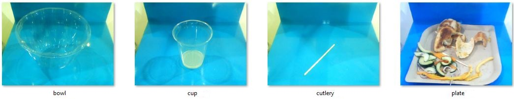
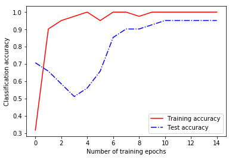

# Build and deploy image classification models with Azure Machine Learning

In this article, learn how to use **Azure Machine Learning Package for Computer Vision** to train, test, and deploy an image classification model. For more details, please check the API doc.

A large number of problems in the computer vision domain can be solved using image classification approaches. These include building models that answer questions such as, "Is an OBJECT present in the image?" (OBJECT can be "dog", "car", "ship", etc.) as well as more complex questions, like "What class of eye disease severity is evinced by this patient's retinal scan?"

When building and deploying this model, you go through the following steps:
1. Dataset Creation
2. Image Visualization and annotation
3. Image Augmentation
4. DNN Model Definition
5. Classifier Training
6. Evaluation and Visualization
7. Web service Deployment
8. Web service Load Testing

[CNTK](https://www.microsoft.com/en-us/cognitive-toolkit/) is used as the deep learning framework, training is performed locally on a GPU powered machine such as the ([Deep learning Data Science VM](https://azuremarketplace.microsoft.com/en-us/marketplace/apps/microsoft-ads.dsvm-deep-learning?tab=Overview)), and deployment uses the Azure ML Operationalization CLI.

## Prerequisites 

1. If you don't have an Azure subscription, create a [free account](https://azure.microsoft.com/free/?WT.mc_id=A261C142F) before you begin.

1. You need to install the Azure Machine Learning Package for Computer Vision.

1. You also need:
   - An Azure Machine Learning Experimentation account 
   - An Azure Machine Learning Model Management account
   - Azure Machine Learning Workbench installed

   If you don't have these prerequisites already, follow the steps in the [Quickstart: Install and start](../service/quickstart-installation.md) article to set up your accounts and install the Azure Machine Learning Workbench application. 

## Sample dataset and Jupyter notebook

The following example uses a dataset consisting of 63 tableware images, each labeled as belonging to one of four different classes (bowl, cup, cutlery, plate). The number of images in this example is small so that this tutorial can be executed quickly; in practice at least 100 images per class should be provided. All images are located at *"../sample_data/imgs_recycling/"*, in subdirectories called "bowl", "cup", "cutlery", and "plate".



> [!div class="nextstepaction"]
> [Try it yourself in this Jupyter notebook](https://github.com/Microsoft/ML-Server-Python-Samples/blob/master/operationalize/Explore_Consume_Python_Web_Services.ipynb)

                             
## Storage context

The storage context is used to determine where various output files such as augmented images or DNN model files will be stored (for more information abotu this see the StorageContext documentation). Normally, the storage content does not need to be set explicitly. However, when using the AML Workbench, to avoid its 25-MB limit on the project size, we are setting the Azure ML Package for Computer Vision outputs directory to point to a location outside the AML project ("../../../../cvtk_output"). Make sure to remove the "cvtk_output" directory once it is no longer needed.


```python
import warnings
warnings.filterwarnings("ignore")
import json, numpy as np, os, timeit 
from azureml.logging import get_azureml_logger
from imgaug import augmenters
from IPython.display import display
from sklearn import svm
from cvtk import ClassificationDataset, CNTKTLModel, Context, Splitter, StorageContext
from cvtk.augmentation import augment_dataset
from cvtk.core.classifier import ScikitClassifier
from cvtk.evaluation import ClassificationEvaluation, graph_roc_curve, graph_pr_curve, graph_confusion_matrix, basic_plot
import matplotlib.pyplot as plt
%matplotlib inline

# Disable printing of logging messages
from azuremltkbase.logging import ToolkitLogger
ToolkitLogger.getInstance().setEnabled(False)

# Set storage context.
out_root_path = "../../../cvtk_output"
Context.create(outputs_path=out_root_path, persistent_path=out_root_path, temp_path=out_root_path)
```


    {
        "storage": {
            "outputs_path": "../../../cvtk_output",
            "persistent_path": "../../../cvtk_output",
            "temp_path": "../../../cvtk_output"
        }
    }


## Create a dataset

Once you have imported the dependencies and set the storage context, you can create the dataset.

Create the Dataset object in the AML Package for Computer Vision is by providing the root directory of the images on the local disk. This directory has to follow the same general structure as the tableware dataset, that is, contain subdirectories with the actual images:
- root
    - label 1
    - label 2
    - ...
    - label n
  
Training an image classification model for a different dataset is therefore as easy as changing the root path `dataset_location` in the following code to point at different images.


```python
# Root image directory 
dataset_location = os.path.abspath(os.path.join(os.getcwd(), "../sample_data/imgs_recycling"))

dataset_name = 'recycling'
dataset = ClassificationDataset.create_from_dir(dataset_name, dataset_location)
print("Dataset consists of {} images with {} labels.".format(len(dataset.images), len(dataset.labels)))
print("Select information for image 2: name={}, label={}, unique id={}.".format(
    dataset.images[2].name, dataset.images[2]._labels[0].name, dataset.images[2]._storage_id))
```

    F1 2018-04-23 17:12:57,593 INFO azureml.vision:machine info {"is_dsvm": true, "os_type": "Windows"} 
    F1 2018-04-23 17:12:57,599 INFO azureml.vision:dataset creating dataset for scenario=classification 
    Dataset consists of 63 images with 4 labels.
    Select information for image 2: name=msft-plastic-bowl20170725152154282.jpg, label=bowl, unique id=3.

The dataset object provides functionality to download images using the [Bing Image Search API](https://azure.microsoft.com/en-us/services/cognitive-services/bing-image-search-api/). 

Two types of search queries are supported: 
+ Regular text queries
+ Image URL queries

These queries as well as the class label must be provided inside a json-encoded text file, such as:

```json
{
	"bowl": [
					"plastic bowl",
					"../imgs_recycling/bowl"
	],
	"cup": [
					"plastic cup",
					"../imgs_recycling/cup",
					"http://cdnimg2.webstaurantstore.com/images/products/main/123662/268841/dart-solo-ultra-clear-conex-tp12-12-oz-pet-plastic-cold-cup-1000-case.jpg"
	],
	"cutlery": [
					"plastic cutlery",
					"../imgs_recycling/cutlery",
					"http://img4.foodservicewarehouse.com/Prd/1900SQ/Fineline_2514-BO.jpg"
	],
	"plate": [
					"plastic plate",
					"../imgs_recycling/plate"
	]
}
```

Furthermore, a Context object needs to be created explicitly and contain the Bing Image Search API key that requires a Bing Image Search API subscription.     

## Visualize and annotate images

The following widget can be used to visualize the images in the dataset object, and to correct some of the labels if needed. In case you see a "Widget Javascript not detected" error, it can often be solved by running the command: 
  `jupyter nbextension enable --py --sys-prefix widgetsnbextension`


```python
from ui_utils.ui_annotation import AnnotationUI
annotation_ui = AnnotationUI(dataset, Context.get_global_context())
display(annotation_ui.ui)
```


    Tab(children=(HBox(children=(VBox(children=(HBox(children=(VBox(children=(Button(button_style='primary', descr…


## Augment images

The augmentation module provides functionality to augment a dataset object using all the transformations described in the [imgaug](https://github.com/aleju/imgaug) library. Image transformations can be grouped in a single pipeline, in which case all transformations in the pipeline are applied simultaneously each image. If you would like to apply different augmentation steps separately, or in any different manner, you can define multiple pipelines and pass them to the *augment_dataset* function. For more information and examples of image augmentation, see the [imgaug documentation](https://github.com/aleju/imgaug).

Adding augmented images to the training set is especially beneficial for small datasets. However, since it slows down DNN training due to the increased number of training images, it is recommended that you start experimentation without augmentation.


```python
# Split the dataset into train and test  
train_set_orig, test_set = dataset.split(train_size = 0.66, stratify = "label")
print("Number of training images = {}, test images = {}.".format(train_set_orig.size(), test_set.size()))
```

    F1 2018-04-23 17:13:01,780 INFO azureml.vision:splitter splitting a dataset 
    F1 2018-04-23 17:13:01,805 INFO azureml.vision:dataset creating dataset for scenario=classification 
    F1 2018-04-23 17:13:01,809 INFO azureml.vision:dataset creating dataset for scenario=classification 
    Number of training images = 41, test images = 22.
    


```python
augment_train_set = False

if augment_train_set:
    aug_sequence = augmenters.Sequential([
            augmenters.Fliplr(0.5),             # horizontally flip 50% of all images
            augmenters.Crop(percent=(0, 0.1)),  # crop images by 0-10% of their height/width
        ])
    train_set = augment_dataset(train_set_orig, [aug_sequence])
    print("Number of original training images = {}, with augmented images included = {}.".format(train_set_orig.size(), train_set.size()))
else:
    train_set = train_set_orig  
```

## Define DNN models

Six different per-trained Deep Neural Network models are supported in the Computer Vision Package: AlexNet, Resnet-18, Resnet-34, and Resnet-50, Resnet-101, and Resnet-152. These DNNs can be used either as classifier, or as featurizer (see step 5). More information about the networks can be found [here](https://github.com/Microsoft/CNTK/blob/master/PretrainedModels/Image.md), and a basic introduction to Transfer Learning is [here](https://blog.slavv.com/a-gentle-intro-to-transfer-learning-2c0b674375a0).

The Computer Vision Package comes with deparametersametes (224x224 pixel resolution and Resnet-18 DNN) which were selected to work well on a wide variety of tasks. Accuracy can often be imply, for example, by, for example,  increasing the image resolution to 500x500 pixels, and/or selecting a deeper model (Resnet-50), however this comes at a significant increase in training time. See the "How to improve accuracy" section in the Appendix for more detail, and why the minibatch-size and the learning rate need to be updated.


```python
# Default parameters (224 x 224 pixels resolution, Resnet-18)
lr_per_mb = [0.05]*7 + [0.005]*7 +  [0.0005]
mb_size = 32
input_resoluton = 224
base_model_name = "ResNet18_ImageNet_CNTK"

# Suggested parameters for 500 x 500 pixels resolution, Resnet-50
# (see in the Appendix "How to improve accuracy", last row in table)
# lr_per_mb   = [0.01] * 7 + [0.001] * 7 + [0.0001]
# mb_size    = 8
# input_resoluton = 500
# base_model_name = "ResNet50_ImageNet_CNTK"

# Initialize model
dnn_model = CNTKTLModel(train_set.labels,
                       base_model_name=base_model_name,
                       image_dims = (3, input_resoluton, input_resoluton))
```

    Successfully downloaded ResNet18_ImageNet_CNTK
    

## Train the classifier

The pre-trained DNN from the last section can be used in two ways:
  - DNN refinement: trains the DNN to directly perform the classification. While DNN training is slow, it typically leads to the best results since all network weights can be improved during training to give best accuracy.
  - DNN featurization: runs the DNN as-is to obtain a lower-dimensional representation of an image (512, 2048, or 4096 floats), which is then used as input to train a separate classifier. Since the DNN is kept unchanged, this approach is much faster compared to DNN refinement, however accuracy is not as good. Nevertheless, training an external classifier such as a linear SVM (shown below) can provide a strong baseline, and help with understanding the feasibility of a problem.
  
Tensorboard can be used to visualize the training progress. To activate, add the parameter `tensorboard_logdir=PATH` as shown below, start the tensorboard client by running in a new console the command `tensorboard --logdir=PATH`, and open a web-browser as instructed by tensorboard (default is localhost:6006). 


```python
# Train either the DNN or a SVM as classifier 
classifier_name = "dnn"

if classifier_name.lower() == "dnn":  
    dnn_model.train(train_set, lr_per_mb = lr_per_mb, mb_size = mb_size, eval_dataset=test_set) #, tensorboard_logdir=r"tensorboard"
    classifier = dnn_model
elif classifier_name.lower() == "svm":
    learner = svm.LinearSVC(C=1.0, class_weight='balanced', verbose=0)
    classifier = ScikitClassifier(dnn_model, learner = learner)
    classifier.train(train_set)
else:
    raise Exception("Classifier unknown: " + classifier)   
```

    F1 2018-04-23 17:13:28,238 INFO azureml.vision:Fit starting in experiment  1541466320 
    F1 2018-04-23 17:13:28,239 INFO azureml.vision:model starting training for scenario=classification 
    <class 'int'>
    1 worker
    Training transfer learning model for 15 epochs (epoch_size = 41).
    non-distributed mode
    Training 15741700 parameters in 53 parameter tensors.
    Training 15741700 parameters in 53 parameter tensors.
    Learning rate per minibatch: 0.05
    Momentum per minibatch: 0.9
    PROGRESS: 0.00%
    Finished Epoch[1 of 15]: [Training] loss = 2.820586 * 41, metric = 68.29% * 41 5.738s (  7.1 samples/s);
    Evaluation Set Error :: 29.27%
    Finished Epoch[2 of 15]: [Training] loss = 0.286728 * 41, metric = 9.76% * 41 0.752s ( 54.5 samples/s);
    Evaluation Set Error :: 34.15%
    Finished Epoch[3 of 15]: [Training] loss = 0.206938 * 41, metric = 4.88% * 41 0.688s ( 59.6 samples/s);
    Evaluation Set Error :: 41.46%
    Finished Epoch[4 of 15]: [Training] loss = 0.098931 * 41, metric = 2.44% * 41 0.785s ( 52.2 samples/s);
    Evaluation Set Error :: 48.78%
    Finished Epoch[5 of 15]: [Training] loss = 0.046547 * 41, metric = 0.00% * 41 0.724s ( 56.6 samples/s);
    Evaluation Set Error :: 43.90%
    Finished Epoch[6 of 15]: [Training] loss = 0.059709 * 41, metric = 4.88% * 41 0.636s ( 64.5 samples/s);
    Evaluation Set Error :: 34.15%
    Finished Epoch[7 of 15]: [Training] loss = 0.005817 * 41, metric = 0.00% * 41 0.710s ( 57.7 samples/s);
    Evaluation Set Error :: 14.63%
    Learning rate per minibatch: 0.005
    Finished Epoch[8 of 15]: [Training] loss = 0.014917 * 41, metric = 0.00% * 41 0.649s ( 63.2 samples/s);
    Evaluation Set Error :: 9.76%
    Finished Epoch[9 of 15]: [Training] loss = 0.040539 * 41, metric = 2.44% * 41 0.777s ( 52.8 samples/s);
    Evaluation Set Error :: 9.76%
    Finished Epoch[10 of 15]: [Training] loss = 0.024606 * 41, metric = 0.00% * 41 0.626s ( 65.5 samples/s);
    Evaluation Set Error :: 7.32%
    PROGRESS: 0.00%
    Finished Epoch[11 of 15]: [Training] loss = 0.004225 * 41, metric = 0.00% * 41 0.656s ( 62.5 samples/s);
    Evaluation Set Error :: 4.88%
    Finished Epoch[12 of 15]: [Training] loss = 0.004364 * 41, metric = 0.00% * 41 0.702s ( 58.4 samples/s);
    Evaluation Set Error :: 4.88%
    Finished Epoch[13 of 15]: [Training] loss = 0.007974 * 41, metric = 0.00% * 41 0.721s ( 56.9 samples/s);
    Evaluation Set Error :: 4.88%
    Finished Epoch[14 of 15]: [Training] loss = 0.000655 * 41, metric = 0.00% * 41 0.711s ( 57.7 samples/s);
    Evaluation Set Error :: 4.88%
    Learning rate per minibatch: 0.0005
    Finished Epoch[15 of 15]: [Training] loss = 0.024865 * 41, metric = 0.00% * 41 0.688s ( 59.6 samples/s);
    Evaluation Set Error :: 4.88%
    Stored trained model at ../../../cvtk_output\model_trained\ImageClassification.model
    F1 2018-04-23 17:13:45,097 INFO azureml.vision:Fit finished in experiment  1541466320 
    


```python
# Plot how the training and test accuracy increases during gradient descent. 
if classifier_name == "dnn":
    [train_accs, test_accs, epoch_numbers] = classifier.train_eval_accs
    plt.xlabel("Number of training epochs") 
    plt.ylabel("Classification accuracy") 
    train_plot = plt.plot(epoch_numbers, train_accs, 'r-', label = "Training accuracy")
    test_plot = plt.plot(epoch_numbers, test_accs, 'b-.', label = "Test accuracy")
    plt.legend()
```




## Evaluate and visualize

The evaluation module provides functionality to evaluate the performance of the trained model on an independent test dataset. Some of the evaluation metrics it computes are: accuracy (by default class-averaged), PR curve, ROC curve, area-under-curve, confusion matrix, etc.


```python
# Run the classifier on all test set images
ce = ClassificationEvaluation(classifier, test_set, minibatch_size = mb_size)

# Compute Accuracy and the confusion matrix
acc = ce.compute_accuracy()
print("Accuracy = {:2.2f}%".format(100*acc))
cm  = ce.compute_confusion_matrix()
print("Confusion matrix = \n{}".format(cm))

# Show PR curve, ROC curve, and confusion matrix
fig, ((ax1, ax2, ax3)) = plt.subplots(1,3)
fig.set_size_inches(18, 4)
graph_roc_curve(ce, ax=ax1)
graph_pr_curve(ce, ax=ax2)
graph_confusion_matrix(ce, ax=ax3)
plt.show()
```

    F1 2018-04-23 17:14:37,449 INFO azureml.vision:evaluation doing evaluation for scenario=classification 
    F1 2018-04-23 17:14:37,450 INFO azureml.vision:model scoring dataset for scenario=classification 
    Accuracy = 95.45%
    Confusion matrix = 
    [[ 0  1  0  1]
     [ 0  7  0  0]
     [ 0  0  2  0]
     [ 0  0  0 11]]
    


```python
# Results viewer UI
labels = [l.name for l in dataset.labels] 
pred_scores = ce.scores #classification scores for all images and all classes
pred_labels = [labels[i] for i in np.argmax(pred_scores, axis=1)]

from ui_utils.ui_results_viewer import ResultsUI
results_ui = ResultsUI(test_set, Context.get_global_context(), pred_scores, pred_labels)
display(results_ui.ui)
```


    Tab(children=(HBox(children=(VBox(children=(HBox(children=(Button(description='Image -1', layout=Layout(width=…


```python
# Precision / recall curve UI
precisions, recalls, thresholds = ce.compute_precision_recall_curve() 
thresholds = list(thresholds)
thresholds.append(thresholds[-1])
from ui_utils.ui_precision_recall import PrecisionRecallUI
pr_ui = PrecisionRecallUI(100*precisions[::-1], 100*recalls[::-1], thresholds[::-1])
display(pr_ui.ui) 
```


    VBox(children=(Figure(axes=[Axis(label='Precision', orientation='vertical', scale=LinearScale(max=100.0, min=0…


## Deploy web services


<b>Introduction:</b></n>

Operationalization is the process of publishing models and code as web services and the consumption of these services to produce business results. Once your model is trained, we can deploy your trained model as a webservice for consumption with [Azure Machine Learning CLI](https://docs.microsoft.com/en-us/azure/machine-learning/preview/cli-for-azure-machine-learning). Your models can be deployed to your local machine or Azure Container Service (ACS) cluster as a webservice. You can scale your webservice with Azure Container Service (ACS) cluster. It also provides some autoscaling functionality for your webservice.


<b>Prerequisite:</b> 
   - You need an [Azure](https://azure.microsoft.com/en-us/) account with a valid subscription. You need to login to your account if you haven't done so. Change to your target subscription if you need.
   >Azure CLI command to login: 
   `az login` 
   
   >Azure CLI command to change subscription: 
   `az account set --subscription [your subscription name]` 
   
   - You need an [Azure ML Model Management](https://docs.microsoft.com/en-us/azure/machine-learning/preview/model-management-overview) account. Set your model management account if you haven't done it before. **Note: Create your Azure Machine Learning Model Management account with location of "westcentralus", avoiding "eastus2" for now (Because some locations are having deployment timeout issue, which the Azure Machine Learning CLI team is going to fix).** For more details, you can follow the instruction from this [page](https://docs.microsoft.com/en-us/azure/machine-learning/preview/deployment-setup-configuration#create-a-model-management-account) to create one. You can use this CLI command to show your active model management account: `az ml account modelmanagement show`
   >Azure CLI command example to create and set model management account:
   ```
   az ml account modelmanagement create -l [Azure region, e.g. westcentralus] -n [your account name] -g [resource group name] --sku-instances [number of instances, e.g. 1] --sku-name [Pricing tier for example S1]
   az ml account modelmanagement set -n [your account name] -g [resource group it was created in]
   ``` 
   - You need a deployment environment. If you've already set the deployment environment before running the image classification sample notebook, you don't need to do it again. If you don't have one, please follow the following instruction in this [page](https://docs.microsoft.com/en-us/azure/machine-learning/preview/deployment-setup-configuration#environment-setup) to set up a deployment environment. Be sure to follow the local or cluster deployment setup steps correctly based on your need. <b>Note:</b> The local environment deployment is not supported for the Windows DSVM/DLVM today. However, local deployment is supported for Linux and Windows 10. The cluster environment deployment is supported for both Linux and Windows. You only need to set it once. You can use this CLI command to show your active deployment environment: az ml env show
   
   >Azure CLI command example to create and set deployment environment
    ```
    az provider register -n Microsoft.MachineLearningCompute
    az provider register -n Microsoft.ContainerRegistry
    az provider register -n Microsoft.ContainerService
    az ml env setup --cluster -n [your environment name] -l [Azure region e.g. westcentralus] [-g [resource group]]
    az ml env set -n [environment name] -g [resource group]
    az ml env cluster
    ```
    
   
<b>Deployment API:</b>

> **Examples:**
- ```deploy_obj = AMLDeployment(deployment_name=deployment_name, associated_DNNModel=dnn_model, aml_env="cluster")``` # create deployment object
- ```deploy_obj.deploy()``` # deploy web service
- ```deploy_obj.score_image(local_image_path_or_image_url)``` # score an image
- ```deploy_obj.delete()``` # delete the web service
- ```deploy_obj.build_docker_image()``` # build docker image without creating webservice
- ```AMLDeployment.list_deployment()``` # list existing deployment
- ```AMLDeployment.delete_if_service_exist(deployment_name)``` # delete if the service exists with the deployment name

<b>API Documentation:</b>

For more API details, refer to the API doc. For more advanced operations related to deployment, refer to the [model management CLI reference](https://docs.microsoft.com/en-us/azure/machine-learning/preview/model-management-cli-reference).

<b>Deployment management with portal:</b>

You can go to [Azure portal](https://ms.portal.azure.com/) to track and manage your deployments. From Azure portal, find your Machine Learning Model Management account page (You can search for your model management account name). Then go to: the model management account page->Model Management->Services.


```python
# ##### OPTIONAL###### 
# Interactive CLI setup helper, including model management account and deployment environment.
# If you haven't setup you CLI before or if you want to change you CLI settings, you can use this block to help you interactively.
#
# UNCOMMENT THE FOLLOWING LINES IF YOU HAVE NOT CREATED OR SET THE MODEL MANAGEMENT ACCOUNT AND DEPLOYMENT ENVIRONMENT
#
# from azuremltkbase.deployment import CliSetup
# CliSetup().run()
```


```python
# # Optional. Persist you model on disk and reuse it later for deployment. 
# from cvtk import TFFasterRCNN, Context
# import os
# save_model_path = os.path.join(Context.get_global_context().storage.persistent_path, "saved_classifier.model")
# # Save model to disk
# dnn_model.serialize(save_model_path)
# # Load model from disk
# dnn_model = CNTKTLModel.deserialize(save_model_path)
```


```python
from cvtk.operationalization import AMLDeployment

# set deployment name
deployment_name = "wsdeployment"

# Optional azure machine learning deployment cluster name (environment name) and resource group name
# If you don't provide here. It will use the current deployment environment (you can check with CLI command "az ml env show").
azureml_rscgroup = "<resource group>"
cluster_name = "<cluster name>"

# If you provide the cluster information, it will use the provided cluster to deploy. 
# Example: deploy_obj = AMLDeployment(deployment_name=deployment_name, associated_DNNModel=dnn_model,
#                            aml_env="cluster", cluster_name=cluster_name, resource_group=azureml_rscgroup, replicas=1)

# Create deployment object
deploy_obj = AMLDeployment(deployment_name=deployment_name, aml_env="cluster", associated_DNNModel=dnn_model, replicas=1)

# Check if the deployment name exists, if yes remove it first.
if deploy_obj.is_existing_service():
    AMLDeployment.delete_if_service_exist(deployment_name)
    
# create the webservice
print("Deploying to Azure cluster...")
deploy_obj.deploy()
print("Deployment DONE")
```

## Consume the web service 

Once you created the webservice, you can score images with the deployed webservice. You have several options:

   - You can directly score the webservice with the deployment object with: deploy_obj.score_image(image_path_or_url) 
   - Or, you can use the Service endpoint url and Service key (None for local deployment) with: AMLDeployment.score_existing_service_with_image(image_path_or_url, service_endpoint_url, service_key=None)
   - Form your http requests directly to score the webservice endpoint (For advanced users).

### Score with existing deployment object
```
deploy_obj.score_image(image_path_or_url)
```


```python
# Score with existing deployment object

# Score local image with file path
print("Score local image with file path")
image_path_or_url = test_set.images[0].storage_path
print("Image source:",image_path_or_url)
serialized_result_in_json = deploy_obj.score_image(image_path_or_url, image_resize_dims=[224,224])
print("serialized_result_in_json:", serialized_result_in_json)

# Score image url and remove image resizing
print("Score image url")
image_path_or_url = "https://cvtkdata.blob.core.windows.net/publicimages/microsoft_logo.jpg"
print("Image source:",image_path_or_url)
serialized_result_in_json = deploy_obj.score_image(image_path_or_url)
print("serialized_result_in_json:", serialized_result_in_json)

# Score image url with added paramters. Add softmax to score.
print("Score image url with added paramters. Add softmax to score")
from cvtk.utils.constants import ClassificationRESTApiParamters
image_path_or_url = "https://cvtkdata.blob.core.windows.net/publicimages/microsoft_logo.jpg"
print("Image source:",image_path_or_url)
serialized_result_in_json = deploy_obj.score_image(image_path_or_url, image_resize_dims=[224,224], parameters={ClassificationRESTApiParamters.ADD_SOFTMAX:True})
print("serialized_result_in_json:", serialized_result_in_json)
```


```python
# Time image scoring
import timeit

for img_index, img_obj in enumerate(test_set.images[:10]):
    print("Calling API for image {} of {}: {}...".format(img_index, len(test_set.images), img_obj.name))
    tic = timeit.default_timer()
    return_json = deploy_obj.score_image(img_obj.storage_path, image_resize_dims=[224,224])
    print("   Time for API call: {:.2f} seconds".format(timeit.default_timer() - tic))
    print(return_json)
```

### Score with service endpoint url and service key
`AMLDeployment.score_existing_service_with_image(image_path_or_url, service_endpoint_url, service_key=None)`


```python
# Import related classes and functions
from cvtk.operationalization import AMLDeployment

service_endpoint_url = "" # please replace with your own service url
service_key = "" # please replace with your own service key
# score local image with file path
image_path_or_url = test_set.images[0].storage_path
print("Image source:",image_path_or_url)
serialized_result_in_json = AMLDeployment.score_existing_service_with_image(image_path_or_url,service_endpoint_url, service_key = service_key)
print("serialized_result_in_json:", serialized_result_in_json)

# score image url
image_path_or_url = "https://cvtkdata.blob.core.windows.net/publicimages/microsoft_logo.jpg"
print("Image source:",image_path_or_url)
serialized_result_in_json = AMLDeployment.score_existing_service_with_image(image_path_or_url,service_endpoint_url, service_key = service_key, image_resize_dims=[224,224])
print("serialized_result_in_json:", serialized_result_in_json)
```

### Score endpoint with http request directly
Following is some example code to form the http request directly in Python. You can do it in other programming languages.


```python
def score_image_list_with_http(images, service_endpoint_url, service_key=None, parameters={}):
    """Score image list with http request

    Args:
        images(list): list of (input image file path, base64 image string, url or buffer)
        service_endpoint_url(str): endpoint url
        service_key(str): service key, None for local deployment.
        parameters(dict): service additional paramters in dictionary


    Returns:
        result (list): list of serialized result 
    """
    import requests
    from io import BytesIO
    import base64
    routing_id = ""

    if service_key is None:
        headers = {'Content-Type': 'application/json',
                   'X-Marathon-App-Id': routing_id}
    else:
        headers = {'Content-Type': 'application/json',
                   "Authorization": ('Bearer ' + service_key), 'X-Marathon-App-Id': routing_id}
    payload = []
    for image in images:
        encoded = None
        # read image
        with open(image,'rb') as f:
            image_buffer = BytesIO(f.read()) ## Getting an image file represented as a BytesIO object
        # convert your image to base64 string
        encoded = base64.b64encode(image_buffer.getvalue())
        image_request = {"image_in_base64": "{0}".format(encoded), "parameters": parameters}
        payload.append(image_request)
    body = json.dumps(payload)
    r = requests.post(service_endpoint_url, data=body, headers=headers)
    try:
        result = json.loads(r.text)
    except:
        raise ValueError("Incorrect output format. Result cant not be parsed: " + r.text)
    return result

# Test with images
images = [test_set.images[0].storage_path, test_set.images[1].storage_path] # A list of local image files
score_image_list_with_http(images, service_endpoint_url, service_key)
```

## Parse serialized result from web service
The result from the webservice is in json string. You can parse it the with different DNN model classes


```python
image_path_or_url = test_set.images[0].storage_path
print("Image source:",image_path_or_url)
serialized_result_in_json = deploy_obj.score_image(image_path_or_url, image_resize_dims=[224,224])
print("serialized_result_in_json:", serialized_result_in_json)
```


```python
# Parse result from json string
import numpy as np
parsed_result = CNTKTLModel.parse_serialized_result(serialized_result_in_json)
print("Parsed result:", parsed_result)
# Map result to image class
class_index = np.argmax(np.array(parsed_result))
print("Class index:", class_index)
dnn_model.class_map
print("Class label:", dnn_model.class_map[class_index])
```


## Next steps

For information about the Azure Machine Learning Package for Computer Vision:

+ Check out the reference documentation

+ Learn how to [improve the accuracy of this model](how-to-improve-accuracy-for-computer-vision-models.md)

+ Learn about [other Python packages for Azure Machine Learning](reference-python-package-overview.md)