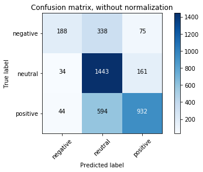

# Build and deploy text classification models with Azure Machine Learning

In this article, learn how to use **Azure Machine Learning Package for Text Analytics** to train and deploy a text classification model. The goal of text classification is to assign a piece of text to one or more predefined classes or categories. The piece of text could be a document, news article, search query, email, tweet, support tickets, customer feedback, user product review etc. 

There are broad applications of text classification such as: 
+ Categorizing newspaper articles and news wire contents into topics
+ Organizing web pages into hierarchical categories 
+ Filtering spam email
+ Sentiment analysis
+ Predicting user intent from search queries
+ Routing support tickets
+ Analyzing customer feedback 

The model building and deployment workflow for a text classification model with Azure Machine Learning Package for Text Analytics is as follows:

1. Load the data
2. Train the model
3. Apply the classifier 
4. Evaluate model performance
5. Save the pipeline
6. Test the pipeline
8. Deploy the model as a web service

This sample code uses a scikit-learn pipeline.

Consult the [package reference documentation](https://aka.ms/aml-packages/text) for the detailed reference for each module and class.


## Prerequisites 

1. If you don't have an Azure subscription, create a [free account](https://azure.microsoft.com/free/?WT.mc_id=A261C142F) before you begin.

1. The following accounts and application must be set up and installed:
   - Azure Machine Learning Experimentation account 
   - An Azure Machine Learning Model Management account
   - Azure Machine Learning Workbench installed

   If these three are not yet created or installed, follow the [Azure Machine Learning Quickstart and Workbench installation](../service/quickstart-installation.md) article. 

1. The Azure Machine Learning Package for Text Analytics must be installed. Learn how to [install this package here](https://aka.ms/aml-packages/text).


## Sample data and Jupyter notebook

### Get the Jupyter notebook

Try it out yourself. Download the notebook and run it yourself.

> [!div class="nextstepaction"]
> [Get the Jupyter notebook](https://aka.ms/aml-packages/text/notebooks/text_classification_sentiment_data)

### Explore the sample data
The following example uses a partial set of the [Sentiment Analysis Semval-2013](https://www.cs.york.ac.uk/semeval-2013/task2/index.php%3Fid=data.html) dataset to demonstrate how to create a text classifier with Azure Machine Learning Package for Text Analytics and scikit-learn. 

## Load data and explore

Define and get the data that you will use to run the classifier.

Input dataset is a *.tsv file with the following [ID, Text, Label] format. 


```python
# Import Packages 
# Use Azure Machine Learning history magic to control history collection
# History is off by default, options are "on", "off", or "show"
#%azureml history on

# Use the Azure Machine Learning data collector to log various metrics
from azureml.logging import get_azureml_logger
import os

logger = get_azureml_logger()

# Log cell runs into run history
logger.log('Cell','Set up run')
# from tatk.utils import load_newsgroups_data, data_dir, dictionaries_dir, models_dir
import pip
pip.main(["show", "azureml-tatk"])
```

Get training and test data sets from Azure blob storage and then update data paths to load your data.

Set the following blob parameters using the [load_data](https://docs.microsoft.com/python/api/tatk.utils.load_data?view) module to point to your blob or set the _resource_dir_ path to read a file from a local directory.

To use your own blob storage, update the following load_data module parameters: 
|Parameter name|Parameter for sample|
|---|---|
|connection_string|Replace None with your connection string|
|container_name|Replace None with your container name|
|blob_name|Replace the subdirectory "sentiment" and the file name for training and test data, for example "SemEval2013.Train.tsv" and "SemEval2013.Test.tsv"|


```python
from tatk.utils import download_blob_from_storage, resources_dir, data_dir

#set the working directory where to save the training data files
resources_dir = os.path.join(os.path.expanduser("~"), "tatk", "resources")

download_blob_from_storage(download_dir=resources_dir, 
                           #connection_string=None, 
                           #container_name=None,
                            blob_name=os.path.join("sentiment", "SemEval2013.Train.tsv"))
        
download_blob_from_storage(download_dir=resources_dir, 
                               blob_name=os.path.join("sentiment", "SemEval2013.Test.tsv"))
```

Specify the local paths to the training and test sets. Load them into pandas dataframes:

```python
import pandas as pd
# Training Dataset Location
file_path = os.path.join(resources_dir, "sentiment", "SemEval2013.Train.tsv")

df_train = pd.read_csv(file_path,
                        sep = '\t',                        
                        header = 0, names= ["id","text","label"])
df_train.head()
print("df_train.shape= {}".format(df_train.shape))

# Test Dataset Location
df_test = pd.read_csv(os.path.join(resources_dir,"sentiment", "SemEval2013.Test.tsv"),
                        sep = '\t',                        
                        header = 0, names= ["id","text","label"])

print("df_test.shape= {}".format(df_test.shape))
print(df_test.head())
```

    df_train.shape= (8655, 3)
    df_test.shape= (3809, 3)
       id                                               text     label
    0   1  @killa_1983 - If you ain't doing nothing Satur...  positive
    1   2  - Pop bottles , make love , thug passion , RED...  positive
    2   3  @TheScript_Danny @thescript - St Patricks Day ...  positive
    3   4  @TheScript_Danny @thescript - St Patricks Day ...  positive
    4   5  @DJT103 - You know what the holidays alright w...  positive
    
The data consists of ID, text and the labels 'Positive', 'Neutral', or 'Negative'. 

Now, you can create a preliminary exploration plot histogram of the class frequency in training and test data sets. 

```python
import numpy as np
import math
from matplotlib import pyplot as plt

data = df_train["label"].values
labels = set(data)
print(labels)
bins = range(len(labels)+1) 

#plt.xlim([min(data)-5, max(data)+5])

plt.hist(data, bins=bins, alpha=0.8)
plt.title('training data distribution over the class labels)')
plt.xlabel('class label')
plt.ylabel('frequency')
plt.grid(True)
plt.show()

data = df_test["label"].values
labels = set(data)
print(labels)
bins = range(len(labels)+1) 

#plt.xlim([min(data)-5, max(data)+5])

plt.hist(data, bins=bins, alpha=0.8)
plt.title('test data distribution over the class labels)')
plt.xlabel('class label')
plt.ylabel('frequency')
plt.grid(True)
plt.show()
```

```
    {'negative', 'neutral', 'positive'}
    


    <matplotlib.figure.Figure at 0x1cce9385b38>


    {'negative', 'neutral', 'positive'}
    


    <matplotlib.figure.Figure at 0x1cce90ea128>
```

## Train the model

### Specify scikitlearn algorithm and define the text classifier

This step involves training a Scikit-learn text classification model using One-versus-Rest LogisticRegression learning algorithm.

Refer to the full list of [Scikit Learners](http://scikit-learn.org/stable/supervised_learning) for more information.

```python
from sklearn.linear_model import LogisticRegression
import tatk
from tatk.pipelines.text_classification.text_classifier import TextClassifier

log_reg_learner =  LogisticRegression(penalty='l2', dual=False, tol=0.0001, 
                            C=1.0, fit_intercept=True, intercept_scaling=1, 
                            class_weight=None, random_state=None, 
                            solver='lbfgs', max_iter=100, multi_class='ovr',
                            verbose=1, warm_start=False, n_jobs=3) 

#train the model a text column "tweets"
text_classifier = TextClassifier(estimator=log_reg_learner, 
                                text_cols = ["text"], 
                                label_cols = ["label"], 
#                                 numeric_cols = None,
#                                 cat_cols = None, 
                                extract_word_ngrams=True, extract_char_ngrams=True)

```

    TextClassifier::create_pipeline ==> start
    :: number of jobs for the pipeline : 6
    0	text_nltk_preprocessor
    1	text_word_ngrams
    2	text_char_ngrams
    3	assembler
    4	learner
    TextClassifier::create_pipeline ==> end
    
### Fit the model

Use the default parameters of the package. By default, the text classifier extracts:
+ Word unigrams and bigrams
+ Character 4 grams

```python
text_classifier.fit(df_train)        
```
    TextClassifier::fit ==> start
    schema: col=id:I8:0 col=text:TX:1 col=label:TX:2 header+
    NltkPreprocessor::tatk_fit_transform ==> start
    NltkPreprocessor::tatk_fit_transform ==> end 	 Time taken: 0.0 mins
    NGramsVectorizer::tatk_fit_transform ==> startNGramsVectorizer::tatk_fit_transform ==> start
    
    			vocabulary size=12839
    NGramsVectorizer::tatk_fit_transform ==> end 	 Time taken: 0.03 mins
    			vocabulary size=14635
    NGramsVectorizer::tatk_fit_transform ==> end 	 Time taken: 0.03 mins
    VectorAssembler::transform ==> start, num of input records=8655
    (8655, 12839)
    (8655, 14635)
    all_features::
    (8655, 27474)
    Time taken: 0.0 mins
    VectorAssembler::transform ==> end
    LogisticRegression::tatk_fit ==> start
    
    [Parallel(n_jobs=3)]: Done   3 out of   3 | elapsed:    2.1s finished
   
    LogisticRegression::tatk_fit ==> end 	 Time taken: 0.04 mins
    Time taken: 0.08 mins
    TextClassifier::fit ==> end
    
    TextClassifier(add_index_col=False, callable_proprocessors_list=None,
            cat_cols=None, char_hashing_original=False, col_prefix='tmp_00_',
            decompose_n_grams=False, detect_phrases=False,
            dictionary_categories=None, dictionary_file_path=None,
            embedding_file_path=None, embedding_file_path_fasttext=None,
            estimator=LogisticRegression(C=1.0, class_weight=None, dual=False, fit_intercept=True,
              intercept_scaling=1, max_iter=100, multi_class='ovr', n_jobs=3,
              penalty='l2', random_state=None, solver='lbfgs', tol=0.0001,
              verbose=1, warm_start=False),
            estimator_vectorizers_list=None, extract_char_ngrams=True,
            extract_word_ngrams=True, label_cols=['label'], numeric_cols=None,
            pos_tagger_vectorizer=False,
            preprocessor_dictionary_file_path=None, regex_replcaement='',
            replace_regex_pattern=None, scale_numeric_cols=False,
            text_callable_list=None, text_cols=['text'], text_regex_list=None,
            weight_col=None)

### Examine and set the parameters of the different pipeline steps

Although the fitting of a scikit-learn model, preprocessing is being done prior to fitting using a pipeline of preprocessor and featurizer (transformation) steps. Hence, the reference to a "pipeline" for training. During evaluation, the full pipeline, including preprocessing and scikit-learn model prediction, is applied to a testing data set.

***Example shown with text_word_ngrams*** 

Typically, you set the parameters before you fit a model. 

The following code samples show you how to train the model using the default pipeline and model parameters. 

To see what parameters are included for "text_word_ngrams", use [get_step_param_names_by_name](https://docs.microsoft.com/python/api/tatk.core.base_text_model.basetextmodel). This function returns the parameters such as lowercase, input_col, output_col and so on. 

```python
text_classifier.get_step_param_names_by_name("text_word_ngrams")
```

    ['input',
     'max_features',
     'output_col',
     'min_df',
     'binary',
     'tokenizer',
     'save_overwrite',
     'n_hashing_features',
     'max_df',
     'vocabulary',
     'hashing',
     'lowercase',
     'analyzer',
     'stop_words',
     'smooth_idf',
     'input_col',
     'dtype',
     'preprocessor',
     'token_pattern',
     'use_idf',
     'ngram_range',
     'sublinear_tf',
     'encoding',
     'strip_accents',
     'norm',
     'decode_error']

Next, check the parameter values for "text_char_ngrams":

```python
text_classifier.get_step_params_by_name("text_char_ngrams")        
```
    {'analyzer': 'char_wb',
     'binary': False,
     'decode_error': 'strict',
     'dtype': numpy.float32,
     'encoding': 'utf-8',
     'hashing': False,
     'input': 'content',
     'input_col': 'NltkPreprocessor5283a730506549cc880f074e750607b0',
     'lowercase': True,
     'max_df': 1.0,
     'max_features': None,
     'min_df': 3,
     'n_hashing_features': None,
     'ngram_range': (4, 4),
     'norm': 'l2',
     'output_col': 'NGramsVectorizer8eb11031f6b64eaaad9ff0fd3b0f5b80',
     'preprocessor': None,
     'save_overwrite': True,
     'smooth_idf': True,
     'stop_words': None,
     'strip_accents': None,
     'sublinear_tf': False,
     'token_pattern': '(?u)\\b\\w\\w+\\b',
     'tokenizer': None,
     'use_idf': True,
     'vocabulary': None}

If necessary, you can change the default parameters.  With the following code, you can change the range of extracted character n-grams from (4,4) to (3,4) to extract both character tri-grams and 4 grams:

```python
text_classifier.set_step_params_by_name("text_char_ngrams", ngram_range =(3,4)) 
text_classifier.get_step_params_by_name("text_char_ngrams")
```
    {'analyzer': 'char_wb',
     'binary': False,
     'decode_error': 'strict',
     'dtype': numpy.float32,
     'encoding': 'utf-8',
     'hashing': False,
     'input': 'content',
     'input_col': 'NltkPreprocessor5283a730506549cc880f074e750607b0',
     'lowercase': True,
     'max_df': 1.0,
     'max_features': None,
     'min_df': 3,
     'n_hashing_features': None,
     'ngram_range': (3, 4),
     'norm': 'l2',
     'output_col': 'NGramsVectorizer8eb11031f6b64eaaad9ff0fd3b0f5b80',
     'preprocessor': None,
     'save_overwrite': True,
     'smooth_idf': True,
     'stop_words': None,
     'strip_accents': None,
     'sublinear_tf': False,
     'token_pattern': '(?u)\\b\\w\\w+\\b',
     'tokenizer': None,
     'use_idf': True,
     'vocabulary': None}

### Export the parameters to a file
If needed, you can optimize model performance by rerunning the model fitting step with revised parameters:

```python
import os
params_file_path = os.path.join(data_dir, "params.tsv")
text_classifier.export_params(params_file_path)
```

## Apply the classifier

Apply the trained text classifier on the test dataset to generate class predictions:

```python
 df_test = text_classifier.predict(df_test)
```

    TextClassifier::predict ==> start
    NltkPreprocessor::tatk_transform ==> start
    NltkPreprocessor::tatk_transform ==> end 	 Time taken: 0.0 mins
    NGramsVectorizer::tatk_transform ==> startNGramsVectorizer::tatk_transform ==> start
    
    NGramsVectorizer::tatk_transform ==> end 	 Time taken: 0.01 mins
    NGramsVectorizer::tatk_transform ==> end 	 Time taken: 0.01 mins
    VectorAssembler::transform ==> start, num of input records=3809
    (3809, 12839)
    (3809, 14635)
    all_features::
    (3809, 27474)
    Time taken: 0.0 mins
    VectorAssembler::transform ==> end
    LogisticRegression::tatk_predict ==> start
    LogisticRegression::tatk_predict ==> end 	 Time taken: 0.0 mins
    Time taken: 0.02 mins
    TextClassifier::predict ==> end

## Evaluate model performance
The [evaluation module](https://docs.microsoft.com/python/api/tatk.evaluation) evaluates the accuracy of the trained text classifier on the test dataset. The evaluate function generates a confusion matrix and provides a macro-F1 score.

```python
 text_classifier.evaluate(df_test)          
```

    TextClassifier::evaluate ==> start
    schema: col=id:I8:0 col=text:TX:1 col=label:TX:2 col=prediction:TX:3 header+
    NltkPreprocessor::tatk_transform ==> start
    NltkPreprocessor::tatk_transform ==> end 	 Time taken: 0.0 mins
    NGramsVectorizer::tatk_transform ==> startNGramsVectorizer::tatk_transform ==> start
    
    NGramsVectorizer::tatk_transform ==> end 	 Time taken: 0.01 mins
    NGramsVectorizer::tatk_transform ==> end 	 Time taken: 0.01 mins
    VectorAssembler::transform ==> start, num of input records=3809
    (3809, 12839)
    (3809, 14635)
    all_features::
    (3809, 27474)
    Time taken: 0.0 mins
    VectorAssembler::transform ==> end
    LogisticRegression::tatk_predict ==> start
    LogisticRegression::tatk_predict ==> end 	 Time taken: 0.0 mins
    [[ 188  338   75]
     [  34 1443  161]
     [  44  594  932]]
    macro_f1 = 0.6112103240853114
    Time taken: 0.02 mins
    TextClassifier::evaluate ==> end
  
    (array([[ 188,  338,   75],
            [  34, 1443,  161],
            [  44,  594,  932]], dtype=int64), 0.6112103240853114)

Plot the confusion matrix for visualization.

```python
# Confusion Matrix UI 
from sklearn.metrics import confusion_matrix
import matplotlib.pyplot as plt
import itertools
def plot_confusion_matrix(cm, classes,
                          normalize=False,
                          title='Confusion matrix',
                          cmap=plt.cm.Blues):
    """
    This function prints and plots the confusion matrix.
    Normalization can be applied by setting `normalize=True`.
    """
    if normalize:
        cm = cm.astype('float') / cm.sum(axis=1)[:, np.newaxis]
        print("Normalized confusion matrix")
    else:
        print('Confusion matrix, without normalization')

    print(cm)

    plt.imshow(cm, interpolation='nearest', cmap=cmap)
    plt.title(title)
    plt.colorbar()
    tick_marks = np.arange(len(classes))
    plt.xticks(tick_marks, classes, rotation=45)
    plt.yticks(tick_marks, classes)

    fmt = '.2f' if normalize else 'd'
    thresh = cm.max() / 2.
    for i, j in itertools.product(range(cm.shape[0]), range(cm.shape[1])):
        plt.text(j, i, format(cm[i, j], fmt),
                 horizontalalignment="center",
                 color="white" if cm[i, j] > thresh else "black")

    plt.tight_layout()
    plt.ylabel('True label')
    plt.xlabel('Predicted label')
    
class_labels = set(df_train['label'].values)
print(class_labels)
```
    {'negative', 'neutral', 'positive'}
    
```python
import numpy as np
np.set_printoptions(precision=2)

#create the confusion matrix
cnf_matrix = confusion_matrix(y_pred=df_test['prediction'].values, y_true=df_test['label'].values)

# Plot non-normalized confusion matrix
plt.figure()
plot_confusion_matrix(cnf_matrix, classes = class_labels,
                      title='Confusion matrix, without normalization')

# Plot normalized confusion matrix
plt.figure()
plot_confusion_matrix(cnf_matrix, classes = class_labels, normalize=True,
                      title='Normalized confusion matrix')

plt.show()
```

    Confusion matrix, without normalization
    [[ 188  338   75]
     [  34 1443  161]
     [  44  594  932]]
    Normalized confusion matrix
    [[0.31 0.56 0.12]
     [0.02 0.88 0.1 ]
     [0.03 0.38 0.59]]
   



## Save the pipeline
Save the classification pipeline into a zip file. Also, save the word-ngrams and character n-grams as text files.

```python
import os
working_dir = os.path.join(data_dir, 'outputs')  
if not os.path.exists(working_dir):
    os.makedirs(working_dir)

# you can save the trained model as a folder or a zip file
model_file = os.path.join(working_dir, 'sk_model.zip')    
text_classifier.save(model_file)
# %azureml upload outputs/models/sk_model.zip

```
    BaseTextModel::save ==> start
    TatkPipeline::save ==> start
    Time taken: 0.03 mins
    TatkPipeline::save ==> end
    Time taken: 0.04 mins
    BaseTextModel::save ==> end
    
```python
# for debugging, you can save the word n-grams vocabulary to a text file
word_vocab_file_path = os.path.join(working_dir, 'word_ngrams_vocabulary.tsv')
text_classifier.get_step_by_name("text_word_ngrams").save_vocabulary(word_vocab_file_path) 
# %azureml upload outputs/dictionaries/word_ngrams_vocabulary.pkl

# for debugging, you can save the character n-grams vocabulary to a text file
char_vocab_file_path = os.path.join(working_dir, 'char_ngrams_vocabulary.tsv')
text_classifier.get_step_by_name("text_char_ngrams").save_vocabulary(char_vocab_file_path) 
# %azureml upload outputs/dictionaries/char_ngrams_vocabulary.pkl
```

    save_vocabulary ==> start
    saving 12839 n-grams ...
    Time taken: 0.0 mins
    save_vocabulary ==> end
    save_vocabulary ==> start
    saving 14635 n-grams ...
    Time taken: 0.0 mins
    save_vocabulary ==> end
 
## Load the pipeline
Load the classification pipeline and the word-ngrams and character n-grams for inferencing:

```python
# in order to deploy the trained model, you have to load the zip file of the classifier pipeline
loaded_text_classifier = TextClassifier.load(model_file)

from tatk.feature_extraction import NGramsVectorizer
word_ngram_vocab = NGramsVectorizer.load_vocabulary(word_vocab_file_path)
char_ngram_vocab = NGramsVectorizer.load_vocabulary(char_vocab_file_path)
```

    BaseTextModel::load ==> start
    TatkPipeline::load ==> start
    Time taken: 0.01 mins
    TatkPipeline::load ==> end
    Time taken: 0.02 mins
    BaseTextModel::load ==> end
    loading 12839 n-grams ...
    loading 14635 n-grams ...
    

## Test the pipeline

To evaluate a test dataset, apply the loaded text classification pipeline:

```python
loaded_text_classifier.evaluate(df_test)
```
    TextClassifier::evaluate ==> start
    schema: col=id:I8:0 col=text:TX:1 col=label:TX:2 col=prediction:TX:3 header+
    NltkPreprocessor::tatk_transform ==> start
    NltkPreprocessor::tatk_transform ==> end 	 Time taken: 0.0 mins
    NGramsVectorizer::tatk_transform ==> startNGramsVectorizer::tatk_transform ==> start
    
    NGramsVectorizer::tatk_transform ==> end 	 Time taken: 0.0 mins
    NGramsVectorizer::tatk_transform ==> end 	 Time taken: 0.01 mins
    VectorAssembler::transform ==> start, num of input records=3809
    (3809, 12839)
    (3809, 14635)
    all_features::
    (3809, 27474)
    Time taken: 0.0 mins
    VectorAssembler::transform ==> end
    LogisticRegression::tatk_predict ==> start
    LogisticRegression::tatk_predict ==> end 	 Time taken: 0.0 mins
    [[ 188  338   75]
     [  34 1443  161]
     [  44  594  932]]
    macro_f1 = 0.6112103240853114
    Time taken: 0.02 mins
    TextClassifier::evaluate ==> end
    
    (array([[ 188,  338,   75],
            [  34, 1443,  161],
            [  44,  594,  932]], dtype=int64), 0.6112103240853114)

## Operationalization: deploy and consume

In this section, you deploy the text classification pipeline as an Azure Machine Learning web service using [Azure Machine Learning CLI](https://docs.microsoft.com/azure/machine-learning/desktop-workbench/cli-for-azure-machine-learning). Then, you consume the web service for training and scoring.

**Log in to your Azure subscription with Azure CLI**

Using an [Azure](https://azure.microsoft.com/) account with a valid subscription, log in using the following CLI command:
<br>`az login`

+ To switch to another Azure subscription, use the command:
<br>`az account set --subscription [your subscription name]`

+ To see the current model management account, use the command:
  <br>`az ml account modelmanagement show`

**Create and set your deployment environment**

You only need to set your deployment environment once. If you don't have one yet, set up your deployment environment now using [these instructions](https://docs.microsoft.com/azure/machine-learning/desktop-workbench/deployment-setup-configuration#environment-setup). 

1. Make sure your Azure Machine Learning environment, model management account, and resource group are located in the same region.

2. Download the deployment configuration file from Blob storage and save it locally:

```python
# Download the deployment config file from Blob storage `url` and save it locally under `file_name`:
deployment_config_file_url = 'https://aztatksa.blob.core.windows.net/dailyrelease/tatk_deploy_config.yaml'
deployment_config_file_path=os.path.join(resources_dir, 'tatk_deploy_config.yaml')
import urllib.request
urllib.request.urlretrieve(deployment_config_file_url, deployment_config_file_path)
```

3. Update the deployment configuration file you downloaded to reflect your resources:

```python
web_service_name = 'please type your web service name'
working_directory= os.path.join(resources_dir, 'deployment') 

web_service = text_classifier.deploy(web_service_name= web_service_name, 
                       config_file_path=deployment_config_file_path,
                       working_directory= working_directory)  
```

4. Given that the trained model is deployed successfully, invoke the scoring web service on new dataset:

```python
print("Service URL: {}".format(web_service._service_url))
print("Service URL: {}".format(web_service._api_key))
print("Service Id: {}".format(web_service._id))

```

5. Load the web service at any time using its name:

```python
from tatk.operationalization.csi.csi_web_service import CsiWebService
tatk_web_service = CsiWebService(web_service_name)
```

6. Test the web service with sample sentiment data:

```python
# Example input data for scoring
# input_data_json_str = "{\"input_data\": [{\"text\": \"@caplannfl - Another example of a good college player who had a great week at Senior Bowl to ease concerns about toughs & get into first round\"}]}"
import json
dict1 ={}
dict1["recordId"] = "a1" 
dict1["data"]= {}
dict1["data"]["text"] = "a good college player who had a great week"

dict2 ={}
dict2["recordId"] = "b2"
dict2["data"] ={}
dict2["data"]["text"] = "a bad college player who had a awful week"
dict_list =[dict1, dict2]
data ={}
data["values"] = dict_list
input_data_json_str = json.dumps(data)
print (input_data_json_str)
prediction = tatk_web_service.score(input_data_json_str)
prediction
```

    {"values": [{"data": {"text": "a good college player who had a great week"}, "recordId": "a1"}, {"data": {"text": "a bad college player who had a awful week"}, "recordId": "b2"}]}
    F1 2018-04-24 00:32:42,971 INFO Web service scored. 
    
    '{"values": [{"recordId": "b2", "data": {"class": "neutral", "text": "a bad college player who had a awful week"}}, {"recordId": "a1", "data": {"class": "positive", "text": "a good college player who had a great week"}}]}'


## Next steps

Learn more about Azure Machine Learning Package for Text Analytics in these articles:

+ Read the [package overview and learn how to install it](https://aka.ms/aml-packages/text).

+ Explore the [reference documentation](https://aka.ms/aml-packages/text) for this package.

+ Learn about [other Python packages for Azure Machine Learning](reference-python-package-overview.md).
