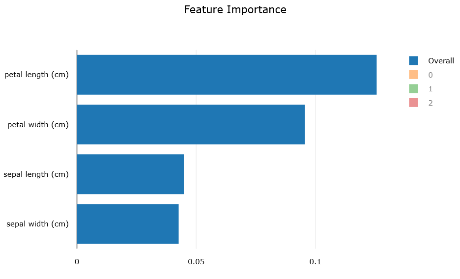

# Configure automated ML experiments in Python

In this guide, learn how to define various configuration settings of your automated machine learning experiments with the [Azure Machine Learning SDK](https://docs.microsoft.com/python/api/overview/azure/ml/intro?view=azure-ml-py). Automated machine learning picks an algorithm and hyperparameters for you and generates a model ready for deployment. There are several options that you can use to configure automated machine learning experiments.

To view examples of an automated machine learning experiments , see [Tutorial: Train a classification model with automated machine learning](tutorial-auto-train-models.md) or [Train models with automated machine learning in the cloud](how-to-auto-train-remote.md).

Configuration options available in automated machine learning:

* Select your experiment type: Classification, Regression or Time Series Forecasting
* Data source, formats, and fetch data
* Choose your compute target: local or remote
* Automated machine learning experiment settings
* Run an automated machine learning experiment
* Explore model metrics
* Register and deploy model

If you prefer a no code experience, you can also [Create your automated machine learning experiments in the Azure portal](how-to-create-portal-experiments.md).

## Select your experiment type

Before you begin your experiment, you should determine the kind of machine learning problem you are solving. Automated machine learning supports task types of classification, regression and forecasting.

Automated machine learning supports the following algorithms during the automation and tuning process. As a user, there is no need for you to specify the algorithm. 

Classification | Regression | Time Series Forecasting
|-- |-- |--
[Logistic Regression](https://scikit-learn.org/stable/modules/linear_model.html#logistic-regression)| [Elastic Net](https://scikit-learn.org/stable/modules/linear_model.html#elastic-net)| [Elastic Net](https://scikit-learn.org/stable/modules/linear_model.html#elastic-net)
[Light GBM](https://lightgbm.readthedocs.io/en/latest/index.html)|[Light GBM](https://lightgbm.readthedocs.io/en/latest/index.html)|[Light GBM](https://lightgbm.readthedocs.io/en/latest/index.html)
[Gradient Boosting](https://scikit-learn.org/stable/modules/ensemble.html#classification)|[Gradient Boosting](https://scikit-learn.org/stable/modules/ensemble.html#regression)|[Gradient Boosting](https://scikit-learn.org/stable/modules/ensemble.html#regression)
[Decision Tree](https://scikit-learn.org/stable/modules/tree.html#decision-trees)|[Decision Tree](https://scikit-learn.org/stable/modules/tree.html#regression)|[Decision Tree](https://scikit-learn.org/stable/modules/tree.html#regression)
[K Nearest Neighbors](https://scikit-learn.org/stable/modules/neighbors.html#nearest-neighbors-regression)|[K Nearest Neighbors](https://scikit-learn.org/stable/modules/neighbors.html#nearest-neighbors-regression)|[K Nearest Neighbors](https://scikit-learn.org/stable/modules/neighbors.html#nearest-neighbors-regression)
[Linear SVC](https://scikit-learn.org/stable/modules/svm.html#classification)|[LARS Lasso](https://scikit-learn.org/stable/modules/linear_model.html#lars-lasso)|[LARS Lasso](https://scikit-learn.org/stable/modules/linear_model.html#lars-lasso)
[C-Support Vector Classification (SVC)](https://scikit-learn.org/stable/modules/svm.html#classification)|[Stochastic Gradient Descent (SGD)](https://scikit-learn.org/stable/modules/sgd.html#regression)|[Stochastic Gradient Descent (SGD)](https://scikit-learn.org/stable/modules/sgd.html#regression)
[Random Forest](https://scikit-learn.org/stable/modules/ensemble.html#random-forests)|[Random Forest](https://scikit-learn.org/stable/modules/ensemble.html#random-forests)|[Random Forest](https://scikit-learn.org/stable/modules/ensemble.html#random-forests)
[Extremely Randomized Trees](https://scikit-learn.org/stable/modules/ensemble.html#extremely-randomized-trees)|[Extremely Randomized Trees](https://scikit-learn.org/stable/modules/ensemble.html#extremely-randomized-trees)|[Extremely Randomized Trees](https://scikit-learn.org/stable/modules/ensemble.html#extremely-randomized-trees)
[Xgboost](https://xgboost.readthedocs.io/en/latest/parameter.html)|[Xgboost](https://xgboost.readthedocs.io/en/latest/parameter.html)| [Xgboost](https://xgboost.readthedocs.io/en/latest/parameter.html)
[DNN Classifier](https://www.tensorflow.org/api_docs/python/tf/estimator/DNNClassifier)|[DNN Regressor](https://www.tensorflow.org/api_docs/python/tf/estimator/DNNRegressor) | [DNN Regressor](https://www.tensorflow.org/api_docs/python/tf/estimator/DNNRegressor)|
[DNN Linear Classifier](https://www.tensorflow.org/api_docs/python/tf/estimator/LinearClassifier)|[Linear Regressor](https://www.tensorflow.org/api_docs/python/tf/estimator/LinearRegressor)|[Linear Regressor](https://www.tensorflow.org/api_docs/python/tf/estimator/LinearRegressor)
[Naive Bayes](https://scikit-learn.org/stable/modules/naive_bayes.html#bernoulli-naive-bayes)|
[Stochastic Gradient Descent (SGD)](https://scikit-learn.org/stable/modules/sgd.html#sgd)|

Use the `task` parameter in the `AutoMLConfig` constructor to specify your experiment type.

```python
from azureml.train.automl import AutoMLConfig

# task can be one of classification, regression, forecasting
automl_config = AutoMLConfig(task="classification")
```

## Data source and format
Automated machine learning supports data that resides on your local desktop or in the cloud such as Azure Blob Storage. The data can be read into scikit-learn supported data formats. You can read the data into:
* Numpy arrays X (features) and y (target variable or also known as label)
* Pandas dataframe

Examples:

*	Numpy arrays

    ```python
    digits = datasets.load_digits()
    X_digits = digits.data
    y_digits = digits.target
    ```

*	Pandas dataframe

    ```python
    import pandas as pd
    from sklearn.model_selection import train_test_split
    df = pd.read_csv("https://automldemods.blob.core.windows.net/datasets/PlayaEvents2016,_1.6MB,_3.4k-rows.cleaned.2.tsv", delimiter="\t", quotechar='"')
    # get integer labels
    y = df["Label"]
    df = df.drop(["Label"], axis=1)
    df_train, _, y_train, _ = train_test_split(df, y, test_size=0.1, random_state=42)
    ```

## Fetch data for running experiment on remote compute

If you are using a remote compute to run your experiment, the data fetch must be wrapped in a separate python script `get_data()`. This script is run on the remote compute where the automated machine learning experiment is run. `get_data` eliminates the need to fetch the data over the wire for each iteration. Without `get_data`, your experiment will fail when you run on remote compute.

Here is an example of `get_data`:

```python
%%writefile $project_folder/get_data.py
import pandas as pd
from sklearn.model_selection import train_test_split
from sklearn.preprocessing import LabelEncoder
def get_data(): # Burning man 2016 data
    df = pd.read_csv("https://automldemods.blob.core.windows.net/datasets/PlayaEvents2016,_1.6MB,_3.4k-rows.cleaned.2.tsv", delimiter="\t", quotechar='"')
    # get integer labels
    le = LabelEncoder()
    le.fit(df["Label"].values)
    y = le.transform(df["Label"].values)
    df = df.drop(["Label"], axis=1)
    df_train, _, y_train, _ = train_test_split(df, y, test_size=0.1, random_state=42)
    return { "X" : df, "y" : y }
```

In your `AutoMLConfig` object, you specify the `data_script` parameter and provide the path to the `get_data` script file similar to below:

```python
automl_config = AutoMLConfig(****, data_script=project_folder + "/get_data.py", **** )
```

`get_data` script can return:

Key	| Type | Mutually Exclusive with	| Description
---|---|---|---
X |	Pandas Dataframe or Numpy Array	| data_train, label, columns |	All features to train with
y |	Pandas Dataframe or Numpy Array |	label	| Label data to train with. For classification, should be an array of integers.
X_valid	| Pandas Dataframe or Numpy Array	| data_train, label	| _Optional_ Feature data that forms the validation set. If not specified, X is split between train and validate
y_valid |	Pandas Dataframe or Numpy Array	| data_train, label	| _Optional_ The label data to validate with. If not specified, y is split between train and validate
sample_weight |	Pandas Dataframe or Numpy Array |	data_train, label, columns|	_Optional_ A weight value for each sample. Use when you would like to assign different weights for your data points
sample_weight_valid	| Pandas Dataframe or Numpy Array |	data_train, label, columns |	_Optional_ A weight value for each validation sample. If  not specified, sample_weight is split between train and validate
data_train |	Pandas Dataframe |	X, y, X_valid, y_valid |	All data (features+label) to train with
label |	string	| X, y, X_valid, y_valid |	Which column in data_train represents the label
columns	| Array of strings	||	_Optional_ Whitelist of columns to use for features
cv_splits_indices	| Array of integers	||	_Optional_ List of indexes to split the data for cross validation

## Train and validation data

You can specify separate train and validation set either through get_data() or directly in the `AutoMLConfig`  method.

### K-Folds Cross Validation

Use `n_cross_validations` setting to specify the number of cross validations. The training data set will be randomly split into `n_cross_validations` folds of equal size. During each cross validation round, one of the folds will be used for validation of the model trained on the remaining folds. This process repeats for `n_cross_validations` rounds until each fold is used once as validation set. The average scores across all `n_cross_validations` rounds will be reported, and the corresponding model will be retrained on the whole training data set.

### Monte Carlo Cross Validation (Repeated Random Sub-Sampling)

Use `validation_size` to specify the percentage of the training dataset that should be used for validation, and use `n_cross_validations` to specify the number of cross validations. During each cross validation round, a subset of size `validation_size` will be randomly selected for validation of the model trained on the remaining data. Finally, the average scores across all `n_cross_validations` rounds will be reported, and the corresponding model will be retrained on the whole training data set. Monte Carlo is not supported for time series forecasting.

### Custom validation dataset

Use custom validation dataset if random split is not acceptable, usually time series data or imbalanced data. You can specify your own validation dataset. The model will be evaluated against the validation dataset specified instead of random dataset.

## Compute to run experiment

Next determine where the model will be trained. An automated machine learning training experiment can run on the following compute options:
*	Your local machine such as a local desktop or laptop – Generally when you have small dataset and you are still in the exploration stage.
*	A remote machine in the cloud – [Azure Machine Learning Managed Compute](concept-compute-target.md#amlcompute) is a managed service that enables the ability to train machine learning models on clusters of Azure virtual machines.

See the [GitHub site](https://github.com/Azure/MachineLearningNotebooks/tree/master/how-to-use-azureml/automated-machine-learning) for example notebooks with local and remote compute targets.

*   An Azure Databricks cluster in your Azure subscription. You can find more details here - [Setup Azure Databricks cluster for Automated ML](how-to-configure-environment.md#azure-databricks)

See the [GitHub site](https://github.com/Azure/MachineLearningNotebooks/tree/master/how-to-use-azureml/azure-databricks/automl) for example notebooks with Azure Databricks.

<a name='configure-experiment'></a>

## Configure your experiment settings

There are several options that you can use to configure your automated machine learning experiment. These parameters are set by instantiating an `AutoMLConfig` object. See the [AutoMLConfig class](https://docs.microsoft.com/python/api/azureml-train-automl/azureml.train.automl.automlconfig?view=azure-ml-py) for a full list of parameters.

Some examples include:

1.	Classification experiment using AUC weighted as the primary metric with a max time of 12,000 seconds per iteration, with the experiment to end after 50 iterations and 2 cross validation folds.

    ```python
    automl_classifier = AutoMLConfig(
        task='classification',
        primary_metric='AUC_weighted',
        max_time_sec=12000,
        iterations=50,
        blacklist_models='XGBoostClassifier',
        X=X,
        y=y,
        n_cross_validations=2)
    ```
2.	Below is an example of a regression experiment set to end after 100 iterations, with each iteration lasting up to 600 seconds with 5 validation cross folds.

    ```python
    automl_regressor = AutoMLConfig(
        task='regression',
        max_time_sec=600,
        iterations=100,
        whitelist_models='kNN regressor'
        primary_metric='r2_score',
        X=X,
        y=y,
        n_cross_validations=5)
    ```

The three different `task` parameter values determine the list of algorithms to apply.  Use the `whitelist` or `blacklist` parameters to further modify iterations with the available algorithms to include or exclude. The list of supported models can be found on [SupportedAlgorithms Class](https://docs.microsoft.com/python/api/azureml-train-automl/azureml.train.automl.constants.supportedalgorithms?view=azure-ml-py).

### Primary Metric
The primary metric; as shown in the examples above determines the metric to be used during model training for optimization. The primary metric you can select is determined by the task type you choose. Below is a list of available metrics.

|Classification | Regression | Time Series Forecasting
|-- |-- |--
|accuracy| spearman_correlation | spearman_correlation
|AUC_weighted | normalized_root_mean_squared_error | normalized_root_mean_squared_error
|average_precision_score_weighted | r2_score | r2_score
|norm_macro_recall | normalized_mean_absolute_error | normalized_mean_absolute_error
|precision_score_weighted |

### Data preprocessing & featurization

In every automated machine learning experiment, your data is [automatically scaled and normalized](concept-automated-ml.md#preprocess) to help algorithms perform well.  However, you can also enable additional preprocessing/featurization, such as missing values imputation, encoding, and transforms. [Learn more about what featurization is included](how-to-create-portal-experiments.md#preprocess).

To enable this featurization, specify `"preprocess": True` for the [`AutoMLConfig` class](https://docs.microsoft.com/python/api/azureml-train-automl/azureml.train.automl.automlconfig?view=azure-ml-py).

### Time Series Forecasting
For time series forecasting task type you have additional parameters to define.
1. time_column_name - This is a required parameter which defines the name of the column in your training data containing date/time series.
1. max_horizon - This defines the length of time you want to predict out based on the periodicity of the training data. For example if you have training data with daily time grains, you define how far out in days you want the model to train for.
1. grain_column_names - This defines the name of columns which contain individual time series data in your training data. For example, if you are forecasting sales of a particular brand by store, you would define store and brand columns as your grain columns.

See example of these settings being used below, notebook example is available [here](https://github.com/Azure/MachineLearningNotebooks/blob/master/how-to-use-azureml/automated-machine-learning/forecasting-orange-juice-sales/auto-ml-forecasting-orange-juice-sales.ipynb).

```python
# Setting Store and Brand as grains for training.
grain_column_names = ['Store', 'Brand']
nseries = data.groupby(grain_column_names).ngroups

# View the number of time series data with defined grains
print('Data contains {0} individual time-series.'.format(nseries))
```

```python
time_series_settings = {
    'time_column_name': time_column_name,
    'grain_column_names': grain_column_names,
    'drop_column_names': ['logQuantity'],
    'max_horizon': n_test_periods
}

automl_config = AutoMLConfig(task='forecasting',
                             debug_log='automl_oj_sales_errors.log',
                             primary_metric='normalized_root_mean_squared_error',
                             iterations=10,
                             X=X_train,
                             y=y_train,
                             n_cross_validations=5,
                             path=project_folder,
                             verbosity=logging.INFO,
                             **time_series_settings)
```

## Run experiment

For automated ML you will need to create an `Experiment` object, which is a named object in a `Workspace` used to run experiments.

```python
from azureml.core.experiment import Experiment

ws = Workspace.from_config()

# Choose a name for the experiment and specify the project folder.
experiment_name = 'automl-classification'
project_folder = './sample_projects/automl-classification'

experiment = Experiment(ws, experiment_name)
```

Submit the experiment to run and generate a model. Pass the `AutoMLConfig` to the `submit` method to generate the model.

```python
run = experiment.submit(automl_config, show_output=True)
```

>[!NOTE]
>Dependencies are first installed on a new machine.  It may take up to 10 minutes before output is shown.
>Setting `show_output` to `True` results in output being shown on the console.

### Exit Criteria
There a few options you can define to complete your experiment.
1. No Criteria - If you do not define any exit parameters the experiment will continue until no further progress is made on your primary metric.
1. Number of iterations - You define the number of iterations for the experiment to run. You can optional add iteration_timeout_minutes to define a time limit in minutes per each iteration.
1. Exit after a length of time - Using experiment_timeout_minutes in your settings you can define how long in minutes should an experiment continue in run.
1. Exit after a score has been reached - Using experiment_exit_score you can choose to complete the experiment after a score based on your primary metric has been reached.

### Explore model metrics

You can view your training results in a widget or inline if you are in a notebook. See [Track and evaluate models](how-to-track-experiments.md#view-run-details) for more details.

## Understand automated ML models

Any model produced using automated ML includes the following steps:
+ Automated feature engineering (if preprocess=True)
+ Scaling/Normalization and algorithm with hypermeter values

We make it transparent to get this information from the fitted_model output from automated ML.

```python
automl_config = AutoMLConfig(…)
automl_run = experiment.submit(automl_config …)
best_run, fitted_model = automl_run.get_output()
```

### Automated feature engineering

See the list of preprocessing and [automated feature engineering](concept-automated-ml.md#preprocess) that happens when preprocess=True.

Consider this example:
+ There are 4 input features: A (Numeric), B (Numeric), C (Numeric), D (DateTime)
+ Numeric feature C is dropped because it is an ID column with all unique values
+ Numeric features A and B have missing values and hence are imputed by mean
+ DateTime feature D is featurized into 11 different engineered features

Use these 2 APIs on the first step of fitted model to understand more.  See [this sample notebook](https://github.com/Azure/MachineLearningNotebooks/tree/master/how-to-use-azureml/automated-machine-learning/forecasting-energy-demand).

+ API 1: `get_engineered_feature_names()` returns a list of engineered feature names.

  Usage:
  ```python
  fitted_model.named_steps['timeseriestransformer']. get_engineered_feature_names ()
  ```

  ```
  Output: ['A', 'B', 'A_WASNULL', 'B_WASNULL', 'year', 'half', 'quarter', 'month', 'day', 'hour', 'am_pm', 'hour12', 'wday', 'qday', 'week']
  ```

  This list includes all engineered feature names.

  >[!Note]
  >Use 'timeseriestransformer' for task=’forecasting’, else use 'datatransformer' for ‘regression’ or ‘classification’ task.

+ API 2: `get_featurization_summary()` returns featurization summary for all the input features.

  Usage:
  ```python
  fitted_model.named_steps['timeseriestransformer'].get_featurization_summary()
  ```

  >[!Note]
  >Use 'timeseriestransformer' for task=’forecasting’, else use 'datatransformer' for ‘regression’ or ‘classification’ task.

  Output:
  ```
  [{'RawFeatureName': 'A',
    'TypeDetected': 'Numeric',
    'Dropped': 'No',
    'EngineeredFeatureCount': 2,
    'Tranformations': ['MeanImputer', 'ImputationMarker']},
   {'RawFeatureName': 'B',
    'TypeDetected': 'Numeric',
    'Dropped': 'No',
    'EngineeredFeatureCount': 2,
    'Tranformations': ['MeanImputer', 'ImputationMarker']},
   {'RawFeatureName': 'C',
    'TypeDetected': 'Numeric',
    'Dropped': 'Yes',
    'EngineeredFeatureCount': 0,
    'Tranformations': []},
   {'RawFeatureName': 'D',
    'TypeDetected': 'DateTime',
    'Dropped': 'No',
    'EngineeredFeatureCount': 11,
    'Tranformations': ['DateTime','DateTime','DateTime','DateTime','DateTime','DateTime','DateTime','DateTime','DateTime','DateTime','DateTime']}]
  ```

   Where:

   |Output|Definition|
   |----|--------|
   |RawFeatureName|Input feature/column name from the dataset provided.|
   |TypeDetected|Detected datatype of the input feature.|
   |Dropped|Indicates if the input feature was dropped or used.|
   |EngineeringFeatureCount|Number of features generated through automated feature engineering transforms.|
   |Transformations|List of transformations applied to input features to generate engineered features.|

### Scaling/Normalization and algorithm with hypermeter values:

To understand the scaling/normalization and algorithm/hyperparameter values for a pipeline, use fitted_model.steps. [Learn more about scaling/normalization](concept-automated-ml.md#preprocess). Here is a sample output:

```
[('RobustScaler', RobustScaler(copy=True, quantile_range=[10, 90], with_centering=True, with_scaling=True)), ('LogisticRegression', LogisticRegression(C=0.18420699693267145, class_weight='balanced', dual=False, fit_intercept=True, intercept_scaling=1, max_iter=100, multi_class='multinomial', n_jobs=1, penalty='l2', random_state=None, solver='newton-cg', tol=0.0001, verbose=0, warm_start=False))
```

To get more details, use this helper function shown in [this sample notebook](https://github.com/Azure/MachineLearningNotebooks/blob/master/how-to-use-azureml/automated-machine-learning/classification/auto-ml-classification.ipynb).

```python
from pprint import pprint
def print_model(model, prefix=""):
    for step in model.steps:
        print(prefix + step[0])
        if hasattr(step[1], 'estimators') and hasattr(step[1], 'weights'):
            pprint({'estimators': list(e[0] for e in step[1].estimators), 'weights': step[1].weights})
            print()
            for estimator in step[1].estimators:
                print_model(estimator[1], estimator[0]+ ' - ')
        else:
            pprint(step[1].get_params())
            print()

print_model(fitted_model)
```

The following is sample output for a pipeline using a specific algorithm (LogisticRegression with RobustScalar, in this case).

```
RobustScaler
{'copy': True,
'quantile_range': [10, 90],
'with_centering': True,
'with_scaling': True}

LogisticRegression
{'C': 0.18420699693267145,
'class_weight': 'balanced',
'dual': False,
'fit_intercept': True,
'intercept_scaling': 1,
'max_iter': 100,
'multi_class': 'multinomial',
'n_jobs': 1,
'penalty': 'l2',
'random_state': None,
'solver': 'newton-cg',
'tol': 0.0001,
'verbose': 0,
'warm_start': False}
```

<a name="explain"></a>

## Explain the model (interpretability)

Automated machine learning allows you to understand feature importance.  During the training process, you can get global feature importance for the model.  For classification scenarios, you can also get class-level feature importance.  You must provide a validation dataset (X_valid) to get feature importance.

There are two ways to generate feature importance.

*	Once an experiment is complete, you can use `explain_model` method on any iteration.

    ```python
    from azureml.train.automl.automlexplainer import explain_model

    shap_values, expected_values, overall_summary, overall_imp, per_class_summary, per_class_imp = \
        explain_model(fitted_model, X_train, X_test)

    #Overall feature importance
    print(overall_imp)
    print(overall_summary)

    #Class-level feature importance
    print(per_class_imp)
    print(per_class_summary)
    ```

*	To view feature importance for all iterations, set `model_explainability` flag to `True` in AutoMLConfig.

    ```python
    automl_config = AutoMLConfig(task = 'classification',
                                 debug_log = 'automl_errors.log',
                                 primary_metric = 'AUC_weighted',
                                 max_time_sec = 12000,
                                 iterations = 10,
                                 verbosity = logging.INFO,
                                 X = X_train,
                                 y = y_train,
                                 X_valid = X_test,
                                 y_valid = y_test,
                                 model_explainability=True,
                                 path=project_folder)
    ```

    Once done, you can use retrieve_model_explanation method to retrieve feature importance for a specific iteration.

    ```python
    from azureml.train.automl.automlexplainer import retrieve_model_explanation

    shap_values, expected_values, overall_summary, overall_imp, per_class_summary, per_class_imp = \
        retrieve_model_explanation(best_run)

    #Overall feature importance
    print(overall_imp)
    print(overall_summary)

    #Class-level feature importance
    print(per_class_imp)
    print(per_class_summary)
    ```

You can visualize the feature importance chart in your workspace in the Azure portal. The chart is also shown when using the  Jupyter widget in a notebook. To learn more about the charts refer to the [Sample Azure Machine Learning service notebooks article.](samples-notebooks.md)

```Python
from azureml.widgets import RunDetails
RunDetails(local_run).show()
```


For more information on how model explanations and feature importance can be enabled in other areas of the SDK outside of automated machine learning, see the [concept](machine-learning-interpretability-explainability.md) article on interpretability.

## Next steps

Learn more about [how and where to deploy a model](how-to-deploy-and-where.md).

Learn more about [how to train a regression model with Automated machine learning](tutorial-auto-train-models.md) or [how to train using Automated machine learning on a remote resource](how-to-auto-train-remote.md).
