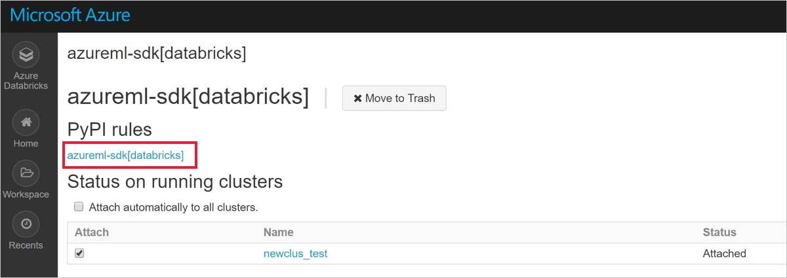

# Configure a development environment for Azure Machine Learning

In this document, learn how to configure a development environment to work with the Azure Machine Learning service. The Azure Machine Learning service is platform agnostic. The only requirements for your development environment are __Python 3__, __Conda__ (for isolated environments), and a configuration file that contains your Azure Machine Learning workspace information.

This document focuses on the following specific environments and tools:

* [Azure Notebooks](#aznotebooks): A Jupyter Notebooks service hosted in the Azure cloud. It is __the easiest__ way to get started, as the Azure Machine Learning SDK is already installed.
* [The Data Science Virtual Machine](#dsvm): A __pre-configured development/experimentation environment__ in the Azure cloud that is __designed for data science work__ and can be deployed to either CPU only VM instances or GPU based instances. Python 3, Conda, Jupyter Notebooks, and the Azure Machine Learning SDK are already installed. The VM comes with popular ML / deep learning frameworks, tools, and editors for developing ML solutions. It is probably __the most complete__ development environment for ML on the Azure platform.
* [Jupyter Notebooks](#jupyter): If you're already using Jupyter Notebooks, the SDK has some extras that you should install.
* [Visual Studio Code](#vscode): If you use Visual Studio Code, there are some useful extensions that you can install.
* [Azure Databricks](#aml-databricks): If you use Azure Databricks, learn how to get the Azure Machine Learning SDK onto your cluster so you can deploy models.

If you already have a Python 3 environment, or just want the basic steps for installing the SDK, see the [Local computer](#local) section.

## Prerequisites

- An Azure Machine Learning service workspace. Follow the steps in [Get started with Azure Machine Learning service](quickstart-get-started.md) to create one.

- Either the [Continuum Anaconda](https://www.anaconda.com/download/) or [Miniconda](https://conda.io/miniconda.html) package manager.

    > [!IMPORTANT]
    > Anaconda and Miniconda are not required when using Azure Notebooks.

- On Linux or Mac OS, you need the bash shell.

    > [!TIP]
    > If you are on Linux or Mac OS and use a shell other than bash (for example, zsh) you may receive errors when running some commands. To work around this problem, use the `bash` command to start a new bash shell and run the commands there.

- On Windows, you need the command prompt or Anaconda prompt (installed by Anaconda and Miniconda).

## <a id="anotebooks"></a>Azure Notebooks

[Azure Notebooks](https://notebooks.azure.com) (preview) is an interactive development environment in the Azure cloud. It is __the easiest__ way to get started with Azure Machine Learning development.

* The Azure Machine Learning SDK is __already installed__.
* After creating an Azure Machine Learning service workspace in the Azure portal, you can click a button to automatically configure your Azure Notebook environment to work with the workspace.

To get started developing with Azure Notebooks, follow the [Get started with Azure Machine Learning service](quickstart-get-started.md) document.

## <a id="dsvm"></a>Data Science Virtual Machine

The Data Science Virtual Machine (DSVM) is a customized virtual machine (VM) image **designed for data science work** that is pre-configured with:

  - Packages such as Tensorflow, Pytorch, scikit-learn, Xgboost and Azure ML SDK
  - Popular data science tools like Spark standalone, Drill
  - Azure tools such as the CLI, Azcopy and Storage explorer
  - Integrated development environments (IDEs) such as Visual Studio Code, PyCharm and RStudio
  - Jupyter Notebook Server 

The Azure Machine Learning SDK works on either the Ubuntu or Windows version of DSVM. To use the Data Science Virtual Machine as a development environment, use the following steps:

1. To create a Data Science Virtual Machine, use one of the following methods:

    * Using the Azure Portal:

        * [Create an __Ubuntu__ Data Science Virtual Machine](https://docs.microsoft.com/azure/machine-learning/data-science-virtual-machine/dsvm-ubuntu-intro)

        * [Create a __Windows__ Data Science Virtual Machine](https://docs.microsoft.com/azure/machine-learning/data-science-virtual-machine/provision-vm)

    * Using the Azure CLI:

        > [!IMPORTANT]
        > When using the Azure CLI, you must first sign in to your Azure subscription by using the `az login` command.
        >
        > When using the commands in this step, you must provide a resource group name, a name for the VM, a username, and a password.

        * To create an __Ubuntu__ Data Science Virtual Machine, use the following command:

            ```azurecli
            # create a Ubuntu DSVM in your resource group
            # note you need to be at least a contributor to the resource group in order to execute this command successfully
            # If you need to create a new resource group use: "az group create --name YOUR-RESOURCE-GROUP-NAME --location YOUR-REGION (For example: westus2)"
            az vm create --resource-group YOUR-RESOURCE-GROUP-NAME --name YOUR-VM-NAME --image microsoft-dsvm:linux-data-science-vm-ubuntu:linuxdsvmubuntu:latest --admin-username YOUR-USERNAME --admin-password YOUR-PASSWORD --generate-ssh-keys --authentication-type password
            ```

        * To create a __Windows__ Data Science Virtual Machine, use the following command:

            ```azurecli
            # create a Windows Server 2016 DSVM in your resource group
            # note you need to be at least a contributor to the resource group in order to execute this command successfully
            az vm create --resource-group YOUR-RESOURCE-GROUP-NAME --name YOUR-VM-NAME --image microsoft-dsvm:dsvm-windows:server-2016:latest --admin-username YOUR-USERNAME --admin-password YOUR-PASSWORD --authentication-type password
            ```    

2. The Azure Machine Learning SDK is **already installed** on the DSVM. To use the Conda environment that contains the SDK, use one of the following commands:

    * On __Ubuntu__ DSVM, use this command:

        ```shell
        conda activate py36
        ```

    * On __Windows__ DSVM, use this command:

        ```shell
        conda activate AzureML
        ```

1. To verify that you can access the SDK and check the version, use the following Python code:

    ```python
    import azureml.core
    print(azureml.core.VERSION)
    ```

1. To configure the DSVM to use your Azure Machine Learning service workspace, see the [Configure workspace](#workspace) section.

For more information on the Data Science Virtual Machines, see [Data Science Virtual Machines](https://azure.microsoft.com/services/virtual-machines/data-science-virtual-machines/).

## <a id="local"></a>Local computer

When using a local computer (which might also be a remote virtual machine), use the following steps to create a conda environment and install the SDK:

1. Open a command prompt or shell.

1. Create a conda environment with the following commands:

    ```shell
    # create a new conda environment with Python 3.6, numpy, and cython
    conda create -n myenv Python=3.6 cython numpy

    # activate the conda environment
    conda activate myenv

    # On Mac OS run
    source activate myenv
    ```

    It might take several minutes to create the environment if Python 3.6 and other components need to be downloaded.

1. Install the Azure Machine Learning SDK with notebook extras and the Data Preparation SDK by using the following command:

     ```shell
    pip install --upgrade azureml-sdk[notebooks,automl] azureml-dataprep
    ```

   > [!NOTE]
   > If you get a message that `PyYAML` can't be uninstalled, use the following command instead:
   >
   > `pip install --upgrade azureml-sdk[notebooks,automl] azureml-dataprep --ignore-installed PyYAML`

   It might take several minutes to install the SDK.

1. Install packages for your machine learning experimentation. Use the following command and replace `<new package>` with the package you want to install:

    ```shell
    conda install <new package>
    ```

1. To verify that the SDK is installed, the following Python code:

    ```python
    import azureml.core
    azureml.core.VERSION
    ```

### <a id="jupyter"></a>Jupyter Notebooks

Jupyter Notebooks are part of the [Jupyter Project](https://jupyter.org/). They provide an interactive coding experience where you create documents that mix live code with narrative text and graphics. Jupyter Notebooks are also a great way to share your results with others, as you can save the output of your code sections in the document. You can install Jupyter Notebooks on a variety of platforms.

The steps in the [Local computer](#local) section install optional components for Jupyter Notebooks. To enable these components in your Jupyter Notebook environment, use the following steps:

1. Open a command prompt or shell.

1. To install a conda-aware Jupyter Notebook server using the following command:

    ```shell
    # install Jupyter
    conda install nb_conda
    ```

1. Open Jupyter Notebook with the following command:

    ```shell
    jupyter notebook
    ```

1. To verify that Jupyter Notebook can use the SDK, open a new notebook and select "myenv" as your kernel. Then run the following command in a notebook cell:

    ```python
    import azureml.core
    azureml.core.VERSION
    ```

1. To configure the Jupyter Notebook to use your Azure Machine Learning service workspace, see the [Configure workspace](#workspace) section.

### <a id="vscode"></a>Visual Studio Code

Visual Studio Code is a cross platform code editor. It relies on a local Python 3 and Conda installation for Python support, but it provides additional tools for working with AI. It also provides support for selecting the Conda environment from within the code editor.

To use Visual Studio Code for development, use the following steps:

1. To learn how to use Visual Studio Code for Python development, see the [Get started with Python in VSCode](https://code.visualstudio.com/docs/python/python-tutorial) document.

1. To select the Conda environment, open VS Code and then use __Ctrl-Shift-P__ (Linux and Windows) or __Command-Shift-P__ (Mac) to get the __Command Pallet__. Enter __Python: Select Interpreter__ and then select the conda environment.

1. To validate that you can use the SDK, create a new Python file (.py) that contains the following code. Then run the file:

    ```python
    import azureml.core
    azureml.core.VERSION
    ```

1. To install the Azure Machine Learning extension for Visual Studio Code, see the [Tools for AI](https://marketplace.visualstudio.com/items?itemName=ms-toolsai.vscode-ai) page.

    For more information, see [Using Azure Machine Learning for Visual Studio Code](how-to-vscode-tools.md).

<a name="aml-databricks"></a>

## Azure Databricks

You can use a custom version of the Azure Machine Learning SDK for Azure Databricks for end-to-end custom machine learning. Or, train your model within Databricks and use [Visual Studio Code](how-to-vscode-train-deploy.md#deploy-your-service-from-vs-code) to deploy the model

To prepare your Databricks cluster and get sample notebooks:

1. Create a [Databricks cluster](https://docs.microsoft.com/azure/azure-databricks/quickstart-create-databricks-workspace-portal) with a Databricks runtime version of 4.x (high concurrency preferred) with **Python 3**. 

1. Create a library to [install and attach](https://docs.databricks.com/user-guide/libraries.html#create-a-library) the Azure Machine Learning SDK for Python `azureml-sdk[databricks]` PyPi package to your cluster. When you are done, you see the library attached as shown in this image. Be aware of these [common Databricks issues](resource-known-issues.md#databricks).

   

   If this step fails, restart your cluster:
   1. Select `Clusters`in the left pane. Select your cluster name in the table. 
   1. On the `Libraries` tab, select `Restart`.

1. Download the [Azure Databricks / Azure Machine Learning SDK notebook archive file](https://github.com/Azure/MachineLearningNotebooks/blob/master/databricks/Databricks_AMLSDK_github.dbc).

   >[!Warning]
   > Many sample notebooks are available for use with Azure Machine Learning service. Only the sample notebooks in this subdirectory https://github.com/Azure/MachineLearningNotebooks/blob/master/how-to-use-azureml/azure-databricks work with Azure Databricks. 

1.  [Import this archive file](https://docs.azuredatabricks.net/user-guide/notebooks/notebook-manage.html#import-an-archive) into your Databricks cluster and start exploring as [described here](https://github.com/Azure/MachineLearningNotebooks/blob/master/how-to-use-azureml/azure-databricks).


## <a id="workspace"></a>Create a workspace configuration file

The workspace configuration file is a JSON document that tells the SDK how to communicate with your Azure Machine Learning service workspace. The file is named `config.json` and it has the following format:

```json
{
    "subscription_id": "<subscription-id>",
    "resource_group": "<resource-group>",
    "workspace_name": "<workspace-name>"
}
```

This file must be in the directory structure that contains your Python scripts or Jupyter Notebooks. It can either be in the same directory, a subdirectory named `aml_config`, or in a parent directory.

To use this file from your code, use `ws=Workspace.from_config()`. This code loads the information from the file and connects to your workspace.

There are three ways to create the configuration file:

* If you follow the [Azure Machine Learning quickstart](quickstart-get-started.md), a `config.json` file is created in your Azure Notebooks library. This file contains the configuration information for your workspace. You can download or copy this `config.json` to other development environments.

* You can **manually create the file** using a text editor. You can find the values for that go into the config file by visiting your workspace in the [Azure portal](https://portal.azure.com). Copy the __Workspace name__, __Resource group__, and __Subscription ID__ values and use them in the configuration file.
        

* You can **create the file programmatically**. The following code snippet demonstrates how to connect to a workspace by providing the subscription ID, resource group, and workspace name. Then it saves the workspace configuration to file:

    ```python
    from azureml.core import Workspace

    subscription_id = '<subscription-id>'
    resource_group  = '<resource-group>'
    workspace_name  = '<workspace-name>'

    try:
        ws = Workspace(subscription_id = subscription_id, resource_group = resource_group, workspace_name = workspace_name)
        ws.write_config()
        print('Library configuration succeeded')
    except:
        print('Workspace not found')
    ```

    This code writes the configuration file to the `aml_config/config.json` file.

## Next steps

- [Train a model on Azure Machine Learning with the MNIST dataset](tutorial-train-models-with-aml.md)
- [Azure Machine Learning SDK for Python](https://aka.ms/aml-sdk)
- [Azure Machine Learning Data Prep SDK](https://aka.ms/data-prep-sdk)
