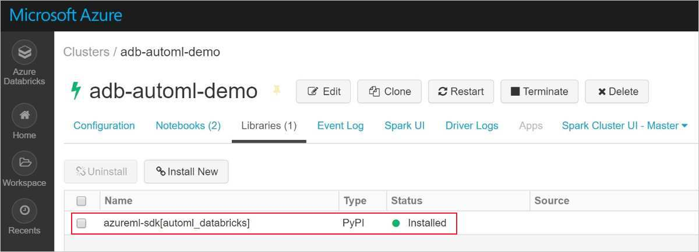
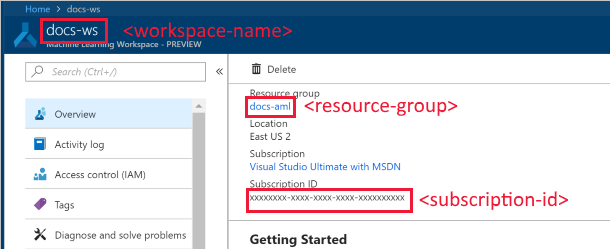

# Configure a development environment for Azure Machine Learning

In this article, you learn how to configure a development environment to work with Azure Machine Learning service. Machine Learning service is platform agnostic.

The only requirements for your development environment are Python 3, Anaconda (for isolated environments), and a configuration file that contains your Azure Machine Learning workspace information.

This article focuses on the following environments and tools:

* Your own [cloud-based notebook VM](#notebookvm): Use a compute resource in your workstation to run Jupyter notebooks. It's the easiest way to get started, because the Azure Machine Learning SDK is already installed.

* [The Data Science Virtual Machine (DSVM)](#dsvm): A pre-configured development or experimentation environment in the Azure cloud that's designed for data science work and can be deployed to either CPU only VM instances or GPU-based instances. Python 3, Conda, Jupyter Notebooks, and the Azure Machine Learning SDK are already installed. The VM comes with popular machine learning and deep learning frameworks, tools, and editors for developing machine learning solutions. It's probably the most complete development environment for machine learning on the Azure platform.

* [The Jupyter Notebook](#jupyter): If you're already using the Jupyter Notebook, the SDK has some extras that you should install.

* [Visual Studio Code](#vscode): If you use Visual Studio Code, it has some useful extensions that you can install.

* [Azure Databricks](#aml-databricks): A popular data analytics platform that's based on Apache Spark. Learn how to get the Azure Machine Learning SDK onto your cluster so that you can deploy models.

* [Azure Notebooks](#aznotebooks): A Jupyter Notebooks service that's hosted in the Azure cloud. Also an easy way to get started, because the Azure Machine Learning SDK is already installed.  

If you already have a Python 3 environment, or just want the basic steps for installing the SDK, see the [Local computer](#local) section.

## Prerequisites

An Azure Machine Learning service workspace. To create the workspace, see [Create an Azure Machine Learning service workspace](setup-create-workspace.md). A workspace is all you need to get started with your own [cloud-based notebook server](#notebookvm), a [DSVM](#dsvm), [Azure Databricks](#aml-databricks), or [Azure Notebooks](#aznotebooks).

To install the SDK environment for your [local computer](#local), [Jupyter Notebook server](#jupyter) or [Visual Studio Code](#vscode) you also need:

- Either the [Anaconda](https://www.anaconda.com/download/) or [Miniconda](https://conda.io/miniconda.html) package manager.

- On Linux or macOS, you need the bash shell.

    > [!TIP]
    > If you're on Linux or macOS and use a shell other than bash (for example, zsh) you might receive errors when you run some commands. To work around this problem, use the `bash` command to start a new bash shell and run the commands there.

- On Windows, you need the command prompt or Anaconda prompt (installed by Anaconda and Miniconda).

## <a id="notebookvm"></a>Your own cloud-based notebook VM

The notebook virtual machine (Preview) is a secure, cloud-based Azure workstation that provides data scientists with a Jupyter notebook server, JupyterLab, and a fully prepared ML environment. 

The notebook VM is: 

+ **Secure**. Since VM and notebook access is secured with HTTPS and Azure Active Directory by default, IT Pros can easily enforce single sign-on and other security features such as multi-factor authentication.

+ **Preconfigured**. This fully prepared Python ML environment draws its pedigree from the popular IaaS Data Science VM and includes:
  + Azure ML Python SDK (latest)
  + Automatic configuration to work with your workspace
  + A Jupyter notebook server
  + JupyterLab notebook IDE
  + Preconfigured GPU drivers 
  + A selection of deep learning frameworks
 

  If you are into code, the VM includes tutorials and samples to help you explore and learn how to use Azure Machine Learning service. The sample notebooks are stored in the Azure Blob Storage account of your workspace making them shareable across VMs. When run, they also have access to the data stores and compute resources of your workspace. 

+ **Simple setup**: Create one anytime from within your Azure Machine Learning workspace. Provide just a name and specify a Azure VM type. Try it now with this [Quickstart: Use a cloud-based notebook server to get started with Azure Machine Learning](quickstart-run-cloud-notebook.md).

+ **Customizable**. While a managed and secure VM offering, you retain full access to the hardware capabilities and customize it to your heart’s desire. For example, quickly create the latest NVidia V100 powered VM to perform step-by-step debugging of novel Neural Network architecture.

To stop incurring notebook VM charges, [stop the notebook VM](quickstart-run-cloud-notebook.md#stop-the-notebook-vm). 

## <a id="dsvm"></a>Data Science Virtual Machine

The DSVM is a customized virtual machine (VM) image. It's designed for data science work that's pre-configured with:

  - Packages such as TensorFlow, PyTorch, Scikit-learn, XGBoost, and the Azure Machine Learning SDK
  - Popular data science tools such as Spark Standalone and Drill
  - Azure tools such as the Azure CLI, AzCopy, and Storage Explorer
  - Integrated development environments (IDEs) such as Visual Studio Code and PyCharm
  - Jupyter Notebook Server

The Azure Machine Learning SDK works on either the Ubuntu or Windows version of the DSVM. But if you plan to use the DSVM as a compute target as well, only Ubuntu is supported.

To use the DSVM as a development environment, do the following:

1. Create a DSVM in either of the following environments:

    * The Azure portal:

        * [Create an Ubuntu Data Science Virtual Machine](https://docs.microsoft.com/azure/machine-learning/data-science-virtual-machine/dsvm-ubuntu-intro)

        * [Create a Windows Data Science Virtual Machine](https://docs.microsoft.com/azure/machine-learning/data-science-virtual-machine/provision-vm)

    * The Azure CLI:

        > [!IMPORTANT]
        > * When you use the Azure CLI, you must first sign in to your Azure subscription by using the `az login` command.
        >
        > * When you use the commands in this step, you must provide a resource group name, a name for the VM, a username, and a password.

        * To create an Ubuntu Data Science Virtual Machine, use the following command:

            ```azurecli
            # create a Ubuntu DSVM in your resource group
            # note you need to be at least a contributor to the resource group in order to execute this command successfully
            # If you need to create a new resource group use: "az group create --name YOUR-RESOURCE-GROUP-NAME --location YOUR-REGION (For example: westus2)"
            az vm create --resource-group YOUR-RESOURCE-GROUP-NAME --name YOUR-VM-NAME --image microsoft-dsvm:linux-data-science-vm-ubuntu:linuxdsvmubuntu:latest --admin-username YOUR-USERNAME --admin-password YOUR-PASSWORD --generate-ssh-keys --authentication-type password
            ```

        * To create a Windows Data Science Virtual Machine, use the following command:

            ```azurecli
            # create a Windows Server 2016 DSVM in your resource group
            # note you need to be at least a contributor to the resource group in order to execute this command successfully
            az vm create --resource-group YOUR-RESOURCE-GROUP-NAME --name YOUR-VM-NAME --image microsoft-dsvm:dsvm-windows:server-2016:latest --admin-username YOUR-USERNAME --admin-password YOUR-PASSWORD --authentication-type password
            ```

2. The Azure Machine Learning SDK is already installed on the DSVM. To use the Conda environment that contains the SDK, use one of the following commands:

    * For Ubuntu DSVM:

        ```shell
        conda activate py36
        ```

    * For Windows DSVM:

        ```shell
        conda activate AzureML
        ```

1. To verify that you can access the SDK and check the version, use the following Python code:

    ```python
    import azureml.core
    print(azureml.core.VERSION)
    ```

1. To configure the DSVM to use your Azure Machine Learning service workspace, see the [Create a workspace configuration file](#workspace) section.

For more information, see [Data Science Virtual Machines](https://azure.microsoft.com/services/virtual-machines/data-science-virtual-machines/).

## <a id="local"></a>Local computer

When you're using a local computer (which might also be a remote virtual machine), create an Anaconda environment and install the SDK by doing the following:

1. Download and install [Anaconda](https://www.anaconda.com/distribution/#download-section) (Python 3.7 version)  if you don't already have it.

1. Open an Anaconda prompt and create an environment with the following commands:

    Run the following command to create the environment.

    ```shell
    conda create -n myenv python=3.6.5
    ```

    Then activate the environment.

    ```shell
    conda activate myenv
    ```

    This example creates an environment using python 3.6.5, but any specific subversions can be chosen. SDK compatibility may not be guaranteed with certain major versions (3.5+ is recommended), and it's recommended to try a different version/subversion in your Anaconda environment if you run into errors. It will take several minutes to create the environment while components and packages are downloaded.

1. Run the following commands in your new environment to enable environment-specific ipython kernels. This will ensure expected kernel and package import behavior when working with Jupyter Notebooks within Anaconda environments:

    ```shell
    conda install notebook ipykernel
    ```

    Then run the following command to create the kernel:

    ```shell
    ipython kernel install --user
    ```

1. Use the following commands to install packages:

    This command installs the base Azure Machine Learning SDK with notebook and automl extras. The `automl` extra is a large install, and can be removed from the brackets if you don't intend to run automated machine learning experiments. The `automl` extra also includes the Azure Machine Learning Data Prep SDK by default as a dependency.

     ```shell
    pip install azureml-sdk[notebooks,automl]
    ```

    Use this command to install the Azure Machine Learning Data Prep SDK on its own:

    ```shell
    pip install azureml-dataprep
    ```

   > [!NOTE]
   > If you get a message that PyYAML can't be uninstalled, use the following command instead:
   >
   > `pip install --upgrade azureml-sdk[notebooks,automl] azureml-dataprep --ignore-installed PyYAML`

   It will take several minutes to install the SDK. See the [install guide](https://docs.microsoft.com/python/api/overview/azure/ml/install?view=azure-ml-py) for more information on installation options.

1. Install other packages for your machine learning experimentation.

    Use either of the following commands and replace *\<new package>* with the package you want to install. Installing packages via `conda install` requires that the package is part of the current channels (new channels can be added in Anaconda Cloud).

    ```shell
    conda install <new package>
    ```

    Alternatively, you can install packages via `pip`.

    ```shell
    pip install <new package>
    ```

### <a id="jupyter"></a>Jupyter Notebooks

Jupyter Notebooks are part of the [Jupyter Project](https://jupyter.org/). They provide an interactive coding experience where you create documents that mix live code with narrative text and graphics. Jupyter Notebooks are also a great way to share your results with others, because you can save the output of your code sections in the document. You can install Jupyter Notebooks on a variety of platforms.

The procedure in the [Local computer](#local) section installs necessary components for running Jupyter Notebooks in an Anaconda environment. To enable these components in your Jupyter Notebook environment, do the following:

1. Open an Anaconda prompt and activate your environment.

    ```shell
    conda activate myenv
    ```

1. Launch the Jupyter Notebook server with the following command:

    ```shell
    jupyter notebook
    ```

1. To verify that Jupyter Notebook can use the SDK, create a **New** notebook, select **Python 3** as your kernel, and then run the following command in a notebook cell:

    ```python
    import azureml.core
    azureml.core.VERSION
    ```

1. If you encounter issues importing modules and receive a `ModuleNotFoundError`, ensure your Jupyter kernel is connected to the correct path for your environment by running the following code in a Notebook cell.

    ```python
    import sys
    sys.path
    ```

1. To configure the Jupyter Notebook to use your Azure Machine Learning service workspace, go to the [Create a workspace configuration file](#workspace) section.

### <a id="vscode"></a>Visual Studio Code

Visual Studio Code is a cross platform code editor. It relies on a local Python 3 and Conda installation for Python support, but it provides additional tools for working with AI. It also provides support for selecting the Conda environment from within the code editor.

To use Visual Studio Code for development, do the following:

1. To learn how to use Visual Studio Code for Python development, see [Get started with Python in VSCode](https://code.visualstudio.com/docs/python/python-tutorial).

1. To select the Conda environment, open VS Code, and then select Ctrl+Shift+P (Linux and Windows) or Command+Shift+P (Mac).
    The __Command Pallet__ opens.

1. Enter __Python: Select Interpreter__, and then select the Conda environment.

1. To validate that you can use the SDK, create and then run a new Python file (.py) that contains the following code:

    ```python
    import azureml.core
    azureml.core.VERSION
    ```

1. To install the Azure Machine Learning extension for Visual Studio Code, see [Tools for AI](https://marketplace.visualstudio.com/items?itemName=ms-toolsai.vscode-ai).

    For more information, see [Use Azure Machine Learning for Visual Studio Code](how-to-vscode-tools.md).

<a name="aml-databricks"></a>

## Azure Databricks
Azure Databricks is an  Apache Spark-based environment in the Azure cloud. It provides a collaborative Notebook based environment with CPU or GPU based compute cluster.

How Azure Databricks works with Azure Machine Learning service:
+ You can train a model using Spark MLlib and deploy the model to ACI/AKS from within Azure Databricks. 
+ You can also use [automated machine learning](concept-automated-ml.md) capabilities in a special Azure ML SDK with Azure Databricks.
+ You can use Azure Databricks as a compute target from an [Azure Machine Learning pipeline](concept-ml-pipelines.md). 

### Set up your Databricks cluster

Create a [Databricks cluster](https://docs.microsoft.com/azure/azure-databricks/quickstart-create-databricks-workspace-portal). Some settings apply only if you install the SDK for automated machine learning on Databricks.
**It will take few minutes to create the cluster.**

Use these settings:

| Setting |Applies to| Value |
|----|---|---|
| Cluster name |always| yourclustername |
| Databricks Runtime |always| Any non ML runtime (non ML 4.x, 5.x) |
| Python version |always| 3 |
| Workers |always| 2 or higher |
| Worker node VM types <br>(determines max # of concurrent iterations) |Automated ML<br>only| Memory optimized VM preferred |
| Enable Autoscaling |Automated ML<br>only| Uncheck |

Wait until the cluster is running before proceeding further.

### Install the correct SDK into a Databricks library
Once the cluster is running, [create a library](https://docs.databricks.com/user-guide/libraries.html#create-a-library) to attach the appropriate Azure Machine Learning SDK package to your cluster. 

1. Choose **only one** option (no other SDK installation are supported)

   |SDK&nbsp;package&nbsp;extras|Source|PyPi&nbsp;Name&nbsp;&nbsp;&nbsp;&nbsp;&nbsp;&nbsp;|
   |----|---|---|
   |For Databricks| Upload Python Egg or PyPI | azureml-sdk[databricks]|
   |For Databricks -with-<br> automated ML capabilities| Upload Python Egg or PyPI | azureml-sdk[automl_databricks]|

   > [!Warning]
   > No other SDK extras can be installed. Choose only one of the preceding options [databricks] or [automl_databricks].

   * Do not select **Attach automatically to all clusters**.
   * Select  **Attach** next to your cluster name.

1. Monitor for errors until status changes to **Attached**, which may take several minutes.  If this step fails, check the following: 

   Try restarting your cluster by:
   1. In the left pane, select **Clusters**.
   1. In the table, select your cluster name.
   1. On the **Libraries** tab, select **Restart**.
      
   Also consider:
   + In Automl config, when using Azure Databricks please add the following parameters:
       1. ```max_concurrent_iterations``` is based on number of worker nodes in your cluster. 
        2. ```spark_context=sc``` is based on the default spark context. 
   + Or, if you have an old SDK version, deselect it from cluster’s installed libs and move to trash. Install the new SDK version and restart the cluster. If there is an issue after this, detach and reattach your cluster.

If install was successful, the imported library should look like one of these:
   
SDK for Databricks **_without_** automated machine learning


SDK for Databricks **WITH** automated machine learning


### Start exploring

Try it out:
+ Download the [notebook archive file](https://github.com/Azure/MachineLearningNotebooks/blob/master/how-to-use-azureml/azure-databricks/Databricks_AMLSDK_1-4_6.dbc) for Azure Databricks/Azure Machine Learning SDK and [import the archive file](https://docs.azuredatabricks.net/user-guide/notebooks/notebook-manage.html#import-an-archive) into your Databricks cluster.  
  While many sample notebooks are available, **only [these sample notebooks](https://github.com/Azure/MachineLearningNotebooks/blob/master/how-to-use-azureml/azure-databricks) work with Azure Databricks.**
  
+ Learn how to [create a pipeline with Databricks as the training compute](how-to-create-your-first-pipeline.md).

## <a id="aznotebooks"></a>Azure Notebooks

[Azure Notebooks](https://notebooks.azure.com) (preview) is an interactive development environment in the Azure cloud. It's an easy way to get started with Azure Machine Learning development.

* The Azure Machine Learning SDK is already installed.
* After you create an Azure Machine Learning service workspace in the Azure portal, you can click a button to automatically configure your Azure Notebook environment to work with the workspace.

Use the [Azure portal](https://portal.azure.com) to get started with Azure Notebooks.  Open your workspace and  from the  **Overview** section, select **Get Started in Azure Notebooks**.

By default, Azure Notebooks uses a free service tier that is limited to 4GB of memory and 1GB of data. You can, however, remove these limits by attaching a Data Science Virtual Machine instance to the Azure Notebooks project. For more information, see [Manage and configure Azure Notebooks projects - Compute tier](/azure/notebooks/configure-manage-azure-notebooks-projects#compute-tier).

## <a id="workspace"></a>Create a workspace configuration file

The workspace configuration file is a JSON file that tells the SDK how to communicate with your Azure Machine Learning service workspace. The file is named *config.json*, and it has the following format:

```json
{
    "subscription_id": "<subscription-id>",
    "resource_group": "<resource-group>",
    "workspace_name": "<workspace-name>"
}
```

This JSON file must be in the directory structure that contains your Python scripts or Jupyter Notebooks. It can be in the same directory, a subdirectory named *.azureml*, or in a parent directory.

To use this file from your code, use `ws=Workspace.from_config()`. This code loads the information from the file and connects to your workspace.

You can create the configuration file in three ways:

* **Follow the steps in [Create an Azure Machine Learning service workspace](setup-create-workspace.md#sdk)**: A *config.json* file is created in your Azure Notebooks library. The file contains the configuration information for your workspace. You can download or copy the *config.json* to other development environments.

* **Download the file**: In the [Azure portal](https://ms.portal.azure.com), select  **Download config.json** from the **Overview** section of your workspace.

     

* **Create the file programmatically**: In the following code snippet, you connect to a workspace by providing the subscription ID, resource group, and workspace name. It then saves the workspace configuration to the file:

    ```python
    from azureml.core import Workspace

    subscription_id = '<subscription-id>'
    resource_group  = '<resource-group>'
    workspace_name  = '<workspace-name>'

    try:
        ws = Workspace(subscription_id = subscription_id, resource_group = resource_group, workspace_name = workspace_name)
        ws.write_config()
        print('Library configuration succeeded')
    except:
        print('Workspace not found')
    ```

    This code writes the configuration file to the *.azureml/config.json* file.


## Next steps

- [Train a model](tutorial-train-models-with-aml.md) on Azure Machine Learning with the MNIST dataset
- View the [Azure Machine Learning SDK for Python](https://aka.ms/aml-sdk) reference
- Learn about the [data prep package for Azure Machine Learning](https://aka.ms/data-prep-sdk)
