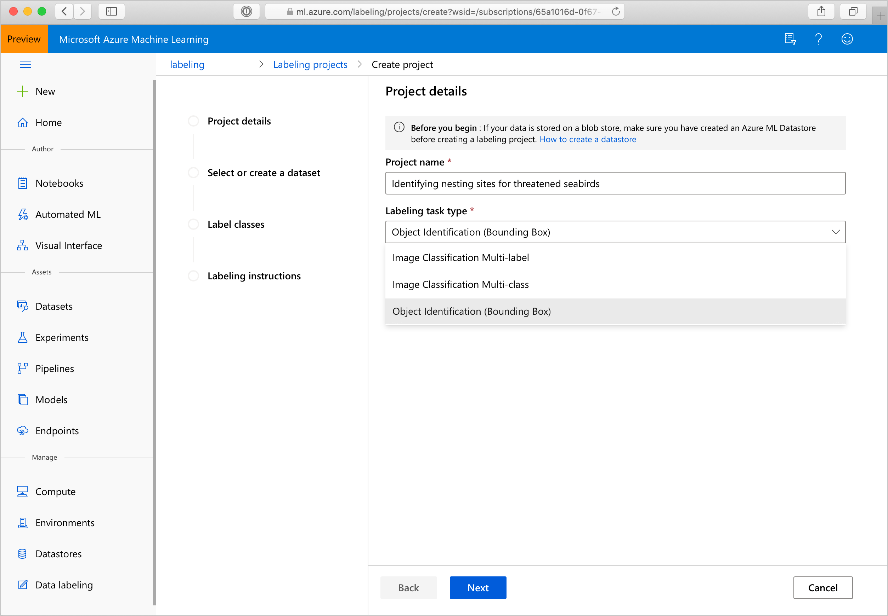

# Get labels for data

Labeling large amounts of data has often been a headache in machine learning projects. ML projects with a computer vision component, such as image classification or object detection, generally require thousands of images and corresponding labels. 
 
Azure Machine Learning studio gives you a central location to create, manage, and monitor labeling projects. Labeling projects help coordinate the data, labels, and team members, allowing you to more efficiently manage the labeling tasks. Currently supported tasks are image classification, either multi-label or multi-class, and object identification using bounded boxes.

Azure tracks progress and maintains the queue of incomplete labeling tasks. Labelers don't require an Azure account to participate. Once authenticated with their Microsoft Account (MSA) or [Azure Active Directory](https://docs.microsoft.com/azure/active-directory/active-directory-whatis), they can do as much or as little labeling as their time allows. They can assign and change labels using keyboard shortcuts. 

You can start and stop the project, add and remove people and teams, and monitor progress. You can export labeled data in either COCO format or as an Azure ML dataset. 

In this article, you'll learn how to:

> [!div class="checklist"]
> * Create a project
> * Specify the project's data and structure
> * Manage the teams and people working on the project
> * Run and monitor the project
> * Export the labels 

## Prerequisites

* The data you wish to label, either in local files or already in Azure storage
* The set of labels you wish to apply
* Instructions for labeling
* An Azure subscription. If you don’t have an Azure subscription, create a free account before you begin. Try the [free or paid version of Azure Machine Learning](https://aka.ms/AMLFree) today
* An Azure Machine Learning workspace. See [Create an Azure Machine Learning workspace](how-to-manage-workspace.md).

## Create a labeling project

Labeling projects are administered from [Azure Machine Learning studio](https://ml.azure.com/). The **Labeling projects** page allows you to manage your projects, teams, and people. A project has one or more teams assigned to it, and a team has one or more people assigned to it. 

If your data are already stored in Azure blob storage, you should make them available as a datastore before creating your labeling project. For information, see [Create and register datastores](https://docs.microsoft.com/azure/machine-learning/service/how-to-access-data#create-and-register-datastores). 

To create a project, choose **Add project**. Give it an appropriate name and select **Labeling task type**. 

* Choose **Image Classification Multi-label** for projects in which **one _or more_** labels from a set of classes may be applied to an image. For instance, a photo of a dog might be labeled with both *dog* and *daytime*
* Choose **Image Classification Multi-class** for projects in which only a **single class** from a set of classes may be applied to an image
* Choose **Object Identification (Bounding Box)** for projects in which the task is to both to assign a class to an object within an image, and to specify a bounding box surrounding the object

Choose **Next** when you're ready to move on.

## Specify data to be labeled

If you've already created a dataset containing your data, you can select it from the **Select an existing dataset** dropdown. Or, choose **Create a dataset** to either select an existing Azure datastore or to upload local files. 

### Create a dataset from an Azure datastore

Although choosing direct upload of local files is fine for many use-cases, [Azure Storage Explorer](https://azure.microsoft.com/features/storage-explorer/) is both more robust and faster for transferring significant amounts of data. We recommend Azure Storage Explorer as the default way to move files.

To create a dataset from data that you've already stored in Azure blob storage:

1. Choose **Create a dataset** and **From datastore**
1. Assign a **Name** for your dataset
1. You must choose "File" as the **Dataset type**  
1. Select the datastore 
1. If your data are in a subfolder within the blob storage, choose **Browse** to select the path. 
    * You may additionally append `/**` after the path to include all the files in subfolders of the selected path
    * Use `**/*.*` to include all the data in the current container and subfolders
1. Provide a description of your dataset
1. Choose **Next** 
1. Confirm the details. You may choose **Back** to modify the settings or choose **Create** to create the dataset

### Create a dataset by uploading data

If you wish to directly upload your data:

1. Choose **Create a dataset** and **From local files**
1. Assign a **Name** for your dataset
1. You must choose "File" as the **Dataset type**
1. If you choose **Advanced settings**, you may customize the datastore, container, and path to your data
1. Choose **Browse** to select local files for upload
1. Provide a description of your dataset
1. Choose **Next** 
1. Confirm the details. You may choose **Back** to modify the settings or choose **Create** to create the dataset

The data get uploaded to the default blob store (`workspaceblobstore`) of your Azure ML workspace.

## Specify label classes

On the **Label classes** page, you specify the set of classes used to categorize your data. Give thought to these classes, as your labelers' accuracy and speed will be affected by the ease with which they can properly choose among them. For instance, rather than spelling out the full genus and species for plants or animals it might be better to use field codes or abbreviate the genus. 

Enter one label per row, using the **+** button to add a new row. If you have more than 3 or 4 labels, but fewer than 10, consider prefixing them with "1: ", "2: ", etc. to provide some guidance to labelers using the number keys to accelerate their work. 

## Describe the labeling task

Clearly explaining the labeling task is important. The **Labeling instructions** page allows you to link to an external site for instructions to be presented to labelers. Keep the instructions task-oriented and appropriate to the audience. 

* What are the labels they'll see and how will they choose between them? Is there a reference text to which they should refer?
* What should they do if no label seems appropriate? 
* What should they do if multiple labels seem appropriate?
* What confidence threshold should they apply to a label? Do you want their "best guess" if they aren't certain?
* What should they do with partially occluded or overlapping objects of interest?
* What should they do if an object of interest is clipped by the edge of the image?
* What should they do if they feel they've made a mistake with an image after submitting it? 

With bounding boxes, other important questions include:

* How is the bounding box defined for this task? Should it be entirely interior to the object, cropped as closely as possible to its extent, or is some amount of clearance acceptable? 
* What level of care and consistency do you expect the labeler to apply to defining bounding boxes?

>[!Note]
> Be sure to say that the labeler will be able to choose among the first 9 labels with number keys 1-9. 

## Initialize the labeling project

Once initialized, some aspects of the labeling project are immutable: you can't change the task type or dataset. You may modify labels and you can change the URL for the task description. Carefully review the settings before creating the project. Once you've submitted the project, you'll be taken back to the **Labeling** homepage, which will show the project as **Initializing**. This page doesn't autorefresh, so after some amount of time, manually refreshing it will show the project as **Created**. 

## Manage teams and people

A labeling project gets a default team and adds you as a default member. Each labeling project gets a new default team, but teams can be shared between projects. Projects may have more than one team. Creating a team is done by choosing **Add team** on the **Teams** page. 

People are managed on the **People** page. You can add and remove people keyed on their email address. Each labeler will have to authenticate using either their Microsoft Account or Azure Active Directory if you use it.  

Once you've added a person, you can assign them to one or more teams. Navigate to the **Teams** page, select the particular team in which you're interested, and then use **Assign people** or **Remove people** as desired.

If you ever wish to send an email to everyone on the team, you can do so by choosing the team to bring up the **Team details** page. On this page, the **Email team** button will open your email editor with the addresses of everyone on the team.

## Run and monitor the project

Once the project is initialized, Azure will begin running it. If, on the main **Labeling** page, you click on the project, you'll be taken to **Project details**. The **Dashboard** tab will show you progress on the labeling task. 

On the **Data** tab, you can look at your dataset and review labeled data. If you see improperly labeled data, you can **Select** it and choose **Reject**, which will remove the labels and put the data back into the unlabeled queue. 

On the **Team** tab, you can assign or unassign teams to this project. 

If you wish to take the project offline or online, choose the **Pause**/**Start** button, which toggles the running state of the project.

You can label data directly from the **Project details** page by selecting **Label data**. You may only label data when the project is running. 

## Export the labels

At any time, you may export the label data for machine learning experimentation. Image labels can be exported in [COCO format](http://cocodataset.org/#format-data) or as an Azure ML dataset. You will find the **Export** button on the **Project details** page of your labeling project.

The COCO file is created in the default blob store of the Azure ML workspace in a folder within **export/coco**. You can access the exported Azure ML dataset under the **Datasets** section of studio. Dataset details page also provides sample code to access your labels from Python.

## Next steps

* Label images for [image classification or object detection](how-to-label-images.md)
* Learn more about [Azure Machine Learning and studio](../compare-azure-ml-to-studio-classic.md)