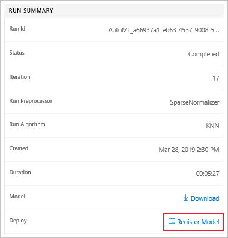
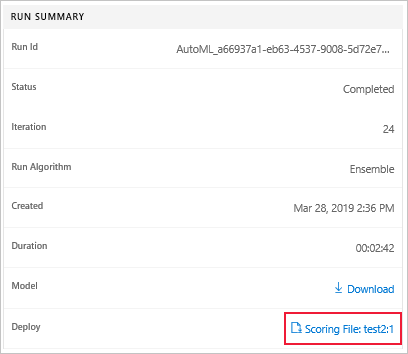
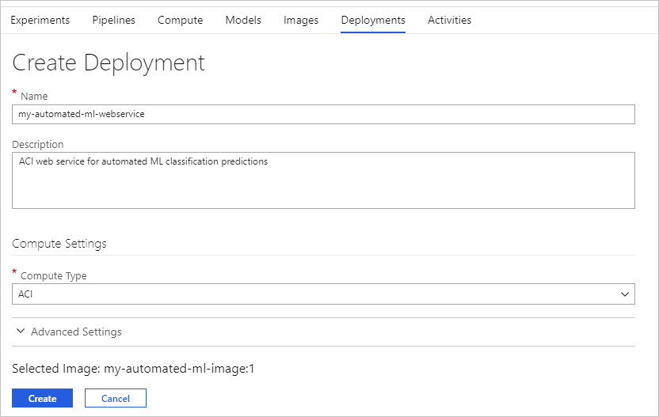

# Create and explore automated machine learning experiments in the Azure portal

 Automated machine learning automates the process of selecting the best algorithm to use for your specific data, so you can generate a machine learning model quickly. In this article, you learn how to create, run, and explore automated machine learning experiments in the Azure portal without a single line of code. [Learn more about automated machine learning](https://docs.microsoft.com/azure/machine-learning/service/concept-automated-ml)

## Prerequisites

* An Azure subscription. If you don’t have an Azure subscription, create a free account before you begin. Try the [free or paid version of Azure Machine Learning service](https://aka.ms/AMLFree) today.

* An Azure Machine Learning service workspace. See [Create an Azure Machine Learning service workspace](https://docs.microsoft.com/azure/machine-learning/service/setup-create-workspace).

## Get Started

Navigate to the left pane. Select Automated Machine Learning under the Applications section.

You'll see the following if this is your first time doing any experiments with Automated Machine Learning.

Otherwise, you will see your Automated machine learning dashboard with an overview of all of your automated machine learning experiments and runs, including those run using the SDK. Here you can filter and explore your runs by date, experiment name, and run status.

## Create an experiment

Select the Create Experiment button to populate the following form.

1. Enter your experiment name.

1. Select a compute for the data profiling and training job. A list of your existing computes is available in the dropdown. To create a new compute, follow the instructions in step 3.

1. Select the Create a new compute button to open the below pane and configure your compute context for this experiment.

    

    Field|Description
    ---|---
    Compute name| Enter a unique name that identifies your compute context.
    Virtual machine size| Select the virtual machine size for your compute.
    Additional settings| *Min node*: Enter the minimum number of nodes for your compute. The minimum number of nodes for AML compute is 0. To enable data profiling, you must have 1 or more nodes.   *Max node*: Enter the maximum number of nodes for your compute. The default is 6 nodes for an AML Compute.

      To start the creation of your new compute, select **Create**. This can take a few moments.

      >[!NOTE]
      > Your compute name will indicate if the compute you select/create is *profiling enabled*. (See 7b for more details on data profiling).

1. Select a storage account for your data. Public preview only supports local file uploads and Azure Blob Storage accounts.

1. Select a storage container.

1. Select a data file from your storage container or upload a file from your local computer to the container.

    

1. Use the preview and profile tabs to further configure your data for this experiment.

    1. On the Preview tab, indicate if your data includes headers and select the features (columns) for training using the **Included** switch buttons in each feature column.

        

    1. On the Profile tab, you can view the profile of your data by feature, as well as the distribution, type, and summary statistics (mean, median, max/min, and so on) of each.

        

        >[!NOTE]
        > The following error message will appear if your compute context is **not** profiling enabled: *Data profiling is only available for compute targets that are already running*.

1. Select the training job type: classification, regression, or forecasting.

1. Select target column. The column which you would like to do the predictions on.

1. For forecasting:
    1. Select time column: This column contains the time data to be used.
    1. Select forecast horizon: How many time units (minutes/hours/days/weeks/months/years) will the model be able to predict to the future. The further the model is required to predict into the future, the less accurate it will become. [Learn more about forecasting and forecast horizon](https://docs.microsoft.com/azure/machine-learning/service/how-to-auto-train-forecast#configure-experiment).

1. (optional) Advanced settings: additional settings you can use to better control the training job.

    Advanced settings|Description
    ------|------
    Primary metric| Main metric used for scoring your model. [Learn more about model metrics](https://docs.microsoft.com/azure/machine-learning/service/how-to-configure-auto-train#explore-model-metrics).
    Exit criteria| When any of these criteria are met, the training job ends before full completion.   *Training job time (minutes)*: How long to allow the training job to run.    *Max number of iterations*: Maximum number of pipelines (iterations) to test in the training job. The job will not run more than the specified number of iterations.   *Metric score threshold*:  Minimum metric score for all pipelines. This ensures that if you have a defined target metric you want to reach, you do not spend more time on the training job than necessary.
    Preprocessing| Select to enable or disable the preprocessing done by automated machine learning. Preprocessing includes automatic data cleansing, preparing, and transformation to generate synthetic features. [Learn more about preprocessing](#preprocess).
    Validation| Select one of the cross validation options to use in the training job. [Learn more about cross validation](https://docs.microsoft.com/en-us/azure/machine-learning/service/how-to-configure-auto-train#cross-validation-split-options).
    Concurrency| Select the multi-core limits you would like to use when using multi-core compute.
    Blocked algorithm| Select algorithms you want to exclude from the training job.

   

> [!NOTE]
> For more information on fields click the information tool tip.

### Data profiling

You can get a vast variety of summary statistics across your data set to verify whether your data set is ML-ready. For non-numeric columns, they include only basic statistics like min, max, and error count. For numeric columns, you can also review their statistical moments and estimated quantiles. Specifically, our data profile includes:

* **Feature**: name of the column which is being summarized.

* **Profile**: an in-line visualization based on the type inferred. For example, strings, booleans, and dates will have value counts, while decimals (numerics) have approximated histograms. This allows you to gain a quick understanding of the distribution of the data.

* **Type distribution**: an in-line value count of types within a column. Nulls are their own type, so this visualization is useful for detecting odd or missing values.

* **Type**: the inferred type of the column. Possible values include: strings, booleans, dates, and decimals.

* **Min**: the minimum value of the column. Blank entries appear for features whose type does not have an inherent ordering (e.g. booleans).

* **Max**: the maximum value of the column. Like "min," blank entries appear for features with irrelevant types.

* **Count**: the total number of missing and non-missing entries in the column.

* **Not missing count**: the number of entries in the column which are not missing. Note that empty strings and errors are treated as values, so they will not contribute to the "not missing count."

* **Quantiles** (at 0.1, 1, 5, 25, 50, 75, 95, 99, and 99.9% intervals): the approximated values at each quantile to provide a sense of the distribution of the data. Blank entries appear for features with irrelevant types.

* **Mean**: the arithmetic mean of the column. Blank entries appear for features with irrelevant types.

* **Standard deviation**: the standard deviation of the column. Blank entries appear for features with irrelevant types.

* **Variance**: the variance of the column. Blank entries appear for features with irrelevant types.

* **Skewness**: the skewness of the column. Blank entries appear for features with irrelevant types.

* **Kurtosis**: the kurtosis of the column. Blank entries appear for features with irrelevant types.

Furthermore, you can use these statistics to decide whether you want to include or exclude certain columns. By toggling the selector on each column, you can control the scope across which columns will be used in your automated machine learning experiment.

### Advanced preprocessing

When configuring your experiments, you can enable the advanced setting `Preprocess`. Doing so means that the following data preprocessing and featurization steps are performed automatically.

|Preprocessing&nbsp;steps| Description |
| ------------- | ------------- |
|Drop high cardinality or no variance features|Drop these from training and validation sets, including features with all values missing, same value across all rows or with extremely high cardinality (for example, hashes, IDs, or GUIDs).|	
|Impute missing values|For numerical features, impute with average of values in the column.  For categorical features, impute with most frequent value.|
|Generate additional features|For DateTime features: Year, Month, Day, Day of week, Day of year, Quarter, Week of the year, Hour, Minute, Second.  For Text features: Term frequency based on unigrams, bi-grams, and tri-character-grams.|	
|Transform and encode |Numeric features with few unique values are transformed into categorical features.  One-hot encoding is performed for low cardinality categorical; for high cardinality, one-hot-hash encoding.|
|Word embeddings|Transforms is a text featurizer that converts vectors of text tokens into sentence vectors using a pre-trained model. Each word’s embedding vector in a document is aggregated together to produce a document feature vector.|	
|Target encodings|For categorical features, maps each category with averaged target value for regression problems, and to the class probability for each class for classification problems. Frequency-based weighting and k-fold cross validation is applied to reduce overfitting of the mapping and noise caused by sparse data categories.|	
|Text target encoding|For text input, a stacked linear model with bag-of-words is used to generate the probability of each class.|	
|Weight of Evidence (WoE)|Calculates WoE as a measure of correlation of categorical columns to the target column. It is calculated as the log of the ratio of in-class vs out-of-class probabilities. This step outputs one numerical feature column per class and removes the need to explicitly impute missing values and outlier treatment.|	
|Cluster Distance|Trains a k-means clustering model on all numerical columns.  Outputs k new features, one new numerical feature per cluster, containing the distance of each sample to the centroid of each cluster.|	

## Run experiment

To run the experiment, click the Start button.
  
The experiment preparing process takes a couple minutes.

## View results

Once the experiment preparation phase is done, you'll see the run details screen. This will give you a full list of the models created. By default, the model that scores the highest based on your parameters will be at the top of the list. As the training job tries out more models, you'll see them added to the list and the chart.
Use the chart to get a quick comparison of the metrics for the models produced so far.

You are able to drill down on any of the output models which opens the details of that model including performance and distribution charts and metrics.[Learn more about charts](https://docs.microsoft.com/azure/machine-learning/service/how-to-track-experiments#understanding-automated-ml-charts).

Training jobs can take a while for each pipeline to finish running.

## Deploy model

Once you have the best model at hand, it is time to deploy it as a web service to predict on new data.

Automated ML helps you with deploying the model without writing code:

1. From the Run Summary pane on the right, select "Register model"

    

1. Once the model is registered, you'll be able to download the scoring script to be used during the deployment.

    

1. Once you have the scoring script, go to the "Models" page (in the left navigation pane under **Assets**)

    

1. Check the checkbox next to the model you registered, and select "Create image".

    You can identify the model by its description, which will include the run id, iteration number, in the following format: "<Run_ID>_<Iteration_number>_Model.

1. Enter a name for the image and upload the scoring file you previously downloaded. For the Conda file, you can download and use the following file:

    <!TODO: insert link to "env.yml">

    

    You can use your own scoring script and conda file, as well as upload additional files. [Learn more about scoring scripts](https://docs.microsoft.com/azure/machine-learning/service/how-to-deploy-and-where#script).

1. Select the "Create" button to start the image creation. This will take a few minutes to complete, once done, you will see a message on the top bar.

1. Go to the "Images" tab, check the checkbox next to the image you want to deploy, and select "Create deployment"

    

1. Enter a unique deployment name.

1. (optional) Enter a description for the deployment.

1. Select the target compute type to use. [Learn more about deployments](https://docs.microsoft.com/azure/machine-learning/service/how-to-deploy-and-where).

    

1. Select "Create" to start the deployment process, it will take several minutes to complete.

1. That's it! You have an operational web service to generate predictions.

## Next steps

* [How to consume a deployed model](https://docs.microsoft.com/azure/machine-learning/service/how-to-consume-web-service).
