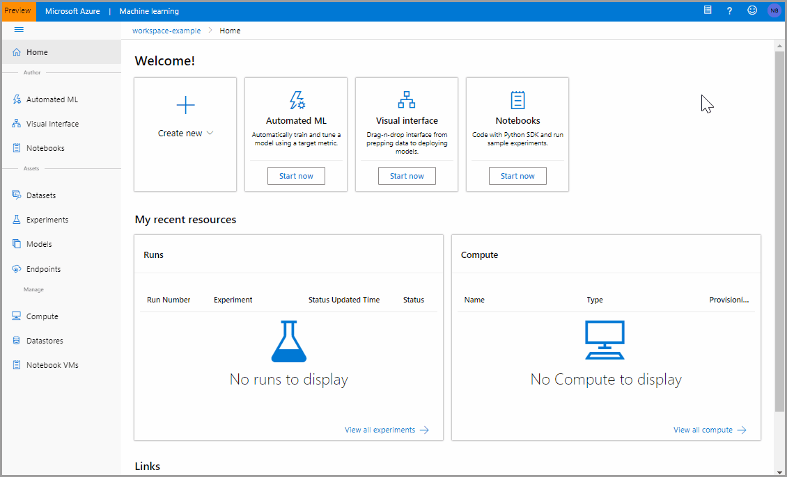

# Create and access datasets (preview) in Azure Machine Learning

In this article, you'll learn how to create Azure Machine Learning datasets (preview), and how to access data from local or remote experiments.

With Azure Machine Learning datasets, you can:

* **Keep a single copy of data in your storage** referenced by datasets.

* **Easily access data during model training** without worrying about connection strings or data paths.

* **Share data & collaborate** with other users.

## Prerequisites

To create and work with datasets, you need:

* An Azure subscription. If you don’t have an Azure subscription, create a free account before you begin. Try the [free or paid version of Azure Machine Learning](https://aka.ms/AMLFree) today.

* An [Azure Machine Learning workspace](how-to-manage-workspace.md)

* The [Azure Machine Learning SDK for Python installed](https://docs.microsoft.com/python/api/overview/azure/ml/install?view=azure-ml-py), which includes the azureml-datasets package.

> [!Note]
> Some Dataset classes (preview) have dependencies on the [azureml-dataprep](https://docs.microsoft.com/python/api/azureml-dataprep/?view=azure-ml-py) package. For Linux users, these classes are supported only on the following distributions:  Red Hat Enterprise Linux, Ubuntu, Fedora, and CentOS.

## Dataset Types

Datasets are categorized into two types based on how users consume them in training.

* [TabularDataset](https://docs.microsoft.com/python/api/azureml-core/azureml.data.tabulardataset?view=azure-ml-py) represents data in a tabular format by parsing the provided file or list of files. This provides you with the ability to materialize the data into a pandas or spark DataFrame. A `TabularDataset` object can be created from csv, tsv, parquet files, SQL query results etc. For a complete list, please visit our [documentation](https://aka.ms/tabulardataset-api-reference).

* [FileDataset](https://docs.microsoft.com/python/api/azureml-core/azureml.data.file_dataset.filedataset?view=azure-ml-py) references single or multiple files in your datastores or public urls. This provides you with the ability to download or mount the files to your compute. The files can be of any format, which enables a wider range of machine learning scenarios including deep learning.

To find out more about upcoming API changes, see [here](https://aka.ms/tabular-dataset).

## Create datasets

By creating a dataset, you create a reference to the data source location, along with a copy of its metadata. The data remains in its existing location, so no extra storage cost is incurred.

For the data to be accessible by Azure Machine Learning, datasets must be created from paths in [Azure datastores](how-to-access-data.md) or public web urls.

To create Datasets from an [Azure datastore](how-to-access-data.md):

* Verify you have `contributor` or `owner` access to the registered Azure datastore.

* Create the dataset by referencing to a path in the datastore.

```Python
from azureml.core.workspace import Workspace
from azureml.core.datastore import Datastore
from azureml.core.dataset import Dataset

datastore_name = 'your datastore name'

# get existing workspace
workspace = Workspace.from_config()

# retrieve an existing datastore in the workspace by name
datastore = Datastore.get(workspace, datastore_name)
```

### Create TabularDatasets

TabularDatasets can be created via the SDK or by using the workspace landing page (preview). A timestamp can be specified from a column in the data or the path pattern data is stored in to enable a timeseries trait, which allows for easy and efficient filtering by time.

#### Using the SDK

Use the [`from_delimited_files()`](https://docs.microsoft.com/python/api/azureml-core/azureml.data.dataset_factory.tabulardatasetfactory?view=azure-ml-py#from-delimited-files-path--validate-true--include-path-false--infer-column-types-true--set-column-types-none--separator------header--promoteheadersbehavior-all-files-have-same-headers--3---partition-format-none-) method on `TabularDatasetFactory` class to read files in csv or tsv format, and create an unregistered TabularDataset. If you are reading from multiple files, results will be aggregated into one tabular representation.

```Python
# create a TabularDataset from multiple paths in datastore
datastore_paths = [
                  (datastore, 'weather/2018/11.csv'),
                  (datastore, 'weather/2018/12.csv'),
                  (datastore, 'weather/2019/*.csv')
                 ]
weather_ds = Dataset.Tabular.from_delimited_files(path=datastore_paths)

# create a TabularDataset from a delimited file behind a public web url
web_path ='https://dprepdata.blob.core.windows.net/demo/Titanic.csv'
titanic_ds = Dataset.Tabular.from_delimited_files(path=web_path)

# preview the first 3 rows of titanic_ds
titanic_ds.take(3).to_pandas_dataframe()
```

| |PassengerId|Survived|Pclass|Name|Sex|Age|SibSp|Parch|Ticket|Fare|Cabin|Embarked
-|-----------|--------|------|----|---|---|-----|-----|------|----|-----|--------|
0|1|0|3|Braund, Mr. Owen Harris|male|22.0|1|0|A/5 21171|7.2500||S
1|2|1|1|Cumings, Mrs. John Bradley (Florence Briggs Th...|female|38.0|1|0|PC 17599|71.2833|C85|C
2|3|1|3|Heikkinen, Miss. Laina|female|26.0|0|0|STON/O2. 3101282|7.9250||S

Use the [`from_sql_query()`](https://docs.microsoft.com/python/api/azureml-core/azureml.data.dataset_factory.tabulardatasetfactory?view=azure-ml-py#from-sql-query-query--validate-true--set-column-types-none-) method on `TabularDatasetFactory` class to read from Azure SQL Database.

```Python

from azureml.core import Dataset, Datastore

# create tabular dataset from a SQL database in datastore
sql_datastore = Datastore.get(workspace, 'mssql')
sql_ds = Dataset.Tabular.from_sql_query((sql_datastore, 'SELECT * FROM my_table'))
```
Use the [`with_timestamp_columns()`](https://docs.microsoft.com/python/api/azureml-core/azureml.data.tabulardataset?view=azure-ml-py#with-timestamp-columns-fine-grain-timestamp--coarse-grain-timestamp-none--validate-false-) method on `TabularDataset` class to enable easy and efficient filtering by time. More examples and details can be found [here](https://aka.ms/azureml-tsd-notebook).

```Python
# create a TabularDataset with timeseries trait
datastore_paths = [(datastore, 'weather/*/*/*/data.parquet')]

# get a coarse timestamp column from the path pattern
dataset = Dataset.Tabular.from_parquet_files(path=datastore_path, partition_format='weather/{coarse_time:yyy/MM/dd}/data.parquet')

# set coarse timestamp to the virtual column created, and fine grain timestamp from a column in the data
dataset = dataset.with_timestamp_columns(fine_grain_timestamp='datetime', coarse_grain_timestamp='coarse_time')

# filter with timeseries trait specific methods
data_slice = dataset.time_before(datetime(2019, 1, 1))
data_slice = dataset.time_after(datetime(2019, 1, 1))
data_slice = dataset.time_between(datetime(2019, 1, 1), datetime(2019, 2, 1))
data_slice = dataset.time_recent(timedelta(weeks=1, days=1))
```

#### Using the workspace landing page

Sign in to the [workspace landing page](https://ml.azure.com) to create a dataset via the web experience. Currently, the workspace landing page only supports the creation of TabularDatasets.

The following animation shows how to create a dataset in the workspace landing page.

First, select **Datasets** in the **Assets** section of the left pane. Then,  select **+ Create Dataset** to choose the source of your dataset; this can either be from local files, datastore or public web urls. The **Settings and preview** and the **Schema** forms are intelligently populated based on file type. Select **Next** to review them or to further configure your dataset prior to creation. Select **Done** to complete your dataset creation.



### Create FileDatasets

Use the [`from_files()`](https://docs.microsoft.com/python/api/azureml-core/azureml.data.dataset_factory.filedatasetfactory?view=azure-ml-py#from-files-path--validate-true-) method on `FileDatasetFactory` class to load files in any format, and create an unregistered FileDataset.

```Python
# create a FileDataset from multiple paths in datastore
datastore_paths = [
                  (datastore, 'animals/dog/1.jpg'),
                  (datastore, 'animals/dog/2.jpg'),
                  (datastore, 'animals/dog/*.jpg')
                 ]
animal_ds = Dataset.File.from_files(path=datastore_paths)

# create a FileDataset from image and label files behind public web urls
web_paths = [
            'https://azureopendatastorage.blob.core.windows.net/mnist/train-images-idx3-ubyte.gz',
            'https://azureopendatastorage.blob.core.windows.net/mnist/train-labels-idx1-ubyte.gz'
           ]
mnist_ds = Dataset.File.from_files(path=web_paths)
```

## Register datasets

To complete the creation process, register your datasets with workspace:

Use the [`register()`](https://docs.microsoft.com/python/api/azureml-core/azureml.core.dataset.dataset?view=azure-ml-py#register-workspace--name--description-none--tags-none--visible-true--exist-ok-false--update-if-exist-false-) method to register datasets to your workspace so they can be shared with others and reused across various experiments.

```Python
titanic_ds = titanic_ds.register(workspace = workspace,
                                 name = 'titanic_ds',
                                 description = 'titanic training data')
```

>[!Note]
> Datasets created via the workspace landing page are automatically registered to the workspace.

## Version datasets

You can register a new dataset under the same name by creating a new version. Dataset version is a way to bookmark the state of your data, so you can apply a specific version of the dataset for experimentation or future reproduction. Typical scenarios to consider versioning:
* When new data is available for retraining.
* When you are applying different data preparation or feature engineering approaches.

```Python
# create a TabularDataset from Titanic training data
web_paths = [
            'https://dprepdata.blob.core.windows.net/demo/Titanic.csv',
            'https://dprepdata.blob.core.windows.net/demo/Titanic2.csv'
           ]
titanic_ds = Dataset.Tabular.from_delimited_files(path=web_paths)

# create a new version of titanic_ds
titanic_ds = titanic_ds.register(workspace = workspace,
                                 name = 'titanic_ds',
                                 description = 'new titanic training data',
                                 create_new_version = True)
```


## Access datasets in your script

Registered datasets are accessible locally and remotely on compute clusters like the Azure Machine Learning compute. To access your registered Dataset across experiments, use the following code to get your workspace and registered dataset by name. The [`get_by_name()`](https://docs.microsoft.com/python/api/azureml-core/azureml.core.dataset.dataset?view=azure-ml-py#get-by-name-workspace--name--version--latest--) method on the `Dataset` class by default returns the latest version of the dataset registered with the workspace.

```Python
%%writefile $script_folder/train.py

from azureml.core import Dataset, Run

run = Run.get_context()
workspace = run.experiment.workspace

dataset_name = 'titanic_ds'

# Get a dataset by name
titanic_ds = Dataset.get_by_name(workspace=workspace, name=dataset_name)

# Load a TabularDataset into pandas DataFrame
df = titanic_ds.to_pandas_dataframe()
```

## Next steps

* Learn [how to train with datasets](how-to-train-with-datasets.md)
* Use automated machine learning to [train with TabularDatasets](https://aka.ms/automl-dataset).
* For more examples of training with datasets, see the [sample notebooks](https://aka.ms/dataset-tutorial).
