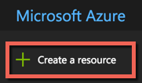
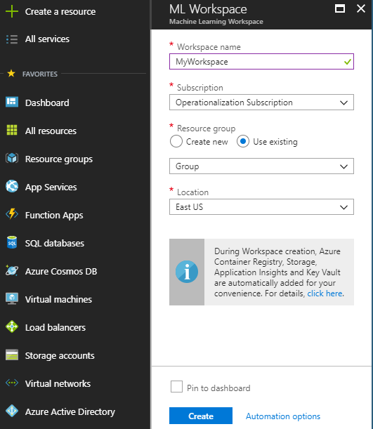
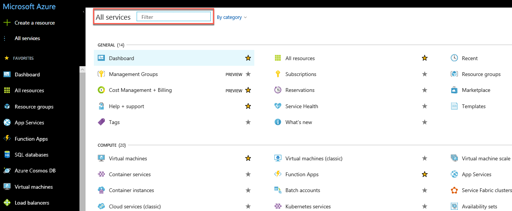
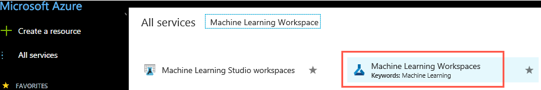

# Create an Azure Machine Learning Workspace in the Azure Portal

In this article, you'll create an **Azure Machine Learning Workspace** in the Azure portal for [Azure Machine Learning Services](overview-what-is-azure-ml.md). 

This workspace is the top-level resource that can be used by one or more users to store their compute resources, models, deployments, and run histories. For your convenience, the following resources are added automatically to your workspace when regionally available: [Azure Container Registry](https://azure.microsoft.com/en-us/services/container-registry/), [Azure storage](https://azure.microsoft.com/en-us/services/storage/), [Azure Application Insights](https://azure.microsoft.com/en-us/services/application-insights/), and [Azure Key Vault](https://azure.microsoft.com/en-us/services/key-vault/).

## Prerequisites

To create a workspace, you need an Azure subscription. If you don't have an Azure subscription, create a [free account](https://azure.microsoft.com/free/?WT.mc_id=A261C142F) before you begin.

## Create a workspace 

1. Sign in to the [Azure portal](https://portal.azure.com/) using the credentials for the Azure subscription you'll use. If you don't have an Azure subscription, create a [free account](https://azure.microsoft.com/free/?WT.mc_id=A261C142F) now.

   

1. Select the **Create a resource** button (+) in the upper-left corner of the portal. 

   

1. Enter **Machine Learning** in the search bar. Select the search result named **Machine Learning Workspace**.

    

1. In the **Machine Learning Workspace** pane, scroll to the bottom and select **Create** to begin.

    

1. In the **ML Workspace** pane, configure your workspace. 

   Field|Description
   ---|---
   Workspace name |Enter a unique name that identifies your workspace. 
   Subscription |Choose the Azure subscription that you want to use. If you have multiple subscriptions, choose the appropriate subscription in which the resource is billed.
   Resource group | Use an existing resource group in your subscription, or enter a name to create a new resource group. A resource group is a container that holds related resources for an Azure solution. 
   Location | Choose the location closest to your users and the data resources. This is where the workspace is created.

   

1. Select **Create** to begin the creation process.  It can take a few moments to create the workspace. 

   To check on the status of the deployment, select the Notifications icon (bell) on the toolbar.

   When finished, a deployment success message appears.

## View a workspace

1. In top left corner of the portal, select **All services**..  

   

1. In the **All services** filter field, type **Machine Learning Workspace**.  

   

1. In the filter results, select **Machine Learning Workspace** to display list of your Azure Machine Leaning Workspaces. 

   

1. Look through the list of workspaces found. You can filter based on subscription, resource groups, and locations.  

   

1. Select the workspace you just created to display its properties.

   

## Clean up resources 

[!INCLUDE [aml-delete-resource-group](../../../includes/aml-delete-resource-group.md)]

You can also keep the resource group, but delete a single workspace by displaying the workspace properties and selecting the Delete button.

## Next steps

Follow the full-length tutorial to learn how to use a workspace to build, train, and deploy models with Azure Machine Learning Services.

> [!div class="nextstepaction"]
> [Tutorial: Build, train, and deploy](tutorial-build-train-deploy-with-azure-machine-learning.md)