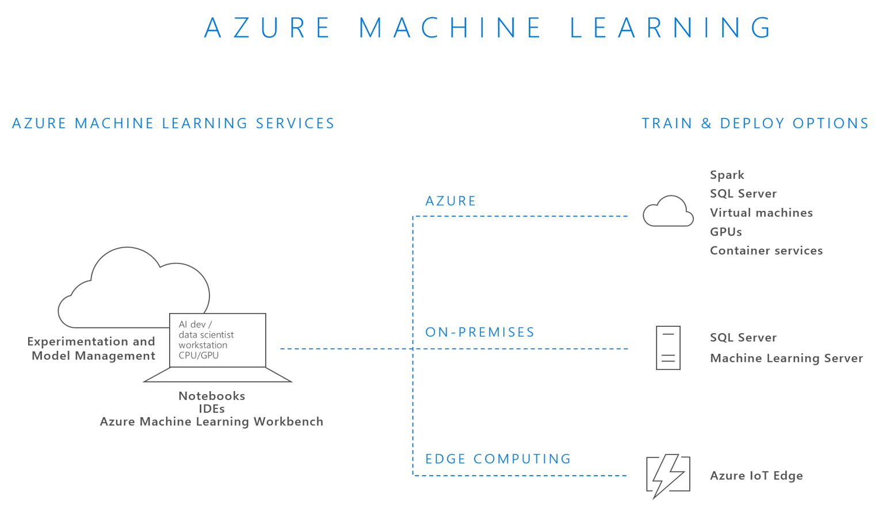

# This H1 is the title of the article. It appears in search, appears at the top of article, second greatest impact on search, 100 chars or less

Guidance here: https://review.docs.microsoft.com/help/contribute/contribute-how-to-write-seo-basics?branch=master

1st paragraph	provides the primary intent of the article in 1 or 2 short sentences. 

To get started using Azure Machine Learning, you need a workspace. The experience starts in the Azure portal by clicking on Create a resource in top left corner of screen. In the “Search the Marketplace” box, type Machine Learning and select Machine Learning Workplace from the list of suggestions.

## Prerequisites
To step through this how-to guide, you need:
- [A machine learning account](template-howto.md)

## Section here H2 
Paragraph here. 
**This phrase is bold.**
*This phrase is italics.*

This is a [hyperlink to an article](./template-concepts.md)

This is an image:

Note that images need to be stored in the media folder with a subdirectory matching the name of the article and then the filename.

## Section here H2
This table has headings:

|Column1  |Column2  |Column3  |
|---------|---------|---------|
|Row1|Value 1|Value A|
|Row2|Value 2|Value B|
|Row3|Value 3|Value C|

## Section here H2
This is a numbered list:

1. First item

   This paragraph is indented to be the same spacing as the first numbered item.

2. Second item
   - this sentence is a bullet
   - this sentence is another bullet

3. Third item

4. Forth item

5. Fifth item

## This list is bulleted list:
- Item 1
- Item 2
- Item 3
  - Subitem 1
  - Subitem 2

## Next steps

For information about machine learning, see [Another article](template-howto.md)
