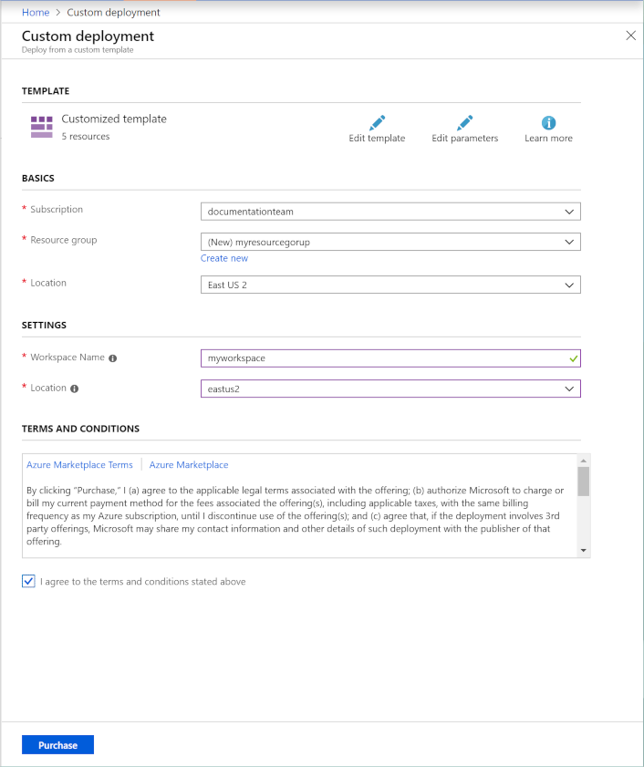

# Use an Azure Resource Manager template to create a workspace for Azure Machine Learning service

In this article, you learn several ways to create an Azure Machine Learning service workspace using Azure Resource Manager templates. A Resource Manager template makes it easy to create resources as a single, coordinated operation. A template is a JSON document that defines the resources that are needed for a deployment. It may also specify deployment parameters. Parameters are used to provide input values when using the template.

For more information, see [Deploy an application with Azure Resource Manager template](../../azure-resource-manager/resource-group-template-deploy.md).

## Prerequisites

* An **Azure subscription**. If you do not have one, try the [free or paid version of Azure Machine Learning service](https://aka.ms/AMLFree).

* To use a template from a CLI, you need either [Azure PowerShell](https://docs.microsoft.com/powershell/azure/overview?view=azps-1.2.0) or the [Azure CLI](https://docs.microsoft.com/cli/azure/install-azure-cli?view=azure-cli-latest).

## Resource Manager template

The following Resource Manager template can be used to create an Azure Machine Learning service workspace and associated Azure resources:

[!code-json[create-azure-machine-learning-service-workspace](~/quickstart-templates/101-machine-learning-create/azuredeploy.json)]

This template creates the following Azure services:

* Azure Resource Group
* Azure Storage Account
* Azure Key Vault
* Azure Application Insights
* Azure Container Registry
* Azure Machine Learning workspace

The resource group is the container that holds the services. The various services are required by the Azure Machine Learning workspace.

The example template has two parameters:

* The **location** where the resource group and services will be created.

    The template will use the location you select for most resources. The exception is the Application Insights service, which is not available in all of the locations that the other services are. If you select a location where it is not available, the service will be created in the South Central US location.

* The **workspace name**, which is the friendly name of the Azure Machine Learning workspace.

    The names of the other services are generated randomly.

For more information on templates, see the following articles:

* [Author Azure Resource Manager templates](../../azure-resource-manager/resource-group-authoring-templates.md)
* [Deploy an application with Azure Resource Manager templates](../../azure-resource-manager/resource-group-template-deploy.md)
* [Microsoft.MachineLearningServices resource types](https://docs.microsoft.com/azure/templates/microsoft.machinelearningservices/allversions)

## Use the Azure portal

1. Follow the steps in [Deploy resources from custom template](https://docs.microsoft.com/azure/azure-resource-manager/resource-group-template-deploy-portal#deploy-resources-from-custom-template). When you arrive at the __Edit template__ screen, paste in the template from this document.
1. Select __Save__ to use the template. Provide the following information and agree to the listed terms and conditions:

   * Subscription: Select the Azure subscription to use for these resources.
   * Resource group: Select or create a resource group to contain the services.
   * Workspace name: The name to use for the Azure Machine Learning workspace that will be created. The workspace name must be between 3 and 33 characters. It may only contain alphanumeric characters and '-'.
   * Location: Select the location where the resources will be created.

     

For more information, see [Deploy resources from custom template](../../azure-resource-manager/resource-group-template-deploy-portal.md#deploy-resources-from-custom-template).

## Use Azure PowerShell

This example assumes that you have saved the template to a file named `azuredeploy.json` in the current directory:

```powershell
New-AzResourceGroup -Name examplegroup -Location "East US"
new-azresourcegroupdeployment -name exampledeployment `
  -resourcegroupname examplegroup -location "East US" `
  -templatefile .\azuredeploy.json -workspaceName "exampleworkspace"
```

For more information, see [Deploy resources with Resource Manager templates and Azure PowerShell](../../azure-resource-manager/resource-group-template-deploy.md) and [Deploy private Resource Manager template with SAS token and Azure PowerShell](../../azure-resource-manager/resource-manager-powershell-sas-token.md).

## Use Azure CLI

This example assumes that you have saved the template to a file named `azuredeploy.json` in the current directory:

```azurecli-interactive
az group create --name examplegroup --location "East US"
az group deployment create \
  --name exampledeployment \
  --resource-group examplegroup \
  --template-file azuredeploy.json \
  --parameters workspaceName=exampleworkspace location=eastus
```

For more information, see [Deploy resources with Resource Manager templates and Azure CLI](../../azure-resource-manager/resource-group-template-deploy-cli.md) and [Deploy private Resource Manager template with SAS token and Azure CLI](../../azure-resource-manager/resource-manager-cli-sas-token.md).

## Azure Key Vault access policy and Azure Resource Manager templates

When you use an Azure Resource Manager template to create the workspace and associated resources (including Azure Key Vault), multiple times. For example, using the template multiple times with the same parameters as part of a continuous integration and deployment pipeline.

Most resource creation operations through templates are idempotent, but Key Vault clears the access policies each time the template is used. Clearing the access policies breaks access to the Key Vault for any existing workspace that is using it. For example, Stop/Create functionalities of Azure Notebooks VM may fail.  

To avoid this problem, we recommend one of the following approaches:

*  Do not deploy the template more than once for the same parameters. Or delete the existing resources before using the template to recreate them.
  
* Examine the Key Vault access policies and then use these policies to set the accessPolicies property of the template.
* Check if the Key Vault resource already exists. If it does, do not recreate it through the template. For example, add a parameter that allows you to disable the creation of the Key Vault resource if it already exists.

## Next steps

* [Deploy resources with Resource Manager templates and Resource Manager REST API](../../azure-resource-manager/resource-group-template-deploy-rest.md).
* [Creating and deploying Azure resource groups through Visual Studio](../../azure-resource-manager/vs-azure-tools-resource-groups-deployment-projects-create-deploy.md).
