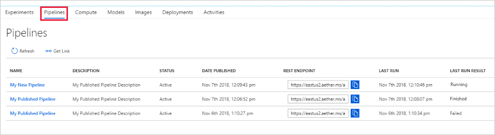

# Create and run a machine learning pipeline by using Azure Machine Learning SDK

In this article, you learn how to create, publish, run, and track a [machine learning pipeline](concept-ml-pipelines.md) by using the [Azure Machine Learning SDK](https://aka.ms/aml-sdk).  These pipelines help create and manage the workflows that stitch together various machine learning phases. 
Each phase of a pipeline, such as data preparation and model training, can include one or more steps.

The pipelines you create are visible to the members of your Azure Machine Learning service [workspace](how-to-manage-workspace.md). 

Pipelines use remote compute targets for computation and the storage of the intermediate and final data associated with that pipeline. Pipelines can read and write data to and from supported [Azure Storage](https://docs.microsoft.com/azure/storage/) locations.

If you don’t have an Azure subscription, create a free account before you begin. Try the [free or paid version of Azure Machine Learning service](https://aka.ms/AMLFree).

## Prerequisites

* [Configure your development environment](how-to-configure-environment.md) to install the Azure Machine Learning SDK.

* Create an [Azure Machine Learning workspace](how-to-configure-environment.md#workspace) to hold all your pipeline resources. 

  ```python
  from azureml.core import Workspace
  
  ws = Workspace.create(
     name = '<workspace-name>',
     subscription_id = '<subscription-id>',
     resource_group = '<resource-group>',
     location = '<workspace_region>',
     exist_ok = True)
  ```

## Set up machine learning resources

Create the resources required to run a pipeline:

* Set up a datastore used to access the data needed in the pipeline steps.

* Configure a `DataReference` object to point to data that lives in, or is accessible in, a datastore.

* Set up the [compute targets](concept-azure-machine-learning-architecture.md#compute-targets) on which your pipeline steps will run.

### Set up a datastore
A datastore stores the data for the pipeline to access. Each workspace has a default datastore. You can register additional datastores. 

When you create your workspace, [Azure Files](https://docs.microsoft.com/azure/storage/files/storage-files-introduction) and [Azure Blob storage](https://docs.microsoft.com/azure/storage/blobs/storage-blobs-introduction) are attached to the workspace by default. Azure Blob Storage is the default datastore for a workspace, but you can also use Blob storage as a datastore. To learn more, see [Deciding when to use Azure Files, Azure Blobs, or Azure Disks](https://docs.microsoft.com/azure/storage/common/storage-decide-blobs-files-disks). 

```python
# Default datastore (Azure file storage)
def_data_store = ws.get_default_datastore() 

# The above call is equivalent to this 
def_data_store = Datastore(ws, "workspacefilestore")

# Get blob storage associated with the workspace
def_blob_store = Datastore(ws, "workspaceblobstore")
```

Upload data files or directories to the datastore for them to be accessible from your pipelines. This example uses the Blob storage version of the datastore:

```python
def_blob_store.upload_files(
    ["./data/20news.pkl"],
    target_path="20newsgroups", 
    overwrite=True)
```

A pipeline consists of one or more steps. A step is a unit run on a compute target. Steps might consume data sources and produce “intermediate” data. A step can create data such as a model, a directory with model and dependent files, or temporary data. This data is then available for other steps later in the pipeline.

### Configure data reference

You just created a data source that can be referenced in a pipeline as an input to a step. A data source in a pipeline is represented by a [DataReference](https://docs.microsoft.com/python/api/azureml-core/azureml.data.data_reference.datareference) object. The `DataReference` object points to data that lives in or is accessible from a datastore.

```python
blob_input_data = DataReference(
    datastore=def_blob_store,
    data_reference_name="test_data",
    path_on_datastore="20newsgroups/20news.pkl")
```

Intermediate data (or output of a step) is represented by a [PipelineData](https://docs.microsoft.com/python/api/azureml-pipeline-core/azureml.pipeline.core.pipelinedata?view=azure-ml-py) object. `output_data1` is produced as the output of a step, and used as the input of one or more future steps. `PipelineData` introduces a data dependency between steps, and creates an implicit execution order in the pipeline.

```python
output_data1 = PipelineData(
    "output_data1",
    datastore=def_blob_store,
    output_name="output_data1")
```

## Set up compute target

In Azure Machine Learning, the term __compute__ (or __compute target__) refers to the machines or clusters that perform the computational steps in your machine learning pipeline.   See [compute targets for model training](how-to-set-up-training-targets.md) for a full list of compute targets and how to create and attach them to your workspace.  The process for creating and or attaching a compute target is the same regardless of whether you are training a model or running a pipeline step. After you create and attach your compute target, use the `ComputeTarget` object in your [pipeline step](#steps).

> [!IMPORTANT]
> Performing management operations on compute targets is not supported from inside remote jobs. Since machine learning pipelines are submitted as a remote job, do not use management operations on compute targets from inside the pipeline.

Below are examples of creating and attaching compute targets for:

* Azure Machine Learning Compute
* Azure Databricks 
* Azure Data Lake Analytics

### Azure Machine Learning Compute

You can create an Azure Machine Learning compute for running your steps.

```python
from azureml.core.compute import ComputeTarget, AmlCompute

compute_name = "aml-compute"
 if compute_name in ws.compute_targets:
    compute_target = ws.compute_targets[compute_name]
    if compute_target and type(compute_target) is AmlCompute:
        print('Found compute target: ' + compute_name)
else:
    print('Creating a new compute target...')
    provisioning_config = AmlCompute.provisioning_configuration(vm_size = vm_size, # NC6 is GPU-enabled
                                                                min_nodes = 1, 
                                                                max_nodes = 4)
     # create the compute target
    compute_target = ComputeTarget.create(ws, compute_name, provisioning_config)
    
    # Can poll for a minimum number of nodes and for a specific timeout. 
    # If no min node count is provided it will use the scale settings for the cluster
    compute_target.wait_for_completion(show_output=True, min_node_count=None, timeout_in_minutes=20)
    
     # For a more detailed view of current cluster status, use the 'status' property    
    print(compute_target.status.serialize())
```

### <a id="databricks"></a>Azure Databricks

Azure Databricks is an Apache Spark-based environment in the Azure cloud. It can be used as a compute target with an Azure Machine Learning pipeline.

Create an Azure Databricks workspace before using it. To create these resource, see the [Run a Spark job on Azure Databricks](https://docs.microsoft.com/azure/azure-databricks/quickstart-create-databricks-workspace-portal) document.

To attach Azure Databricks as a compute target, provide the following information:

* __Databricks compute name__: The name you want to assign to this compute resource.
* __Databricks workspace name__: The name of the Azure Databricks workspace.
* __Databricks access token__: The access token used to authenticate to Azure Databricks. To generate an access token, see the [Authentication](https://docs.azuredatabricks.net/api/latest/authentication.html) document.

The following code demonstrates how to attach Azure Databricks as a compute target with the Azure Machine Learning SDK:

```python
import os
from azureml.core.compute import ComputeTarget, DatabricksCompute
from azureml.exceptions import ComputeTargetException

databricks_compute_name = os.environ.get("AML_DATABRICKS_COMPUTE_NAME", "<databricks_compute_name>")
databricks_workspace_name = os.environ.get("AML_DATABRICKS_WORKSPACE", "<databricks_workspace_name>")
databricks_resource_group = os.environ.get("AML_DATABRICKS_RESOURCE_GROUP", "<databricks_resource_group>")
databricks_access_token = os.environ.get("AML_DATABRICKS_ACCESS_TOKEN", "<databricks_access_token>")

try:
    databricks_compute = ComputeTarget(workspace=ws, name=databricks_compute_name)
    print('Compute target already exists')
except ComputeTargetException:
    print('compute not found')
    print('databricks_compute_name {}'.format(databricks_compute_name))
    print('databricks_workspace_name {}'.format(databricks_workspace_name))
    print('databricks_access_token {}'.format(databricks_access_token))

    # Create attach config
    attach_config = DatabricksCompute.attach_configuration(resource_group = databricks_resource_group,
                                                           workspace_name = databricks_workspace_name,
                                                           access_token = databricks_access_token)
    databricks_compute = ComputeTarget.attach(
             ws,
             databricks_compute_name,
             attach_config
         )
    
    databricks_compute.wait_for_completion(True)
```

For a more detailed example, see an [example notebook](https://aka.ms/pl-databricks) on GitHub.

### <a id="adla"></a>Azure Data Lake Analytics

Azure Data Lake Analytics is a big data analytics platform in the Azure cloud. It can be used as a compute target with an Azure Machine Learning pipeline.

Create an Azure Data Lake Analytics account before using it. To create this resource, see the [Get started with Azure Data Lake Analytics](https://docs.microsoft.com/azure/data-lake-analytics/data-lake-analytics-get-started-portal) document.

To attach Data Lake Analytics as a compute target, you must use the Azure Machine Learning SDK and provide the following information:

* __Compute name__: The name you want to assign to this compute resource.
* __Resource Group__: The resource group that contains the Data Lake Analytics account.
* __Account name__: The Data Lake Analytics account name.

The following code demonstrates how to attach Data Lake Analytics as a compute target:

```python
import os
from azureml.core.compute import ComputeTarget, AdlaCompute
from azureml.exceptions import ComputeTargetException


adla_compute_name = os.environ.get("AML_ADLA_COMPUTE_NAME", "<adla_compute_name>")
adla_resource_group = os.environ.get("AML_ADLA_RESOURCE_GROUP", "<adla_resource_group>")
adla_account_name = os.environ.get("AML_ADLA_ACCOUNT_NAME", "<adla_account_name>")

try:
    adla_compute = ComputeTarget(workspace=ws, name=adla_compute_name)
    print('Compute target already exists')
except ComputeTargetException:
    print('compute not found')
    print('adla_compute_name {}'.format(adla_compute_name))
    print('adla_resource_id {}'.format(adla_resource_group))
    print('adla_account_name {}'.format(adla_account_name))
    # create attach config
    attach_config = AdlaCompute.attach_configuration(resource_group = adla_resource_group,
                                                     account_name = adla_account_name)
    # Attach ADLA
    adla_compute = ComputeTarget.attach(
             ws,
             adla_compute_name,
             attach_config
         )
    
    adla_compute.wait_for_completion(True)
```

For a more detailed example, see an [example notebook](https://aka.ms/pl-adla) on GitHub.

> [!TIP]
> Azure Machine Learning pipelines can only work with data stored in the default data store of the Data Lake Analytics account. If the data you need to work with is in a non-default store, you can use a [`DataTransferStep`](https://docs.microsoft.com/python/api/azureml-pipeline-steps/azureml.pipeline.steps.data_transfer_step.datatransferstep?view=azure-ml-py) to copy the data before training.

## <a id="steps"></a>Construct your pipeline steps

Once you create and attach a compute target to your workspace, you are ready to define a pipeline step. There are many built-in steps available via the Azure Machine Learning SDK. The most basic of these steps is a [PythonScriptStep](https://docs.microsoft.com/python/api/azureml-pipeline-steps/azureml.pipeline.steps.python_script_step.pythonscriptstep?view=azure-ml-py), which runs a Python script in a specified compute target:

```python
trainStep = PythonScriptStep(
    script_name="train.py",
    arguments=["--input", blob_input_data, "--output", processed_data1],
    inputs=[blob_input_data],
    outputs=[processed_data1],
    compute_target=compute_target,
    source_directory=project_folder
)
```

Reuse of previous results (`allow_reuse`) is key when using pipelines in a collaborative environment since eliminating unnecessary re-runs offers agility. This is the default behavior when the script_name, inputs, and the parameters of a step remain the same. When the output of the step is reused, the job is not submitted to the compute, instead, the results from the previous run are immediately available to the next step's run. If set to false, a new run will always be generated for this step during pipeline execution. 

After you define your steps, you build the pipeline by using some or all of those steps.

> [!NOTE]
> No file or data is uploaded to the Azure Machine Learning service when you define the steps or build the pipeline.

```python
# list of steps to run
compareModels = [trainStep, extractStep, compareStep]

# Build the pipeline
pipeline1 = Pipeline(workspace=ws, steps=[compareModels])
```

The following example uses the Azure Databricks compute target created earlier: 

```python
dbStep = DatabricksStep(
    name="databricksmodule",
    inputs=[step_1_input],
    outputs=[step_1_output],
    num_workers=1,
    notebook_path=notebook_path,
    notebook_params={'myparam': 'testparam'},
    run_name='demo run name',
    compute_target=databricks_compute,
    allow_reuse=False
)
# List of steps to run
steps = [dbStep]

# Build the pipeline
pipeline1 = Pipeline(workspace=ws, steps=steps)
```

For more information, see the [azure-pipeline-steps package](https://docs.microsoft.com/python/api/azureml-pipeline-steps/?view=azure-ml-py) and [Pipeline class](https://docs.microsoft.com/python/api/azureml-pipeline-core/azureml.pipeline.core.pipeline%28class%29?view=azure-ml-py) reference.

## Submit the pipeline

When you submit the pipeline, Azure Machine Learning service checks the dependencies for each step and uploads a snapshot of the source directory you specified. If no source directory is specified, the current local directory is uploaded. The snapshot is also stored as part of the experiment in your workspace.

> [!IMPORTANT]
> To prevent files from being included in the snapshot, create a [.gitignore](https://git-scm.com/docs/gitignore) or `.amlignore` file in the directory and add the files to it. The `.amlignore` file uses the same syntax and patterns as the [.gitignore](https://git-scm.com/docs/gitignore) file. If both files exist, the `.amlignore` file takes precedence.
>
> For more information, see [Snapshots](concept-azure-machine-learning-architecture.md#snapshots).

```python
# Submit the pipeline to be run
pipeline_run1 = Experiment(ws, 'Compare_Models_Exp').submit(pipeline1)
pipeline_run1.wait_for_completion()
```

When you first run a pipeline, Azure Machine Learning:

* Downloads the project snapshot to the compute target from the Blob storage associated with the workspace.
* Builds a Docker image corresponding to each step in the pipeline.
* Downloads the docker image for each step to the compute target from the container registry.
* Mounts the datastore, if a `DataReference` object is specified in a step. If mount is not supported, the data is instead copied to the compute target.
* Runs the step in the compute target specified in the step definition. 
* Creates artifacts, such as logs, stdout and stderr, metrics, and output specified by the step. These artifacts are then uploaded and kept in the user’s default datastore.


For more information, see the [Experiment class](https://docs.microsoft.com/python/api/azureml-core/azureml.core.experiment.experiment?view=azure-ml-py) reference.

## GitHub tracking and integration

When you start a training run where the source directory is a local Git repository, information about the repository is stored in the run history. For example, the current commit ID for the repository is logged as part of the history.

## Publish a pipeline

You can publish a pipeline to run it with different inputs later. For the REST endpoint of an already published pipeline to accept parameters, you must parameterize the pipeline before publishing. 

1. To create a pipeline parameter, use a [PipelineParameter](https://docs.microsoft.com/python/api/azureml-pipeline-core/azureml.pipeline.core.graph.pipelineparameter?view=azure-ml-py) object with a default value.

   ```python
   pipeline_param = PipelineParameter(
     name="pipeline_arg", 
     default_value=10)
   ```

2. Add this `PipelineParameter` object as a parameter to any of the steps in the pipeline as follows:

   ```python
   compareStep = PythonScriptStep(
     script_name="compare.py",
     arguments=["--comp_data1", comp_data1, "--comp_data2", comp_data2, "--output_data", out_data3, "--param1", pipeline_param],
     inputs=[ comp_data1, comp_data2],
     outputs=[out_data3],    
     target=compute_target, 
     source_directory=project_folder)
   ```

3. Publish this pipeline that will accept a parameter when invoked.

   ```python
   published_pipeline1 = pipeline1.publish(
       name="My_Published_Pipeline", 
       description="My Published Pipeline Description")
   ```

## Run a published pipeline

All published pipelines have a REST endpoint. This endpoint invokes the run of the pipeline from external systems, such as non-Python clients. This endpoint enables "managed repeatability" in batch scoring and retraining scenarios.

To invoke the run of the preceding pipeline, you need an Azure Active Directory authentication header token, as described in [AzureCliAuthentication class](https://docs.microsoft.com/python/api/azureml-core/azureml.core.authentication.azurecliauthentication?view=azure-ml-py) or get more details at [Authentication in Azure Machine Learning](https://aka.ms/pl-restep-auth) notebook.

```python
response = requests.post(published_pipeline1.endpoint, 
    headers=aad_token, 
    json={"ExperimentName": "My_Pipeline",
        "ParameterAssignments": {"pipeline_arg": 20}})
```

## View results

See the list of all your pipelines and their run details:
1. Sign in to the [Azure portal](https://portal.azure.com/).  

1. [View your workspace](how-to-manage-workspace.md#view) to find the list of pipelines.
 
 
1. Select a specific pipeline to see the run results.

## Caching & reuse  

In order to optimize and customize the behavior of your pipelines you can do a few things around caching and reuse. For example, you can choose to:
+ **Turn off the default reuse of the step run output** by setting `allow_reuse=False` during [step definition](https://docs.microsoft.com/python/api/azureml-pipeline-steps/?view=azure-ml-py). Reuse is key when using pipelines in a collaborative environment since eliminating unnecessary runs offers agility. However, you can opt out of this.
+ **Extend hashing beyond the script**, to also include an absolute path or relative paths to the source_directory to other files and directories using the `hash_paths=['<file or directory']` 
+ **Force output regeneration for all steps in a run** with `pipeline_run = exp.submit(pipeline, regenerate_outputs=False)`

By default, `allow-reuse` for steps is enabled and only the main script file is hashed. So, if the script for a given step remains the same (`script_name`, inputs, and the parameters), the output of a previous step run is reused, the job is not submitted to the compute, and the results from the previous run are immediately available to the next step instead.  

```python
step = PythonScriptStep(name="Hello World", 
                        script_name="hello_world.py",  
                        compute_target=aml_compute,  
                        source_directory= source_directory, 
                        allow_reuse=False, 
                        hash_paths=['hello_world.ipynb']) 
```
 

## Next steps
- Use [these Jupyter notebooks on GitHub](https://aka.ms/aml-pipeline-readme) to explore machine learning pipelines further.
- Read the SDK reference help for the [azureml-pipelines-core](https://docs.microsoft.com/python/api/azureml-pipeline-core/?view=azure-ml-py) package and the [azureml-pipelines-steps](https://docs.microsoft.com/python/api/azureml-pipeline-steps/?view=azure-ml-py) package.

[!INCLUDE [aml-clone-in-azure-notebook](../../../includes/aml-clone-for-examples.md)]
