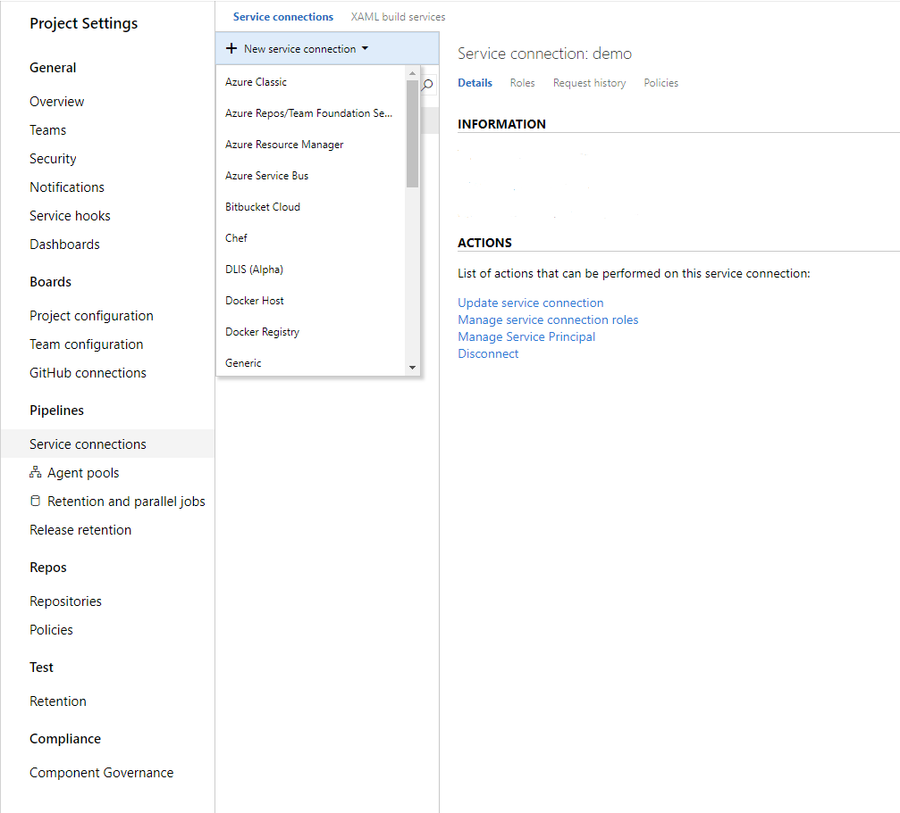
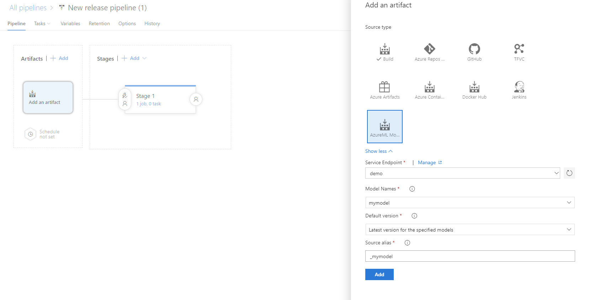
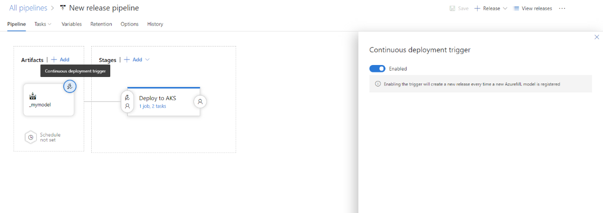

# Deploy models with the Azure Machine Learning service

Learn how to deploy your machine learning model as a web service in the Azure cloud, or to IoT Edge devices. 

The workflow is similar regardless of [where you deploy](#target) your model:

1. Register the model.
1. Prepare to deploy (specify assets, usage, compute target)
1. Deploy the model to the compute target.
1. Test the deployed model, also called web service.

For more information on the concepts involved in the deployment workflow, see [Manage, deploy, and monitor models with Azure Machine Learning Service](concept-model-management-and-deployment.md).

## Prerequisites

- A model. If you do not have a trained model, you can use the model & dependency files provided in [this tutorial](https://aka.ms/azml-deploy-cloud).

- The [Azure CLI extension for Machine Learning service](reference-azure-machine-learning-cli.md), [Azure Machine Learning Python SDK](https://aka.ms/aml-sdk), or the [Azure Machine Learning Visual Studio Code extension](how-to-vscode-tools.md).

## <a id="registermodel"></a> Register your model

A registered model logical container for one or more files that make up your model. For example, if you have a model that is stored in multiple files, you can register them as a single model in the workspace. After registration, you can then download or deploy the registered model and receive all the files that were registered.

Machine learning models are registered in your Azure Machine Learning workspace. The model can come from Azure Machine Learning or can come from somewhere else. The following examples demonstrate how to register a model from file:

### Register a model from an Experiment Run

+ **Scikit-Learn example using the SDK**
  ```python
  model = run.register_model(model_name='sklearn_mnist', model_path='outputs/sklearn_mnist_model.pkl')
  print(model.name, model.id, model.version, sep='\t')
  ```

  > [!TIP]
  > To include multiple files in the model registration, set `model_path` to the directory that contains the files.

+ **Using the CLI**

  ```azurecli-interactive
  az ml model register -n sklearn_mnist  --asset-path outputs/sklearn_mnist_model.pkl  --experiment-name myexperiment
  ```

  > [!TIP]
  > To include multiple files in the model registration, set `--asset-path` to the directory that contains the files.

+ **Using VS Code**

  Register models using any model files or folders with the [VS Code](how-to-vscode-tools.md#deploy-and-manage-models) extension.

### Register an externally created model

[!INCLUDE [trusted models](../../../includes/machine-learning-service-trusted-model.md)]

You can register an externally created model by providing a **local path** to the model. You can provide either a folder or a single file.

+ **ONNX example with the Python SDK:**
  ```python
  onnx_model_url = "https://www.cntk.ai/OnnxModels/mnist/opset_7/mnist.tar.gz"
  urllib.request.urlretrieve(onnx_model_url, filename="mnist.tar.gz")
  !tar xvzf mnist.tar.gz
  
  model = Model.register(workspace = ws,
                         model_path ="mnist/model.onnx",
                         model_name = "onnx_mnist",
                         tags = {"onnx": "demo"},
                         description = "MNIST image classification CNN from ONNX Model Zoo",)
  ```

  > [!TIP]
  > To include multiple files in the model registration, set `model_path` to the directory that contains the files.

+ **Using the CLI**
  ```azurecli-interactive
  az ml model register -n onnx_mnist -p mnist/model.onnx
  ```

  > [!TIP]
  > To include multiple files in the model registration, set `-p` to the directory that contains the files.

**Time estimate**: Approximately 10 seconds.

For more information, see the reference documentation for the [Model class](https://docs.microsoft.com/python/api/azureml-core/azureml.core.model.model?view=azure-ml-py).

For more information on working with models trained outside Azure Machine Learning service, see [How to deploy an existing model](how-to-deploy-existing-model.md).

<a name="target"></a>

## Choose a compute target

The following compute targets, or compute resources, can be used to host your web service deployment. 

[!INCLUDE [aml-compute-target-deploy](../../../includes/aml-compute-target-deploy.md)]

## Prepare to deploy

To deploy as a web service, you must create an inference configuration (`InferenceConfig`) and a deployment configuration. Inference, or model scoring, is the phase where the deployed model is used for prediction, most commonly on production data. In the inference config, you specify the scripts and dependencies needed to serve your model. In the deployment config you specify details of how to serve the model on the compute target.


### <a id="script"></a> 1. Define your entry script & dependencies

The entry script receives data submitted to a deployed web service, and passes it to the model. It then takes the response returned by the model and returns that to the client. **The script is specific to your model**; it must understand the data that the model expects and returns.

The script contains two functions that load and run the model:

* `init()`: Typically this function loads the model into a global object. This function is run only once when the Docker container for your web service is started.

* `run(input_data)`: This function uses the model to predict a value based on the input data. Inputs and outputs to the run typically use JSON for serialization and de-serialization. You can also work with raw binary data. You can transform the data before sending to the model, or before returning to the client.

#### What is get_model_path?

When you register a model, you provide a model name used for managing the model in the registry. You use this name with the [Model.get_model_path()](https://docs.microsoft.com/python/api/azureml-core/azureml.core.model.model?view=azure-ml-py#get-model-path-model-name--version-none---workspace-none-) to retrieve the path of the model file(s) on the local file system. If you register a folder or a collection of files, this API returns the path to the directory that contains those files.

When you register a model, you give it a name, which corresponds to where the model is placed, either locally or during service deployment.

The below example will return a path to a single file called `sklearn_mnist_model.pkl` (which was registered with the name `sklearn_mnist`):

```python
model_path = Model.get_model_path('sklearn_mnist')
``` 

#### (Optional) Automatic Swagger schema generation

To automatically generate a schema for your web service, provide a sample of the input and/or output in the constructor for one of the defined type objects, and the type and sample are used to automatically create the schema. Azure Machine Learning service then creates an [OpenAPI](https://swagger.io/docs/specification/about/) (Swagger) specification for the web service during deployment.

The following types are currently supported:

* `pandas`
* `numpy`
* `pyspark`
* standard Python object

To use schema generation, include the `inference-schema` package in your conda environment file. The following example uses `[numpy-support]` since the entry script uses a numpy parameter type: 

#### Example dependencies file
The following YAML is an example of a Conda dependencies file for inference.

```YAML
name: project_environment
dependencies:
  - python=3.6.2
  - pip:
    - azureml-defaults
    - scikit-learn==0.20.0
    - inference-schema[numpy-support]
```

If you want to use automatic schema generation, your entry script **must** import the `inference-schema` packages. 

Define the input and output sample formats in the `input_sample` and `output_sample` variables, which represent the request and response formats for the web service. Use these samples in the input and output function decorators on the `run()` function. The scikit-learn example below uses schema generation.

> [!TIP]
> After deploying the service, use the `swagger_uri` property to retrieve the schema JSON document.

#### Example entry script

The following example demonstrates how to accept and return JSON data:

```python
#example: scikit-learn and Swagger
import json
import numpy as np
from sklearn.externals import joblib
from sklearn.linear_model import Ridge
from azureml.core.model import Model

from inference_schema.schema_decorators import input_schema, output_schema
from inference_schema.parameter_types.numpy_parameter_type import NumpyParameterType

def init():
    global model
    # note here "sklearn_regression_model.pkl" is the name of the model registered under
    # this is a different behavior than before when the code is run locally, even though the code is the same.
    model_path = Model.get_model_path('sklearn_regression_model.pkl')
    # deserialize the model file back into a sklearn model
    model = joblib.load(model_path)

input_sample = np.array([[10,9,8,7,6,5,4,3,2,1]])
output_sample = np.array([3726.995])

@input_schema('data', NumpyParameterType(input_sample))
@output_schema(NumpyParameterType(output_sample))
def run(data):
    try:
        result = model.predict(data)
        # you can return any datatype as long as it is JSON-serializable
        return result.tolist()
    except Exception as e:
        error = str(e)
        return error
```

#### Example script with dictionary input (Support consumption from Power BI)

The following example demonstrates how to define input data as <key: value> dictionary, using Dataframe. This method is supported for consuming the deployed web service from Power BI ([learn more on how to consume the web service from Power BI](https://docs.microsoft.com/power-bi/service-machine-learning-integration)):

```python
import json
import pickle
import numpy as np
import pandas as pd
import azureml.train.automl
from sklearn.externals import joblib
from azureml.core.model import Model

from inference_schema.schema_decorators import input_schema, output_schema
from inference_schema.parameter_types.numpy_parameter_type import NumpyParameterType
from inference_schema.parameter_types.pandas_parameter_type import PandasParameterType

def init():
    global model
    model_path = Model.get_model_path('model_name')   # replace model_name with your actual model name, if needed
    # deserialize the model file back into a sklearn model
    model = joblib.load(model_path)

input_sample = pd.DataFrame(data=[{
              "input_name_1": 5.1,         # This is a decimal type sample. Use the data type that reflects this column in your data
              "input_name_2": "value2",    # This is a string type sample. Use the data type that reflects this column in your data
              "input_name_3": 3            # This is a integer type sample. Use the data type that reflects this column in your data
            }])

output_sample = np.array([0])              # This is a integer type sample. Use the data type that reflects the expected result

@input_schema('data', PandasParameterType(input_sample))
@output_schema(NumpyParameterType(output_sample))
def run(data):
    try:
        result = model.predict(data)
        # you can return any datatype as long as it is JSON-serializable
        return result.tolist()
    except Exception as e:
        error = str(e)
        return error
```
For more example scripts, see the following examples:

* Pytorch: [https://github.com/Azure/MachineLearningNotebooks/blob/master/how-to-use-azureml/training-with-deep-learning/train-hyperparameter-tune-deploy-with-pytorch](https://github.com/Azure/MachineLearningNotebooks/blob/master/how-to-use-azureml/training-with-deep-learning/train-hyperparameter-tune-deploy-with-pytorch)
* TensorFlow: [https://github.com/Azure/MachineLearningNotebooks/tree/master/how-to-use-azureml/training-with-deep-learning/train-hyperparameter-tune-deploy-with-tensorflow](https://github.com/Azure/MachineLearningNotebooks/tree/master/how-to-use-azureml/training-with-deep-learning/train-hyperparameter-tune-deploy-with-tensorflow)
* Keras: [https://github.com/Azure/MachineLearningNotebooks/tree/master/how-to-use-azureml/training-with-deep-learning/train-hyperparameter-tune-deploy-with-keras](https://github.com/Azure/MachineLearningNotebooks/tree/master/how-to-use-azureml/training-with-deep-learning/train-hyperparameter-tune-deploy-with-keras)
* ONNX: [https://github.com/Azure/MachineLearningNotebooks/blob/master/how-to-use-azureml/deployment/onnx/](https://github.com/Azure/MachineLearningNotebooks/blob/master/how-to-use-azureml/deployment/onnx/)
* Scoring against binary data: [How to consume a web service](how-to-consume-web-service.md)

### 2. Define your InferenceConfig

The inference configuration describes how to configure the model to make predictions. The following example demonstrates how to create an inference configuration. This configuration specifies the runtime, the entry script, and (optionally) the conda environment file:

```python
inference_config = InferenceConfig(runtime= "python",
                                   entry_script="x/y/score.py",
                                   conda_file="env/myenv.yml")
```

For more information, see the [InferenceConfig](https://docs.microsoft.com/python/api/azureml-core/azureml.core.model.inferenceconfig?view=azure-ml-py) class reference.

For information on using a custom Docker image with inference configuration, see [How to deploy a model using a custom Docker image](how-to-deploy-custom-docker-image.md).

### CLI example of InferenceConfig

The following JSON document is an example inference configuration for use with the machine learning CLI:

```JSON
{
   "entryScript": "x/y/score.py",
   "runtime": "python",
   "condaFile": "env/myenv.yml",
   "sourceDirectory":"C:/abc",
}
```

The following entities are valid in this file:

* __entryScript__: Path to local file that contains the code to run for the image.
* __runtime__: Which runtime to use for the image. Current supported runtimes are 'spark-py' and 'python'.
* __condaFile__ (optional): Path to local file containing a conda environment definition to use for the image.
* __extraDockerFileSteps__ (optional): Path to local file containing additional Docker steps to run when setting up image.
* __sourceDirectory__ (optional): Path to folders that contains all files to create the image.
* __enableGpu__ (optional): Whether or not to enable GPU support in the image. The GPU image must be used on Microsoft Azure Services such as Azure Container Instances, Azure Machine Learning Compute, Azure Virtual Machines, and Azure Kubernetes Service. Defaults to False.
* __baseImage__ (optional): A custom image to be used as base image. If no base image is given, then the base image will be used based off of given runtime parameter.
* __baseImageRegistry__ (optional): Image registry that contains the base image.
* __cudaVersion__ (optional): Version of CUDA to install for images that need GPU support. The GPU image must be used on Microsoft Azure Services such as Azure Container Instances, Azure Machine Learning Compute, Azure Virtual Machines, and Azure Kubernetes Service. Supported versions are 9.0, 9.1, and 10.0. If 'enable_gpu' is set, defaults to '9.1'.

These entities map to the parameters for the [InferenceConfig](https://docs.microsoft.com/python/api/azureml-core/azureml.core.model.inferenceconfig?view=azure-ml-py) class.

Thee following command demonstrates how to deploy a model using the CLI:

```azurecli-interactive
az ml model deploy -n myservice -m mymodel:1 --ic inferenceconfig.json
```

In this example, the configuration contains the following items:

* A directory that contains assets needed to inference
* That this model requires Python
* The [entry script](#script), which is used to handle web requests sent to the deployed service
* The conda file that describes the Python packages needed to inference

For information on using a custom Docker image with inference configuration, see [How to deploy a model using a custom Docker image](how-to-deploy-custom-docker-image.md).

### 3. Define your Deployment configuration

Before deploying, you must define the deployment configuration. The deployment configuration is specific to the compute target that will host the web service. For example, when deploying locally you must specify the port where the service accepts requests.

You may also need to create the compute resource. For example, if you do not already have an Azure Kubernetes Service associated with your workspace.

The following table provides an example of creating a deployment configuration for each compute target:

| Compute target | Deployment configuration example |
| ----- | ----- |
| Local | `deployment_config = LocalWebservice.deploy_configuration(port=8890)` |
| Azure Container Instance | `deployment_config = AciWebservice.deploy_configuration(cpu_cores = 1, memory_gb = 1)` |
| Azure Kubernetes Service | `deployment_config = AksWebservice.deploy_configuration(cpu_cores = 1, memory_gb = 1)` |

The following sections demonstrate how to create the deployment configuration, and then use it to deploy the web service.

### Optional: Profile your model
Prior to deploying your model as a service, you can profile it to determine optimal CPU and memory requirements using either the SDK or CLI.  Model profiling results are emitted as a `Run` object. The full details of [the Model Profile schema can be found in the API documentation](https://docs.microsoft.com/python/api/azureml-core/azureml.core.profile.modelprofile?view=azure-ml-py)

Learn more on [how to profile your model using the SDK](https://docs.microsoft.com/python/api/azureml-core/azureml.core.model.model?view=azure-ml-py#profile-workspace--profile-name--models--inference-config--input-data-)

## Deploy to target

### <a id="local"></a> Local deployment

To deploy locally, you need to have **Docker installed** on your local machine.

+ **Using the SDK**

  ```python
  deployment_config = LocalWebservice.deploy_configuration(port=8890)
  service = Model.deploy(ws, "myservice", [model], inference_config, deployment_config)
  service.wait_for_deployment(show_output = True)
  print(service.state)
  ```

+ **Using the CLI**

    To deploy using the CLI, use the following command. Replace `mymodel:1` with the name and version of the registered model:

  ```azurecli-interactive
  az ml model deploy -m mymodel:1 -ic inferenceconfig.json -dc deploymentconfig.json
  ```

    The entries in the `deploymentconfig.json` document map to the parameters for [LocalWebservice.deploy_configuration](https://docs.microsoft.com/python/api/azureml-core/azureml.core.webservice.local.localwebservicedeploymentconfiguration?view=azure-ml-py). The following table describes the mapping between the entities in the JSON document and the parameters for the method:

    | JSON entity | Method parameter | Description |
    | ----- | ----- | ----- |
    | `computeType` | NA | The compute target. For local, the value must be `local`. |
    | `port` | `port` | The local port on which to expose the service's HTTP endpoint. |

    The following JSON is an example deployment configuration for use with the CLI:

    ```json
    {
        "computeType": "local",
        "port": 32267
    }
    ```

### <a id="aci"></a> Azure Container Instances (DEVTEST)

Use Azure Container Instances for deploying your models as a web service if one or more of the following conditions is true:
- You need to quickly deploy and validate your model.
- You are testing a model that is under development. 

To see quota and region availability for ACI, see the [Quotas and region availability for Azure Container Instances](https://docs.microsoft.com/azure/container-instances/container-instances-quotas) article.

+ **Using the SDK**

  ```python
  deployment_config = AciWebservice.deploy_configuration(cpu_cores = 1, memory_gb = 1)
  service = Model.deploy(ws, "aciservice", [model], inference_config, deployment_config)
  service.wait_for_deployment(show_output = True)
  print(service.state)
  ```

+ **Using the CLI**

    To deploy using the CLI, use the following command. Replace `mymodel:1` with the name and version of the registered model. Replace `myservice` with the name to give this service:

    ```azurecli-interactive
    az ml model deploy -m mymodel:1 -n myservice -ic inferenceconfig.json -dc deploymentconfig.json
    ```

    The entries in the `deploymentconfig.json` document map to the parameters for [AciWebservice.deploy_configuration](https://docs.microsoft.com/python/api/azureml-core/azureml.core.webservice.aci.aciservicedeploymentconfiguration?view=azure-ml-py). The following table describes the mapping between the entities in the JSON document and the parameters for the method:

    | JSON entity | Method parameter | Description |
    | ----- | ----- | ----- |
    | `computeType` | NA | The compute target. For ACI, the value must be `ACI`. |
    | `containerResourceRequirements` | NA | Contains configuration elements for the CPU and memory allocated for the container. |
    | &emsp;&emsp;`cpu` | `cpu_cores` | The number of CPU cores to allocate for this web service. Defaults, `0.1` |
    | &emsp;&emsp;`memoryInGB` | `memory_gb` | The amount of memory (in GB) to allocate for this web service. Default, `0.5` |
    | `location` | `location` | The Azure region to deploy this Webservice to. If not specified the Workspace location will be used. More details on available regions can be found here: [ACI Regions](https://azure.microsoft.com/global-infrastructure/services/?regions=all&products=container-instances) |
    | `authEnabled` | `auth_enabled` | Whether or not to enable auth for this Webservice. Defaults to False |
    | `sslEnabled` | `ssl_enabled` | Whether or not to enable SSL for this Webservice. Defaults to False. |
    | `appInsightsEnabled` | `enable_app_insights` | Whether or not to enable AppInsights for this Webservice. Defaults to False |
    | `sslCertificate` | `ssl_cert_pem_file` | The cert file needed if SSL is enabled |
    | `sslKey` | `ssl_key_pem_file` | The key file needed if SSL is enabled |
    | `cname` | `ssl_cname` | The cname for if SSL is enabled |
    | `dnsNameLabel` | `dns_name_label` | The dns name label for the scoring endpoint. If not specified a unique dns name label will be generated for the scoring endpoint. |

    The following JSON is an example deployment configuration for use with the CLI:

    ```json
    {
        "computeType": "aci",
        "containerResourceRequirements":
        {
            "cpu": 0.5,
            "memoryInGB": 1.0
        },
        "authEnabled": true,
        "sslEnabled": false,
        "appInsightsEnabled": false
    }
    ```

+ **Using VS Code**

  To [deploy your models with VS Code](how-to-vscode-tools.md#deploy-and-manage-models) you don't need to create an ACI container to test in advance, because ACI containers are created on the fly.

For more information, see the reference documentation for the [AciWebservice](https://docs.microsoft.com/python/api/azureml-core/azureml.core.webservice.aciwebservice?view=azure-ml-py) and [Webservice](https://docs.microsoft.com/python/api/azureml-core/azureml.core.webservice.webservice?view=azure-ml-py) classes.

### <a id="aks"></a>Azure Kubernetes Service (DEVTEST & PRODUCTION)

You can use an existing AKS cluster or create a new one using the Azure Machine Learning SDK, CLI, or the Azure portal.

<a id="deploy-aks"></a>

If you already have an AKS cluster attached, you can deploy to it. If you haven't created or attached an AKS cluster, follow the process to <a href="#create-attach-aks">create a new AKS cluster</a>.

+ **Using the SDK**

  ```python
  aks_target = AksCompute(ws,"myaks")
  # If deploying to a cluster configured for dev/test, ensure that it was created with enough
  # cores and memory to handle this deployment configuration. Note that memory is also used by
  # things such as dependencies and AML components.
  deployment_config = AksWebservice.deploy_configuration(cpu_cores = 1, memory_gb = 1)
  service = Model.deploy(ws, "aksservice", [model], inference_config, deployment_config, aks_target)
  service.wait_for_deployment(show_output = True)
  print(service.state)
  print(service.get_logs())
  ```

+ **Using the CLI**

    To deploy using the CLI, use the following command. Replace `myaks` with the name of the AKS compute target. Replace `mymodel:1` with the name and version of the registered model. Replace `myservice` with the name to give this service:

  ```azurecli-interactive
  az ml model deploy -ct myaks -m mymodel:1 -n myservice -ic inferenceconfig.json -dc deploymentconfig.json
  ```

    The entries in the `deploymentconfig.json` document map to the parameters for [AksWebservice.deploy_configuration](https://docs.microsoft.com/python/api/azureml-core/azureml.core.webservice.aks.aksservicedeploymentconfiguration?view=azure-ml-py). The following table describes the mapping between the entities in the JSON document and the parameters for the method:

    | JSON entity | Method parameter | Description |
    | ----- | ----- | ----- |
    | `computeType` | NA | The compute target. For AKS, the value must be `aks`. |
    | `autoScaler` | NA | Contains configuration elements for autoscale. See the autoscaler table. |
    | &emsp;&emsp;`autoscaleEnabled` | `autoscale_enabled` | Whether or not to enable autoscaling for the web service. If `numReplicas` = `0`, `True`; otherwise, `False`. |
    | &emsp;&emsp;`minReplicas` | `autoscale_min_replicas` | The minimum number of containers to use when autoscaling this web service. Default, `1`. |
    | &emsp;&emsp;`maxReplicas` | `autoscale_max_replicas` | The maximum number of containers to use when autoscaling this web service. Default, `10`. |
    | &emsp;&emsp;`refreshPeriodInSeconds` | `autoscale_refresh_seconds` | How often the autoscaler attempts to scale this web service. Default, `1`. |
    | &emsp;&emsp;`targetUtilization` | `autoscale_target_utilization` | The target utilization (in percent out of 100) that the autoscaler should attempt to maintain for this web service. Default, `70`. |
    | `dataCollection` | NA | Contains configuration elements for data collection. |
    | &emsp;&emsp;`storageEnabled` | `collect_model_data` | Whether or not to enable model data collection for the web service. Default, `False`. |
    | `authEnabled` | `auth_enabled` | Whether or not to enable authentication for the web service. Default, `True`. |
    | `containerResourceRequirements` | NA | Contains configuration elements for the CPU and memory allocated for the container. |
    | &emsp;&emsp;`cpu` | `cpu_cores` | The number of CPU cores to allocate for this web service. Defaults, `0.1` |
    | &emsp;&emsp;`memoryInGB` | `memory_gb` | The amount of memory (in GB) to allocate for this web service. Default, `0.5` |
    | `appInsightsEnabled` | `enable_app_insights` | Whether or not to enable Application Insights logging for the web service. Default, `False`. |
    | `scoringTimeoutMs` | `scoring_timeout_ms` | A timeout to enforce for scoring calls to the web service. Default, `60000`. |
    | `maxConcurrentRequestsPerContainer` | `replica_max_concurrent_requests` | The maximum concurrent requests per node for this web service. Default, `1`. |
    | `maxQueueWaitMs` | `max_request_wait_time` | The maximum time a request will stay in thee queue (in milliseconds) before a 503 error is returned. Default, `500`. |
    | `numReplicas` | `num_replicas` | The number of containers to allocate for this web service. No default value. If this parameter is not set, the autoscaler is enabled by default. |
    | `keys` | NA | Contains configuration elements for keys. |
    | &emsp;&emsp;`primaryKey` | `primary_key` | A primary auth key to use for this Webservice |
    | &emsp;&emsp;`secondaryKey` | `secondary_key` | A secondary auth key to use for this Webservice |
    | `gpuCores` | `gpu_cores` | The number of GPU cores to allocate for this Webservice. Default is 1. |
    | `livenessProbeRequirements` | NA | Contains configuration elements for liveness probe requirements. |
    | &emsp;&emsp;`periodSeconds` | `period_seconds` | How often (in seconds) to perform the liveness probe. Default to 10 seconds. Minimum value is 1. |
    | &emsp;&emsp;`initialDelaySeconds` | `initial_delay_seconds` | Number of seconds after the container has started before liveness probes are initiated. Defaults to 310 |
    | &emsp;&emsp;`timeoutSeconds` | `timeout_seconds` | Number of seconds after which the liveness probe times out. Defaults to 2 seconds. Minimum value is 1 |
    | &emsp;&emsp;`successThreshold` | `success_threshold` | Minimum consecutive successes for the liveness probe to be considered successful after having failed. Defaults to 1. Minimum value is 1. |
    | &emsp;&emsp;`failureThreshold` | `failure_threshold` | When a Pod starts and the liveness probe fails, Kubernetes will try failureThreshold times before giving up. Defaults to 3. Minimum value is 1. |
    | `namespace` | `namespace` | The Kubernetes namespace that the webservice is deployed into. Up to 63 lowercase alphanumeric ('a'-'z', '0'-'9') and hyphen ('-') characters. The first and last characters cannot be hyphens. |

    The following JSON is an example deployment configuration for use with the CLI:

    ```json
    {
        "computeType": "aks",
        "autoScaler":
        {
            "autoscaleEnabled": true,
            "minReplicas": 1,
            "maxReplicas": 3,
            "refreshPeriodInSeconds": 1,
            "targetUtilization": 70
        },
        "dataCollection":
        {
            "storageEnabled": true
        },
        "authEnabled": true,
        "containerResourceRequirements":
        {
            "cpu": 0.5,
            "memoryInGB": 1.0
        }
    }
    ```

+ **Using VS Code**

  You can also [deploy to AKS via the VS Code extension](how-to-vscode-tools.md#deploy-and-manage-models), but you'll need to configure AKS clusters in advance.

Learn more about AKS deployment and autoscale in the [AksWebservice.deploy_configuration](https://docs.microsoft.com/python/api/azureml-core/azureml.core.webservice.akswebservice) reference.

#### Create a new AKS cluster<a id="create-attach-aks"></a>
**Time estimate**: Approximately 20 minutes.

Creating or attaching an AKS cluster is a one time process for your workspace. You can reuse this cluster for multiple deployments. If you delete the cluster or the resource group that contains it, you must create a new cluster the next time you need to deploy. You can have multiple AKS clusters attached to your workspace.

If you want to create an AKS cluster for development, validation, and testing, you set `cluster_purpose = AksCompute.ClusterPurpose.DEV_TEST` when using [`provisioning_configuration()`](https://docs.microsoft.com/python/api/azureml-core/azureml.core.compute.akscompute?view=azure-ml-py). A cluster created with this setting will only have one node.

> [!IMPORTANT]
> Setting `cluster_purpose = AksCompute.ClusterPurpose.DEV_TEST` creates an AKS cluster that is not suitable for handling production traffic. Inference times may be longer than on a cluster created for production. Fault tolerance is also not guaranteed for dev/test clusters.
>
> We recommend that clusters created for dev/test use at least two virtual CPUs.

The following example demonstrates how to create a new Azure Kubernetes Service cluster:

```python
from azureml.core.compute import AksCompute, ComputeTarget

# Use the default configuration (you can also provide parameters to customize this).
# For example, to create a dev/test cluster, use:
# prov_config = AksCompute.provisioning_configuration(cluster_purpose = AksComputee.ClusterPurpose.DEV_TEST)
prov_config = AksCompute.provisioning_configuration()

aks_name = 'myaks'
# Create the cluster
aks_target = ComputeTarget.create(workspace = ws,
                                    name = aks_name,
                                    provisioning_configuration = prov_config)

# Wait for the create process to complete
aks_target.wait_for_completion(show_output = True)
```

For more information on creating an AKS cluster outside of the Azure Machine Learning SDK, see the following articles:
* [Create an AKS cluster](https://docs.microsoft.com/cli/azure/aks?toc=%2Fazure%2Faks%2FTOC.json&bc=%2Fazure%2Fbread%2Ftoc.json&view=azure-cli-latest#az-aks-create)
* [Create an AKS cluster (portal)](https://docs.microsoft.com/azure/aks/kubernetes-walkthrough-portal?view=azure-cli-latest)

For more information on the `cluster_purpose` parameter, see the [AksCompute.ClusterPurpose](https://docs.microsoft.com/python/api/azureml-core/azureml.core.compute.aks.akscompute.clusterpurpose?view=azure-ml-py) reference.

> [!IMPORTANT]
> For [`provisioning_configuration()`](https://docs.microsoft.com/python/api/azureml-core/azureml.core.compute.akscompute?view=azure-ml-py), if you pick custom values for agent_count and vm_size, then you need to make sure agent_count multiplied by vm_size is greater than or equal to 12 virtual CPUs. For example, if you use a vm_size of "Standard_D3_v2", which has 4 virtual CPUs, then you should pick an agent_count of 3 or greater.
>
> The Azure Machine Learning SDK does not provide support scaling an AKS cluster. To scale the nodes in the cluster, use the UI for your AKS cluster in the Azure portal. You can only change the node count, not the VM size of the cluster.

#### Attach an existing AKS cluster
**Time estimate:** Approximately 5 minutes.

If you already have AKS cluster in your Azure subscription, and it is version 1.12.##, you can use it to deploy your image.

> [!WARNING]
> When attaching an AKS cluster to a workspace, you can define how you will use the cluster by setting the `cluster_purpose` parameter.
>
> If you do not set the `cluster_purpose` parameter, or set `cluster_purpose = AksCompute.ClusterPurpose.FAST_PROD`, then the cluster must have at least 12 virtual CPUs available.
>
> If you set `cluster_purpose = AksCompute.ClusterPurpose.DEV_TEST`, then the cluster does not need to have 12 virtual CPUs. However a cluster that is configured for dev/test will not be suitable for production level traffic and may increase inference times.

The following code demonstrates how to attach an existing AKS 1.12.## cluster to your workspace:

```python
from azureml.core.compute import AksCompute, ComputeTarget
# Set the resource group that contains the AKS cluster and the cluster name
resource_group = 'myresourcegroup'
cluster_name = 'mycluster'

# Attach the cluster to your workgroup. If the cluster has less than 12 virtual CPUs, use the following instead:
# attach_config = AksCompute.attach_configuration(resource_group = resource_group,
#                                         cluster_name = cluster_name,
#                                         cluster_purpose = AksCompute.ClusterPurpose.DEV_TEST)
attach_config = AksCompute.attach_configuration(resource_group = resource_group,
                                         cluster_name = cluster_name)
aks_target = ComputeTarget.attach(ws, 'mycompute', attach_config)
```

For more information on `attack_configuration()`, see the [AksCompute.attach_configuration()](https://docs.microsoft.com/python/api/azureml-core/azureml.core.compute.akscompute?view=azure-ml-py#attach-configuration-resource-group-none--cluster-name-none--resource-id-none--cluster-purpose-none-) reference.

For more information on the `cluster_purpose` parameter, see the [AksCompute.ClusterPurpose](https://docs.microsoft.com/python/api/azureml-core/azureml.core.compute.aks.akscompute.clusterpurpose?view=azure-ml-py) reference.

## Consume web services

Every deployed web service provides a REST API, so you can create client applications in a variety of programming languages. 
If you have enabled authentication for your service, you need to provide a service key as a token in your request header.

### Request-response consumption

Here is an example of how to invoke your service in Python:
```python
import requests
import json

headers = {'Content-Type':'application/json'}

if service.auth_enabled:
    headers['Authorization'] = 'Bearer '+service.get_keys()[0]

print(headers)
    
test_sample = json.dumps({'data': [
    [1,2,3,4,5,6,7,8,9,10], 
    [10,9,8,7,6,5,4,3,2,1]
]})

response = requests.post(service.scoring_uri, data=test_sample, headers=headers)
print(response.status_code)
print(response.elapsed)
print(response.json())
```

For more information, see [Create client applications to consume webservices](how-to-consume-web-service.md).


### <a id="azuremlcompute"></a> Batch inference
Azure Machine Learning Compute targets are created and managed by the Azure Machine Learning service. They can be used for batch prediction from Azure Machine Learning Pipelines.

For a walkthrough of batch inference with Azure Machine Learning Compute, read the [How to Run Batch Predictions](how-to-run-batch-predictions.md) article.

### <a id="iotedge"></a> IoT Edge inference
Support for deploying to the edge is in preview. For more information, see the  [Deploy Azure Machine Learning as an IoT Edge module](https://docs.microsoft.com/azure/iot-edge/tutorial-deploy-machine-learning) article.


## <a id="update"></a> Update web services

When you create a new model, you must manually update each service that you want to use the new model. To update the web service, use the `update` method. The following code demonstrates how to update the web service to use a new model:

```python
from azureml.core.webservice import Webservice
from azureml.core.model import Model

# register new model
new_model = Model.register(model_path = "outputs/sklearn_mnist_model.pkl",
                       model_name = "sklearn_mnist",
                       tags = {"key": "0.1"},
                       description = "test",
                       workspace = ws)

service_name = 'myservice'
# Retrieve existing service
service = Webservice(name = service_name, workspace = ws)

# Update to new model(s)
service.update(models = [new_model])
print(service.state)
print(service.get_logs())
```

## Continuous model deployment 

You can continuously deploy models using the Machine Learning extension for [Azure DevOps](https://azure.microsoft.com/services/devops/). By using the Machine Learning extension for Azure DevOps, you can trigger a deployment pipeline when a new machine learning model is registered in Azure Machine Learning service workspace. 

1. Sign up for [Azure Pipelines](https://docs.microsoft.com/azure/devops/pipelines/get-started/pipelines-sign-up?view=azure-devops), which makes continuous integration and delivery of your application to any platform/any cloud possible. Azure Pipelines [differs from ML pipelines](concept-ml-pipelines.md#compare). 

1. [Create an Azure DevOps project.](https://docs.microsoft.com/azure/devops/organizations/projects/create-project?view=azure-devops)

1. Install the [Machine Learning extension for Azure Pipelines](https://marketplace.visualstudio.com/items?itemName=ms-air-aiagility.vss-services-azureml&targetId=6756afbe-7032-4a36-9cb6-2771710cadc2&utm_source=vstsproduct&utm_medium=ExtHubManageList) 

1. Use __service Connections__ to set up a service principal connection to your Azure Machine Learning service workspace to access all your artifacts. Go to project settings, click on service connections, and select Azure Resource Manager.

     

1. Define AzureMLWorkspace as the __scope level__ and fill in the subsequent parameters.

    

1. Next, to continuously deploy your machine learning model using the Azure Pipelines, under pipelines select __release__. Add a new artifact, select AzureML Model artifact and the service connection that was created in the earlier step. Select the model and version to trigger a deployment. 

    

1. Enable the model trigger on your model artifact. By turning on the trigger, every time the specified version (i.e the newest version) of that model is register in your workspace, an Azure DevOps release pipeline is triggered. 

    

For sample projects and examples, check out [the MLOps repository](https://github.com/Microsoft/MLOps)

## Clean up resources
To delete a deployed web service, use `service.delete()`.
To delete a registered model, use `model.delete()`.

For more information, see the reference documentation for [WebService.delete()](https://docs.microsoft.com/python/api/azureml-core/azureml.core.webservice(class)?view=azure-ml-py#delete--), and [Model.delete()](https://docs.microsoft.com/python/api/azureml-core/azureml.core.model.model?view=azure-ml-py#delete--).

## Next steps
* [How to deploy a model using a custom Docker image](how-to-deploy-custom-docker-image.md)
* [Deployment troubleshooting](how-to-troubleshoot-deployment.md)
* [Secure Azure Machine Learning web services with SSL](how-to-secure-web-service.md)
* [Consume a ML Model deployed as a web service](how-to-consume-web-service.md)
* [Monitor your Azure Machine Learning models with Application Insights](how-to-enable-app-insights.md)
* [Collect data for models in production](how-to-enable-data-collection.md)

