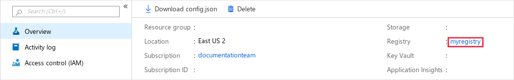
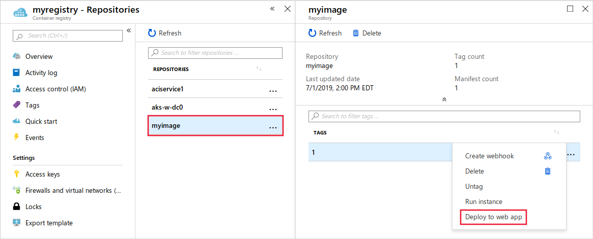
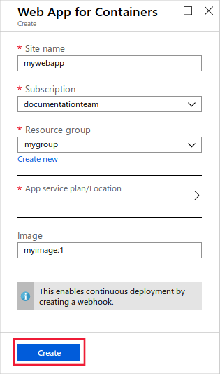
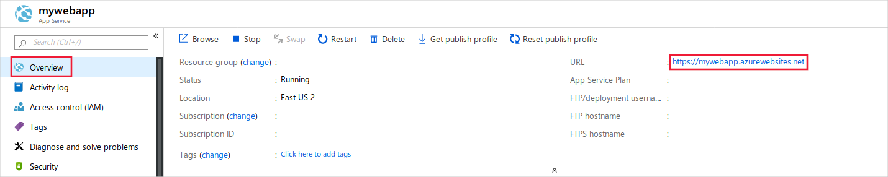

# Deploy a machine learning model to Azure App Service (preview)

Learn how to deploy a model from the Azure Machine Learning service as a web app in Azure App Service.

> [!IMPORTANT]
> While both Azure Machine Learning service and Azure App Service are generally available, the ability to deploy a model from the Machine Learning service to App Service is in preview.

With Azure Machine Learning service, you can create Docker images from trained machine learning models. This image contains a web service that receives data, submits it to the model, and then returns the response. Azure App Service can be used to deploy the image, and provides the following features:

* [SSL support](/azure/app-service/app-service-web-ssl-cert-load) for secure communications between clients and the service.
* [Scale out](/azure/azure-monitor/platform/autoscale-get-started?toc=%2fazure%2fapp-service%2ftoc.json) to multiple instances without having to redeploy.
* [Advanced authentication](/azure/app-service/configure-authentication-provider-aad) for enhanced security.

For more information on features provided by Azure App Service, see the [App Service overview](/azure/app-service/overview).

## Prerequisites

* An Azure Machine Learning service workspace. For more information, see the [Create a workspace](how-to-manage-workspace.md) article.
* A trained machine learning model registered in your workspace. If you do not have a model, use the [Image classification tutorial: train model](tutorial-train-models-with-aml.md) to train and register one.
* A Docker image created from the model. If you do not have an image, use the [Image classification: deploy model](tutorial-deploy-models-with-aml.md) to create one.

## Deploy image as a Web App

1. From the [Azure portal](https://portal.azure.com), select your Azure Machine Learning workspace. From the __Overview__ section, use the __Registry__ link to access the Azure Container Registry for the workspace.

    

2. From the Azure Container Registry, select __Repositories__, and then select the __image name__ that you want to deploy. For the version that you want to deploy, select the __...__ entry, and then __Deploy to web app__.

    

3. To create the Web App, provide a site name, subscription, resource group, and select the App service plan/location. Finally, select __Create__.

    

## Use the Web App

From the [Azure portal](https://portal.azure.com), select the Web App created in the previous step. From the __Overview__ section, copy the __URL__. This value is the __base URL__ of the service.



The web service that passes requests to the model is located at `{baseurl}/score`. For example, `https://mywebapp.azurewebsites.net/score`. The following Python code demonstrates how to submit data to the URL and display the response:

```python
import requests
import json

scoring_uri = "https://mywebapp.azurewebsites.net/score"

headers = {'Content-Type':'application/json'}

if service.auth_enabled:
    headers['Authorization'] = 'Bearer '+service.get_keys()[0]

print(headers)
    
test_sample = json.dumps({'data': [
    [1,2,3,4,5,6,7,8,9,10], 
    [10,9,8,7,6,5,4,3,2,1]
]})

response = requests.post(scoring_uri, data=test_sample, headers=headers)
print(response.status_code)
print(response.elapsed)
print(response.json())
```

## Next steps

* For more information on configuring your Web App, see the [App Service on Linux](/azure/app-service/containers/) documentation.
* For more information on scaling, see [Get started with Autoscale in Azure](/azure/azure-monitor/platform/autoscale-get-started?toc=%2fazure%2fapp-service%2ftoc.json).
* For more information on SSL support, see [Use an SSL certificate in your Azure App Service](/azure/app-service/app-service-web-ssl-cert-load).
* For more information on authentication, see [Configure your App Service app to use Azure Active Directory sign-in](/azure/app-service/configure-authentication-provider-aad).