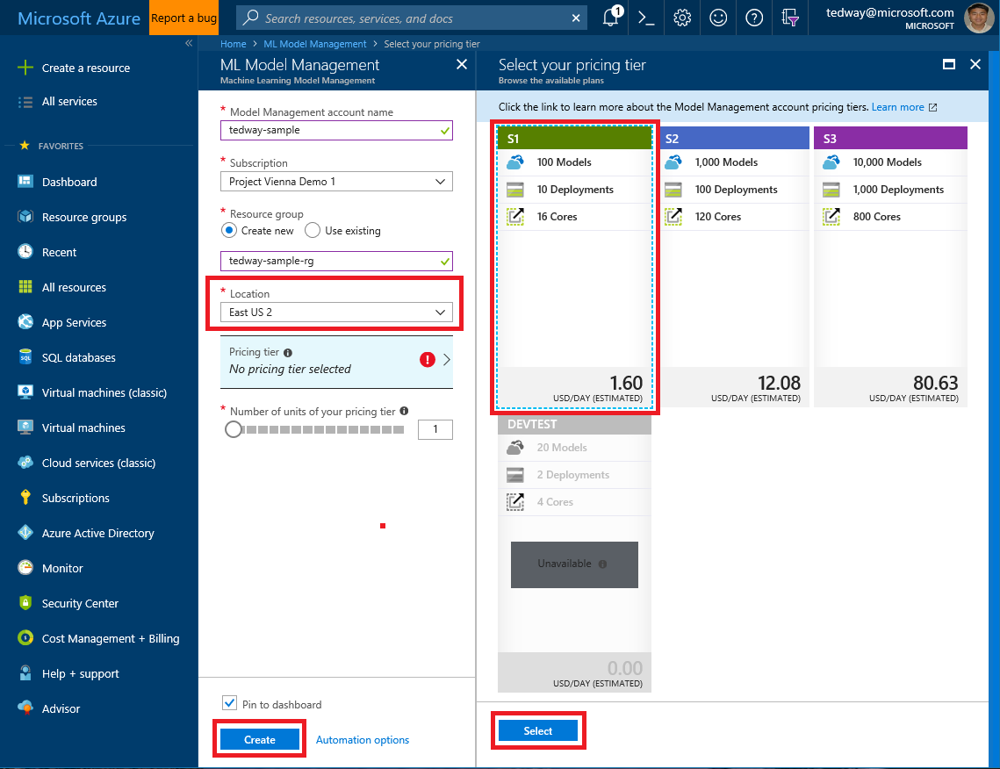
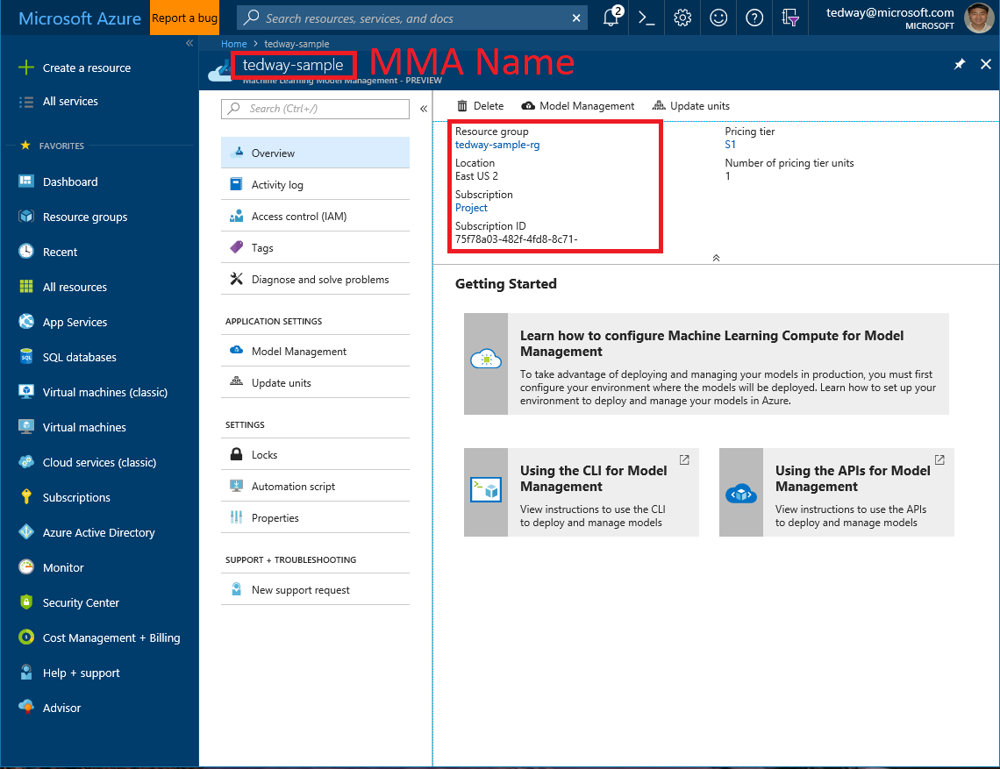
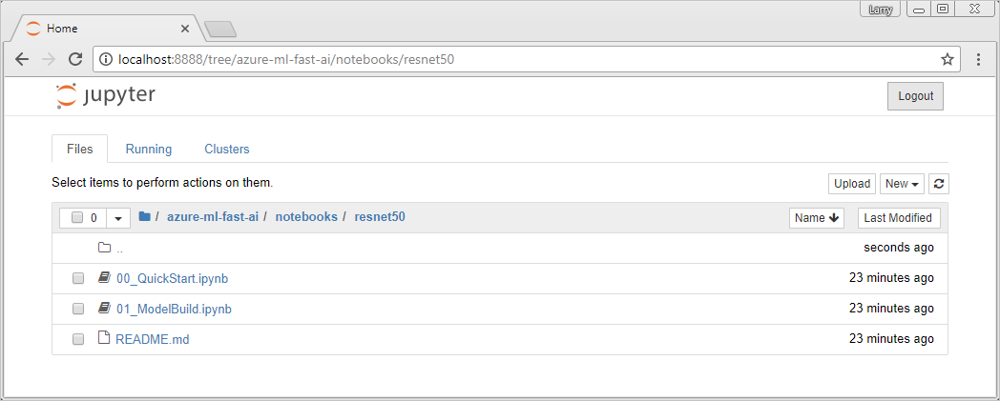

# Deploy a model as a web service on an FPGA with Azure Machine Learning

In this document, you learn how to set up your workstation environment and deploy a model as a web service on [field programmable gate arrays (FPGA)](concept-accelerate-with-fpgas.md). The web service uses Project Brainwave to run the model on FPGA.

Using FPGAs provides ultra-low latency inferencing, even with a single batch size.

## Create an Azure Machine Learning Model Management account

1. Go to the Model Management Account creation page on the [Azure Portal](https://aka.ms/aml-create-mma).

2. In the portal, create a Model Management Account in the **East US 2** region.

   

3. Give your Model Management Account a name, choose a subscription, and choose a resource group.

   >[!IMPORTANT]
   >For Location, you MUST choose **East US 2** as the region.  No other regions are currently available.

4. Choose a pricing tier (S1 is sufficient, but S2 and S3 also work).  The DevTest tier is not supported.  

5. Click **Select** to confirm the pricing tier.

6. Click **Create** on the ML Model Management on the left.

## Get Model Management account information

To get information about your Model Management Account (MMA), click the __Model Management Account__ on the Azure portal.

Copy the values of the following items:

+ Model Management Account name (in on the upper left corner)
+ Resource group name
+ Subscription ID
+ Location (use "eastus2")



## Set up your machine

To set up your workstation for FPGA deployment, use these steps:

1. Download and install the latest version of [Git](https://git-scm.com/downloads).

2. Install [Anaconda (Python 3.6)](https://conda.io/miniconda.html).

3. To download the Anaconda environment, use the following command from a Git prompt:

    ```
    git clone https://aka.ms/aml-real-time-ai
    ```

4. To create the environment, open an **Anaconda Prompt** (not an Azure Machine Learning Workbench prompt) and run the following command:

    > [!IMPORTANT]
    > The `environment.yml` file is in the git repository you cloned in the previous step. Change the path as needed to point to the file on your workstation.

    ```
    conda env create -f environment.yml
    ```

5. To activate the environment, use the following command:

    ```
    conda activate amlrealtimeai
    ```

6. To start the Jupyter Notebook server, use the following command:

    ```
    jupyter notebook
    ```

    The output of this command is similar to the following text:

    ```text
    Copy/paste this URL into your browser when you connect for the first time, to login with a token:
        http://localhost:8888/?token=bb2ce89cc8ae931f5df50f96e3a6badfc826ff4100e78075
    ```

    > [!TIP]
    > You will get a different token each time you run the command.

    If your browser does not automatically open to the Jupyter notebook, use the HTTP URL returned by the previous command to open the page.

    

## Deploy your model

From the Jupyter Notebook, open the `00_QuickStart.ipynb` notebook from the `notebooks/resnet50` directory. Follow the instructions in the notebook to:

* Define the service
* Deploy the model
* Consume the deployed model
* Delete deployed services

> [!IMPORTANT]
> To optimize latency and throughput, your workstation should be in the same Azure region as the endpoint.  Currently the APIs are created in the East US Azure region.

## SSL/TLS and authentication

Azure Machine Learning provides SSL support and key-based authentication. This enables you to restrict access to your service and secure data submitted by clients.

> [!NOTE]
> The steps in this section only apply to Azure Machine Learning Hardware Accelerated Models. For standard Azure Machine Learning services, see the [How to set up SSL on Azure Machine Learning Compute](https://docs.microsoft.com/azure/machine-learning/preview/how-to-setup-ssl-on-mlc) document.

> [!IMPORTANT]
> Authentication is only enabled for services that have provided an SSL certificate and key. 
>
> If you do not enable SSL, any user on the internet will be able to make calls to the service.
>
> If you enable SSL, and authentication key is required when accessing the service.

SSL encrypts data sent between the client and the service. It also used by the client to verify the identity of the server.

You can deploy a service with SSL enabled, or update an already deployed service to enable it. The steps are the same:

1. Acquire a domain name.

2. Acquire an SSL certificate.

3. Deploy or update the service with SSL enabled.

4. Update your DNS to point to the service.

### Acquire a domain name

If you do not already own a domain name, you can purchase one from a __domain name registrar__. The process differs between registrars, as does the cost. The registrar also provides you with tools for managing the domain name. These tools are used to map a fully qualified domain name (such as www.contoso.com) to the IP address that your service is hosted at.

### Acquire an SSL certificate

There are many ways to get an SSL certificate. The most common is to purchase one from a __Certificate Authority__ (CA). Regardless of where you obtain the certificate, you need the following files:

* A __certificate__. The certificate must contain the full certificate chain, and must be PEM-encoded.
* A __key__. The key must be PEM-encoded.

> [!TIP]
> If the Certificate Authority cannot provide the certificate and key as PEM-encoded files, you can use a utility such as [OpenSSL](https://www.openssl.org/) to change the format.

> [!IMPORTANT]
> Self-signed certificates should be used only for development. They should not be used in production.
>
> If you use a self-signed certificate, see the [Consuming services with self-signed certificates](#self-signed) section for specific instructions.

> [!WARNING]
> When requesting a certificate, you must provide the fully qualified domain name (FQDN) of the address you plan to use for the service. For example, www.contoso.com. The address stamped into the certificate and the address used by the clients are compared when validating the identity of the service.
>
> If the addresses do not match, the clients will receive an error. 

### Deploy or update the service with SSL enabled

To deploy the service with SSL enabled, set the `ssl_enabled` parameter to `True`. Set the `ssl_certificate` parameter to the value of the __certificate__ file and the `ssl_key` to the value of the __key__ file. The following example demonstrates deploying a service with SSL enabled:

```python
from amlrealtimeai import DeploymentClient

subscription_id = "<Your Azure Subscription ID>"
resource_group = "<Your Azure Resource Group Name>"
model_management_account = "<Your AzureML Model Management Account Name>"
location = "eastus2"

model_name = "resnet50-model"
service_name = "quickstart-service"

deployment_client = DeploymentClient(subscription_id, resource_group, model_management_account, location)

with open('cert.pem','r') as cert_file:
    with open('key.pem','r') as key_file:
        cert = cert_file.read()
        key = key_file.read()
        service = deployment_client.create_service(service_name, model_id, ssl_enabled=True, ssl_certificate=cert, ssl_key=key)
```

The response of the `create_service` operation contains the IP address of the service. The IP address is used when mapping the DNS name to the IP address of the service.

The response also contains a __primary key__ and __secondary key__ that are used to consume the service.

### Update your DNS to point to the service

Use the tools provided by your domain name registrar to update the DNS record for your domain name. The record must point to the IP address of the service.

> [!NOTE]
> Depending on the registrar, and the time to live (TTL) configured for the domain name, it can take several minutes to several hours before clients can resolve the domain name.

### Consuming authenticated services

The following examples demonstrate how to consume an authenticated service using Python and C#:

> [!NOTE]
> Replace `authkey` with the primary or secondary key returned when creating the service.

```python
from amlrealtimeai import PredictionClient
client = PredictionClient(service.ipAddress, service.port, use_ssl=True, access_token="authKey")
image_file = R'C:\path_to_file\image.jpg'
results = client.score_image(image_file)
```

```csharp
var client = new ScoringClient(host, 50051, useSSL, "authKey");
float[,] result;
using (var content = File.OpenRead(image))
    {
        IScoringRequest request = new ImageRequest(content);
        result = client.Score<float[,]>(request);
    }
```

Other gRPC clients can authenticate requests by setting an authorization header. The general approach is to create a `ChannelCredentials` object that combines `SslCredentials` with `CallCredentials`. This is added to the authorization header of the request. For more information on implementing support for your specific headers, see [https://grpc.io/docs/guides/auth.html](https://grpc.io/docs/guides/auth.html).

The following examples demonstrate how to set the header in C# and Go:

```csharp
creds = ChannelCredentials.Create(baseCreds, CallCredentials.FromInterceptor(
                      async (context, metadata) =>
                      {
                          metadata.Add(new Metadata.Entry("authorization", "authKey"));
                          await Task.CompletedTask;
                      }));

```

```go
conn, err := grpc.Dial(serverAddr, 
    grpc.WithTransportCredentials(credentials.NewClientTLSFromCert(nil, "")),
    grpc.WithPerRPCCredentials(&authCreds{
    Key: "authKey"}))

type authCreds struct {
    Key string
}

func (c *authCreds) GetRequestMetadata(context.Context, uri ...string) (map[string]string, error) {
    return map[string]string{
        "authorization": c.Key,
    }, nil
}

func (c *authCreds) RequireTransportSecurity() bool {
    return true
}
```

### <a id="self-signed"></a>Consuming services with self-signed certificates

There are two ways to enable the client to authenticate to a server secured with a self-signed certificate:

* On the client system, set the `GRPC_DEFAULT_SSL_ROOTS_FILE_PATH` environment variable on the client system to point to the certificate file.

* When constructing an `SslCredentials` object, pass the contents of the certificate file to the constructor.

Using either method causes gRPC to use the certificate as the root cert.

> [!IMPORTANT]
> gRPC will not accept untrusted certificates. Using an untrusted certificate will fail with an `Unavailable` status code. The details of the failure contain `Connection Failed`.
