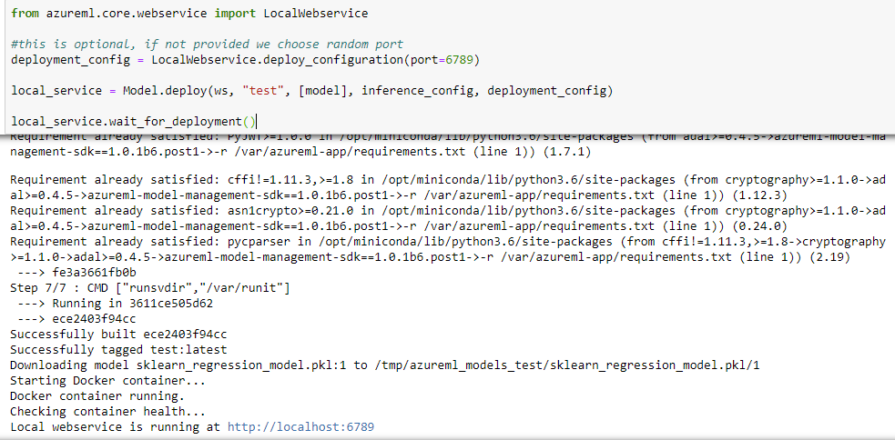
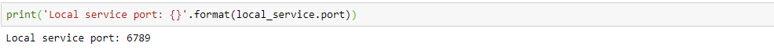

# Deploy a model to Notebook VMs

Learn how to use the Azure Machine Learning service to deploy a model as a web service on your Notebook VM. Use Notebook VMs if one of the following conditions is true:

- You need to quickly deploy and validate your model.
- You are testing a model that is under development.

> [!TIP]
> Deploying a model from a Jupyter Notebook on a notebook VM, to a web service on the same VM is a _local deployment_. In this case, the 'local' computer is the notebook VM. For more information on deployments, see [Deploy models with Azure Machine Learning service](how-to-deploy-and-where.md).

## Prerequisites

- An Azure Machine Learning service workspace with a notebook VM running. For more information, see [Setup environment and workspace](tutorial-1st-experiment-sdk-setup.md).

## Deploy to the notebook VMs

An example notebook that demonstrates local deployments is included on your notebook VM. Use the following steps to load the notebook and deploy the model as a web service on the VM:

1. From the [Azure portal](https://portal.azure.com), select your Azure Machine Learning notebook VMs.

1. Open the `samples-*` subdirectory, and then open `how-to-use-azureml/deploy-to-local/register-model-deploy-local.ipynb`. Once open, run the notebook.

    

1. The notebook displays the URL and port that the service is running on. For example, `https://localhost:6789`. You can also run the cell containing `print('Local service port: {}'.format(local_service.port))` to display the port.

    

1. To test the service from the notebook VM, use the `https://localhost:<local_service.port>` URL. To test from a remote client, get the public URL of the service running on the Notebook VM The public URL can be determined use the following formula; `https://<notebookvm_name>-<local_service_port>.<azure_region_of_notebook>.notebooks.azureml.net/score`. For example, `https://mynotebookvm-6789.eastus2.notebooks.azureml.net/score`.

## Test the service

To submit sample data to the running service, use the following code. Replace the value of `service_url` with the URL of from the previous step:

```python
import requests
import json
test_sample = json.dumps({'data': [
    [1,2,3,4,5,6,7,8,9,10],
    [10,9,8,7,6,5,4,3,2,1]
]})
test_sample = bytes(test_sample,encoding = 'utf8')
access_token = "your bearer token"
headers = {'Content-Type':'application/json', 'Authorization': 'Bearer ' + access_token}
service_url = "https://mynotebookvm-6789.eastus2.notebooks.azureml.net/score"
resp = requests.post(service_url, test_sample, headers=headers)
print("prediction:", resp.text)
```

## Next steps

* [How to deploy a model using a custom Docker image](how-to-deploy-custom-docker-image.md)
* [Deployment troubleshooting](how-to-troubleshoot-deployment.md)
* [Secure Azure Machine Learning web services with SSL](how-to-secure-web-service.md)
* [Consume a ML Model deployed as a web service](how-to-consume-web-service.md)
* [Monitor your Azure Machine Learning models with Application Insights](how-to-enable-app-insights.md)
* [Collect data for models in production](how-to-enable-data-collection.md)