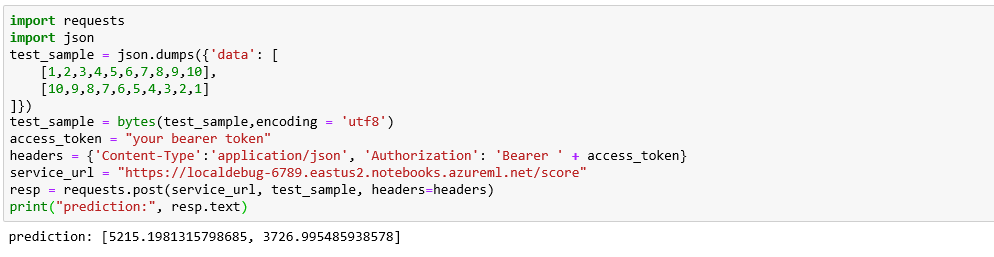

# Deploy a model to Notebook vms

Learn how to use the Azure Machine Learning service to deploy a model as a web service on Notebook vms. Use Notebook vms if one of the following conditions is true:

- You need to quickly deploy and validate your model.
- You are testing a model that is under development. 

## Prerequisites

- An Azure Machine Learning service workspace with Notebook vms running. For more information, see [Setup environment and workspace](tutorial-1st-experiment-sdk-setup.md).

## Deploy to Notebook Vms

1. From the [Azure portal](https://portal.azure.com), select your Azure Machine Learning notebook vms. Open the samples-* subdirectory, then open how-to-use-azureml/deploy-to-local/register-model-deploy-local.ipynb and run this notebook.

    

2. From notebook cell copy service port.

    

3. Now you are ready to consume this service from any location with following code.

    

```python
import requests
import json
test_sample = json.dumps({'data': [
    [1,2,3,4,5,6,7,8,9,10], 
    [10,9,8,7,6,5,4,3,2,1]
]})
test_sample = bytes(test_sample,encoding = 'utf8')
access_token = "your bearer token"
headers = {'Content-Type':'application/json', 'Authorization': 'Bearer ' + access_token}
service_url = "https://localdebug-6789.eastus2.notebooks.azureml.net/score"
resp = requests.post(service_url, test_sample, headers=headers)
print("prediction:", resp.text)
```
NOTE: service_url is https://{{NotebookvmName}}-{{local_service.port}}.{{notebookvmLocation}}.notebooks.azureml.net/score

For more information on the classes, methods, and parameters used in this example, see the following reference documents:

* [local_service.deploy_configuration](../../../includes/machine-learning-service-local-deploy-config.md)
* [Model.deploy](https://docs.microsoft.com/python/api/azureml-core/azureml.core.model.model?view=azure-ml-py#deploy-workspace--name--models--inference-config--deployment-config-none--deployment-target-none-)

## Next steps

* [How to deploy a model using a custom Docker image](how-to-deploy-custom-docker-image.md)
* [Deployment troubleshooting](how-to-troubleshoot-deployment.md)
* [Secure Azure Machine Learning web services with SSL](how-to-secure-web-service.md)
* [Consume a ML Model deployed as a web service](how-to-consume-web-service.md)
* [Monitor your Azure Machine Learning models with Application Insights](how-to-enable-app-insights.md)
* [Collect data for models in production](how-to-enable-data-collection.md)