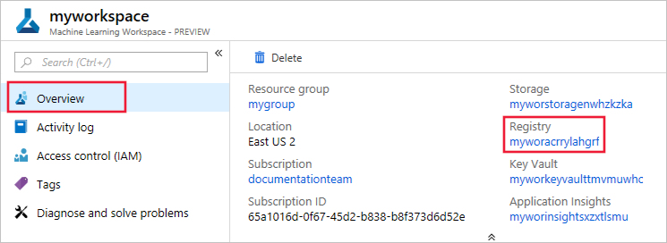
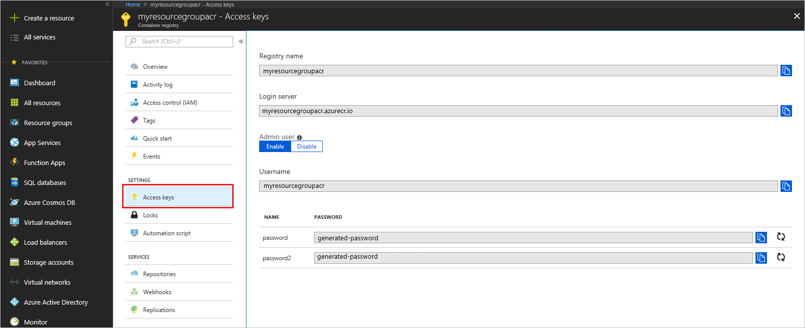

# Prepare to deploy models on IoT Edge

In this document, learn how to use the Azure Machine Learning service to prepare a trained model for deployment to an Azure IoT Edge device.

An Azure IoT Edge device is a Linux or Windows-based device that runs the Azure IoT Edge runtime. Machine learning models can be deployed to these devices as IoT Edge modules. Deploying a model to an IoT Edge device allows the device to use the model directly, instead of having to send data to the cloud for processing. You get faster response times and less data transfer.

Before deploying a model to an edge device, use the steps in this document to prepare the model and the device.

## Prerequisites

* An Azure subscription. If you don't have one, create a [free account](https://azure.microsoft.com/free/?WT.mc_id=A261C142F) before you begin.

* An Azure Machine Learning service workspace. To create one, use the steps in the [Get started with Azure Machine Learning service](quickstart-get-started.md) document.

* A development environment. For more information, see the [How to configure a development environment](how-to-configure-environment.md) document.

* An [Azure IoT Hub](../../iot-hub/iot-hub-create-through-portal.md) in your Azure subscription. 

* A trained model. For an example of how to train a model, see the [Train an image classification model with Azure Machine Learning](tutorial-train-models-with-aml.md) document. A pre-trained model is available on the [AI Toolkit for Azure IoT Edge GitHub repo](https://github.com/Azure/ai-toolkit-iot-edge/tree/master/IoT%20Edge%20anomaly%20detection%20tutorial).

## Prepare the IoT device

To learn how to register your device and install the IoT runtime, follow the steps in the [Quickstart: Deploy your first IoT Edge module to a Linux x64 device](../../iot-edge/quickstart-linux.md) document.

## Register the model

Azure IoT Edge modules are based on container images. To deploy your model to an IoT Edge device, use the following steps to register your model on an Azure Machine Learning service workspace and create a Docker image. 

1. Initialize the workspace and load the config.json file:

    ```python
    from azureml.core  import Workspace

    #Load existing workspace from the config file info.
    ws  = Workspace.from_config()
    ```    

1. Register the model into your workspace. Replace the default text with your model path, name, tags, and description:

    > [!IMPORTANT]
    > If you used Azure Machine Learning to train the model, it may already be registered in the workspace. If so, skip this step. To see a list of models registered with this workspace, use `Model.list(ws)`.

    ```python
    from azureml.core.model import Model
    model = Model.register(model_path = "model.pkl", # this path points to the local file
                        model_name = "best_model", # the model gets registered as this name
                        tags = {'attribute': "myattribute", 'classification': "myclassification"},
                        description = "My awesome model",
                        workspace = ws)
    ```    

1. Retrieve the registered model: 

    ```python
    from azureml.core.model import Model

    model_name = "best_model"
    model = Model(ws, model_name)                     
    ```    

## Create a Docker image

1. Create a **scoring script** named `score.py`. This file is used to run the model inside the image. It must include the following functions:

    * The `init()` function, which typically loads the model into a global object. This function is run only once when the Docker container is started. 

    * The `run(input_data)` function uses the model to predict a value based on the input data. Inputs and outputs to the run typically use JSON for serialization and de-serialization, but other formats are supported.

    For an example, see the [image classification tutorial](tutorial-deploy-models-with-aml.md#make-script).

1. Create an **environment file** named `myenv.yml`. This file is a Conda environment specification, and lists all of the dependencies needed by the script and model. For an example, see the [image classification tutorial](tutorial-deploy-models-with-aml.md#make-myenv).

1. Configure the Docker image using the `score.py` and `myenv.yml` files:
    
    ```python
    from azureml.core.image import Image, ContainerImage
    
    #Image configuration
    image_config = ContainerImage.image_configuration( runtime = "python", 
                           execution_script = "score.py",
                           conda_file = "myenv.yml", 
                           tags = {"attributes", "calssification"},
                           description = "Image that contains my model",
                           
                        )
    ```    

1. Create the image using the model and image configuration:

    ```python
    image = ContainerImage.create (name = "myimage", 
                           models = [model], #this is the model object
                           image_config = image_config,
                           workspace = ws
                        )
    ```     

    The image creation takes around 5 minutes.

## Get the container registry credentials

Azure IoT needs the credentials for the container registry that Azure Machine Learning service stores docker images in. Use the following steps to get the credentials:

1. Sign in to the [Azure portal](https://portal.azure.com/signin/index).

1. Go to your Azure Machine Learning service workspace and select __Overview__. To go to the container registry settings, select the __Registry__ link.

    

1. Once in the container registry, select **Access Keys** and then enable the admin user.

    

1. Save the values for login server, username, and password. 

   These credentials are necessary to provide the IoT edge device access to images in your private container registry.

## Next steps

You have completed preparations for deployment. Now, use the steps in the [Deploy Azure IoT Edge modules from the Azure portal](../../iot-edge/how-to-deploy-modules-portal.md) document to deploy to your edge device. When configuring the __Registry Settings__ for the device, use the credentials you configured previously.
