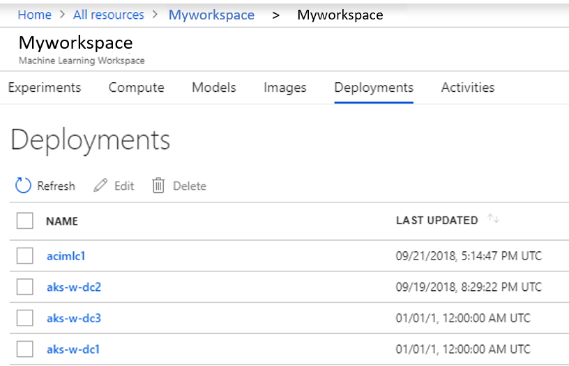
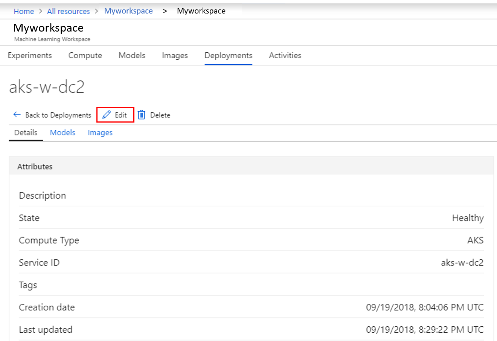
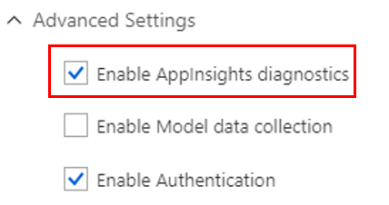
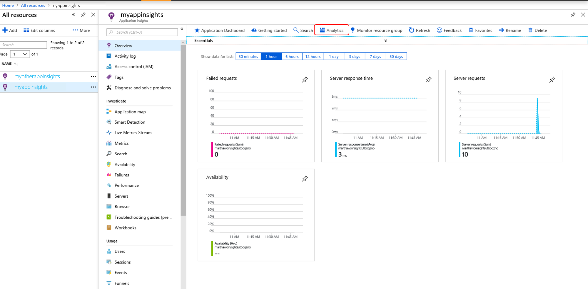

# Monitor your Azure Machine Learning models in production with Application Insights

In this article, you can learn how to set up **Application Insights** for your **Azure Machine Learning** service. Once enabled, Application Insights gives you the opportunity to monitor:
* Request rates, response times, and failure rates
* Dependency rates, response times, and failure rates
* Exceptions

Learn more about Application Insights [here](../../application-insights/app-insights-overview.md). 

## Prerequisites
* An Azure subscription. If you don't have one, create a [free account](https://azure.microsoft.com/free/?WT.mc_id=A261C142F) before you begin.
* An Azure Machine Learning workspace, a local directory containing your scripts, and the Azure Machine Learning SDK for Python installed. Learn how to get these prerequisites using the [How to configure a development environment](how-to-configure-environment.md) document.
* A trained machine learning model to be deployed to Azure Kubernetes Service (AKS). If you don't have one, see the [train image classification model](tutorial-train-models-with-aml.md) tutorial.
* An [AKS cluster](how-to-deploy-to-aks.md).

## Enable & disable in the portal

You can enable and disable Application Insights in Azure portal.

### Enable

1. In [Azure portal](https://portal.azure.com), open your workspace.

1. Go into your deployments and select the service where you want to enable Application Insights.

   [](./media/how-to-enable-app-insights/Deployments.PNG#lightbox)

3. Click **Edit** and go to **Advanced Settings**.

   [](./media/how-to-enable-app-insights/Edit.PNG#lightbox)

4. In **Advance Settings** select **Enable Application Insights diagnostics**.

   [](./media/how-to-enable-app-insights/AdvancedSettings.png#lightbox)

1. Select **Update** at the bottom of the screen to apply the changes. 

### Disable
To disable Application Insights in Azure portal, do the following steps:

1. Sign in to Azure portal at https://portal.azure.com.
1. Go to your workspace.
1. Choose **Deployments**, then **Select service**, and then **Edit**.

   [](./media/how-to-enable-app-insights/Edit.PNG#lightbox)

1. In **Advanced Settings**, deselect the option **Enable AppInsights diagnostics**. 

   [](./media/how-to-enable-app-insights/uncheck.png#lightbox)

1. Select **Update** at the bottom of the screen to apply the changes. 

## Enable & disable from the SDK

### Update a deployed service
1. Identify the service in your workspace (ws= name of your workspace)

    ```python
    aks_service= Webservice(ws, "my-service-name")
    ```
2. Update your service and enable Application Insights. 

    ```python
    aks_service.update(enable_app_insights=True)
    ```

### Log custom traces in your service
If you want to log custom traces, you will follow the [standard deployment process for AKS](how-to-deploy-to-aks.md) and you will:

1. Update scoring file by adding print statements.
    
    ```python
    print ("model initialized" + time.strftime("%H:%M:%S"))
    ```

2. Update aks configuration.
    
    ```python
    aks_config = AksWebservice.deploy_configuration(enable_app_insights=True)
    ```

3. [Build image and deploy it.](how-to-deploy-to-aks.md)  

### Disable tracking in Python

To disable Application Insights, use the following code:

```python 
## replace <service_name> with the name of the web service
<service_name>.update(enable_app_insights=False)
```
	

## Evaluate data
The data of your service gets stored in your Application Insights account within the same resource group your Azure Machine Learning service workspace is at.
To view it:
1. Go to your resource group in the [Azure portal](https://portal.azure.com) and click into your Application Insights resource. 
2. The **Overview** tab shows you the basic set of metrics for your service.

   [](./media/how-to-enable-app-insights/overview.png#lightbox)

3. To look into your custom traces click **Analytics**.
4. Within the schema section, click on **traces** and then **run** your query. Data should appear in a table format down below and should map to your custom calls in your scoring file. 

   [](./media/how-to-enable-app-insights/logs.png#lightbox)

Click [here](../../application-insights/app-insights-overview.md) to learn more about how to use Application Insights.
    

## Example Notebook

The [00.Getting Started/13.enable-app-insights-in-production-service.ipynb](https://github.com/Azure/MachineLearningNotebooks/tree/master/01.getting-started/13.enable-app-insights) notebook demonstrates concepts in this article.  Get this notebook:
 
[!INCLUDE [aml-clone-in-azure-notebook](../../../includes/aml-clone-for-examples.md)]

## Next steps
You can also collect data on your models in production. Read the article  [Collect data for models in production](how-to-enable-data-collection.md) 
