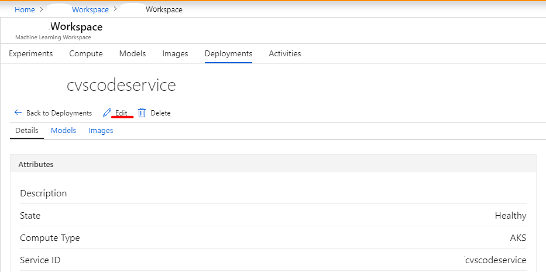
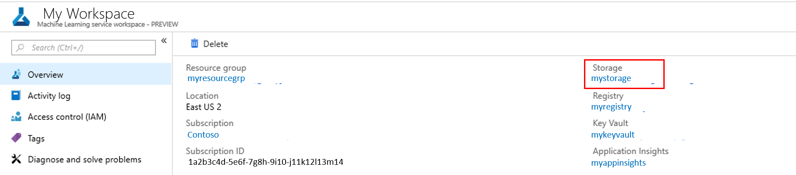
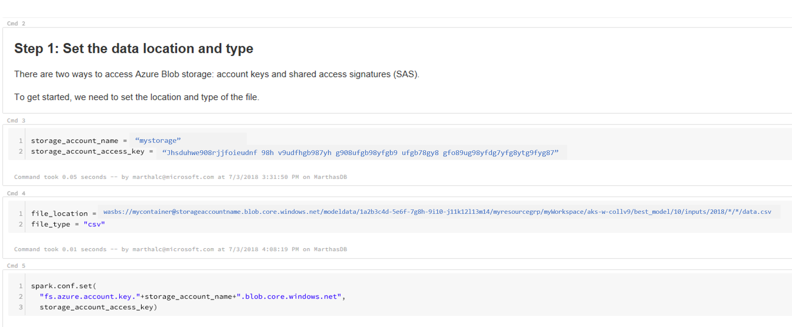

# Collect data for models in production

In this article, you can learn how to collect input model data from the Azure Machine Learning services you've deployed into Azure Kubernetes Cluster (AKS) into an Azure Blob storage. 

Once enabled, this data you collect helps you:
* [Monitor data drifts](how-to-monitor-data-drift.md) as production data enters your model

* Make better decisions on when to retrain or optimize your model

* Retrain your model with the data collected

## What is collected and where does it go?

The following data can be collected:
* Model **input** data from web services deployed in Azure Kubernetes Cluster (AKS)
  (Voice, images, and video are **not** collected) 
  
* Model predictions using production input data.

> [!Note]
> Pre-aggregation or pre-calculations on this data are not part of the service at this time.   

The output gets saved in an Azure Blob. Since the data gets added into an Azure Blob, you can then choose your favorite tool to run the analysis. 

The path to the output data in the blob follows this syntax:

```
/modeldata/<subscriptionid>/<resourcegroup>/<workspace>/<webservice>/<model>/<version>/<identifier>/<year>/<month>/<day>/data.csv
# example: /modeldata/1a2b3c4d-5e6f-7g8h-9i10-j11k12l13m14/myresourcegrp/myWorkspace/aks-w-collv9/best_model/10/inputs/2018/12/31/data.csv
```

## Prerequisites

- If you don’t have an Azure subscription, create a free account before you begin. Try the [free or paid version of Azure Machine Learning service](https://aka.ms/AMLFree) today.

- An Azure Machine Learning service workspace, a local directory containing your scripts, and the Azure Machine Learning SDK for Python installed. Learn how to get these prerequisites using the [How to configure a development environment](how-to-configure-environment.md) document.

- A trained machine learning model to be deployed to Azure Kubernetes Service (AKS). If you don't have one, see the [train image classification model](tutorial-train-models-with-aml.md) tutorial.

- An Azure Kubernetes Service cluster. For information on how to create and deploy to one, see the [How to deploy and where](how-to-deploy-and-where.md) document.

- [Set up your environment](how-to-configure-environment.md) and install the [Monitoring SDK](https://aka.ms/aml-monitoring-sdk).

## Enable data collection
Data collection can be enabled regardless of the model being deployed through Azure Machine Learning Service or other tools. 

To enable it, you need to:

1. Open the scoring file. 

1. Add the [following code](https://aka.ms/aml-monitoring-sdk) at the top of the file:

   ```python 
   from azureml.monitoring import ModelDataCollector
   ```

2. Declare your data collection variables in your `init()` function:

    ```python
    global inputs_dc, prediction_dc
    inputs_dc = ModelDataCollector("best_model", identifier="inputs", feature_names=["feat1", "feat2", "feat3". "feat4", "feat5", "feat6"])
    prediction_dc = ModelDataCollector("best_model", identifier="predictions", feature_names=["prediction1", "prediction2"])
    ```

    *CorrelationId* is an optional parameter, you do not need to set it up if your model doesn’t require it. Having a correlationId in place does help you for easier mapping with other data. (Examples include: LoanNumber, CustomerId, etc.)
    
    *Identifier* is later used for building the folder structure in your Blob, it can be used to divide “raw” data versus “processed”.

3.	Add the following lines of code to the `run(input_df)` function:

    ```python
    data = np.array(data)
    result = model.predict(data)
    inputs_dc.collect(data) #this call is saving our input data into Azure Blob
    prediction_dc.collect(result) #this call is saving our input data into Azure Blob
    ```

4. Data collection is **not** automatically set to **true** when you deploy a service in AKS, so you must update your configuration file such as: 

    ```python
    aks_config = AksWebservice.deploy_configuration(collect_model_data=True)
    ```
    AppInsights for service monitoring can also be turned on by changing this configuration:
    ```python
    aks_config = AksWebservice.deploy_configuration(collect_model_data=True, enable_app_insights=True)
    ``` 

5. To create a new image and deploy the service, see the [How to deploy and where](how-to-deploy-and-where.md) document.


If you already have a service with the dependencies installed in your **environment file** and **scoring file**, enable data collection by:

1. Go to  [Azure Portal](https://portal.azure.com).

1. Open your workspace.

1. Go to **Deployments** -> **Select service** -> **Edit**.

   

1. In **Advanced Settings**, deselect **Enable Model data collection**. 

    [](./media/how-to-enable-data-collection/CheckDataCollection.png#lightbox)

   In this window, you can also choose to "Enable Appinsights diagnostics" to track the health of your service.  

1. Select **Update** to apply the change.


## Disable data collection
You can stop collecting data any time. Use Python code or the Azure portal to disable data collection.

+ Option 1 - Disable in the Azure portal: 
  1. Sign in to [Azure portal](https://portal.azure.com).

  1. Open your workspace.

  1. Go to **Deployments** -> **Select service** -> **Edit**.

     [](./media/how-to-enable-data-collection/EditService.PNG#lightbox)

  1. In **Advanced Settings**, deselect **Enable Model data collection**. 

     [](./media/how-to-enable-data-collection/UncheckDataCollection.png#lightbox)

  1. Select **Update** to apply the change.

+ Option 2 - Use Python to disable data collection:

  ```python 
  ## replace <service_name> with the name of the web service
  <service_name>.update(collect_model_data=False)
  ```

## Validate your data and analyze it
You can choose any tool of your preference to analyze the data collected into your Azure Blob. 

To quickly access the data from your blob:
1. Sign in to [Azure portal](https://portal.azure.com).

1. Open your workspace.
1. Click on **Storage**.

    [](./media/how-to-enable-data-collection/StorageLocation.png#lightbox)

1. Follow the path to the output data in the blob with this syntax:

```
/modeldata/<subscriptionid>/<resourcegroup>/<workspace>/<webservice>/<model>/<version>/<identifier>/<year>/<month>/<day>/data.csv
# example: /modeldata/1a2b3c4d-5e6f-7g8h-9i10-j11k12l13m14/myresourcegrp/myWorkspace/aks-w-collv9/best_model/10/inputs/2018/12/31/data.csv
```


### Analyzing model data through Power BI

1. Download and Open [PowerBi Desktop](https://www.powerbi.com)

1. Select **Get Data** and click on [**Azure Blob Storage**](https://docs.microsoft.com/power-bi/desktop-data-sources).

    [](./media/how-to-enable-data-collection/PBIBlob.png#lightbox)


1. Add your storage account name and enter your storage key. You can find this information in your blob's **Settings** >> Access keys. 

1. Select the container **modeldata** and click on **Edit**. 

    [](./media/how-to-enable-data-collection/pbiNavigator.png#lightbox)

1. In the query editor, click under “Name” column and add your Storage account 1. Model path into the filter. Note: if you want to only look into files from a specific year or month, just expand the filter path. For example, just look into March data: /modeldata/subscriptionid>/resourcegroupname>/workspacename>/webservicename>/modelname>/modelversion>/identifier>/year>/3

1. Filter the data that is relevant to you based on **Name**. If you stored **predictions** and **inputs** you'll need to do create a query per each.

1. Click on the double arrow aside the **Content** column to combine the files. 

    [](./media/how-to-enable-data-collection/pbiContent.png#lightbox)

1. Click OK and the data will preload.

    [](./media/how-to-enable-data-collection/pbiCombine.png#lightbox)

1. You can now click **Close and Apply** .

1.  If you added inputs and predictions your tables will automatically correlate by **RequestId**.

1. Start building your custom reports on your model data.


### Analyzing model data using Databricks

1. Create a [Databricks workspace](https://docs.microsoft.com/azure/azure-databricks/quickstart-create-databricks-workspace-portal). 

1. Go to your Databricks workspace. 

1. In your databricks workspace select **Upload Data**.

    [](./media/how-to-enable-data-collection/dbupload.png#lightbox)

1. Create New Table and select **Other Data Sources** -> Azure Blob Storage -> Create Table in Notebook.

    [](./media/how-to-enable-data-collection/dbtable.PNG#lightbox)

1. Update the location of  your data. Here is an example:

    ```
    file_location = "wasbs://mycontainer@storageaccountname.blob.core.windows.net/modeldata/1a2b3c4d-5e6f-7g8h-9i10-j11k12l13m14/myresourcegrp/myWorkspace/aks-w-collv9/best_model/10/inputs/2018/*/*/data.csv" 
    file_type = "csv"
    ```
 
    [](./media/how-to-enable-data-collection/dbsetup.png#lightbox)

1. Follow the steps on the template in order to view and analyze your data. 

## Example notebook

The [how-to-use-azureml/deployment/enable-data-collection-for-models-in-aks/enable-data-collection-for-models-in-aks.ipynb](https://github.com/Azure/MachineLearningNotebooks/blob/master/how-to-use-azureml/deployment/enable-data-collection-for-models-in-aks/enable-data-collection-for-models-in-aks.ipynb) notebook demonstrates concepts in this article.  

[!INCLUDE [aml-clone-in-azure-notebook](../../../includes/aml-clone-for-examples.md)]
