# Securely run experiments and inference inside an Azure virtual network

In this article, you learn how to run your experiments and inference inside a virtual network. A virtual network acts as a security boundary, isolating your Azure resources from the public internet. You can also join an Azure virtual network to your on-premises network. It allows you to securely train your models and access your deployed models for inference. Inference, or model scoring, is the phase where the deployed model is used for prediction, most commonly on production data.

The Azure Machine Learning service relies on other Azure services for compute resources. Compute resources (compute targets) are used to train and deploy models. These compute targets can be created inside a virtual network. For example, you can use the Microsoft Data Science Virtual Machine to train a model and then deploy the model to Azure Kubernetes Service (AKS). For more information about virtual networks, see the [Azure Virtual Network overview](https://docs.microsoft.com/azure/virtual-network/virtual-networks-overview).

## Prerequisites

This document assumes that you are familiar with Azure Virtual Networks, and IP networking in general. This document also assumes that you have created a virtual network and subnet to use with your compute resources. If you are not familiar with Azure Virtual Networks, read the following articles to learn about the service:

* [IP addressing](https://docs.microsoft.com/azure/virtual-network/virtual-network-ip-addresses-overview-arm)
* [Security groups](https://docs.microsoft.com/azure/virtual-network/security-overview)
* [Quickstart: Create a virtual network](https://docs.microsoft.com/azure/virtual-network/quick-create-portal)
* [Filter network traffic](https://docs.microsoft.com/azure/virtual-network/tutorial-filter-network-traffic)

## Storage account for your workspace

> [!IMPORTANT]
> The __default storage account__ for your Azure Machine Learning service can be placed in a virtual network __only while doing experimentation__.
>
> For __non-default storage accounts for experimentation__, or if you are using a storage account for __inference__, you must have __unrestricted access to the storage account__.
> 
> If you aren't sure if you've modified these settings or not, see __Change the default network access rule__ in [Configure Azure Storage firewalls and virtual networks](https://docs.microsoft.com/azure/storage/common/storage-network-security). Use the steps to allow access from all networks during inference, or model scoring.

To use place the default Azure Storage account for the workspace in a virtual network, use the following steps:

1. Create an experimentation compute ex. Machine Learning Compute behind a virtual network or attach an experimentation compute to the workspace ex. HDInsight cluster or virtual machine. For more information, see [Use Machine Learning Compute](#use-machine-learning-compute) and [Use a virtual machine or HDInsight cluster](#use-a-virtual-machine-or-hdinsight-cluster) sections in this document
2. Go to the storage attached to the workspace. 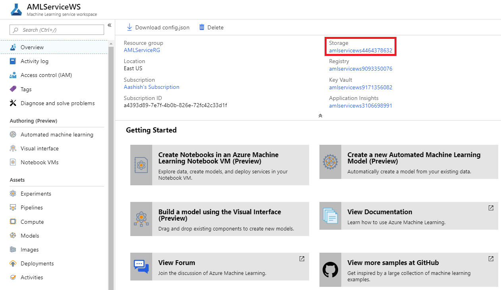
3. On the Azure Storage page, select __Firewalls and virtual networks__. 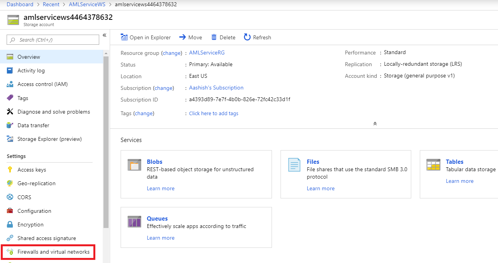
4. On the __Firewalls and virtual networks__ page select the following entries:
    - Select __Selected networks__.
    - Under __Virtual networks__, select __Add existing virtual network__ to add the virtual network where your experimentation compute resides. (See step 1.)
    - Select __Allow trusted Microsoft services to access this storage account__.
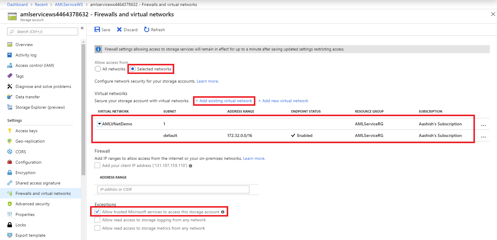 

5. While running experiment, in your experimentation code, change the run config to use blob storage:
    ```python
    run_config.source_directory_data_store = "workspaceblobstore"
    ```
    
## Key vault for your workspace
Key Vault instance associated with the workspace is used by Azure Machine Learning service to store credentials of various kinds:
* The associated storage account connection string
* Passwords to Azure Container Repository instances
* Connection Strings to data stores. 

To use Azure Machine Learning experimentation capabilities with Key Vault behind a virtual network follow the steps below:
1. Go to the Key Vault associated with the workspace. 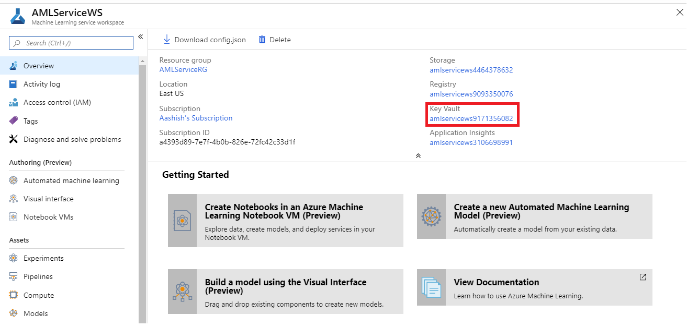
2. On the Key Vault page, select __Firewalls and virtual networks__ section. 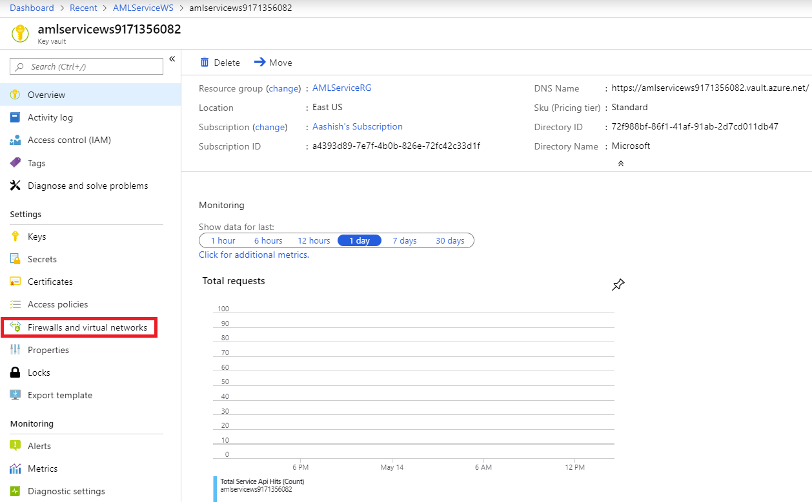
3. On the __Firewalls and virtual networks__ page select the following entries:
    - Select __Selected networks__.
    - Under the __Virtual networks__, select __Add existing virtual networks__ to add the virtual network where your experimentation compute resides.
    - Select __Allow trusted Microsoft services to bypass this firewall__.
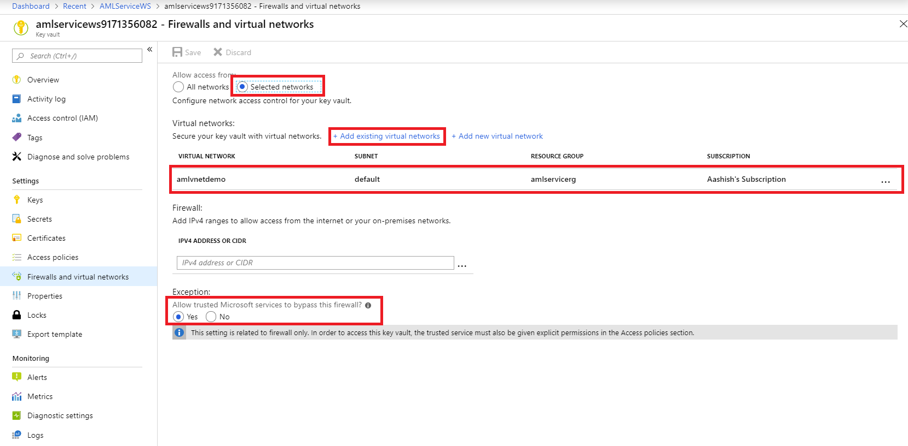 


## Use Machine Learning Compute

To use Azure Machine Learning Compute in a virtual network, use the following information about network requirements:

- The virtual network must be in the same subscription and region as the Azure Machine Learning service workspace.

- The subnet specified for the Machine Learning Compute cluster must have enough unassigned IP addresses to accommodate the number of VMs targeted for the cluster. If the subnet doesn't have enough unassigned IP addresses, the cluster will be partially allocated.

- If you plan to secure the virtual network by restricting traffic, leave some ports open for the Machine Learning Compute service. For more information, see [Required ports](#mlcports).

- Check whether your security policies or locks on the virtual network's subscription or resource group restrict permissions to manage the virtual network.

- If you are going to put multiple Machine Learning Compute clusters in one virtual network, you may need to request a quota increase for one or more of your resources.

    Machine Learning Compute automatically allocates additional networking resources in the resource group that contains the virtual network. For each Machine Learning Compute cluster, the Azure Machine Learning service allocates the following resources:

    - One network security group (NSG)

    - One public IP address

    - One load balancer

  These resources are limited by the subscription's [resource quotas](https://docs.microsoft.com/azure/azure-subscription-service-limits).

### <a id="mlcports"></a> Required ports

Machine Learning Compute currently uses the Azure Batch service to provision VMs in the specified virtual network. The subnet must allow inbound communication from the Batch service. This communication is used to schedule runs on the Machine Learning Compute nodes and to communicate with Azure Storage and other resources. Batch adds NSGs at the level of network interfaces (NICs) that are attached to VMs. These NSGs automatically configure inbound and outbound rules to allow the following traffic:

- Inbound TCP traffic on ports 29876 and 29877 from a __Service Tag__ of __BatchNodeManagement__.

    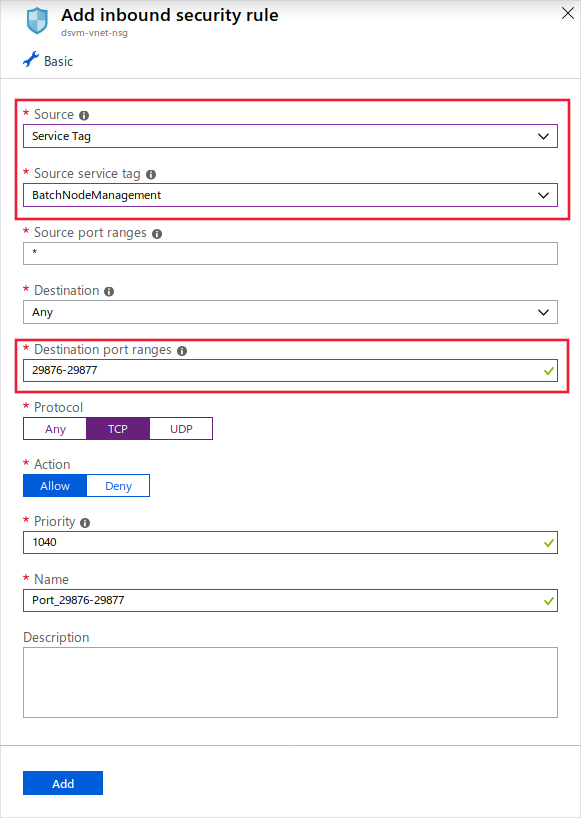
 
- (optional) Inbound TCP traffic on port 22 to permit remote access. This port is only needed if you want to connect using SSH on the public IP.
 
- Outbound traffic on any port to the virtual network.

- Outbound traffic on any port to the internet. 

Exercise caution if you modify or add inbound/outbound rules in Batch-configured NSGs. If an NSG blocks communication to the compute nodes, then the Machine Learning Compute services sets the state of the compute nodes to unusable.

You don't need to specify NSGs at the subnet level because Batch configures its own NSGs. However, if the specified subnet has associated NSGs and/or a firewall, configure the inbound and outbound security rules as mentioned earlier. 

The following screenshot shows how the NSG rule configuration looks in the Azure portal:

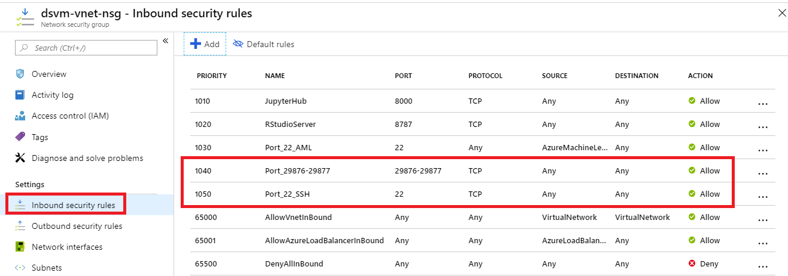

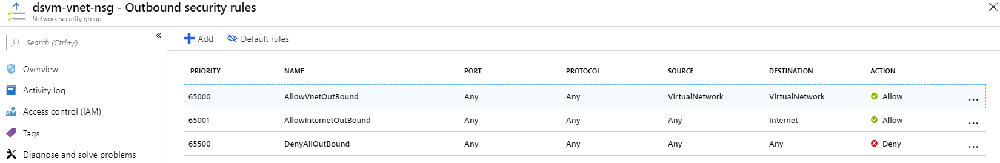

### <a id="limiting-outbound-from-vnet"></a> Limiting outbound connectivity from the virtual network

If you do not want to use the default outbound rules and want to limit the outbound access of your virtual network, follow the steps below:

- Deny outbound internet connection using the NSG rules 

- Limit outbound traffic to Azure Storage (using __Service Tag__ of __Storage.Region_Name__ ex. Storage.EastUS), Azure Container Registry (using __Service Tag__ of __AzureContainerRegistry.Region_Name__ ex. AzureContainerRegistry.EastUS), and Azure Machine Learning service (using __Service Tag__ of __AzureMachineLearning__)

The following screenshot shows how the NSG rule configuration looks in the Azure portal:

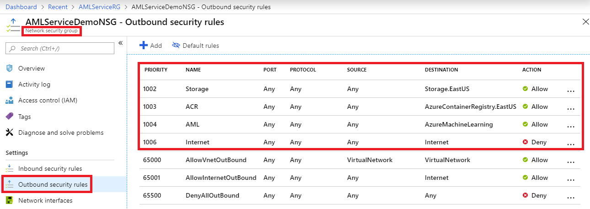

### User-defined routes for forced tunneling

If you are using forced tunneling with Azure Machine Learning Compute, you must add [user-defined routes (UDR)](https://docs.microsoft.com/azure/virtual-network/virtual-networks-udr-overview) to the subnet that contains the compute resource.

* A user-defined route for each IP address used by the Azure Batch service in the region where your resources exist. These UDRs enable the batch service to communicate with compute nodes for task scheduling. To get a list of the IP addresses of the Batch service,  contact Azure Support.

* Outbound traffic to Azure Storage (specifically, URLs of the form `<account>.table.core.windows.net`, `<account>.queue.core.windows.net`, and `<account>.blob.core.windows.net`) must not be blocked by your on-premises network appliance.

When you add the user-defined routes, define the route for each related Batch IP address prefix, and set __Next hop type__ to __Internet__. The following image shows an example of this UDR in the Azure portal:


For more information, see the [Create an Azure Batch pool in a virtual network](../../batch/batch-virtual-network.md#user-defined-routes-for-forced-tunneling) article.

### Create Machine Learning Compute in a virtual network

To create a Machine Learning Compute cluster by using the Azure portal, follow these steps:

1. In the [Azure portal](https://portal.azure.com), select your Azure Machine Learning service workspace.

1. In the __Application__ section, select __Compute__. Then select __Add compute__. 

    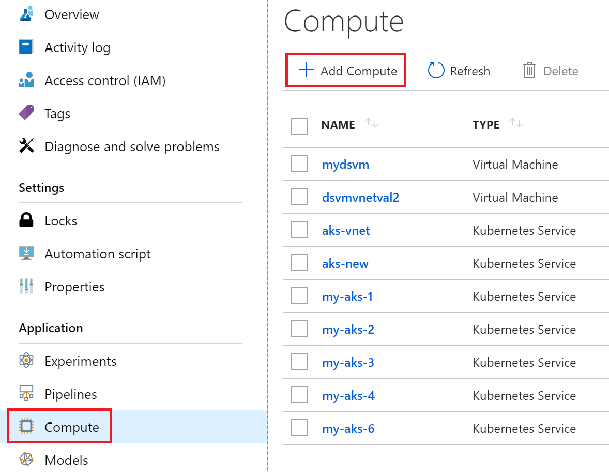

1. To configure this compute resource to use a virtual network, use these options:

    - __Network configuration__: Select __Advanced__.

    - __Resource group__: Select the resource group that contains the virtual network.

    - __Virtual network__: Select the virtual network that contains the subnet.

    - __Subnet__: Select the subnet to use.

   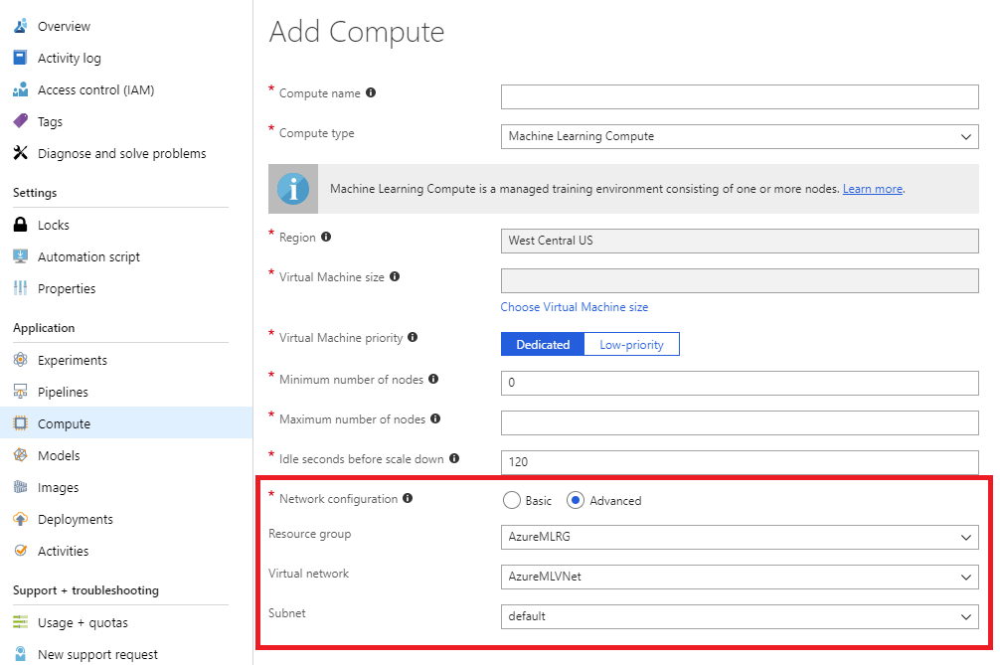

You can also create a Machine Learning Compute cluster by using the Azure Machine Learning SDK. The following code creates a new Machine Learning Compute cluster in the `default` subnet of a virtual network named `mynetwork`:

```python
from azureml.core.compute import ComputeTarget, AmlCompute
from azureml.core.compute_target import ComputeTargetException

# The Azure virtual network name, subnet, and resource group
vnet_name = 'mynetwork'
subnet_name = 'default'
vnet_resourcegroup_name = 'mygroup'

# Choose a name for your CPU cluster
cpu_cluster_name = "cpucluster"

# Verify that cluster does not exist already
try:
    cpu_cluster = ComputeTarget(workspace=ws, name=cpu_cluster_name)
    print("Found existing cpucluster")
except ComputeTargetException:
    print("Creating new cpucluster")
    
    # Specify the configuration for the new cluster
    compute_config = AmlCompute.provisioning_configuration(vm_size="STANDARD_D2_V2",
                                                           min_nodes=0,
                                                           max_nodes=4,
                                                           vnet_resourcegroup_name = vnet_resourcegroup_name,
                                                           vnet_name = vnet_name,
                                                           subnet_name = subnet_name)

    # Create the cluster with the specified name and configuration
    cpu_cluster = ComputeTarget.create(ws, cpu_cluster_name, compute_config)
    
    # Wait for the cluster to complete, show the output log
    cpu_cluster.wait_for_completion(show_output=True)
```

When the creation process finishes, you can train your model by using the cluster. For more information, see [Select and use a compute target for training](how-to-set-up-training-targets.md).

## Use a virtual machine or HDInsight cluster

To use a virtual machine or Azure HDInsight cluster in a virtual network with your workspace, follow these steps:

> [!IMPORTANT]
> The Azure Machine Learning service only supports virtual machines that are running Ubuntu.

1. Create a VM or HDInsight cluster by using the Azure portal or Azure CLI, and put it in an Azure virtual network. For more information, see the following documents:
    * [Create and manage Azure virtual networks for Linux VMs](https://docs.microsoft.com/azure/virtual-machines/linux/tutorial-virtual-network)

    * [Extend HDInsight using an Azure virtual network](https://docs.microsoft.com/azure/hdinsight/hdinsight-extend-hadoop-virtual-network) 

1. To allow the Azure Machine Learning service to communicate with the SSH port on the VM or cluster, you must configure a source entry for the NSG. The SSH port is usually port 22. To allow traffic from this source, use the following information:

    * __Source__: Select __Service Tag__.

    * __Source service tag__: Select __AzureMachineLearning__.

    * __Source port ranges__: Select __*__.

    * __Destination__: Select __Any__.

    * __Destination port ranges__: Select __22__.

    * __Protocol__: Select __Any__.

    * __Action__: Select __Allow__.

   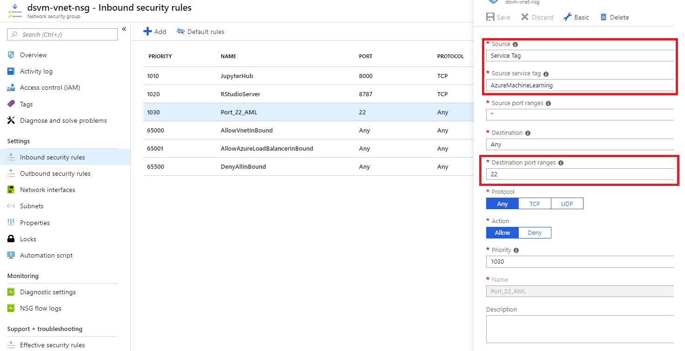

    Keep the default outbound rules for the NSG. For more information, see the default security rules in [Security groups](https://docs.microsoft.com/azure/virtual-network/security-overview#default-security-rules).

    If you do not want to use the default outbound rules and want to limit the outbound access of your virtual network, see [Limiting outbound connectivity from the virtual network](#limiting-outbound-from-vnet)
    
1. Attach the VM or HDInsight cluster to your Azure Machine Learning service workspace. For more information, see [Set up compute targets for model training](how-to-set-up-training-targets.md).

## Use Azure Kubernetes Service

> [!IMPORTANT]
> Check the prerequisites and plan IP addressing for your cluster before proceeding with the steps. For more information, see [Configure advanced networking in Azure Kubernetes Service](https://docs.microsoft.com/azure/aks/configure-advanced-networking).
> 
>
> Keep the default outbound rules for the NSG. For more information, see the default security rules in [Security groups](https://docs.microsoft.com/azure/virtual-network/security-overview#default-security-rules).
>
> Azure Kubernetes Service and the Azure virtual network should be in the same region.

To add Azure Kubernetes Service in a virtual network to your workspace, follow these steps in the Azure portal:

1. Make sure NSG group that controls the virtual network has inbound rule enabled for Azure Machine Learning service using __Service Tag__ of __AzureMachineLearning__

         
 
1. In the [Azure portal](https://portal.azure.com), select your Azure Machine Learning service workspace.

1. In the __Application__ section, select __Compute__. Then select __Add compute__. 

    

1. To configure this compute resource to use a virtual network, use these options:

    - __Network configuration__: Select __Advanced__.

    - __Resource group__: Select the resource group that contains the virtual network.

    - __Virtual network__: Select the virtual network that contains the subnet.

    - __Subnet__: Select the subnet.

    - __Kubernetes Service address range__: Select the Kubernetes service address range. This address range uses a CIDR notation IP range to define the IP addresses available for the cluster. It must not overlap with any subnet IP ranges. For example: 10.0.0.0/16.

    - __Kubernetes DNS service IP address__: Select the Kubernetes DNS service IP address. This IP address is assigned to the Kubernetes DNS service. It must be within the Kubernetes service address range. For example: 10.0.0.10.

    - __Docker bridge address__: Select the Docker bridge address. This IP address is assigned to Docker Bridge. It must not be in any subnet IP ranges, or the Kubernetes service address range. For example: 172.17.0.1/16.

   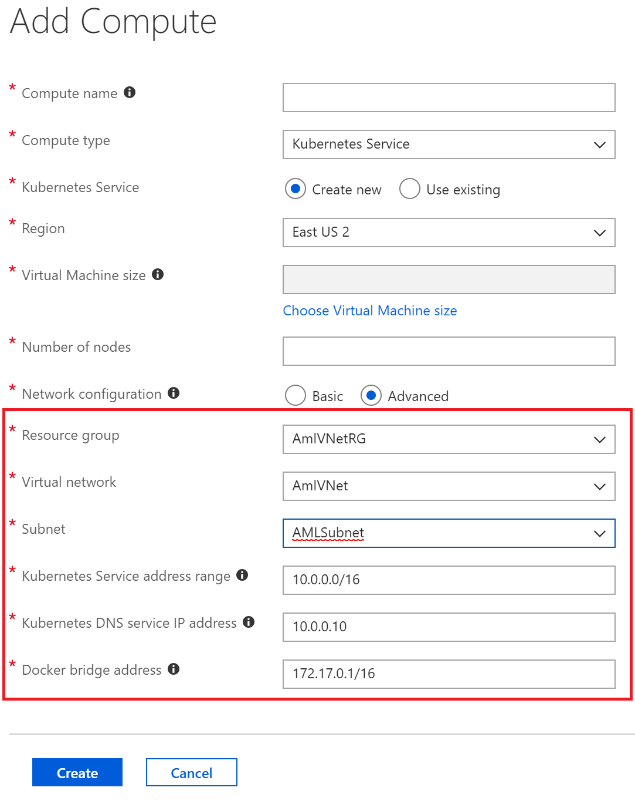

1. Make sure NSG group that controls the virtual network has inbound rule enabled for the scoring endpoint so that it can be called from outside of virtual network

    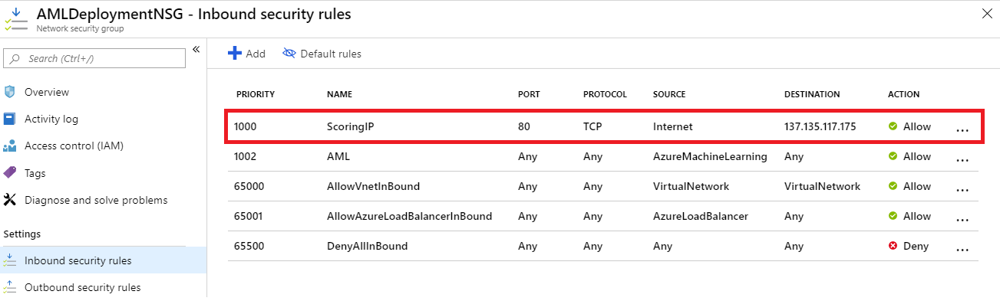

    > [!TIP]
    > If you already have an AKS cluster in a virtual network, you can attach it to the workspace. For more information, see [How to deploy to AKS](how-to-deploy-to-aks.md).

You can also use the **Azure Machine Learning SDK** to add Azure Kubernetes Service in a virtual network. The following code creates a new Azure Kubernetes Service instance in the `default` subnet of a virtual network named `mynetwork`:

```python
from azureml.core.compute import ComputeTarget, AksCompute

# Create the compute configuration and set virtual network information
config = AksCompute.provisioning_configuration(location="eastus2")
config.vnet_resourcegroup_name = "mygroup"
config.vnet_name = "mynetwork"
config.subnet_name = "default"
config.service_cidr = "10.0.0.0/16"
config.dns_service_ip = "10.0.0.10"
config.docker_bridge_cidr = "172.17.0.1/16"

# Create the compute target
aks_target = ComputeTarget.create(workspace = ws,
                                  name = "myaks",
                                  provisioning_configuration = config)
```

When the creation process is completed, you can inference/score on an AKS cluster behind a virtual network. For more information, see [How to deploy to AKS](how-to-deploy-to-aks.md).

## Next steps

* [Set up training environments](how-to-set-up-training-targets.md)
* [Where to deploy models](how-to-deploy-and-where.md)
* [Securely deploy models with SSL](how-to-secure-web-service.md)

