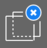

# How to tag images in a labeling project

Once your project administrator has created a labeling project in Azure Machine Learning studio, you can use the labeling tool to rapidly prepare data for a machine learning project. 

> [!div class="checklist"]
> * How to access your labeling projects
> * Labeling tools
> * How to use the tools for specific labeling tasks

## Prerequisites

* The labeling portal URL for a running data labeling project
* A [Microsoft Account](https://account.microsoft.com/account) or
* An Azure Active Directory account for the organization and project

> [!Note]
> The project administrator can find the labeling portal URL on the **Details** tab within the **Project details** page. 

## Logging in to the project's labeling portal

Go to the labeling portal URL provided to you by the project administrator. 

Log in using the email account the administrator used to add you to the team. For most users, logging in will be done with your Microsoft account. If the labeling project uses Azure Active Directory, that's how you'll log in. 

## Understanding the labeling task

Once you've signed in, you'll be brought to the project's overview page. 

The first thing to do is **View detailed instructions**. These instructions are specific to your project and will explain the type of data you're facing, how you should make your decisions, and other relevant information. When you're done, return to the project page and choose **Start labeling**.

## Common features of the labeling task

All image-labeling tasks involve choosing an appropriate tag or tags from a set specified by the project administrator. You can select among the first nine tags by using the number keys on your keyboard.  

Image classification tasks allow you to choose to present multiple images simultaneously. The different layouts can be chosen using the icons above the image area. You may select all of the displayed images simultaneously by pressing the **Select all** button. Select individual photos using the circular selection button in the upper right of the image's area. You must select at least one image to apply a tag. If you've multiple images selected, selecting a tag will apply that tag to each of the selected photos.

Here, we've chosen a 2x2 layout and are about to apply the tag "Mammal" to the images of the bear and orca. The image with the shark has already been tagged as "Cartilaginous fish" and the iguana hasn't yet been tagged.

> [!Important] 
> Only switch layouts when you've a fresh page of unlabeled data. Switching layouts clears the page's in-progress tagging work. 

Azure enables the **Submit** button when you've tagged all the images on the page. Press **Submit** to save your work. 

Once you've submitted tags for the data at hand, Azure will refresh the page with a new set of images from the work queue.  

## Tagging images for multi-class classification

If your project is of type "Image Classification Multi-Class," you'll assign a single tag to the entire image. At any time, choose the **Instructions** page and navigate to **View detailed instructions** to see project-specific guidance. 

As discussed previously, you may select from several layouts for presenting images. If, after selecting an image and assigning it a tag, you realize you've made a mistake, you can fix it. If, in the label showing beneath the image, you click the `X` target, you'll clear the tag. Or, if you select the image and choose another class, the tag will switch to the newly selected value.

## Tagging images for multi-label classification

If you're working on a project of type "Image Classification Multi-Label", you'll apply one _or more_ tags to an image. At any time, choose the **Instructions** page and navigate to **View detailed instructions** to see project-specific guidance. 

Select the image that you want to label and then click on the tag. Choosing the tag applies it to all selected images and deselects them. To apply more tags, you must reselect the images. This animation shows a multi-label tagging page:

* **Select all** is used to apply the "Ocean" tag
* A single image is selected and tagged "Closeup"
* Three images are selected and tagged "Wide angle"

To correct a mistake, you may either click the `X` to clear individual tags or select the images, and choose the tag, which will clear the tag from all the selected images. This scenario is shown here, where clicking on "Land" will clear that tag from the two selected images.

Azure will only enable the **Submit** button after you've applied at least one tag to each image. Press **Submit** for your work to be saved.

## Tagging images and bounding boxes for object detection

If your project is of type "Object Identification (Bounding Boxes)", you'll specify one or more bounding boxes in the image and apply a tag to that box. Each image may have multiple bounding boxes, each with a single tag. Use **View detailed instructions** to determine if adding multiple bounding boxes is appropriate to your project.

1. Select a tag for the bounding box you wish to create
1. Select the **Rectangular box** tool  or press 'R' 
1. Click and drag diagonally across your target to create a rough bounding box
    * Adjust the bounding box by clicking and dragging the edges or corners of the box

If you wish to delete the bounding box, click the X-shaped target that appears beside the bounding box after creation.

You may not reassign the tag of an existing bounding box. If you make a mistake with tag assignment, you must delete the bounding box and create a new one with the correct tag.

By default, existing bounding boxes may be edited. The **Lock/unlock regions** tool  or "L" toggles that behavior. If regions are locked, you may only change the shape or location of a new bounding box.

Use the **Regions manipulation** tool  or "M" to adjust an existing bounding box. You can click and drag on the edges or corners to adjust the shape. If you click in the interior, you can drag the whole bounding box. If you can't edit a region, you've probably toggled the **Lock/unlock regions** tool. 

Use the **Template-based box** tool  or "T" to create multiple bounding boxes of the same size. If the image has no bounding boxes and you activate template-based boxes, the tool will produce 50x50 pixel boxes. If you've created a bounding box and then activate template-based boxes, new bounding boxes will be the size of the last one you made. Template-based boxes can be resized after placement. Resizing a template-based box only resizes the particular box. 

If you wish to delete _all_ bounding boxes in the current image, you can choose the **Delete all regions** tool . 

Once you've created the bounding boxes for the image, press **Submit** to save your work. Your work in progress won't be saved unless you press the **Submit** button. 

## Finishing up 

When you submit a page of tagged data, Azure assigns you new unlabeled data from a work queue. If there are no more unlabeled data, you'll see a message to that effect, with a link back to the portal home page. 

If you know you're not going to do more labeling, choose your name in the upper right corner of the labeling portal and choose **Signout**. If you don't sign out, eventually Azure will "time you out" and assign your data to another labeler. 

## Next steps

* Learn to [train image classification models in Azure](https://docs.microsoft.com/azure/machine-learning/service/tutorial-train-models-with-aml)
* Read about [object detection using Azure and the Faster R-CNN technique](https://www.microsoft.com/developerblog/2017/10/24/bird-detection-with-azure-ml-workbench/)