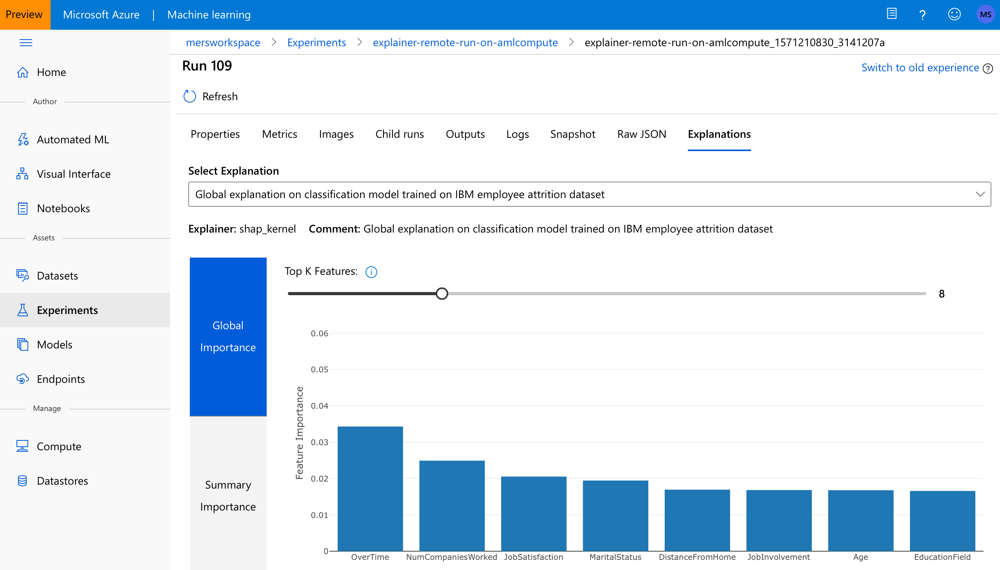

# Model interpretability for local and remote runs

[!INCLUDE [applies-to-skus](../../../includes/aml-applies-to-basic-enterprise-sku.md)]

In this article, you learn how to explain why your model made the predictions it did with the interpretability package of the Azure Machine Learning Python SDK. You learn the following tasks:

* Interpret machine learning models trained both locally and on remote compute resources
* Store local and global explanations on Azure Run History
* View interpretability visualizations in [Azure Machine Learning studio](https://ml.azure.com)
* Deploy a scoring explainer with your model

To learn more about model interpretability, see the [concept article](how-to-machine-learning-interpretability.md).

## Local interpretability

The following example shows how to use the interpret package locally without contacting Azure services. Run `pip install azureml-interpret` to get the interpretability package.

1. Train a sample model in a local Jupyter notebook.

    ```python
    # load breast cancer dataset, a well-known small dataset that comes with scikit-learn
    from sklearn.datasets import load_breast_cancer
    from sklearn import svm
    from sklearn.model_selection import train_test_split
    breast_cancer_data = load_breast_cancer()
    classes = breast_cancer_data.target_names.tolist()
    
    # split data into train and test
    from sklearn.model_selection import train_test_split
    x_train, x_test, y_train, y_test = train_test_split(breast_cancer_data.data,            
                                                        breast_cancer_data.target,  
                                                        test_size=0.2,
                                                        random_state=0)
    clf = svm.SVC(gamma=0.001, C=100., probability=True)
    model = clf.fit(x_train, y_train)
    ```

2. Call the explainer locally: To initialize an explainer object, you need to pass your model and some training data to the explainer's constructor. You can also optionally pass in feature names and output class names (if doing classification) which will be used to make your explanations and visualizations more informative. Here is how to instantiate an explainer object using `TabularExplainer`, `MimicExplainer`, and `PFIExplainer` locally. `TabularExplainer` is calling one of the three SHAP explainers underneath (`TreeExplainer`, `DeepExplainer`, or `KernelExplainer`), and is automatically selecting the most appropriate one for your use case. You can however,call each of its three underlying explainers directly.

    ```python
    from interpret.ext.blackbox import TabularExplainer

    # "features" and "classes" fields are optional
    explainer = TabularExplainer(model, 
                                 x_train, 
                                 features=breast_cancer_data.feature_names, 
                                 classes=classes)
    ```

    or

    ```python

    from interpret.ext.blackbox import MimicExplainer
    
    # you can use one of the following four interpretable models as a global surrogate to the black box model
    
    from interpret.ext.glassbox import LGBMExplainableModel
    from interpret.ext.glassbox import LinearExplainableModel
    from interpret.ext.glassbox import SGDExplainableModel
    from interpret.ext.glassbox import DecisionTreeExplainableModel

    # "features" and "classes" fields are optional
    # augment_data is optional and if true, oversamples the initialization examples to improve surrogate model accuracy to fit original model.  Useful for high-dimensional data where the number of rows is less than the number of columns. 
    # max_num_of_augmentations is optional and defines max number of times we can increase the input data size.
    # LGBMExplainableModel can be replaced with LinearExplainableModel, SGDExplainableModel, or DecisionTreeExplainableModel
    explainer = MimicExplainer(model, 
                               x_train, 
                               LGBMExplainableModel, 
                               augment_data=True, 
                               max_num_of_augmentations=10, 
                               features=breast_cancer_data.feature_names, 
                               classes=classes)
    ```
   or

    ```python
    from interpret.ext.blackbox import PFIExplainer 
    
    # "features" and "classes" fields are optional
    explainer = PFIExplainer(model, 
                             features=breast_cancer_data.feature_names, 
                             classes=classes)
    ```

### Overall (global) feature importance values

Get the global feature importance values.
    
```python

# you can use the training data or the test data here
global_explanation = explainer.explain_global(x_train)

# if you used the PFIExplainer in the previous step, use the next line of code instead
# global_explanation = explainer.explain_global(x_train, true_labels=y_test)

# sorted feature importance values and feature names
sorted_global_importance_values = global_explanation.get_ranked_global_values()
sorted_global_importance_names = global_explanation.get_ranked_global_names()
dict(zip(sorted_global_importance_names, sorted_global_importance_values))

# alternatively, you can print out a dictionary that holds the top K feature names and values
global_explanation.get_feature_importance_dict()
```

### Instance-level (local) feature importance values

Get the local feature importance values: use the following function calls to explain an individual instance or a group of instances. Please note that PFIExplainer does not support local explanations.

```python
# explain the first data point in the test set
local_explanation = explainer.explain_local(x_test[0:5])

# sorted feature importance values and feature names
sorted_local_importance_names = local_explanation.get_ranked_local_names()
sorted_local_importance_values = local_explanation.get_ranked_local_values()
```

## Interpretability for remote runs

This example shows how to use the `ExplanationClient` class for enabling model interpretability for remote runs. The concept is similar to the previous section,but you use the `ExplanationClient` in the remote run to upload the interpretability context, and then you can download the context later in a local environment. Use `pip install azureml-contrib-interpret` to get the necessary package.

1. Create a training script in a local Jupyter notebook (for example, train_explain.py).

    ```python
    from azureml.contrib.interpret.explanation.explanation_client import ExplanationClient
    from azureml.core.run import Run
    from interpret.ext.blackbox import TabularExplainer

    run = Run.get_context()
    client = ExplanationClient.from_run(run)

    # write code to get and split your data into train and test sets here
    # write code to train your model here 

    # explain predictions on your local machine
    # "features" and "classes" fields are optional
    explainer = TabularExplainer(model, 
                                 x_train, 
                                 features=feature_names, 
                                 classes=classes)

    # explain overall model predictions (global explanation)
    global_explanation = explainer.explain_global(x_test)
    
    # uploading global model explanation data for storage or visualization in webUX
    # the explanation can then be downloaded on any compute
    # multiple explanations can be uploaded
    client.upload_model_explanation(global_explanation, comment='global explanation: all features')
    # or you can only upload the explanation object with the top k feature info
    #client.upload_model_explanation(global_explanation, top_k=2, comment='global explanation: Only top 2 features')
    ```

1. Follow the instructions for [setting up compute targets for model training](how-to-set-up-training-targets.md#amlcompute) to learn how to set up an Azure Machine Learning compute as your compute target and submit your training run. You can also see the [example notebooks](https://github.com/Azure/MachineLearningNotebooks/tree/master/how-to-use-azureml/explain-model/azure-integration/remote-explanation).

1. Download the explanation in your local Jupyter notebook.

    ```python
    from azureml.contrib.interpret.explanation.explanation_client import ExplanationClient
    
    client = ExplanationClient.from_run(run)
    
    # get model explanation data
    explanation = client.download_model_explanation()
    # or only get the top k (e.g., 4) most important features with their importance values
    explanation = client.download_model_explanation(top_k=4)
    
    global_importance_values = explanation.get_ranked_global_values()
    global_importance_names = explanation.get_ranked_global_names()
    print('global importance values: {}'.format(global_importance_values))
    print('global importance names: {}'.format(global_importance_names))
    ```

## Raw feature transformations

Optionally, you can pass your feature transformation pipeline to the explainer (in train_explain.py) to receive explanations in terms of the raw features before the transformation (rather than engineered features). If you skip this, the explainer provides explanations in terms of engineered features.

The format of supported transformations is same as the one described in [sklearn-pandas](https://github.com/scikit-learn-contrib/sklearn-pandas). In general, any transformations are supported as long as they operate on a single column and are therefore clearly one to many. 

Explain raw features by either using a `sklearn.compose.ColumnTransformer` or a list of fitted transformer tuples. The code below uses `sklearn.compose.ColumnTransformer`. 


```python
from sklearn.compose import ColumnTransformer

numeric_transformer = Pipeline(steps=[
    ('imputer', SimpleImputer(strategy='median')),
    ('scaler', StandardScaler())])

categorical_transformer = Pipeline(steps=[
    ('imputer', SimpleImputer(strategy='constant', fill_value='missing')),
    ('onehot', OneHotEncoder(handle_unknown='ignore'))])

preprocessor = ColumnTransformer(
    transformers=[
        ('num', numeric_transformer, numeric_features),
        ('cat', categorical_transformer, categorical_features)])

# append classifier to preprocessing pipeline.
# now we have a full prediction pipeline.
clf = Pipeline(steps=[('preprocessor', preprocessor),
                      ('classifier', LogisticRegression(solver='lbfgs'))])


# clf.steps[-1][1] returns the trained classification model
# pass transformation as an input to create the explanation object
# "features" and "classes" fields are optional
tabular_explainer = TabularExplainer(clf.steps[-1][1],
                                     initialization_examples=x_train,
                                     features=dataset_feature_names,
                                     classes=dataset_classes,
                                     transformations=preprocessor)
```

In case you want to run the example with the list of fitted transformer tuples, use the following code.

```python
from sklearn.pipeline import Pipeline
from sklearn.impute import SimpleImputer
from sklearn.preprocessing import StandardScaler, OneHotEncoder
from sklearn.linear_model import LogisticRegression
from sklearn_pandas import DataFrameMapper

# assume that we have created two arrays, numerical and categorical, which holds the numerical and categorical feature names

numeric_transformations = [([f], Pipeline(steps=[('imputer', SimpleImputer(
    strategy='median')), ('scaler', StandardScaler())])) for f in numerical]

categorical_transformations = [([f], OneHotEncoder(
    handle_unknown='ignore', sparse=False)) for f in categorical]

transformations = numeric_transformations + categorical_transformations

# append model to preprocessing pipeline.
# now we have a full prediction pipeline.
clf = Pipeline(steps=[('preprocessor', DataFrameMapper(transformations)),
                      ('classifier', LogisticRegression(solver='lbfgs'))])

# clf.steps[-1][1] returns the trained classification model
# pass transformation as an input to create the explanation object
# "features" and "classes" fields are optional
tabular_explainer = TabularExplainer(clf.steps[-1][1],
                                     initialization_examples=x_train,
                                     features=dataset_feature_names,
                                     classes=dataset_classes,
                                     transformations=transformations)
```

## Visualizations

Once you download the explanations in your local Jupyter notebook, you can use the visualization dashboard to understand and interpret your model.

### Global visualizations

The following plots provide a global view of the trained model along with its predictions and explanations.

|Plot|Description|
|----|-----------|
|Data Exploration| An overview of the dataset along with prediction values.|
|Global Importance|Shows the top K (configurable K) important features globally. This chart is useful for understanding the global behavior of the underlying model.|
|Explanation Exploration|Demonstrates how a feature is responsible for making a change in model’s prediction values (or probability of prediction values). It also demonstrates how two features interact to impact the predictions.|
|Summary Importance| Uses a signed local feature importance values across all data points to show the distribution of the impact each feature has on the prediction value.|

[](./media/machine-learning-interpretability-explainability/global-charts.png#lightbox)

### Local visualizations

Click on any individual data point at any time in the preceding plots to load the local feature importance plot for the given data point.

|Plot|Description|
|----|-----------|
|Local Importance|Shows the top K (configurable K) important features globally. This chart is useful for understanding the local behavior of the underlying model on a specific data point.|
|Perturbation Exploration|Allows you to change feature values of the selected data point and observe how those changes will affect prediction value.|
|Individual Conditional Expectation (ICE)| Allows you to change a feature value from a minimum value to a maximum value to see how the data point's prediction changes when a feature changes.|

[](./media/machine-learning-interpretability-explainability/local-charts.png#lightbox)


[](./media/machine-learning-interpretability-explainability/perturbation.gif#lightbox)


[](./media/machine-learning-interpretability-explainability/ice-plot.png#lightbox)

Note you will need to have widget extensions of the visualization dashboard enabled prior to Jupyter kernel starting.

* Jupyter notebooks

    ```shell
    jupyter nbextension install --py --sys-prefix azureml.contrib.interpret.visualize
    jupyter nbextension enable --py --sys-prefix azureml.contrib.interpret.visualize
    ```


* Jupyter Labs

    ```shell
    jupyter labextension install @jupyter-widgets/jupyterlab-manager
    jupyter labextension install microsoft-mli-widget
    ```

To load the visualization dashboard, use the following code.

```python
from azureml.contrib.interpret.visualize import ExplanationDashboard

ExplanationDashboard(global_explanation, model, x_test)
```

### Visualization in Azure Machine Learning studio

By completing the steps in the [remote interpretability](how-to-machine-learning-interpretability-aml.md#interpretability-for-remote-runs) section, you can check the visualization dashboard in [Azure Machine Learning studio](https://ml.azure.com). The dashboard shown in Azure Machine Learning studio, is a simpler version of the visualization dashboard explained above and only supports the following two tabs.

|Plot|Description|
|----|-----------|
|Global Importance|Shows the top K (configurable K) important features globally. This chart is useful for understanding the global behavior of the underlying model.|
|Summary Importance| Uses a signed local feature importance values across all data points to show the distribution of the impact each feature has on the prediction value.|

If both global and local explanations are available, both tabs will be populated with data. If only global explanation is available, the second tab will be disabled.

To access the visualization dashboard in Azure Machine Learning studio, you can go through one of the following paths:

1. Experiments tab (Preview): By clicking on the "Experiments" tab, you will see a list of experiments that you have run on Azure Machine Learning service. From that list, you can select a particular experiment to be redirected to a page with all the Runs under the selected experiment name. By clicking on each run and its "Explanations" tab, you will see the explanation visualization dashboard.


[](./media/machine-learning-interpretability-explainability/amlstudio-experiments.png#lightbox)


2. Models tab: In case you have registered your original model using the steps in [Deploy models with Azure Machine Learning](https://docs.microsoft.com/azure/machine-learning/service/how-to-deploy-and-where), your model will show up in the list of the "Models" tab. By clicking on each model and its "Explanations" tab, you will see the explanation visualization dashboard.

## Interpretability at inference time

The explainer can be deployed along with the original model and can be used at inference time to provide the local explanation information. We also offer lighter-weight scoring explainers to improve performance of interpretability at inference time. The process of deploying a lighter-weight scoring explainer is similar to deploying a model and includes the following steps:


1. Create an explanation object (e.g., using TabularExplainer):

   ```python
    from interpret.ext.blackbox import TabularExplainer


   explainer = TabularExplainer(model, 
                                initialization_examples=x_train, 
                                features=dataset_feature_names, 
                                classes=dataset_classes, 
                                transformations=transformations)
   ```

1. Create a scoring explainer using the explanation object:

   ```python
   from azureml.contrib.interpret.scoring.scoring_explainer import KernelScoringExplainer, save

   # create a lightweight explainer at scoring time
   scoring_explainer = KernelScoringExplainer(explainer)

   # pickle scoring explainer
   # pickle scoring explainer locally
   OUTPUT_DIR = 'my_directory'
   save(scoring_explainer, directory=OUTPUT_DIR, exist_ok=True)
   ```

1. Configure and register an image that uses the scoring explainer model.

   ```python
   # register explainer model using the path from ScoringExplainer.save - could be done on remote compute
   # scoring_explainer.pkl is the filename on disk, while my_scoring_explainer.pkl will be the filename in cloud storage
   run.upload_file('my_scoring_explainer.pkl', os.path.join(OUTPUT_DIR, 'scoring_explainer.pkl'))
   
   scoring_explainer_model = run.register_model(model_name='my_scoring_explainer', 
                                                model_path='my_scoring_explainer.pkl')
   print(scoring_explainer_model.name, scoring_explainer_model.id, scoring_explainer_model.version, sep = '\t')
   ```

1. [Optional] Retrieve the scoring explainer from cloud and test the explanations

   ```python
   from azureml.contrib.interpret.scoring.scoring_explainer import load

   # retrieve the scoring explainer model from cloud"
   scoring_explainer_model = Model(ws, 'my_scoring_explainer')
   scoring_explainer_model_path = scoring_explainer_model.download(target_dir=os.getcwd(), exist_ok=True)

   # load scoring explainer from disk
   scoring_explainer = load(scoring_explainer_model_path)

   # test scoring explainer locally
   preds = scoring_explainer.explain(x_test)
   print(preds)
   ```

1. Deploy the image to a compute target:

   1. Create a scoring file (before this step, follow the steps in [Deploy models with Azure Machine Learning](https://docs.microsoft.com/azure/machine-learning/service/how-to-deploy-and-where) to register your original prediction model)

        ```python
        %%writefile score.py
        import json
        import numpy as np
        import pandas as pd
        import os
        import pickle
        from sklearn.externals import joblib
        from sklearn.linear_model import LogisticRegression
        from azureml.core.model import Model

        def init():

            global original_model
            global scoring_model

            # retrieve the path to the model file using the model name
            # assume original model is named original_prediction_model
            original_model_path = Model.get_model_path('original_prediction_model')
            scoring_explainer_path = Model.get_model_path('my_scoring_explainer')

            original_model = joblib.load(original_model_path)
            scoring_explainer = joblib.load(scoring_explainer_path)

        def run(raw_data):
            # get predictions and explanations for each data point
            data = pd.read_json(raw_data)
            # make prediction
            predictions = original_model.predict(data)
            # retrieve model explanations
            local_importance_values = scoring_explainer.explain(data)
            # you can return any data type as long as it is JSON-serializable
            return {'predictions': predictions.tolist(), 'local_importance_values': local_importance_values}
        ```

   1. Define the deployment configuration (This configuration depends on the requirements of your model. The following example defines a configuration that uses one CPU core and 1 GB of memory)

        ```python
        from azureml.core.webservice import AciWebservice

        aciconfig = AciWebservice.deploy_configuration(cpu_cores=1,
                                                       memory_gb=1,
                                                       tags={"data": "NAME_OF_THE_DATASET",
                                                             "method" : "local_explanation"},
                                                       description='Get local explanations for NAME_OF_THE_PROBLEM')
        ```

   1. Create a file with environment dependencies

        ```python
        from azureml.core.conda_dependencies import CondaDependencies

        # WARNING: to install this, g++ needs to be available on the Docker image and is not by default (look at the next cell)

        azureml_pip_packages = ['azureml-defaults', 'azureml-contrib-interpret', 'azureml-core', 'azureml-telemetry', 'azureml-interpret']
 

        # specify CondaDependencies obj
        myenv = CondaDependencies.create(conda_packages=['scikit-learn', 'pandas'],
                                         pip_packages=['sklearn-pandas'] + azureml_pip_packages,
                                         pin_sdk_version=False)


        with open("myenv.yml","w") as f:
            f.write(myenv.serialize_to_string())

        with open("myenv.yml","r") as f:
            print(f.read())
        ```

   1. Create a custom dockerfile with g++ installed

        ```python
        %%writefile dockerfile
        RUN apt-get update && apt-get install -y g++
        ```

   1. Deploy the created image (time estimate: 5 minutes)

        ```python
        from azureml.core.webservice import Webservice
        from azureml.core.image import ContainerImage

        # use the custom scoring, docker, and conda files we created above
        image_config = ContainerImage.image_configuration(execution_script="score.py",
                                                        docker_file="dockerfile",
                                                        runtime="python",
                                                        conda_file="myenv.yml")

        # use configs and models generated above
        service = Webservice.deploy_from_model(workspace=ws,
                                            name='model-scoring-service',
                                            deployment_config=aciconfig,
                                            models=[scoring_explainer_model, original_model],
                                            image_config=image_config)

        service.wait_for_deployment(show_output=True)
        ```

1. Test the deployment

    ```python
    import requests

    # create data to test service with
    examples = x_list[:4]
    input_data = examples.to_json()

    headers = {'Content-Type':'application/json'}

    # send request to service
    resp = requests.post(service.scoring_uri, input_data, headers=headers)

    print("POST to url", service.scoring_uri)
    # can covert back to Python objects from json string if desired
    print("prediction:", resp.text)
    ```

1. Clean up: To delete a deployed web service, use `service.delete()`.

## Next steps

To learn more about model interpretability, see the [conceptual article](how-to-machine-learning-interpretability.md).
