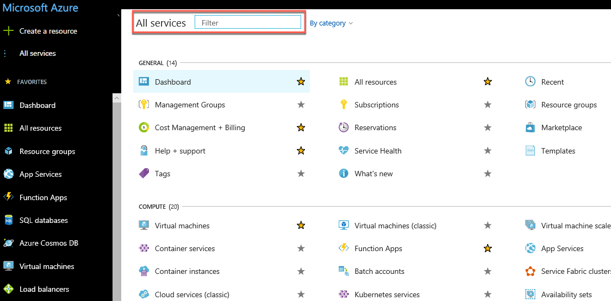
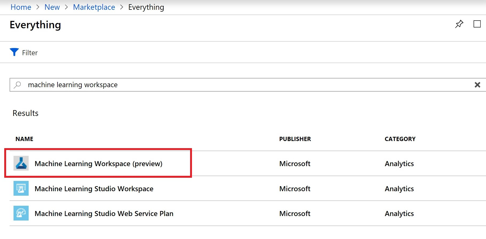

# Create and manage Azure Machine Learning service workspaces

In this article, you'll create, view, and delete [**Azure Machine Learning service workspaces**](concept-azure-machine-learning-architecture.md#workspace) in the Azure portal for [Azure Machine Learning service](overview-what-is-azure-ml.md).  You can also create and delete workspaces [using the CLI](reference-azure-machine-learning-cli.md) or [with Python code](http://aka.ms/aml-sdk).

To create a workspace, you need an Azure subscription. If you don't have an Azure subscription, create a [free account](https://azure.microsoft.com/free/?WT.mc_id=A261C142F) before you begin.

## Create a workspace 

[!INCLUDE [aml-create-portal](../../../includes/aml-create-in-portal.md)]

## View a workspace

1. In top left corner of the portal, select **All services**. 

1. In the **All services** filter field, type **Machine Learning service workspace**.  

   

1. In the filter results, select **Machine Learning service workspace** to display a list of your workspaces. 

   

1. Look through the list of workspaces found. You can filter based on subscription, resource groups, and locations.  

   

1. Select the workspace you just created to display its properties.

   

## Delete a workspace

Use the Delete button at the top of the workspace you wish to delete.

  

## Clean up resources 

[!INCLUDE [aml-delete-resource-group](../../../includes/aml-delete-resource-group.md)]

## Next steps

Follow the full-length tutorial to learn how to use a workspace to build, train, and deploy models with Azure Machine Learning service.

> [!div class="nextstepaction"]
> [Tutorial: Train models](tutorial-train-models-with-aml.md)
