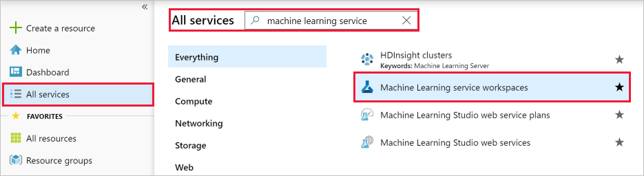
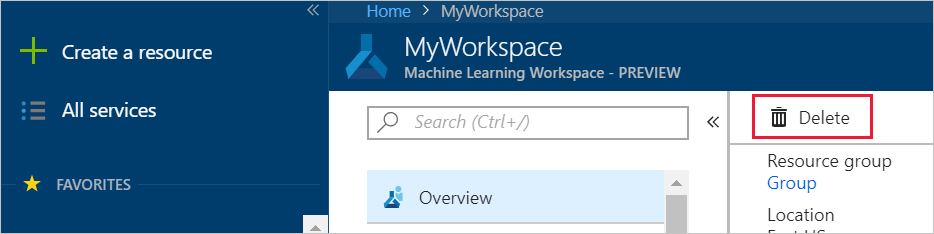

# Create and manage Azure Machine Learning service workspaces

In this article, you'll create, view, and delete [**Azure Machine Learning service workspaces**](concept-workspace.md) in the Azure portal for [Azure Machine Learning service](overview-what-is-azure-ml.md).  You can also create and delete workspaces [using the CLI](reference-azure-machine-learning-cli.md), [with Python code](https://aka.ms/aml-sdk) or [via the VS Code extension](how-to-vscode-tools.md#get-started-with-azure-machine-learning).

## Create a workspace

To create a workspace, you need an Azure subscription. If you don’t have an Azure subscription, create a free account before you begin. Try the [free or paid version of Azure Machine Learning service](https://aka.ms/AMLFree) today.

[!INCLUDE [aml-create-portal](../../../includes/aml-create-in-portal.md)]

## View a workspace

1. In top left corner of the portal, select **All services**.

1. In the **All services** filter field, type **machine learning service**.  

1. Select **Machine Learning service workspaces**.

   

1. Look through the list of workspaces found. You can filter based on subscription, resource groups, and locations.  

1. Select a workspace to display its properties.
   

## Delete a workspace

Use the Delete button at the top of the workspace you wish to delete.

  

## Clean up resources

[!INCLUDE [aml-delete-resource-group](../../../includes/aml-delete-resource-group.md)]

## Next steps

Follow the full-length tutorial to learn how to use a workspace to build, train, and deploy models with Azure Machine Learning service.

> [!div class="nextstepaction"]
> [Tutorial: Train models](tutorial-train-models-with-aml.md)
