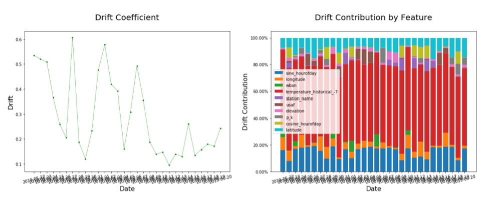
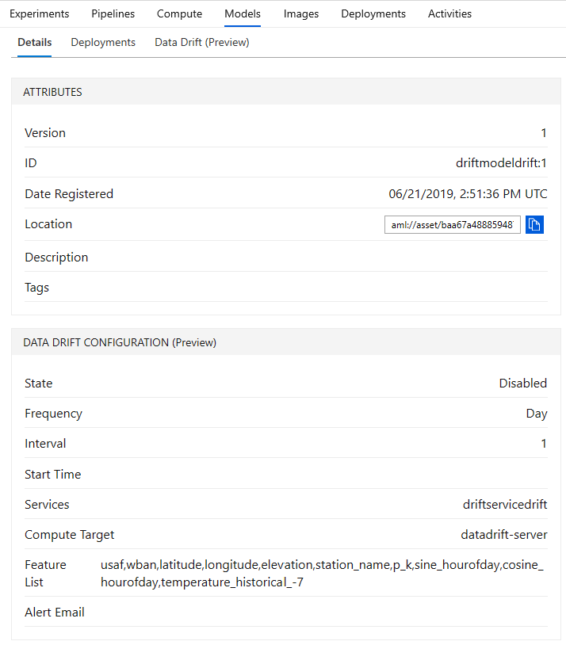
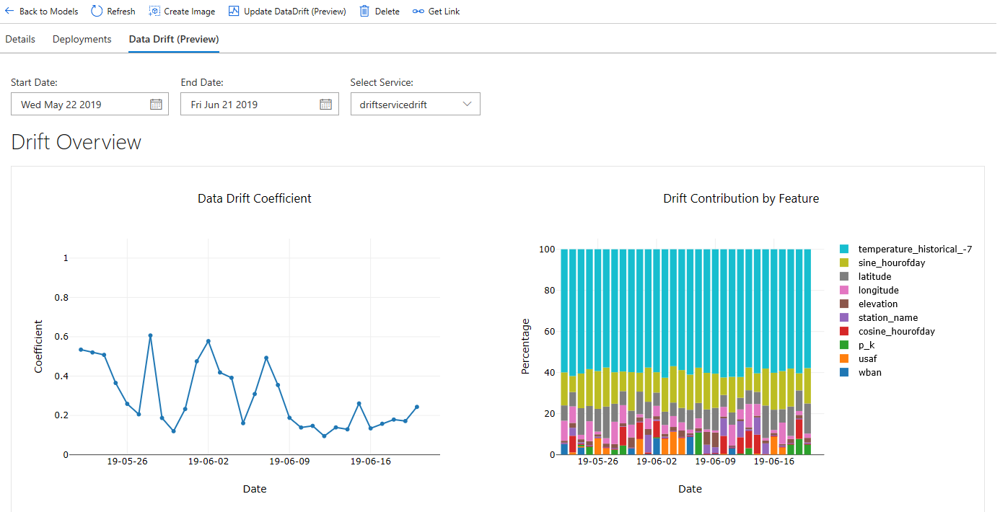
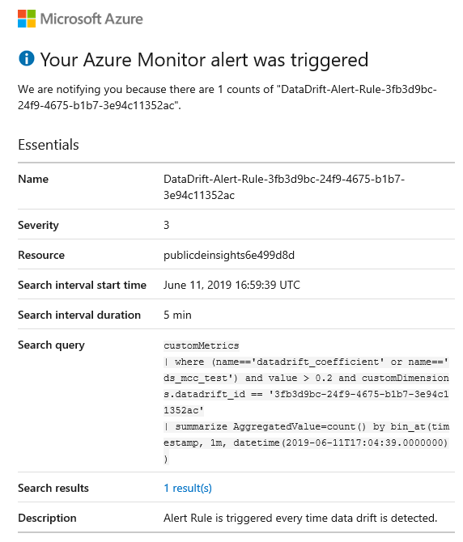

# Detect data drift (preview) on models deployed to Azure Kubernetes Service (AKS)

In this article, you learn how to monitor for data drift between the training dataset and inference data of a deployed model. In the context of machine learning, trained machine learning models may experience degraded prediction performance because of drift. With the Azure Machine Learning service, you can monitor data drift and the service can send an email alert to you when drift is detected.

## What is data drift?

Data drift happens when data served to a model in production is different from the data used to train the model. It is one of the top reasons where model accuracy degrades over time, thus monitoring data drift helps detect model performance issues. 

## What can I monitor?

With Azure Machine Learning service, you can monitor the inputs to a model deployed on AKS and compare this data to the training dataset for the model. At regular intervals, the inference data is [snapshot and profiled](how-to-explore-prepare-data.md), then computed against the baseline dataset to produce a data drift analysis that: 

+ Measures the magnitude of data drift, called the drift coefficient.
+ Measures the data drift contribution by feature, informing which features caused data drift.
+ Measures distance metrics. Currently Wasserstein and Energy Distance are computed.
+ Measures distributions of features. Currently kernel density estimation and histograms.
+ Send alerts to data drift by email.

> [!Note]
> This service is in (Preview) and limited in configuration options. Please see our [API Documentation](https://docs.microsoft.com/python/api/azureml-contrib-datadrift/?view=azure-ml-py) and [Release Notes](azure-machine-learning-release-notes.md) for details and updates. 

### How data drift is monitored in Azure Machine Learning service

Using Azure Machine Learning service, data drift is monitored through datasets or deployments. To monitor for data drift, a baseline dataset - usually the training dataset for a model - is specified. A second dataset - usually model input data gathered from a deployment - is tested against the baseline dataset. Both datasets are [profiled](how-to-explore-prepare-data.md#explore-with-summary-statistics) and input to the data drift monitoring service. A machine learning model is trained to detect differences between the two datasets. The model's performance is converted to the drift coefficient, which measures the magnitude of drift between the two datasets. Using [model interpretability](machine-learning-interpretability-explainability.md), the features that contribute to the drift coefficient are computed. From the dataset profile, statistical information about each feature is tracked. 

## Prerequisites

- An Azure subscription. If you don’t have one, create a free account before you begin. Try the [free or paid version of Azure Machine Learning service](https://aka.ms/AMLFree) today.

- An Azure Machine Learning service workspace and the Azure Machine Learning SDK for Python installed. Use the instructions at [Create an Azure Machine Learning service workspace](setup-create-workspace.md#sdk) to do the following:

    - Create a Miniconda environment
    - Install the Azure Machine Learning SDK for Python
    - Create a workspace
    - Write a workspace configuration file (aml_config/config.json).

- Install the data drift SDK using the following command:

    ```shell
    pip install azureml-contrib-datadrift
    ```

- Create a [dataset](how-to-create-register-datasets.md) from your model's training data.

- Specify the training dataset when [registering](concept-model-management-and-deployment.md) the model. The following example demonstrates using the `datasets` parameter to specify the training dataset:

    ```python
    model = Model.register(model_path=model_file,
                        model_name=model_name,
                        workspace=ws,
                        datasets=datasets)

    print(model_name, image_name, service_name, model)
    ```

- [Enable model data collection](how-to-enable-data-collection.md) to collect data from the AKS deployment of the model and confirm data is being collected in the `modeldata` blob container.

## Configure data drift
To configure data drift for your experiment, import dependencies as seen in the following Python example. 

This example demonstrates configuring the [`DataDriftDetector`](https://docs.microsoft.com/python/api/azureml-contrib-datadrift/azureml.contrib.datadrift.datadriftdetector.datadriftdetector?view=azure-ml-py) object:

```python
# Import Azure ML packages
from azureml.core import Experiment, Run, RunDetails
from azureml.contrib.datadrift import DataDriftDetector, AlertConfiguration

# if email address is specified, setup AlertConfiguration
alert_config = AlertConfiguration('your_email@contoso.com')

# create a new DatadriftDetector object
datadrift = DataDriftDetector.create(ws, model.name, model.version, services, frequency="Day", alert_config=alert_config)
    
print('Details of Datadrift Object:\n{}'.format(datadrift))
```

## Submit a DataDriftDetector run

With the `DataDriftDetector` object configured, you can submit a [data drift run](https://docs.microsoft.com/python/api/azureml-contrib-datadrift/azureml.contrib.datadrift.datadriftdetector%28class%29?view=azure-ml-py#run-target-date--services--compute-target-name-none--create-compute-target-false--feature-list-none--drift-threshold-none-) on a given date for the model. As part of the run, enable DataDriftDetector alerts by setting the `drift_threshold` parameter. If the [datadrift_coefficient](#metrics) is above the given `drift_threshold`, an email is sent.

```python
# adhoc run today
target_date = datetime.today()

# create a new compute - creates datadrift-server
run = datadrift.run(target_date, services, feature_list=feature_list, create_compute_target=True)

# or specify existing compute cluster
run = datadrift.run(target_date, services, feature_list=feature_list, compute_target='cpu-cluster')

# show details of the data drift run
exp = Experiment(ws, datadrift._id)
dd_run = Run(experiment=exp, run_id=run)
RunDetails(dd_run).show()
```

## Visualize drift metrics

<a name="metrics"></a>

After you submit your DataDriftDetector run, you are able to see the drift metrics that are saved in each run iteration for a data drift task:


|Metric|Description|
--|--|
wasserstein_distance|Statistical distance defined for one-dimensional numerical distribution.|
energy_distance|Statistical distance defined for one-dimensional numerical distribution.|
datadrift_coefficient|Calculated similarly as Matthew's correlation coefficient, but this output is a real number ranging from 0 to 1. In the context of drift, 0 indicates no drift and 1 indicates maximum drift.|
datadrift_contribution|Feature importance of features contributing to drift.|

There are multiple ways to view drift metrics:

* Use the Jupyter widget.
* Use the [`get_metrics()`](https://docs.microsoft.com/python/api/azureml-core/azureml.core.run%28class%29?view=azure-ml-py#get-metrics-name-none--recursive-false--run-type-none--populate-false-) function on any `datadrift` run object.
* View the metrics in the Azure portal on your model

The following Python example demonstrates how to plot relevant data drift metrics. You can use the returned metrics to build custom visualizations:

```python
# start and end are datetime objects 
drift_metrics = datadrift.get_output(start_time=start, end_time=end)

# Show all data drift result figures, one per serivice.
# If setting with_details is False (by default), only the data drift magnitude will be shown; if it's True, all details will be shown.
drift_figures = datadrift.show(with_details=True)
```




## Schedule data drift scans 

When you enable data drift detection, a DataDriftDetector is run at the specified, scheduled frequency. If the datadrift_coefficient reaches the given `drift_threshold`, an email is sent with each scheduled run. 

```python
datadrift.enable_schedule()
datadrift.disable_schedule()
```

The configuration of the data drift detector can be seen on the model details page in the Azure portal.



## View results in Azure ML Workspace UI

To view results in the Azure ML Workspace UI, navigate to the model page. On the details tab of the model, the data drift configuration is shown. A 'Data Drift (Preview)' tab is now available visualizing the data drift metrics. 



## Receiving drift alerts

By setting the drift coefficient alerting threshold and providing an email address, an [Azure Monitor](https://docs.microsoft.com/azure/azure-monitor/overview) email alert is automatically sent whenever the drift coefficient is above the threshold. 

In order for you to set up custom alerts and actions, all data drift metrics are stored in the [Application Insights](how-to-enable-app-insights.md) resource that was created along with the Azure Machine Learning service workspace. You can follow the link in the email alert to the Application Insights query.



## Retrain your model after drift

When data drift negatively impacts the performance of your deployed model, it is time to retrain the model. The following [`diff()`](https://docs.microsoft.com/python/api/azureml-core/azureml.core.dataset.dataset?view=azure-ml-py#diff-rhs-dataset--compute-target-none--columns-none-
) method gives you an initial sense of what changed between the old and new training data sets. 

```python
from azureml.core import Dataset

old_training_dataset.diff(new_training_dataset)
```

Based on the output of the previous code, you may want to retrain your model. To do so, proceed with the following steps.

* Investigate the collected data and prepare data to train the new model.
* Split it into train/test data.
* Train the model again using the new data.
* Evaluate performance of the newly generated model.
* Deploy new model if performance is better than the production model.

## Next steps

* For a full example of using data drift, see the [Azure ML data drift notebook](https://github.com/Azure/MachineLearningNotebooks/blob/master/how-to-use-azureml/data-drift/azure-ml-datadrift.ipynb). This Jupyter Notebook demonstrates using an [Azure Open Dataset](https://docs.microsoft.com/azure/open-datasets/overview-what-are-open-datasets) to train a model to predict the weather, deploy it to AKS, and monitor for data drift. 

* We would greatly appreciate your questions, comments, or suggestions as data drift moves toward general availability. Use the product feedback button below! 
